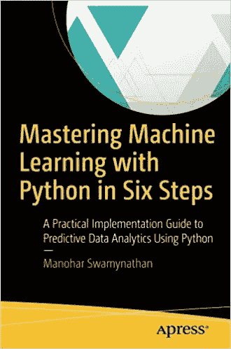

# 【注意】每个编码员都必须知道的 19 条编码规则

> 原文：<https://medium.com/hackernoon/19-coding-rules-that-every-coder-must-know-mastering-machine-learning-with-python-in-six-steps-2a4d3febc903>

> 这是从数据科学家 ***马诺哈尔*的《用 Python 六步掌握机器学习》中引用的一段注释**

1.美丽总比丑陋好——保持一致。

2.复杂比复杂好——使用现有的库。

3.简单总比复杂好——保持简单和愚蠢(KISS)。

4.平的比嵌套的好——避免嵌套的 if。

5.明确的比含蓄的好——要清楚。

6.稀疏比密集好——将代码分成模块。

7.可读性很重要——缩进以方便阅读。

8.特例不足以特殊到打破规则——一切都是对象。

9.错误永远不会悄无声息地过去——好的异常处理程序。

10.尽管实用性胜过纯粹性——如果需要，打破规则。

11.除非明确禁止——错误记录和可追溯性。

12.在歧义中，拒绝猜测的诱惑——Python 语法更简单；然而，很多时候我们可能要花更长的时间来破译它。

13.尽管除非你是荷兰人，否则这种方式一开始可能并不明显——实现某事的方式并不只有一种。

14.最好只有一种显而易见的方法——使用现有的库。

15.如果实现很难解释，这是一个坏主意——如果你不能用简单的术语解释，那么你就不能很好地理解它。

16.现在做总比不做好——有快速/肮脏的方法来完成工作，而不是尝试太多的优化。

17.尽管从来没有比现在更好——尽管有一条快速/肮脏的路，但不要走上一条没有优雅的回头路的路。

18.名称空间是一个非常棒的想法，所以让我们多做一些吧！—要具体。

19.如果实现很容易解释，这可能是一个好主意——简单。

# 参考:

—[https://www . Amazon . com/Mastering-Machine-Learning-Python-Steps/DP/1484228650](https://www.amazon.com/Mastering-Machine-Learning-Python-Steps/dp/1484228650)