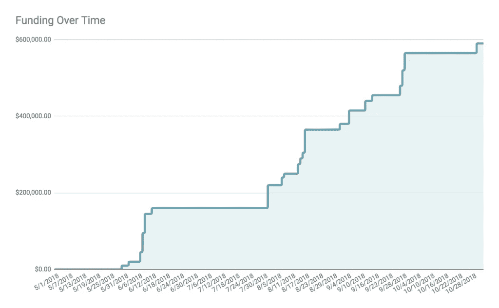

# 193 天，1482 封电子邮件，59 万美元:揭露我们种子期的本质细节

> 原文：<https://medium.com/hackernoon/193-days-1-482-emails-590-000-dollars-exposing-the-nitty-gritty-details-of-our-seed-round-61d0bbef9404>

上个月，我们宣布了对 T2 的新一轮融资。我承认，能够告诉全世界我们关闭了更多的钱，这感觉真的很棒。尤其是在去年[差点倒闭](https://tettra.co/blog/navigating-the-depths-of-near-failure-to-profitability-an-introduction/)之后。我也承认饲养它是一吨的[工作](https://hackernoon.com/tagged/work)。

阅读其他创业公司的融资公告会让你觉得筹集资金很容易。不是的。保罗·格拉厄姆在 2008 年说得最好，他的话今天仍然适用:

*   [y combinator 的 Geoff Ralston 撰写的种子资金筹集指南](https://blog.ycombinator.com/how-to-raise-a-seed-round/)
*   [如何筹集一轮种子资金](https://www.atrium.co/blog/seed-stage-funding-startups/)来自《心房》的贾斯汀·坎(2018)
*   保罗·格拉厄姆著[一本筹款生存指南](http://www.paulgraham.com/fundraising.html) (2008)和[如何筹款](http://paulgraham.com/fr.html) (2013)

> “筹集资金是创业的第二大困难。最难的部分是做出人们想要的东西:大多数失败的创业公司都是因为没有做到这一点而失败的。但第二大死因可能是筹资困难。筹款是残酷的。”

幸运的是，从那以后，人们分享了大量关于如何筹资的建议。以下是一些我最喜欢的关于如何完成一轮的帖子:

不同于通常的关于如何筹款的帖子，我想让大家了解一下**我们的筹款过程实际上是怎样的，以及花了多长时间**。

我们总共筹集了 152.1 万美元。我们在 2016 年 4 月筹集了 93.1 万美元，在 2018 年 10 月又筹集了 59 万美元。相比之下，第二轮比第一轮难多了，但都很艰难。老实说，筹款从来都不容易。

现在来分解第二轮。

# 193 天:分享我们加薪的所有细节

我们于 2018 年 4 月 19 日发出了第一封电子邮件，并于 2018 年 10 月 29 日收到了最后一次电汇。从头到尾 6 个月零 10 天。

这是一张表格，显示了我们为每一个投资者从最初的接触到承诺以及最终收到资金所花的时间。

从我们最初的接触到获得我们的第一笔承诺花了 33 天，又花了一周的时间关闭来自那个投资者的基金。有趣的是，这个人共同创立了有史以来发展最快的 SaaS 公司之一。我利用这一社会证据，关闭了我们现有的几个投资者，他们之前表示有兴趣做出后续承诺。

我们开始时很强劲，但在六月初遇到了阻碍。你可以在下面图表的开头看到。

幸运的是，在我们第一轮融资时，同样的事情发生在我们身上，所以我知道不要让它太让我担心。我还意识到，夏季筹款可能会很艰难，因为许多人会休更长的假。筹款时要记住的重要一点是，你需要坚持到底。

最终，在 7 月底，我们从一位投资者那里获得了另一笔 5 万美元的投资，这位投资者是世界上最大的科技公司之一的联合创始人。这重新点燃了我们的势头，并帮助我们关闭了一些新的投资者。

到 8 月底，我们达到了 40 万美元的目标，最终在接下来的两个月里超额认购了 59 万美元。这是所有资金平仓时的图表:

# 统计上的统计:其他有趣的数据点

这里有一些关于筹款的其他有趣的数据点和统计。

## 接通率

我们联系了 75 个不同的投资者。其中，我们得到了 25 个承诺和 50 个拒绝，成功率为 33%。

我们发送了 1482 封电子邮件，通过电话开了 4 次会，面对面开了 29 次会。

## 新投资者与现有投资者

我们有很多新投资者，也有以前投资者的资金。在这一轮的 25 个投资者中，我们现有的投资者中有 5 个进行了第二次投资，其他 20 个投资者都是 Tettra 的新投资者。

对我来说，这表明我们在与投资者沟通方面做得很好，他们仍然相信产品的愿景。59 万美元的融资中，28%来自现有投资者，72%来自我们的新投资者。

平均而言，现有投资者开出的支票金额为 3.3 万美元，而新投资者开出的支票金额为 2 万美元

## 我们的新天使来自哪里

以下是我们与 20 位新天使投资人见面的详细情况:

*   2 份来自我们现有投资者的介绍
*   3 人是 HubSpot 的前同事
*   5 位是我们多年来与之建立关系的其他创始人
*   1 支持我以前的创业公司(Rentabilities)
*   1 来自我们一位 Tettra 队友的介绍
*   2 个来自一个投资者的介绍，他通过了(这真的让我惊讶)
*   6 个是新投资者提交后的介绍

## 新秀天使

我们的两个新投资者是第一次投资。记住这一点很好，即使有人以前从未做过投资，问一下也是好的，因为他们可能有兴趣支持你。

## 创始人朋友

其中六个新投资者是我所谓的“创始人朋友”，意思是这些是我们多年来认识的其他创始人，他们决定投资我们。有趣的是，这些“创始人天使”是对我们最有帮助的人，因为他们正在积极地经营公司，接近或稍微领先于我们的阶段，并能提供相关的、相关的建议。

## 该关门了

从初次接触到封闭资金最短时间为 3 天。然而，这是一个已经存在的投资者，他阅读了我们的投资者更新，决定在我没有联系的情况下再投资 50，000 美元。

对于新投资者，从外联到平仓最快 9 天，最长 114 天。

从签署文件到把钱存入银行的平均时间是 13 天，平均时间是 8 天。两个投资者在签署文件的同一天出资。

## 资金类型

我们收到了 20 笔资金电汇和 5 张纸质支票。我们的检查有 40%的错误率。其中一份在邮寄过程中丢失了，因为我忘记提醒投资者我们搬家了。另一份对于远程存款来说太难辨认了，我不得不通过挂号信把它寄到我们银行进行人工存款。

## 位置

该轮 88.1%来自大波士顿地区的投资者，10.2%来自湾区，1.7%来自远程投资者。对波士顿的严重倾斜可能部分是因为投资者倾向于在本地投资，部分是因为我的网络集中在波士顿。

# 课程和要点

关于如何筹集资金，有大量的战术建议，所以我就不深究了。但以下是一些可能对其他创始人有帮助的战略结论:

## 筹款是一项漫长的任务。振作起来。

当我们开始这一轮的时候，我想这可能需要我三个月的时间。花了六个多小时。筹款的时间总是比预期的要长。准备好磨出来，坚持很久。

## 如果您有现有投资者，请发送投资者更新

这是我们的第二轮。事后看来，我们为这次成功所做的最好的事情之一就是每个月给我们以前的投资者发送投资者更新。因为我们以前的投资者了解我们从几乎失败到盈利的历程，他们更愿意给我们额外的资金。我们的一位投资者甚至在承诺再投资 15，000 美元后对我说:

> “我钦佩你的坚韧和承诺。让我们骄傲！”

始终保持透明很重要。在好的时候，你的投资者会和你一起庆祝。在困难时期，他们会尽力帮你把事情做好。最糟糕的是不透明，然后带着着火的创业公司出现，没有任何解释。我给新创始人的第一条建议是，每月向投资者发送一份最新消息。它不仅会产生支持和信心，还会迫使你反思自己的真实表现，从而让你保持诚实。

[在这里注册，获取我们每月发送给投资者的模板](https://mailchi.mp/tettra/investor-update-template)。

## 在你需要提高之前建立关系

我们这轮关闭的投资者中有 30%是预先存在的关系——要么是我们在 HubSpot 合作过的人，要么是我们已经建立了多年关系的创始人朋友。正如[马克·苏斯特](https://medium.com/u/946f534320f7?source=post_page-----61d0bbef9404--------------------------------)所说，人们[投资的是线，而不是点](https://bothsidesofthetable.com/invest-in-lines-not-dots-611f36491d73)。在你计划抚养孩子之前就开始建立人际关系是很重要的。这不一定需要很多时间。只要确保让可能成为好投资者的人了解令人兴奋的消息，在有意义的地方寻求帮助，并与他们建立真诚的关系。当寻求投资的时候，他们更有可能会答应。

## 保持渠道畅通，保持有序，并进行跟进

筹款是一个销售过程。与任何销售流程一样，您需要一个完整的渠道。在我忽略管道顶部的时候，我们的势头真的慢了下来。动力是筹款的强大工具，通过不断接触很多人，你可以创造你需要的动力。我建议每天安排几个小时进行拓展和跟进。

当然，动力的价值取决于你控制它的能力。你需要保持条理性，随时掌握你的销售渠道。我们用 Trello 跟踪每笔交易，用 Boomerang 跟进。Trello 有助于跟踪交易过程中谁在哪里。就及时跟进而言，回旋镖是一个有用的纪律来源。

像 [FounderSuite](https://foundersuite.com/) 甚至 Asana 这样的筹款专用工具也可以。重要的是保持有组织性，在每笔交易中保持领先。还有一个额外的好处是，你的联合创始人或团队不会一直问你融资的事情。他们可以查看一下公告板。

## 利用每一个承诺来建立动力和社会证明

每当有新的投资者承诺，我就更新那些还在筹备中的。这是一种强大的技术，因为它利用了社会证明和 FOMO 的基本人类心理学。人们不想错过其他聪明人正在做的好投资。看看上面的图表，你会发现融资就像滚落山坡的雪球。起初，你的雪球很小，滚得很慢。但是当它获得动力并变大时，你会有更大的冲力，每卷雪会带走更多的雪。融资轮也不例外。起初，它们很慢，但接近尾声时，它们加快了速度，很快接近尾声。

## 钱没存进银行之前，这永远算不上交易

在我们的两轮融资中，我们都使用了*滚动收盘*，这意味着我们从每个投资者那里收集他们承诺的资金。如果你从天使投资人那里融资，并且从很多不同的人那里收集资金，我强烈建议你使用滚动成交法，如果你能做到的话。收到每一张支票要比试图在特定的时间范围内一次和几十个人争吵容易得多。

在 Tettra，我们很幸运地避免了投资者承诺后又反悔的问题。在与其他几十名创始人的交谈中，我了解到投资者一直都在打退堂鼓——即使是那些已经签署了文件的人。重要的是要记住，在钱存入银行之前，这绝不是一笔交易。

# 最后，感谢我们所有了不起的投资者

最后，我要感谢所有在这一轮和上一轮支持我们的投资者。没有他们的帮助，我们就不会有现在的成就，帮助世界上成千上万的公司共同成长和繁荣。

[艾莉森·埃尔沃西](https://medium.com/u/e5fc0b49ae06?source=post_page-----61d0bbef9404--------------------------------)、[安德烈·奥普里桑](https://medium.com/u/c04a94e66558?source=post_page-----61d0bbef9404--------------------------------)、[安德鲁·比亚莱基](https://medium.com/u/1feaa5eb42df?source=post_page-----61d0bbef9404--------------------------------)、安德鲁·麦科勒姆[布莱恩·哈利根](https://medium.com/u/a845d2c84c23?source=post_page-----61d0bbef9404--------------------------------)、布莱恩·申[公司风险投资](https://www.companyon.vc/)、[大卫·塞科](https://medium.com/u/52d45a2865c1?source=post_page-----61d0bbef9404--------------------------------)、[德斯·特雷纳](https://medium.com/u/4f6994e706c8?source=post_page-----61d0bbef9404--------------------------------)、[达梅什·沙阿](https://medium.com/u/d5d49189c3e7?source=post_page-----61d0bbef9404--------------------------------)、[黛安·赫桑](https://medium.com/u/20211c76f149?source=post_page-----61d0bbef9404--------------------------------)、埃德·罗伯茨、[埃利亚斯·托雷斯](https://medium.com/u/fba02bea1ecf?source=post_page-----61d0bbef9404--------------------------------) [乔·探戈](https://medium.com/u/d1e9c09446d2?source=post_page-----61d0bbef9404--------------------------------)，[乔尔·加斯科因](https://medium.com/u/cc7e684f6a25?source=post_page-----61d0bbef9404--------------------------------)，[约翰·金泽](https://medium.com/u/5cbfebb7398e?source=post_page-----61d0bbef9404--------------------------------)，[约书亚·波特](https://medium.com/u/ddc71e0612ec?source=post_page-----61d0bbef9404--------------------------------)，坎南·索卡林加姆[肯·森本](https://medium.com/u/56288c02e0c8?source=post_page-----61d0bbef9404--------------------------------)，[凯尔·约克](https://medium.com/u/c6b66387bb51?source=post_page-----61d0bbef9404--------------------------------)，[劳伦·德里昂](https://angel.co/laurent-drion)，马克·普伊[马克·罗伯格](https://medium.com/u/c9dacbba2fc8?source=post_page-----61d0bbef9404--------------------------------)，马特·丹尼尔斯，富兰克林·福斯特[马特·恩格尔](https://medium.com/u/41cc665214f4?source=post_page-----61d0bbef9404--------------------------------)， [瑞安·伯克](https://medium.com/u/3054ee29f44?source=post_page-----61d0bbef9404--------------------------------)、[塔伦·拉特南](https://medium.com/u/ed3961b0b324?source=post_page-----61d0bbef9404--------------------------------)、[蒂莫西·j·霍谢克](https://medium.com/u/fdb783452bf3?source=post_page-----61d0bbef9404--------------------------------)、汤姆·科普曼、尤里·马里亚什、维克·波尔克[、维纳亚克·拉纳德](https://medium.com/u/822e7b94cf18?source=post_page-----61d0bbef9404--------------------------------)、[怀吉特·刘](https://medium.com/u/32ab87258c11?source=post_page-----61d0bbef9404--------------------------------)、威尔·帕金斯以及其他几位要求匿名的人。

# 感谢阅读！

就这些了，伙计们！感谢阅读并坚持到最后。如果你有任何问题或者想要一些关于筹款的建议，请在下面回复。也可以在 [Twitter](https://twitter.com/andygcook) 上 DM 我。

干杯，
安迪

附言:如果你的团队在成长，试试我们的产品[泰特拉](https://tettra.co/?utm_source=tettra_medium&utm_medium=social&utm_campaign=61d0bbef9404&utm_content=footer_ps)，一个为高绩效团队设计的知识共享&管理系统。

Andy is the Co-founder & CEO of [Tettra](https://tettra.co/?utm_source=tettra_medium&utm_medium=social&utm_campaign=61d0bbef9404&utm_content=footer_byline)

## 👇如果你喜欢这篇文章，别忘了给它一些👏帮助别人找到它。