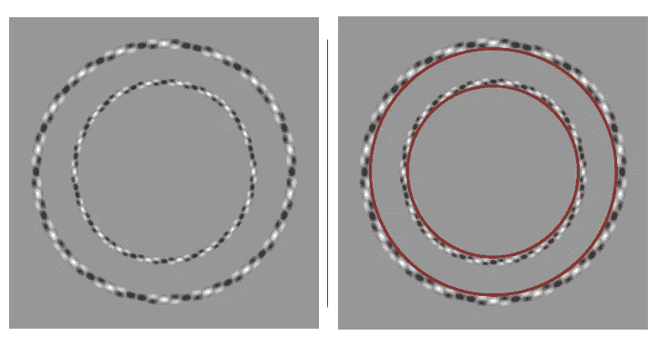

# 2-本周很酷的事情

> 原文：<https://medium.com/hackernoon/2-cool-things-this-week-587ce03266c2>

第二周:2018 年 10 月 6 日—2018 年 10 月 13 日

参见上周的 [*1-本周酷事*](https://hackernoon.com/1-cool-things-this-week-43e7a7dec431)

# 类别:人类 n.0 和/或世界 n.0 (n=1，2，…)

这一类别将包括有可能改善人类或我们生活的世界的突破。

## 奥布里·德·格里博士的生命延长和人类长寿

奥布里·德·格里是“返老还童”领域的先驱。根据他的说法，寿命延长是使人们更健康的一个副作用——他声称这对于延长我们的寿命没有内在的限制。他的研究重点是[再生医学](https://en.wikipedia.org/wiki/Regenerative_medicine)以及是否能阻止衰老过程。他也是 SENS 研究基金会的首席科学官，该基金会在延长人类寿命方面做着开创性的工作。

在采访中，他们讨论了一些概念，如“促衰老恍惚”，“长寿逃逸速度”和“全面损伤修复”，这些概念可以维持人体。

(我正在写一些关于这个话题的博客。所以如果你有兴趣了解一下，关注我这里)。

## 用干细胞治疗失明——这是最新的科学成果

**(ClinicalTrials.gov**[**链接**](https://clinicaltrials.gov/ct2/show/NCT02903576?term=stem+cells+scaffold&cond=Macular+Degeneration&rank=1) **)**

“2006 年,《自然》杂志发表了一篇论文，描述了干细胞如何被用于恢复失明小鼠的视力。这项研究，以及类似的后续研究,[在干细胞治疗人类失明的潜力方面引起了很多兴奋](http://news.bbc.co.uk/1/hi/health/6120664.stm)。一晃 12 年过去了，我们似乎仍未实现目标——日本一项著名的人体临床试验于 2015 年被叫停，原因是患者眼部有[肿瘤发展](https://ipscell.com/2015/07/firstipscstop/)的风险。”

将视网膜干细胞输送给患者有几个挑战:

1.  弄清楚如何在正确的位置进行治疗(不伤害眼睛——一个已经很脆弱的器官)
2.  即使我们可以在正确的位置提供治疗，我们如何让视网膜干细胞与现有的视网膜细胞沟通并正常发挥作用(日本早期的研究因肿瘤发展的风险而停止)，
3.  我们如何确保病人的身体不会排斥这些新细胞。

显然，科学家们现在正在使用由生物材料制成的“支架”——在将干细胞输送到眼睛之前，他们将干细胞附着在这些支架上。他们说这项技术已经在老鼠身上的研究中取得了成功，一些在 T2 的人类临床试验已经在进行中。

希望他们快点解决这件事！

## 7500 万年前的海洋微生物依靠几乎为零的能量永远生存([链接](https://www.newscientist.com/article/2182271-75-million-year-old-ocean-microbes-live-forever-on-almost-zero-energy/?utm_medium=SOC&utm_source=Twitter#Echobox=1539278359))

在南太平洋海面下 70 米深的海底沉积物下，存在着可能有 7500 万年历史的微生物。这些生物是地球上已知的最古老的生命形式之一，然而它们究竟是如何保持近乎不朽的仍然是个谜。

南加州大学的地球生物学家詹姆斯·布拉德利和他的同事认为他们已经解决了这个难题:为了生存，微生物基本上保持死亡状态。它们几乎不消耗能量。"

“……有一天可能有助于在遥远的世界寻找生命，特别是那些乍一看似乎不适合生命生存的星球。”如果我们在火星或欧罗巴上寻找生命——这些行星体的表面条件非常恶劣——我们在这些环境中最有可能找到生命的地方是地下。"

# 类别:关于人工智能(和机器)的一切

尽管发生了很多有趣的事情，我还是会尽量缩短这个类别。

## 视错觉图像数据集(Arxiv [链接](http://Optical Illusions Images Dataset)

[罗伯特·马克斯·威廉姆斯](https://arxiv.org/search/cs?searchtype=author&query=Williams%2C+R+M)，[罗曼诉扬波尔斯基](https://arxiv.org/search/cs?searchtype=author&query=Yampolskiy%2C+R+V)

作者汇编了一个超过 6500 幅视错觉图像的数据库(收集自两个网站和一个由 500 幅手绘图像组成的较小数据集)，然后训练一个神经网络来识别它们。

然后，他们建立了一个生成式对抗网络(没有超参数优化)，为自己创造视错觉，但“在一台英伟达特斯拉 K80 上训练 7 小时后，没有创造出任何有价值的东西”。

他们谈到如何天真地应用最近在甘氏综合症上的研究方法，却得不到同样的结果。这个视错觉数据集太小，而 GANs 使用大数据集(例如，30，000 张高分辨率的人脸图像)。

他们说，除了需要能够从如此小而有限的数据集学习的模型之外，还需要对人类视觉有更深入的理解。

Concentric circles

您可以下载数据集:

图像目前托管在机器学习云平台“Floydhub”上。

*   https://www.floydhub.com/robertmax/datasets/illusions-jpg[——这包含所有下载的图像，使用与链接的 github 存储库上的元数据相同的编号方案。](https://www.floydhub.com/robertmax/datasets/illusions-jpg)
*   [https://www . floydhub . com/robertmax/datasets/missions-filtered](https://www.floydhub.com/robertmax/datasets/illusions-filtered)—该文件夹包含因具有明显视觉效果而无需遵循特殊说明而手工挑选的图像。

## 世界上最强大的计算机会不会太复杂而无法使用？([链接](https://www.newscientist.com/article/mg24031990-300-could-the-worlds-mightiest-computers-be-too-complicated-to-use/))

田纳西州橡树岭国家实验室(ORNL)的天体物理学家布朗森·刀子乐队正在为极光构建超新星模拟，极光是一台预计在 21 世纪 20 年代初上线的机器，它可能是第一台每秒能够进行十亿亿亿次“浮点运算”的机器。

本文讨论了构建这样一台机器的一些挑战:

*   动力——“如果出于某种不可思议的原因，你真的可以用今天的技术建造一台亿亿亿次机器，没有人能负担得起它的动力，”麦金托什-史密斯说。他说，这样一个庞然大物将需要数百兆瓦。根据经验，“一兆瓦大约相当于一年一百万美元”。"…."在大规模计算机系统内移动数据消耗的能量比计算数据所需的能量多一个数量级。"
*   并行性——构建在潜在的数十亿个内核上运行的软件和算法非常“棘手”。我喜欢这个例子:“问题是并行性的一个固有弱点，这是计算机科学家吉恩·阿姆达尔在 1967 年指出的。他的同名定律说，任何程序的速度总是受到其最小并行部分的限制。格罗普把它比作从芝加哥运送一飞机乘客到纽约。即使你把航班换成即时传送，每个乘客仍然需要 2 个小时才能通过安检。”通常，为了处理这个问题，系统会将问题分解成尽可能小的子问题，然后决定如何使用处理器。但是您仍然需要担心处理器之间如何通信，这也是上面提到的数据移动问题再次出现的地方。例如，刀子乐队的超新星模拟会将恒星分成单独的部分，每个部分都单独进行模拟——但“计算每次重力的影响”步骤需要每个处理器向所有其他处理器广播其块的质量。大脑模拟也存在类似的问题，因为每个神经元都与许多其他神经元相连。这种方法，即分解问题，然后在处理器之间交流信息，在千万亿次浮点运算中工作良好，但“只会在亿亿次浮点运算中吞噬太多的时间和内存。”(有人请告诉我如何更好地考虑这个问题)。

Rise of the machines

即使我们能够解决这些问题，他们也提出了一个更深层次的问题:关注翻牌是提高成绩的最佳方式吗？许多研究人员不再认为这是最好的目标。

领导日本“万亿次”计算机开发的松冈聪说，日本有意设定了不同的目标。目标是通过将开发重点放在数据移动而不是原始 flops 上，使应用程序的运行速度比他们现有的 K 超级计算机(10 petaflops 机器)快 100 倍。他坦率地说，后 K 时代的计算机不会达到 1 亿亿次，但他也相信，它运行科学应用的速度会比竞争对手的第一代亿次计算机更快。

# 类别:探索太空

这个类别将拥有所有与太空相关的东西:有意义、旅行、殖民等。

## 克里斯·哈德菲尔德教授太空探索

“探索未知:不可能的事情会发生。九岁时，克里斯·哈德菲尔德知道他想去太空。他最终去了那里三次，成为了国际空间站的指挥官。在他的大师课上，克里斯教你探索太空需要什么，以及人类在最后的前沿会有什么样的未来。了解太空旅行的科学，宇航员的生活，以及太空飞行将如何永远改变你对地球生活的看法。”

Must watch trailer!!!

我没上过这门课，但我想我会的。预告片非常鼓舞人心——来看看吧。如果你想一起上这门课，这样我们就可以讨论、辩论、学习并相互激励，那么给我发信息吧。

## 即将到来的望远镜应该能够探测到系外行星上的山脉和其他景观

“2792 个系统中共确认了 3726 颗系外行星，其中 622 个系统拥有一颗以上的行星(截至[2018 年 1 月 1 日](http://exoplanet.eu/catalog/))。在未来几年，科学家们预计，由于下一代任务的部署，可能会有更多的发现。”

*“在假设行星本身不发光的情况下，凌日方法直接测量行星轮廓相对于恒星轮廓的天空投影面积……这一事实意味着凌日确实有一些揭示表面特征的潜力，因为由于地形的存在，行星的轮廓肯定会从圆形轮廓扭曲。”*

# 类别:我身边发生了什么？

我会试着突出我周围很酷的东西——在新泽西州/纽约地区。

## 人工智能机器人如何支持 NJ 的水下基础设施([链接](https://www.njtvonline.org/news/video/how-machine-learning-can-help-support-new-jerseys-infrastructure/))

“我们希望机器人能够进行基础设施检查，最理想的是评估水下基础设施的完整性，确保一切都完好无损，正常工作，没有损坏或缺陷。或者从安全的角度来看，水下的基础设施没有被植入异常。”—机械工程教授 Brendan Englot 博士。

# 类别:我知道，但是没办法

这正是类别标题所说的。

我要[这个](https://www.producthunt.com/posts/the-hypercube)！！！

Everyone should want this

不，我不这么认为:

就是这样。下周见。

如果你喜欢你所读的，一定要评论或鼓掌——作为一个新作家，这意味着很多。

我会每周做一次，所以如果你感兴趣的话，请关注。