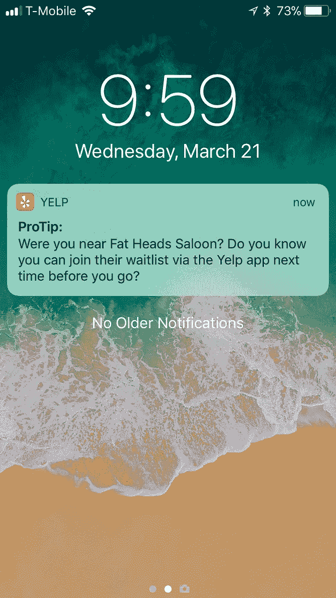
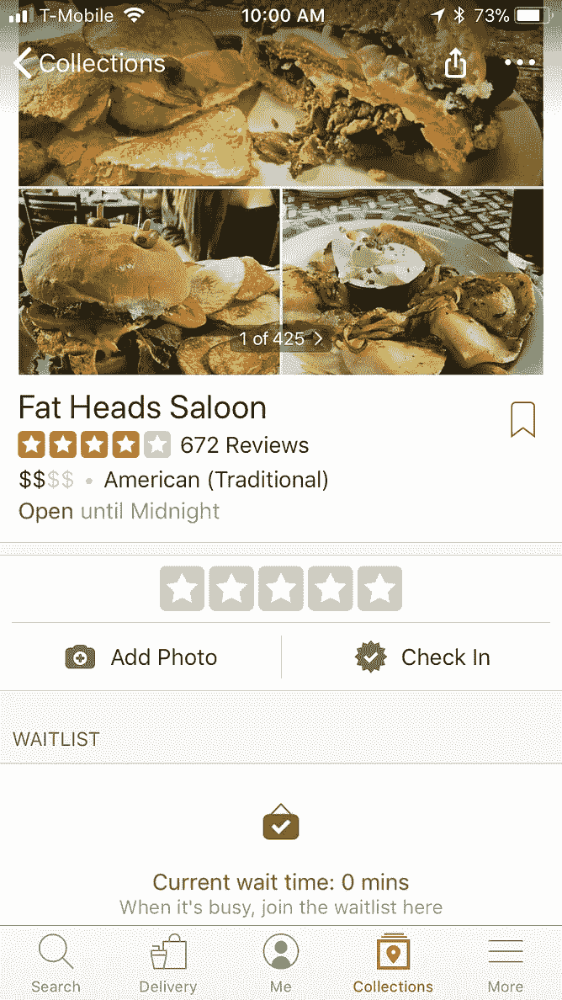
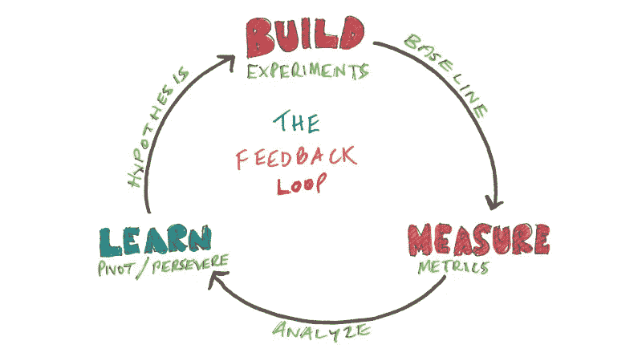
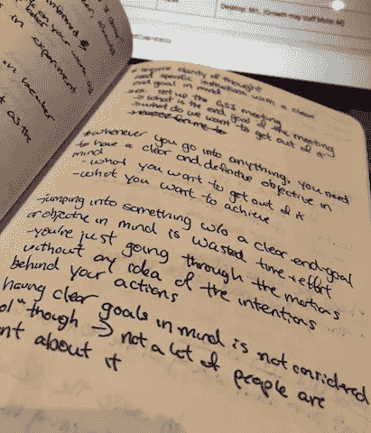
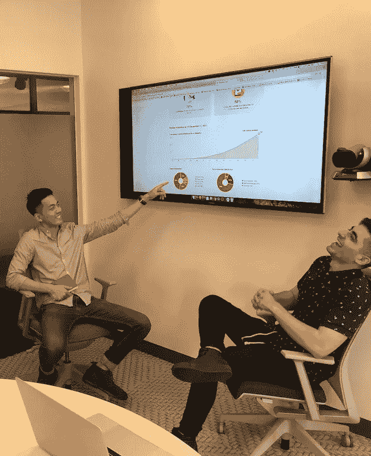

# 产品管理 2 个月:以下是我学到的东西

> 原文：<https://medium.com/hackernoon/2-months-into-product-management-heres-what-i-learned-2a0741dac17d>

This notebook, that I’ve kept throughout my internship, started off as a to-do list and has evolved to a reflective document where I state my learnings, questions, and short-term objectives to manage my day-to-day.

> 背景信息:这是我作为滑铁卢大学合作社系统的一部分的第五个合作社。这是我第一次作为产品经理实习，我在 Yelp 预订团队工作。我们负责在 Yelp 中提供餐厅预订流程，并在移动应用程序中提供名为 NoWait 的在线餐厅等候名单系统；一些餐厅以纸和笔为基础运作，NoWait 允许你加入他们的等候名单系统，而不必亲自到餐厅。

在 Yelp 实习的中途，我主动总结并浓缩了我在过去两个月里写下的几页观察笔记，并将其整理成一页，标题为“关键[知识](https://hackernoon.com/tagged/learnings)”。

这些观察笔记的灵感来自于与其他项目经理的对话、关于我如何处理困难情况的自我反思，以及来自我才华横溢的导师的建议和教训。

我想分享 3 条重要的经验，如果我一开始就将这些经验内化，会让我在[产品管理](https://hackernoon.com/tagged/product-management)的最初几周变得更容易。

## 1.实验性产品特性的目标是在最短的时间内，以“可接受的用户体验”学习尽可能多的东西

在专注于交付新产品特性的团队中，您不断地运行一系列实验来测试关于如何在没有设定基线的情况下提高关键指标的多种假设。

**关键目标:**每个实验产品特性都是解决核心问题的假想解决方案。你的主要目标是在尽可能短的时间内，尽可能多地学习验证或否定你的假设。

> 我早期犯的一个错误是在优化用户体验上花了太多时间。

项目:我从事 Yelp 通知推送，旨在提高用户对 NoWait 在线等待列表功能的认识。如果你最近去了一家使用 NoWait 的餐厅，你就会收到这条推送。

NoWait Push on iOS

问题:底层技术的一个局限是，有时他们会在餐厅被推，有时当他们离开餐厅时。我花了很多时间试图根据它们属于哪个用例来优化整个实验，而不是创建一个对两个用例都足够好的可接受的用户体验。

> 如果我们已经知道，那么花在优化用户体验上的时间和精力可能会更有益
> 
> 1)推送实验的影响
> 
> 2)它将如何影响用户
> 
> 3)他们会如何回应

但是我们没有。事实上，我们的实验应该回答那些我假设的问题。

**项目目标:**如果我们的推送实验显示用户对 NoWait 餐厅更感兴趣，并且他们的 NoWait 功能任务成功指标获得了更高的提升，这将是一个我们希望加倍努力并优化用户体验的机会。为了实现我们的目标，我们最初需要一个可接受的用户体验，而不是完美的用户体验。

**未来优化的领域:**在我们启动这个实验时，我们还会跟踪一系列其他指标。这样，我们可以看到某些行为是否与我们为实验定义的成功指标相关。例如，如果我们看到 NoWait 等待列表功能的完成率与为获得推送的用户标记业务之间的高度相关性，那么我们可以修改我们推送的副本，以说服他们也标记业务，此外还通知他们 NoWait 功能。这将成为新的假设来检验。

> 这种逻辑背后的推理是，如果他们做 A，他们很可能会做 B。B 是我们想要的结果，B 不是他们现在可以采取的行动，但 A 是。因此，我们让他们对 a 采取行动。

Based on the data of the experiment, we can create new hypotheses to optimize the solution — keeping the cycle turning

**想一想这种情况:**如果你能够在一周的实验产品开发中获得 80%的知识，但要花下周的时间去优化剩下的 20%，你就不应该这样做。这将允许你把额外的一周时间花在另一个项目上，解决你的产品路线图中不同的核心问题；即使这个新项目会产生 50%的知识，这 50%仍然比剩下的 20%多。

## 2.每次开会前，问自己“会议结束时我想完成什么”？

你应该明确列出每次会议的目标以及你希望看到的结果。一旦你确定了会议的目标，我发现了一个组织会议的好方法，如下所示:

> 背景
> 提供你试图解决的问题以及解决该问题所需的任何背景。这可能需要几个不同的人围绕这种情况陈述事实。你能吸引的人越多，就越好，因为你可以通过让人们参与来开始会议。
> 
> **目标** 预先阐明会议的目标
> 
> **讨论要点** 把你想讨论的事情放在第一位，以便人们能够做出决定。
> 
> **行动项目** 在你完成讨论要点后，你应该能够写下行动项目并为这些行动项目指派负责人。

**个人策略:**在会议之前，发送一封简短的电子邮件，详细说明会议的目的以及会议顺利进行所需的任何背景信息。在会议开始时，你应该再次向每个人重申会议的目标。

当你心中有一个清晰的最终目标，并向集体陈述时，你的讨论变得更有意图，你可以更有效地推动对话达到最终目标。

An example of a page in my notebook

**请记住:**你也应该问问自己，你需要什么样的投入才能达到你想要的产出。

尤其是在跨职能和跨团队协作之间，您应该格外警惕沟通路线的目标。反复问自己这三个问题，以明确你的沟通路线的目的:

> 1)我们为什么需要交谈？
> 
> 2)我想从他们那里得到什么？
> 
> 3)他们想从我这里得到什么？

## 3.不知道答案没关系

最糟糕的事情莫过于做出一个声明性的陈述，但后来因为被证明是不正确的而不得不收回。

就我个人而言，当我决定把速度看得比理解更重要时，我就犯了这个错误。因此，你最终会做出仓促的决定来优化你的现状。

**项目经理压力:**项目经理，在早期，误解了作为产品知识中心的工作职责，期望在任何给定的时间知道每个问题的答案。这导致了一种不健康的想法，认为不知道每个问题的答案是他们工作的失败。

尽管你应该努力尽可能多地了解你的问题、你的解决方案以及它的执行情况，但我们应该进行的对话是，期望完全了解正在发生的一切是不现实的。

下次这样做:如果有人让你做决定或询问某事如何运作，当场，你完全可以说:

> “这个问题问得好，但我不知道。给我点时间做些调查，四处打听，考虑一下。我会回来找你的。”

当你有太多的问题却没有足够的答案时，就会产生歧义。每当你觉得你已经到了一个困惑的状态，把你脑子里所有的问题都倒出来，写在一张纸上。然后，通过个人研究或向主题专家寻求答案，来弄清每一种情况。

在那个时候不知道答案并不是你工作的失败。不跟进是你工作的失败。

Bonus learning: always have fun :)

*如果您有任何问题，欢迎在下面提出！我愿意尽可能地帮忙！*

[*关注我*](/@charlesbai) *阅读更多关于我的 PM 之旅；第二部分即将推出！*

*我要感谢* [*科马尔*](https://medium.com/u/7e69d0333459?source=post_page-----2a0741dac17d--------------------------------)*[*山*](https://medium.com/u/76a200a1a1f8?source=post_page-----2a0741dac17d--------------------------------) *和* [*赛义德*](https://medium.com/u/95cb8eb718db?source=post_page-----2a0741dac17d--------------------------------) *帮助我完成这篇博文。**