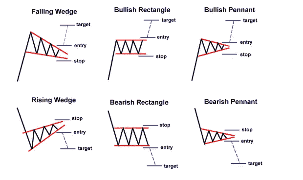

# 加密货币市场下跌时要做的两件事

> 原文：<https://medium.com/hackernoon/2-things-to-do-while-the-cryptocurrency-market-falls-2c6cdfbd6809>

## 除了哭，尖叫，和其他自毁行为。

#1: Ramen is your best friend.

1.  换成拉面饮食。
2.  以胎儿的姿势前后摇晃自己。

## **开个玩笑**

请不要做以上任何一项。尽管我一直是节俭的支持者，并真诚地相信奶酪味拉面是这个世界上最被低估的美味之一。

加密货币投资是一种情绪过山车，即使对经验丰富的交易者来说也是如此。不要让你的情绪控制你的行动。坚持你的策略，记住你为什么买你做的硬币，不要恐慌卖出。

> *市场下跌时该怎么做取决于你所处的具体位置。*

如果你已经投资了，并且看到你的头寸在贬值，你会想要表现得不同于你坐在现金中等待投资机会(这是市场下跌时的最佳位置)。

如果你足够幸运，当市场下跌时，你的投资资本是现金…

# **买蘸料**

加密货币中有一个术语叫做“BTFD”。意思是“买该死的蘸酱”。

自 2009 年以来，**一直是比特币投资者的制胜策略。这个概念并不新鲜，早在金融时代就有名言告诉你，“当街上血流成河时买入”。**

这里有一些“ **BTFD** ”在其自然栖息地推特上的例子。

## **像购物一样投资加密货币。你在寻找最好的交易。**

当你去杂货店购物时，你知道你想买什么，你知道它值多少钱。因此，如果你去买香蕉，但它们已经过季，价格上涨了近 20%，那一周你可能不会买香蕉。

加密货币也是一样。如果你认为某样东西有价值，并且将来会增值，那就买下它。如果你认为某样东西已经被高估了，或者即使市场已经让某样东西的价值超过了你愿意花在它上面的钱，不要这样做。

假设一枚硬币在上涨时从 5 美元涨到 20 美元，当市场下跌时跌到 10 美元。

这是从 20 美元开始打折还是从 5 美元开始加价？

都是。硬币可以走任何一条路，但在这一点上，鉴于它已经找到了 10 美元的临时底部，并没有进一步下跌。我认为更有可能恢复到 20 美元甚至更高。最重要的是，我的下跌是 5 美元，我的上涨是 10 美元。

这个例子非常简单，但是你已经明白了要点。事实上，在权衡风险和回报时，需要考虑更多的变量。

这个故事的寓意是，你看到的称之为“比特币的终结”的文章越多，你就越应该看好你的投资。不要关注新闻(CNN，美国消费者新闻与商业频道等)。).上次美国消费者新闻与商业频道做了一个关于“如何购买 Ripple”的部分，他们几乎称之为上涨趋势的确切顶部。几乎就在这个片段播出后，瑞波(XRP)股价暴跌了 50%以上。

# **研究**

> “正规教育会让你谋生；自我教育会让你发财的。”
> –吉米·罗恩

如果你已经投资了，看着你的包包贬值，花点时间从你的错误中吸取教训。

当我第一次在 crypto 经历熊市时，我开始学习技术分析并制定个人投资策略。

不幸的是，当时我没有耐心地坐在菲亚特里等待“购买 dip”的最佳时机。我已经投入了我所能承受的一切，在牛市的顶部，在我买入后几乎立即停止。

我的投资很快损失了 50%的价值——我甚至无法打开我的交易所而不陷入一阵沮丧。我觉得自己像个白痴。

太固执不肯接受失去，我开始学习。自学指标，研究市场及其周期，了解这个领域不同的主要参与者——做我在涉足之前就应该做的尽职调查。

查看[股票图表](http://stockcharts.com/)，开始研究不同的图表模式。许多人认为技术分析是一门“*伪科学*”，但我发现它比传统股票市场更适用于加密货币。也许是由于市场的情绪状态。

股票市场有几十年经验的投资者和交易者。大多数加密货币投资者都是新手，或“散户投资者”，他们在极端波动时期更容易情绪化。

机构投资者才刚刚开始涌入市场。这个领域的工具和资源不够成熟，很难让“大资金”参与进来。这使得这个高度投机和情绪驱动的市场不受阻碍地发展到今天的波动水平。

技术分析(TA)在心理学中试图理解图表历史中任何一点可能发生的可能性。它利用市场的波动性，并试图理解它。重要的是要明白 TA 不是预测未来。

这是关于理解所有可能的结果，并在任何结果发生时准备好自己处于最佳状态。

这都是关于**风险管理。**例如:不要试图抓住下跌趋势的底部(有经验的交易者称之为“抓住下跌的刀”)来最大化你的上涨潜力。相反，等待下跌趋势结束的确认。这意味着你将错过最初的价格上涨，但是你进入的风险也比你在上升趋势被确认前进入的风险要低。

在你买任何东西之前，你应该研究这个图表至少一个月。了解它移动的通道，研究它的历史，看看它过去对正面和负面消息的反应。

## **当你发现一枚你认为是好投资的硬币时:**

*   研究图表
*   确定你认为什么是好的切入点
*   设置限价单，在这个价格买入
*   走开。

信不信由你，最后一步往往是最难的。我看到我们[交易团队](https://discord.gg/WqSdhX)的人面临的最大问题之一是坚持他们的策略。他们花时间研究进场点，但当他们设置限价单时，他们就坐等着进场。

这是一个**可怕的想法。**

打开电视，玩一些电子游戏，做**除了盯着图表之外的任何事情**，直到你的订单通过。在你设定了买入后盯着图表是一个很好的方式，让你自己重新猜测自己的决定，搬起石头砸自己的脚。

找出好的进场点比我在这里说的要困难得多，我建议找一个导师或者在 Udemy 上学习技术分析课程。

**继续教育:**如果你想能够看懂图表并对图表做出自己的决定，那就从一些基础的 TA 开始吧。了解[烛台模式](http://stockcharts.com/school/doku.php?id=chart_school%3Achart_analysis%3Acandlesticks_and_traditional_chart_analysis&st=candlesticks)、[图表模式](http://stockcharts.com/school/doku.php?id=chart_school%3Achart_analysis%3Achart_patterns&st=chart+patterns)、[支撑位&阻力](http://stockcharts.com/school/doku.php?id=chart_school%3Achart_analysis%3Asupport_and_resistance&st=support+and+resistance)、[所有股票图表上的指标](http://stockcharts.com/school/doku.php?id=chart_school%3Atechnical_indicators)。

## 我个人最喜欢的覆盖图/指示器:

[**MACD**](http://stockcharts.com/school/doku.php?id=chart_school%3Atechnical_indicators%3Amoving_average_convergence_divergence_macd)

**[RSI](http://stockcharts.com/school/doku.php?id=chart_school%3Atechnical_indicators%3Arelative_strength_index_rsi)**

**[**随机 RSI**](http://stockcharts.com/school/doku.php?id=chart_school%3Atechnical_indicators%3Astochrsi)**

**[**布林线**](http://stockcharts.com/school/doku.php?id=chart_school%3Atechnical_indicators%3Abollinger_bands)**

## ****一旦你对基础知识有了扎实的理解:****

**深入探讨 [**斐波那契回撤**](http://stockcharts.com/school/doku.php?id=chart_school%3Achart_analysis%3Afibonacci_retracemen&st=fibonnaci+retracement)**&**[**艾略特波浪理论。这些是我个人最喜欢的，我以它们发誓。**](http://stockcharts.com/school/doku.php?id=chart_school%3Amarket_analysis%3Aintroduction_to_elliott_wave_theory&st=elliot+wave)******

# ****想了解更多？****

## ****如果你喜欢这篇文章，请随意看看我最近的一些作品。****

**** [## 不熟悉加密货币？从这里开始

### 加密货币、比特币和区块链速成班

medium.com](/swlh/new-to-cryptocurrency-start-here-44cc5a6d6626)  [## 了解加密货币市场周期，以便更好地投资

### 为什么以太币、莱特币和其他替代币会在比特币创下新高时下跌，以及如何利用这一点

medium.com](/swlh/understanding-cryptocurrency-market-cycles-for-better-investments-c6cc4bc80099)  [## 加密货币的未来

### 鸟瞰是什么导致了加密市场的兴起

medium.com](/swlh/on-the-future-of-cryptocurrency-e8ff9e171be9)  [## 关于 Facebooks 加密货币你需要知道的一切(Libra 项目)

### 我阅读了 Project Libra 白皮书，所以你不必这样做。

medium.com](/swlh/facebook-crypto-d13449171a9f)****