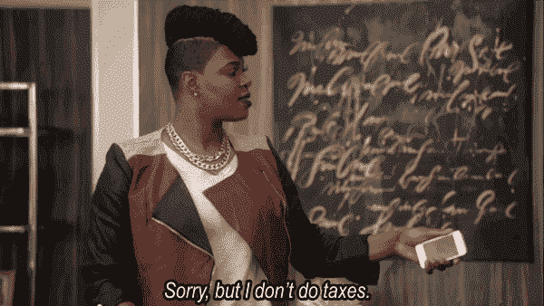

# 2018 年 2 月 20 日:神秘领域最大的故事

> 原文：<https://medium.com/hackernoon/20-02-2018-biggest-stories-in-the-cryptosphere-100cd402b7d8>

**1。韩国政府支持的加密货币交易**

对韩国政府可能实施禁令的担忧终于平息了。金融监管机构负责人[宣布了两项重要消息](https://www.ccn.com/south-korea-govt-will-support-cryptocurrency-transactions-financial-regulator/)。加密货币交易将得到政府的支持，同时银行将被鼓励为客户简化与交易所的交易。后者是由于这些金融机构不愿意向加密货币交易者提供虚拟银行账户。此外，[国家金融监督局(FSS)局长 Choe Heung-sik 表示](http://english.yonhapnews.co.kr/news/2018/02/20/0200000000AEN20180220006500320.html?input=rss)政府将积极帮助该行业在该国蓬勃发展，其中包括“了解你的客户”支票(KYC)。

**2。尼日利亚每周有 400 万美元的比特币交易**

我们之前[报道过](https://hackernoon.com/02-02-2018-biggest-stories-in-the-cryptosphere-ae7caeaa6c45)尼日利亚参议院发起对比特币的调查。尽管政府很担心，但据报道，每周有 380 万美元(13.89 亿尼日利亚奈拉)通过 13 家当地交易所进行交易。许多人认为，政府应该重新评估自己的地位，并利用这一新的创新。分析人士表示，在实施任何禁令之前，都应该对这个话题有所了解。总部位于尼日利亚的 13 家交易所在去年 12 月达到峰值，交易价格为 5.4 美元(1.95 奈拉)。此外，Cymantiks Nigeria 的软件开发人员兼首席架构师埃梅卡·奥科耶认为，政府的敌意只会导致进一步的投机和波动。根据 Okoye 的说法，由于这项技术的潜力，政府应该接受它，而不是将其推向地下。然而，他澄清说，他不认为比特币会取代法定货币。尽管如此，它将有助于资金的转移。

**3。尼古拉斯·马杜罗的加密货币 Petro 正式发布**

委内瑞拉[希望](https://news.sky.com/story/struggling-venezuela-lines-up-cryptocurrency-launch-11258834)通过推出臭名昭著的石油支持的加密货币 Petro (PTR)来缓解恶性通货膨胀和美国制裁带来的问题。负责人卡洛斯·巴尔加斯之前已经宣布了今天，也就是 2 月 20 日，第一阶段的拍卖。他接着表示，预计土耳其和卡塔尔等中东国家的投资者将参与此次出售。[计划](http://fortune.com/2018/02/20/venezuela-petro-cryptocurrency-sale/)是找到合适的客户，然后依靠二级市场交易。然而，许多人认为对公民自由的压制给委内瑞拉带来了[信任和透明问题](https://www.cnbc.com/2018/02/20/venezuelas-new-bitcoin-oil-backed-cryprocurrency-launched-in-bid-to-save-economy.html)。最后，Longview Economics 的主任兼高级经济学家 Harry Colvin 对该项目能否成功表示怀疑。

**4。加密货币可能免于财产税**

怀俄明州参议院发布了一项税收法案[呼吁免除加密货币的州财产税。这项立法列出了应该豁免的项目。该法案被称为怀俄明州参议院 111 号法案，由参议员奥格登·德里斯基尔、塔拉·内瑟科特和克里斯·罗斯富斯在众议员泰勒·林德霍尔姆、大卫·米勒和贾里德·奥尔森的帮助下颁布。赞成、反对和不反对的票数分别是 26、3 和 1。这一消息是在两党运动呼吁美国制定加密法规的报道之后发布的。](https://legiscan.com/WY/text/SF0111/2018)

> 要想在你的邮箱里收到我们的每日新闻综述，请在这里注册:[http://bit.ly/BlockExNewsRoundup](http://bit.ly/BlockExNewsRoundup)