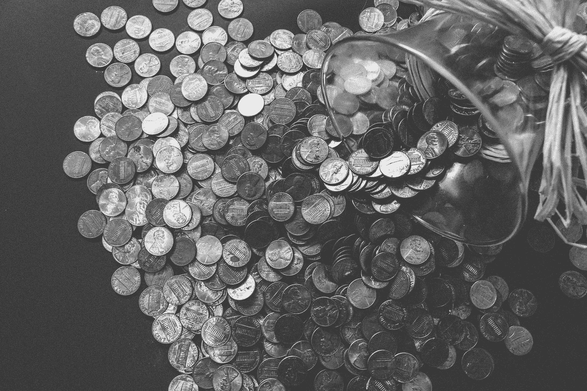

# 2018 年 4 月 20 日:神秘领域最大的故事

> 原文：<https://medium.com/hackernoon/20-04-2018-biggest-stories-in-the-cryptosphere-e90c8b9c5e95>

**1。凭借 63 亿美元，ico 在 2018 年已经筹集了超过 2017 年全年的资金**

ico 已经[在 2018 年第一季度筹集的资金超过了 2017 年全年](https://www.coindesk.com/6-3-billion-2018-ico-funding-already-outpaced-2017/)。2018 年前三个月筹集的 63 亿美元相当于 2017 年筹集资金的 118%，尽管只有 59%的 ico 已经推出。这个数字包括 Telegram 自己的代币销售，它筹集了创纪录的 17 亿美元。这些数字证明，尽管目前监管存在不确定性，但 ico 仍是一种成功的融资方式。这一消息是在 SEC 宣布被归类为证券的 ico 现在需要向该机构注册之后发布的。它已经[将其网站的一部分](https://hackernoon.com/21-03-2018-biggest-stories-in-the-cryptosphere-33e9c6381cf4)分配给这个问题。

**2。摩根大通和加拿大银行正在测试区块链发债**

摩根大通和加拿大银行以及其他大公司正在测试在区块链发行金融工具。目标是简化各种流程。发起、利率支付和结算都将受益于该计划。参与该项目的其他机构包括高盛资产管理公司(高盛集团公司的基金管理子公司)、辉瑞公司和 Legg Mason Western Asset。该平台是利用摩根大通内部开源的区块链法定人数创建的。Quorum 的受欢迎程度已导致摩根大通(JP Morgan)考虑发行一家分拆公司。到目前为止，许多银行已经在区块链技术上投入了大量资金。

**3。欧盟议会投票通过联合加密法规**

欧盟议会就一套联合加密法规进行了投票，这将使欧盟国家更加紧密地合作。这个消息是通过官方网站上的新闻稿发布的。2017 年 12 月与理事会达成的协议获得 574 票支持，13 票反对，60 票弃权。该协议是欧盟反洗钱指令的一部分。它的意图之一是解决虚拟货币以及相关交易所和钱包交易中的匿名问题。现在需要客户验证。新的立法将在欧盟官方公报公布三天后颁布。欧盟国家将有 18 个月的时间将新规则转化为国家法律。

**4。尽管美国的税收日**，加密货币仍然不受欢迎

Fundstrat Global 的联合创始人汤姆·李(Tom Lee)此前表示，在美国税收日引发抛售后，比特币的价格将会下跌。然而，[超过 85000 美元的比特币和接近 600 美元的以太坊反而是市场正在改善的迹象。](https://cointelegraph.com/news/crypto-markets-see-more-gains-in-the-wake-of-americas-tax-day)24 小时内，比特币增长 3%，与 3 月 25 日的价格持平。尽管如此，Ripple 仍然是最成功的加密货币，在过去 24 小时内增长了 20%。上涨背后的原因之一可能是机构兴趣的增长。

> 本新闻综合报道由 [BlockEx](http://bit.ly/BlockEx_) 为您带来。

> 要想在你的邮箱里收到我们的每日新闻综述，请在这里注册:[*http://bit.ly/BlockExNewsRoundup-Updates*](http://bit.ly/BlockExNewsRoundup-Updates)