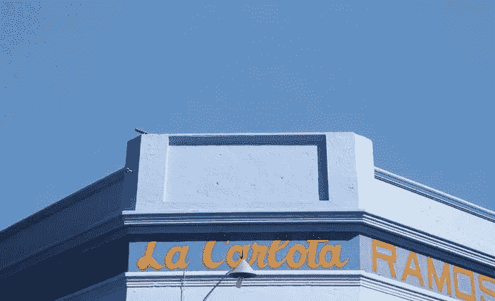

# 2018 年 6 月 20 日:神秘领域最大的故事

> 原文：<https://medium.com/hackernoon/20-06-2018-biggest-stories-in-the-cryptosphere-84408c3b3cc7>

通过 BlockEx

**1。乌拉圭将推出加密监管框架**

据 BNamericas】报道，乌拉圭金融科技商会正在建立一个委员会，其任务是[创建一个加密监管框架](https://cointelegraph.com/news/uruguay-to-develop-crypto-regulations-focusing-on-innovation)。此举是政府促进创新和发展国家财政体系的努力的一部分。该项目将启动反洗钱、反恐怖主义和反贩毒举措。商会正在积极寻求第三方的投入，以制定该框架。监管必须通过机构渠道。乌拉圭希望将自己定位为该地区的技术中心。这些举措旨在提高该国的投资和创新水平。

**2。菲律宾银行 RCBC 将区块链集成到其汇款服务中**

总部位于菲律宾的 Rizal 商业银行宣布与两家日本银行合作推出区块链汇款服务，其中一家可能是 Resona Bank Ltd .的合作伙伴。区块链技术将削减货币交易的时间和成本。该项目旨在帮助生活在日本的海外菲律宾工人。第一高级副总裁 Manny T. Narciso 表示，新技术将取代基于 SWIFT 的程序，他认为该程序已经过时且成本高昂。日本是首选国家，因为就汇款额而言，它是最大的国家。

**3。高盛首席执行官仍对加密货币持积极态度**

高盛首席执行官劳埃德·布兰克费恩最近接受了彭博的采访。在谈话中，布兰克费恩重申了他对加密货币的积极立场，称它们可以像纸币取代金币和银币一样彻底改变当前的货币体系。他接着说，加密货币和纸币一样，没有内在价值。最后，布兰克费恩将加密货币无法取代当前形式的法定货币的观点称为“傲慢”。这一消息是在华尔街银行决定推出比特币交易业务之后发布的，正如[在五月初报道的](/swlh/03-05-2018-biggest-stories-in-the-cryptosphere-4e25f89235b6)。

**4。欧洲刑警组织正与密码交易所合作打击犯罪**

欧洲刑警组织正与密码交易所合作，作为打击犯罪的一种手段。执法机构正在与几家数字交易所进行讨论，以收集信息，了解哪种方法是处理加密货币在非法活动中的使用的最佳方法。由欧洲刑警组织主办的为期三天的活动正在进行，加密货币正在讨论中。包括密码交易所、支付处理器、数字钱包和欧盟国家当局在内的 16 个组织将参加此次活动。会议的重点是评估如何追踪加密货币的来源，以及打击有助于简化非法活动的服务。

> 本新闻综合报道由 [BlockEx](http://bit.ly/BlockEx_) 为您带来。

> *要想在你的邮箱里收到我们的每日新闻综述，请在这里注册:*[*http://bit.ly/BlockExNewsAndUpdates*](http://bit.ly/BlockExNewsAndUpdates)