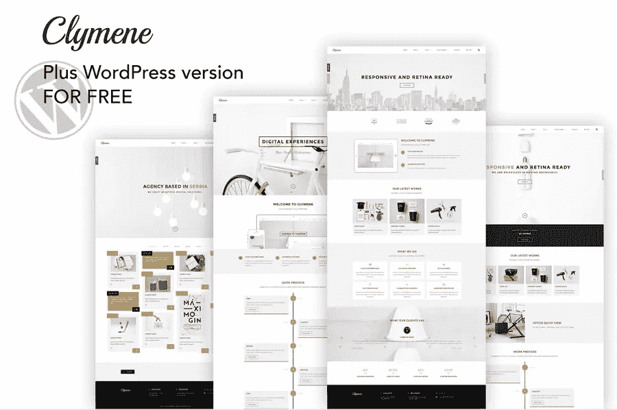

# 2018 年 20 个最佳免费 HTML5、CSS3、Bootstrap 登陆页面模板

> 原文：<https://medium.com/hackernoon/20-best-free-html5-css3-bootstrap-landing-page-templates-in-2018-717488cfa48b>

网站模板是网站建设的最佳解决方案。以下是 2018 年 20 个最好的免费 Bootstrap 登陆页模板，用于有创意和强大的网站建设。

你的登陆页面是说服新访客在访问你的网站时采取某些行动的基础。无论是让用户注册，注册，甚至购买你的产品或服务，设计一个优秀的登陆页面将帮助你实现这个目标。

但是如何快速建立一个高质量的登陆页面呢？使用功能强大且灵活的登录页面模板可能是您的最佳选择。大多数 HTML5、Bootstrap 和 CSS3 模板都包含可以帮助您轻松创建页面的功能。此外，网站设计人员和开发人员随时在互联网上分享免费的响应登录页面模板供您使用。Mockplus 在 2018 年精心挑选了 **20 个最好的免费响应 HTML5、CSS3、Bootstrap 和 WordPress 登陆页面模板**，你可以在你的项目中快速实现。

# 2018 年 5 个最佳免费响应 Html5 登陆页面模板

有 5 个完全可定制且响应迅速的登录页面模板供您激发灵感。

# 1.克吕墨涅——创造性的多用途 HTML/Wordpress 模板

克吕墨涅，用 html5 和 css3 构建，是一个用于[创意作品集网站](https://www.mockplus.com/blog/post/portfolio-design-websites)的完美且通用的 html 模板。这个多用途的模板涵盖了所有细节，因此它非常适合从博客、自由职业者和摄影师到餐馆、商业商店和旅行社的所有人。该模板使您的作品集以经典网格或 Pinterest 风格的砖石布局显示，最大限度地扩大页面空间，创造更具吸引力的用户体验。

**功能:**

*   免费 WordPress 版本
*   单页 3d 菜单
*   预建网站变体
*   触摸滑动支持
*   混合砌体和网格组合
*   高级滑块，滑块旋转(价值 14 美元)
*   Ajax 和外部投资组合页面内置的例子

[https://elements.envato.com/clymene-creative-multi...](https://elements.envato.com/clymene-creative-multipurpose-html-template-wp-6RYYF4)

# 2.succes—蔡雅艺 CV 的响应式 HTML5 和 CSS3 模板

Sukces 是一个基于 Bootstrap 3 框架的强大的个人简历 cv html5 / css3 模板。这个模板有漂亮的设计和效果，包括视频背景，幻灯片背景，博客，一个工作联系形式，许多有用的组件，8 种配色方案和有效组件等。所有这些特点使它成为一个完美的单页个人网站。基于 Bootstrap 3，该模板在默认情况下是可响应的，并具有所有的通用元素样式，确保它在任何设备上都看起来和工作起来非常棒。

**特色:**

*   10 个演示版本
*   RTL 支持
*   衬线和无衬线版本
*   用萨斯做的
*   令人惊叹的文档
*   视网膜就绪
*   易于设置

【https://elements.envato.com/sukces-neat-personal-r... 

# 3.膳食—单页 HTML 模板

膳食是一个免费的单页 HTML 餐厅模板，由 Free-Template.co 创建。这个模板有许多独特的功能，包括整洁的负载转换，画布外导航，食物菜单(早餐，午餐，晚餐切换器)，厨师简介，客户评论滑块，预订表单和智能页脚与谷歌地图集成。这个模板制作了很多[登陆页面设计实例](https://www.mockplus.com/blog/post/best-landing-page-design-examples)。

**功能:**

*   订票表格
*   食物菜单
*   谷歌地图
*   负载转换
*   长滚动时事通讯
*   团队感言

[https://onepagelove.com/meal](https://onepagelove.com/meal)

# 4.Tinos —高级预订酒店 HTML 模板

Tinos 是专为酒店、度假村和客房预订而设计和开发的一款创意简洁的模板。Tinos 有两个版本(深色和浅色)，都采用了干净时尚的设计。Tinos 和 Montserrat 字体的完美结合给使用这个模板的人带来了奢华的感觉。该设计非常有创意，独特，非常容易定制。

**功能:**

*   包括 30 个 HTML 文件
*   将文件转换到 Wordpress、Joomla 或其他 CMS
*   使用 1170 像素网格自定义
*   像素完美，
*   自举网格

[https://elements.envato.com/tinos-premium-booking-...](https://elements.envato.com/tinos-premium-booking-hotel-html-template-P4KVNA)

# 5.住房-房地产视差登录页面模板

住房是现代和清洁的房地产房地产登陆页面模板。这个模板有助于将你的访问者转化为未来的客户，因此它很受房地产开发商、建筑师、代理机构或任何与房地产相关的企业的欢迎。漂亮简洁的设计为任何访问你网站的用户提供了愉快的用户体验。你甚至可以从中学习一些[登陆页面设计技巧](https://www.mockplus.com/blog/post/product-landing-page-design)。

**特色:**

*   房地产、建筑师或开发商的登录页面
*   视差效果
*   谷歌地图
*   自举 4
*   响应性

【https://elements.envato.com/housing-real-estate-la... 

# 2018 年 5 个最佳免费响应引导登录页面模板

一个免费的集合，包括自举建立登陆页面，主页，主题和模板。

# 6.商务休闲装——完全开发的 Bootstrap 4 商务网站登录页面模板

商务休闲是一个完整的登录页面模板，使用 Bootstrap 4 创建。它响应迅速，支持所有主流浏览器和平台的最新稳定版本。它有 4 个预建的 HTML 页面和许多不同的定制样式的组件。

**功能:**

*   完全响应
*   自举 4
*   四个预建的 HTML 页面
*   存储当天更新的小时脚本

[https://startbootstrap.com/template-overviews/busi...](https://startbootstrap.com/template-overviews/business-casual)

# 7.新时代——一个大胆而丰富多彩的引导登录页面主题，用于 web 应用程序或其他商业用途

新时代有一个引导登录页面主题，可以帮助你展示你的网络应用。只要放入内容，你就可以很容易地在上面使用 HTML5/CSS 设备模型。这个主题具有大胆，丰富多彩和时尚的设计，各种内容部分，自定义固定导航菜单，滚动动画和自定义风格的按钮。

**功能:**

*   支持所有主流浏览器和平台的最新稳定版本
*   用 Bootstrap 4 创建的完全响应的 HTML 模板
*   包含 SASS/SCSS 文件，用于更深入的定制选项
*   带有导航、章节和旁白的语义标记
*   标题中带有纹理覆盖的 CSS 渐变

[https://startbootstrap.com/template-overviews/new-...](https://startbootstrap.com/template-overviews/new-age/)

# 8.自由职业者——一个面向自由职业者的单页自举作品集主题，带有自定义作品集网格

自由职业者是一个为自由职业者的一页自举组合登陆页面主题。它具有一个固定的顶部导航，可折叠滚动，完美响应的组合网格，悬停效果和使用字体真棒图标的自定义水平规则。这是一个用 Bootstrap 4 创建的完全响应的 HTML 模板。此外，它有一个反应灵敏的全屏模式窗口，用于展示项目细节。

**特性:**

*   flaticons.com 的平面图标
*   包括 SCSS/萨斯文件和编译的 CSS
*   浏览导航项目
*   自定义大纲按钮样式
*   带有浮动表单标签的移动友好联系人表单
*   易于编辑的 PHP 文件，使联系形式发送消息
*   包括用于联系人表单验证的 jqBootstrapValidation 插件

https://startbootstrap.com/template-overviews/free...

# 9.Appy —基于 Bootstrap 1170px 的应用程序登录页面 HTML 模板

Appy 是一个应用程序登录页面，旨在销售移动应用程序。它有创意，现代的设计元素，无限的颜色，平滑的过渡，[视差滚动网站](https://www.mockplus.com/blog/post/parallax-scrolling-websites)背景，谷歌字体和 Mailchimp 集成。它有良好的客户服务与 6 个月的支持。Appy 包含了一个应用登陆页面应该包含的所有可能的元素。

**功能:**

*   潜在客户和点击量
*   活动监视器
*   基于引导程序 1170px
*   有效的 HTML5 / CSS3
*   视网膜就绪

[https://elements.envato.com/appy-app-landing-page-...](https://elements.envato.com/appy-app-landing-page-html-template-A6D3G8)

# 10.灰度——一个免费的多用途单页引导主题，具有深色配色方案和平滑滚动动画

灰度是用 Bootstrap 4 创建的完全响应的 HTML 模板，旨在支持所有主流浏览器和平台的最新稳定版本。这是一个多用途的单页网站主题，具有深色布局和平滑滚动的页面动画。

**功能:**

*   包括 SCSS/萨斯文件和编译的 CSS
*   固定顶部导航，滚动时折叠
*   平滑滚动动画
*   突出显示活动页面部分的 Scrollspy
*   自定义按钮样式

[https://startbootstrap.com/template-overviews/gray...](https://startbootstrap.com/template-overviews/grayscale/)

# Wordpress 主题的 5 个最佳免费登陆页面模板

WordPress 是网络上最流行的 CMS 平台之一。在这里你会找到你的 WordPress 网站的最佳登陆页面主题。

# 11.mcgillis——大学免费 WordPress 高等教育登陆页面主题

Mcgillis 是一个极简主义的 Wordpress 登陆页面模板，旨在帮助用户选择一所好学校。这是一个免费的教育模板，所以如果你打算创建一个教育网站，这是你最好的选择。最好的部分是出色的表格设计，它展示了你的大学有什么了不起，以及人们为什么应该申请。包括社会证明和真实的证明使这个模板非常有用。

**特性:**

*   特定行业
*   Wordpress 主题
*   响应性

https://unbounce.com/landing-page-template/mcgilli...

# 12.Moto — WordPress 登录页面主题

Moto 是一个为登陆页面设计的反应灵敏、干净、现代的 WordPress 主题。它具有整洁，干净和简单的设计，无限的颜色变化，博客页面，谷歌字体，字体真棒图标，线图标等。特别值得注意的是快速拖放页面生成器，它也很容易定制。

**功能:**

*   有效的 HTML5，CSS3
*   主题布局[全幅，框式]
*   基于 King Composer 构建
*   完全响应
*   有据可查

[https://elements.envato.com/moto-wordpress-landing...](https://elements.envato.com/moto-wordpress-landing-page-theme-WH6JZ5R)

# 13.电子商务的凝视响应多用途主题

凝视是一个优质的多用途 WordPress 主题，它的设计和开发考虑到了简单性和灵活性。这个[电子商务登录页面模板](https://www.mockplus.com/blog/post/ecommerce-website-templates)有超过 18 个具有独特风格和功能的家庭演示，以及超过 100 个模块和元素。它最适合创业网站、作品集、数字代理、商业公司、登陆页面、在线商店和个人网站。

**功能:**

*   响应引导网格
*   用干净的语义 PHP 代码构建
*   文件类型包括 CSS，JS，PHP，PSD
*   视觉作曲家和 WooCommerce
*   包括 PSD 文件

[https://elements.envato.com/gaze-responsive-multip...](https://elements.envato.com/gaze-responsive-multipurpose-wordpress-theme-W9NRMWD)

# 14.stash——多用途 WordPress 主题，带有可视化编辑器块生成器

Stash 是商业网站的一个直观、灵活和强大的 WordPress 主题。它有一个预先做好的布局，确保你的内容显示良好。该主题包括市场上最受欢迎的优质插件:可视化作曲家，革命滑块和基本网格。只需使用拖放界面和大量预构建的元素，您就可以创建几乎任何类型的布局。

**功能:**

*   以实用性为设计理念
*   现成的布局
*   插件集
*   翻译就绪，并与 WPML 插件兼容

[https://theme forest . net/item/stash-multipury-WordPress-theme-with-visual-composer-block-builder/2012 8 009](https://goo.gl/4vy2XN)

# 15.照片——一页 WordPress 主题

Photosy 是由[主题泡泡](http://themebubble.com/)设计的 WordPress 主题，旨在满足各种规模的摄影网站的需求。该主题包括最好的登录页面示例，其特点是长滚动单页面布局。最有趣的功能包括 intro project carousel，Instagram feed，博客帖子和项目，有几个选项，全画布视图，缩放，全屏，自动播放幻灯片，甚至还有一个下载图像的选项。

**功能:**

*   100%宽度布局
*   大图像
*   博客订阅源
*   Instagram feed
*   长滚动
*   幻灯片放映
*   主题泡泡

[https://onepagelove.com/photosy](https://onepagelove.com/photosy)

# 5 其他登录页面模板

我们希望与您分享更多登录页面模板，以构建您自己的首选网站。

# 16.Atlas 单页 HTML 登录页面模板

Atlas 是由前端开发人员 Yiya Chen 提供的优质免费软件。这个免费的单页 HTML 模板是建立在 Bootstrap 框架上的，适合一个干净的、长滚动的登陆页面。它包括清晰的排版，内容加载过渡，时尚的对角线，带有截图的设备，三层定价表，客户标志，结尾是联系方式。

**功能:**

*   徽标联系人
*   表单设备
*   对角线
*   负载转换
*   长滚动
*   定价表
*   社交图标

[https://onepagelove.com/atlas-template](https://onepagelove.com/atlas-template)

# 17.产品登录页面—促销页面网站模板

产品登陆页面是 WIX 发布的流行模板之一。它是专门为那些有推广计划的商业网站设计的。该模板具有丰富的界面设计和特殊商品部分。

**功能:**

*   响应式设计
*   谷歌字体支持
*   优秀的表单设计

[https://www.wix.com/website-template/view/html/1234/](https://goo.gl/K9ttX3)

# 18.drew——一个营销登录页面

Drew 是一个强大的登录页面模板，可以满足您的登录页面所需的所有需求。最令人兴奋的是漂亮的设计和完美的网络营销方法的结合，同时继续为您的最终用户提供出色的性能和功能。此外，它包括大量的组件和变化。

**功能:**

*   引导框架(3.3 版)
*   470++图标集成
*   视差效果(可选)
*   模块化 CSS 类
*   针对性能进行优化
*   详细而直接的文档
*   通过 Mailchimp 集成的订阅表单

[https://wrapbootstrap.com/theme/drew-all-in-one-ma...](https://wrapbootstrap.com/theme/drew-all-in-one-marketing-landing-page-WB0350PTJ)

# 19.Delta —推广移动应用程序(引导程序 4)

Delta 是一个 HTML5 登陆页面模板，旨在帮助应用开发者推广他们的移动应用。您只需放入您的内容/图片，并连接联系表单，就可以快速构建您的网站，简单明了。

**特色:**

*   基于 Bootstrap 4 构建
*   HTML5 + CSS
*   包括 SCSS 源文件
*   完全响应
*   3 种类型的移动设备

【https://wrapbootstrap.com/theme/delta-promote-mobi... 

# 20.Prottasha — Bootstrap 4 慈善登录页面

Prottasha 是一个专业的 HTML5 登录页面模板，旨在满足任何慈善机构、非营利组织、非政府组织或基于捐赠的网站的需求。它是用最新版本的 Bootstrap 框架制作的。这个模板有一个干净的外观和感觉，时尚和现代的风格，包括 11 个独特的 HTML 页面，4 个不同的主页，3 个博客页面，12 个不同类型的预制配色方案等等。

**功能:**

*   惊人的四个主页布局
*   全宽击晕滑块
*   100%响应，兼容所有设备
*   使用最新版本的 Bootstrap、HTML5 和 CSS3 进行构建
*   优化良好且干净的代码
*   W3C 验证代码

[https://themeforest.net/item/prottasha-bootstrap-4...](https://themeforest.net/item/prottasha-bootstrap-4-charity-landing-page/22668574?s_rank=2)

# 给你灵感的 7 个最佳登陆页面模板网站资源

1.[https://startbootstrap.com/template-categories/lan...](https://startbootstrap.com/template-categories/landing-pages/)

一个免费的，引导建立的登陆页面和主页主题和模板的集合。

2.[https://unbounce.com/landing-page-templates/](https://unbounce.com/landing-page-templates/)

100 多个以转换为中心的模板。

3.[https://elements.envato.com/all-items/landing+page](https://elements.envato.com/all-items/landing+page)

完全可定制和响应的登录页面模板。

4.[https://wrapbootstrap.com/themes/landing-pages](https://wrapbootstrap.com/themes/landing-pages)

登录页面模板。

5.[https://onepagelove.com/templates/landing-page-tem...](https://onepagelove.com/templates/landing-page-templates)

125 个单页登录页面模板。

6.https://www.templatemonster.com/landing-page-templ...

简单而强大的登录页面模板。

7.【https://www.wix.com/website/templates/html/landing... 

nest 登录页面网站模板，你会喜欢的。

以上是 2018 年 20 个最好的免费 HTML5、CSS3、Bootstrap、WordPress 登陆页模板。我们希望这些模板能帮助你[用更少的时间和精力创建响应性网站](https://www.mockplus.com/blog/post/best-responsive-web-design)。在构建下一个应用时，不要忘记尝试一下 [Mockplus](https://www.mockplus.com/) (快速原型制作工具)！