# 你应该知道的 2018 年 20 个区块链用例

> 原文：<https://medium.com/hackernoon/20-blockchain-use-cases-for-2018-you-should-know-f7d2919c191d>

## 区块链圈研讨会的经验教训

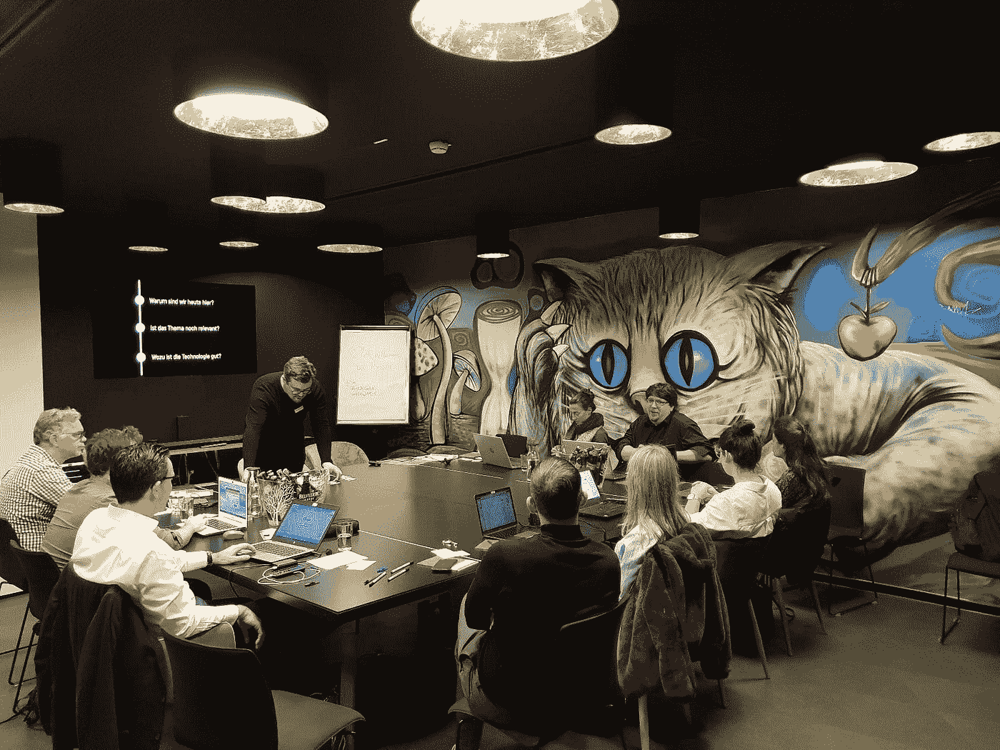

[Workshop](https://www.eventbrite.de/e/blockchain-im-business-workshop-des-blockchain-circle-tickets-50912669164?aff=ebdssbdestsearch) by **Blockchain Circle** and **ConsenSys** in **Rent24**.

密码市场一天比一天血腥。但这是否意味着区块链技术失败了呢？

上周五我们开始了 [**工作坊**](https://www.eventbrite.de/e/blockchain-im-business-workshop-des-blockchain-circle-tickets-50912669164?aff=ebdssbdestsearch) **系列** **区块链圈**[**ConsenSys**](https://consensys.net)中 [**Rent24**](https://www.rent24.com/en/) 。白天我们浏览了该技术最近的使用案例。以下是 2018 年 20 个引人注目的用例:

## **1。房地产**

[**Brickblock**](https://www.brickblock.io/) 令牌化了区块链的第一个房地产。 **Indiegogo** 是 [**令牌化**](https://www.theverge.com/2018/8/23/17766128/indiegogo-real-estate-shares-blockchain) 房地产股票。

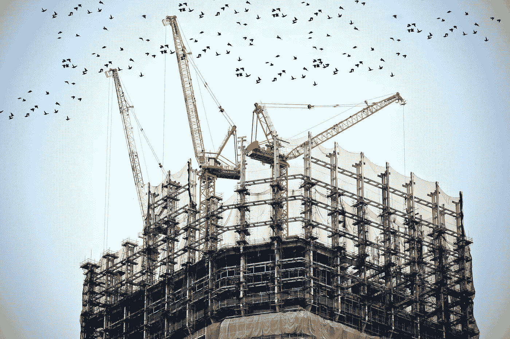

Photo by [Element5 Digital](https://unsplash.com/photos/ls8Kc0P9hAA?utm_source=unsplash&utm_medium=referral&utm_content=creditCopyText) on [Unsplash](https://unsplash.com/search/photos/voting?utm_source=unsplash&utm_medium=referral&utm_content=creditCopyText)

## **2。投票**

150 名西弗吉尼亚人通过一个区块链应用程序为 [**投票**](https://www.theverge.com/2018/11/10/18080518/blockchain-voting-mobile-app-west-virginia-voatz) 。**南韩** [**正在区块链测试**](https://www.coindesk.com/south-korea-eyes-more-reliable-e-voting-with-december-blockchain-trial) 电子投票。日本城市**筑波** [**完成了**](https://www.coindesk.com/japanese-city-trials-blockchain-voting-for-social-development-programs) 区块链地方发展项目投票系统的测试。

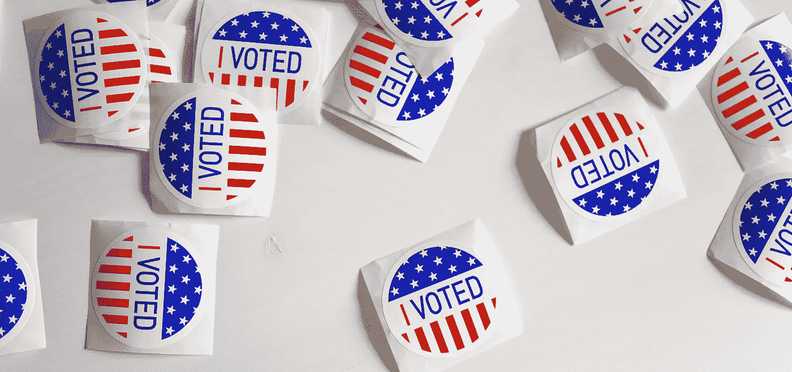

Photo by [Element5 Digital](https://unsplash.com/photos/ls8Kc0P9hAA?utm_source=unsplash&utm_medium=referral&utm_content=creditCopyText) on [Unsplash](https://unsplash.com/search/photos/voting?utm_source=unsplash&utm_medium=referral&utm_content=creditCopyText)

## **3。身份解决方案**

瑞士联邦铁路正在 [**测试**](/linum-labs/swiss-federal-railway-trials-first-digital-identity-pilot-on-ethereum-4a3cb3c6621)[**输出**](https://www.uport.me/) 身份方案。安特卫普市是 [**测试**](https://stories.jolocom.com/blockchain-enables-citizens-to-manage-own-identity-data-894a557d6e35)[**jolo com**](https://jolocom.io/)为行政任务。 [**莫尼**](https://moni.com/) 是 [**为难民提供**](https://www.technologyreview.com/s/608764/how-blockchain-is-kickstarting-the-financial-lives-of-refugees/) 一个区块链供电的 id。

Photo by [Roland Lösslein](https://unsplash.com/photos/DmDYX_ltI48?utm_source=unsplash&utm_medium=referral&utm_content=creditCopyText) on [Unsplash](https://unsplash.com/search/photos/train?utm_source=unsplash&utm_medium=referral&utm_content=creditCopyText)

## **4。股票代币发行**

NEUFUND 在它的 ETO(股票代币发行)平台上列出了第一批公司。最近，他们 [**通过 ETO 筹集了**](https://www.eu-startups.com/2018/12/neufund-raises-funding/)【300 万美元。

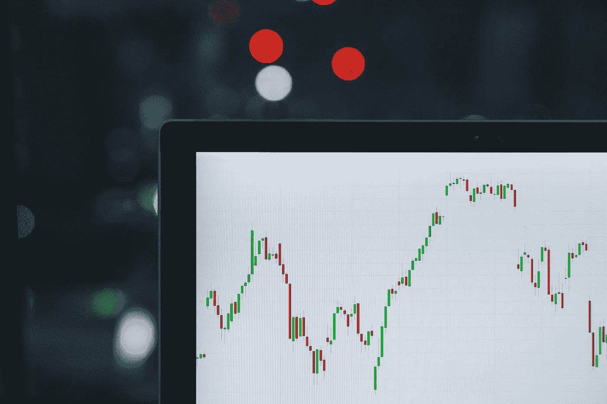

Photo by [M. B. M.](https://unsplash.com/photos/ZzOa5G8hSPI?utm_source=unsplash&utm_medium=referral&utm_content=creditCopyText) on [Unsplash](https://unsplash.com/search/photos/stock-exchange?utm_source=unsplash&utm_medium=referral&utm_content=creditCopyText)

## **5。海上保险**

**Insurwave** ，一个区块链驱动的海上保险平台(由 EY，Guardtime，A.P .穆勒-马士基，微软)现已投入 [**商业使用**](https://www.ey.com/en_gl/news/2018/05/world-s-first-blockchain-platform-for-marine-insurance-now-in-co) 。

Photo by [kinsey](https://unsplash.com/photos/cB8YiJt_0Y0?utm_source=unsplash&utm_medium=referral&utm_content=creditCopyText) on [Unsplash](https://unsplash.com/search/photos/transport?utm_source=unsplash&utm_medium=referral&utm_content=creditCopyText)

## **6。加密银行**

****(与[**Solaris bank**](https://www.solarisbank.com/en/))**[**推出**](https://bitcoinmagazine.com/articles/bitwala-offering-german-citizens-joint-crypto-and-fiat-banking-accounts/) 授权加密和菲亚特银行。******

****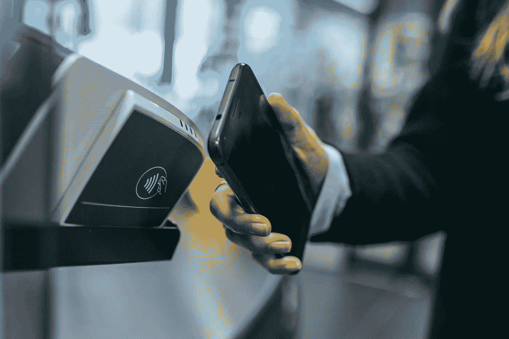****

****Photo by [Jonas Leupe](https://unsplash.com/photos/0IVop5v4MMU?utm_source=unsplash&utm_medium=referral&utm_content=creditCopyText) on [Unsplash](https://unsplash.com/search/photos/payment?utm_source=unsplash&utm_medium=referral&utm_content=creditCopyText)****

## ******7。外汇交易&双边支付******

******德国商业银行**和**蒂森克虏伯** [**复制了**](https://www.reuters.com/article/commerzbank-blockchain-thyssenkrupp/commerzbank-demonstrates-first-german-corporate-fx-deal-on-blockchain-idUSL5N1SV2V5) 一笔使用区块链的外汇交易。**高盛**和**摩根士丹利** [**使用了**](https://www.coindesk.com/goldman-morgan-stanley-go-live-with-cls-ibm-powered-blockchain)IBM[**解决方案**](https://www.cls-group.com/products/processing/clsnet/) 进行双边支付。****

********

****Photo by [Floriane Vita](https://unsplash.com/photos/FyD3OWBuXnY?utm_source=unsplash&utm_medium=referral&utm_content=creditCopyText) on [Unsplash](https://unsplash.com/search/photos/bank?utm_source=unsplash&utm_medium=referral&utm_content=creditCopyText)****

## ****8。食品安全****

******澳洲国家运输**保险[检测**区块链**牛肉出口。**沃尔玛**](https://cointelegraph.com/news/australia-national-transport-insurance-partners-on-blockchain-for-food-safety-trial?utm_source=Telegram&utm_medium=social) [**要求**](https://www.cpapracticeadvisor.com/news/12437001/walmart-to-require-produce-growers-to-use-blockchain-tracking) 选定的供应商使用区块链。**美国乳品公司美国奶农(DFA)** 是 [**与创业公司**](https://cointelegraph.com/news/major-us-dairy-co-op-pilots-blockchain-technology-for-food-supply) **[**ripe.io**](http://ripe.io) 合作** 。****

**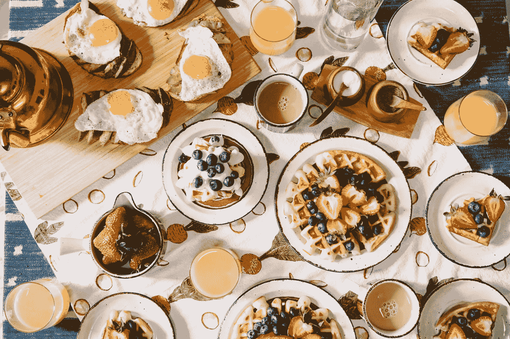**

**Photo by [Rachel Park](https://unsplash.com/photos/hrlvr2ZlUNk?utm_source=unsplash&utm_medium=referral&utm_content=creditCopyText) on [Unsplash](https://unsplash.com/search/photos/food?utm_source=unsplash&utm_medium=referral&utm_content=creditCopyText)**

## ****9。回购协议****

**俄罗斯主要银行 **Sberbank** [**完成了**](https://www.coindesk.com/russias-sberbank-uses-smart-contract-to-settle-three-way-repo-deal) 一份智能合约动力回购协议。**

**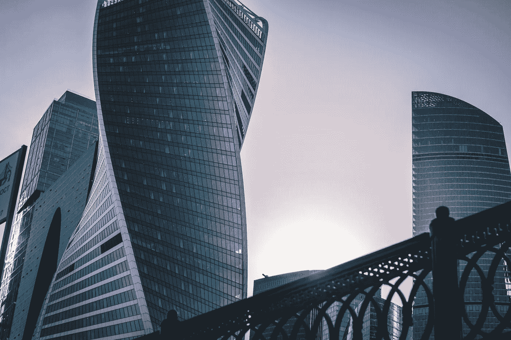**

**Photo by [Artur Matosyan](https://unsplash.com/photos/IWeiC32EVp4?utm_source=unsplash&utm_medium=referral&utm_content=creditCopyText) on [Unsplash](https://unsplash.com/search/photos/moscow?utm_source=unsplash&utm_medium=referral&utm_content=creditCopyText)**

## ****10。证券交易所****

****纽交所**是 [**推出**](https://www.theverge.com/2018/8/3/17648830/nyse-new-york-stock-exchange-owner-bitcoin-launch-cryptocurrency) 一家比特币交易所，**六家**至 [**于 2019 年在区块链发售**](https://in.reuters.com/article/uk-swiss-blockchain/swiss-exchange-six-expects-blockchain-platform-to-rule-in-10-years-idINKCN1NI1CK) 证券， **SAX** [**使用**](http://fortune.com/2017/12/07/blockchain-technology-australian-securities-exchange-asx/) 区块链记录持股情况并管理清算。**

**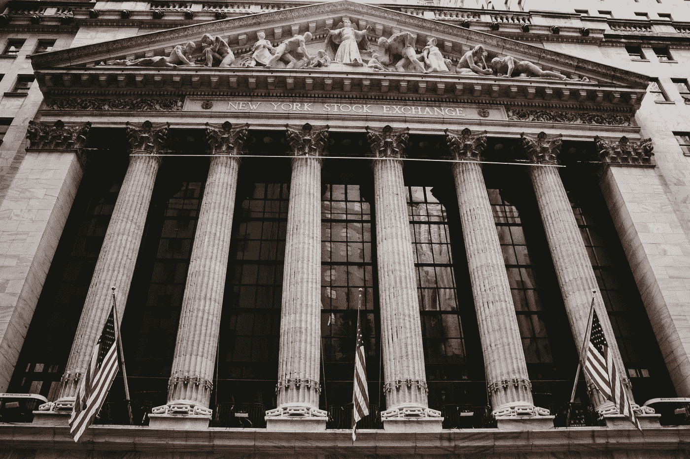**

**Photo by [Aditya Vyas](https://unsplash.com/photos/6Ih4UoqzaAs?utm_source=unsplash&utm_medium=referral&utm_content=creditCopyText) on [Unsplash](https://unsplash.com/search/photos/stock-exchange?utm_source=unsplash&utm_medium=referral&utm_content=creditCopyText)**

## ****11。令牌化所有权****

**[**Mattereum**](https://mattereum.com/)[**特殊化**](https://cryptovest.com/news/mattereum-tokenizes-9m-stradivarius-violin/) 一把价值 900 万美元的斯特拉迪瓦里小提琴。安迪·沃霍尔的画被符号化后在区块链出售。**

****

**Photo by [Baher Khairy](https://unsplash.com/photos/uqKyeMaaAOQ?utm_source=unsplash&utm_medium=referral&utm_content=creditCopyText) on [Unsplash](https://unsplash.com/search/photos/violin?utm_source=unsplash&utm_medium=referral&utm_content=creditCopyText)**

## ****12。许可&知识产权****

****埃森哲**和区块链创业 [**数字资产**](https://www.digitalasset.com/) [**推出了**](https://www.coindesk.com/accenture-puts-software-license-management-on-a-blockchain-platform) 一款软件许可管理应用。**

**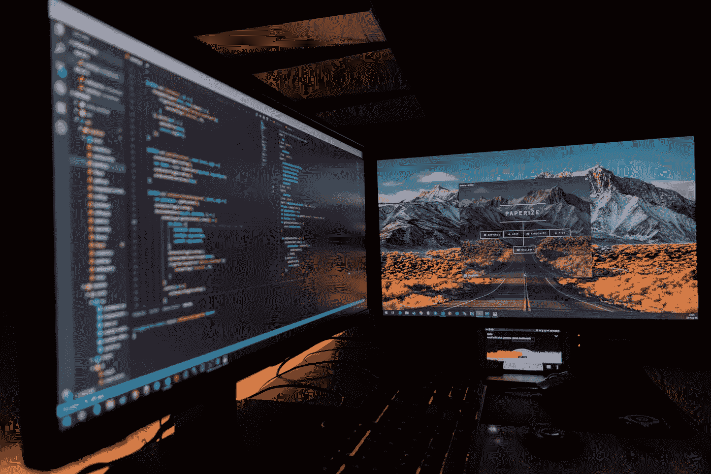**

**Photo by [Fotis Fotopoulos](https://unsplash.com/photos/LJ9KY8pIH3E?utm_source=unsplash&utm_medium=referral&utm_content=creditCopyText) on [Unsplash](https://unsplash.com/search/photos/software?utm_source=unsplash&utm_medium=referral&utm_content=creditCopyText)**

## ****13。证书****

****新加坡** [**的公司可以在 **SP(新加坡电力)集团**的区块链上获得**](https://www.cnbc.com/2018/11/07/blockchain-tech-is-taking-on-renewable-energy-trading-in-one-country.html) 可再生能源证书。**

**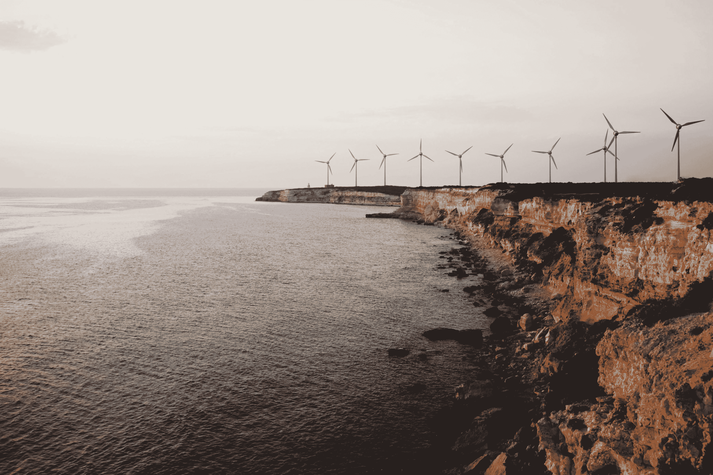**

**Photo by [Efe Kurnaz](https://unsplash.com/photos/1yqvbnSE_sQ?utm_source=unsplash&utm_medium=referral&utm_content=creditCopyText) on [Unsplash](https://unsplash.com/search/photos/energy?utm_source=unsplash&utm_medium=referral&utm_content=creditCopyText)**

## ****14。AdTech****

****丰田** [**与区块链新创企业**](https://cointelegraph.com/news/toyota-uses-blockchain-tech-to-reduce-fraud-in-digital-advertising-campaigns?utm_source=Telegram&utm_medium=social)****合作，将广告欺诈降至最低。******

********

****Photo by [Steven Roe](https://unsplash.com/photos/Jtk0YQL4k3g?utm_source=unsplash&utm_medium=referral&utm_content=creditCopyText) on [Unsplash](https://unsplash.com/search/photos/digital-ads?utm_source=unsplash&utm_medium=referral&utm_content=creditCopyText)****

## ******15。患者数据******

******BlackBerry** 正在网络上 [**工作**](https://www.prnewswire.com/news-releases/blackberry-brings-its-eot-vision-to-healthcare-to-improve-patient-outcomes-300724407.html) 以支持患者数据的区块链解决方案。某**医大医院**在台 [**推出**](https://cointelegraph.com/news/taiwan-hospital-launches-blockchain-platform-to-improve-medical-record-keeping) 一个以区块链为动力的病历平台。****

********

****Photo by [rawpixel](https://unsplash.com/photos/w9YHKTK-wLo?utm_source=unsplash&utm_medium=referral&utm_content=creditCopyText) on [Unsplash](https://unsplash.com/search/photos/medicine?utm_source=unsplash&utm_medium=referral&utm_content=creditCopyText)****

## ****16。土地注册处****

****澳大利亚新南威尔士州政府正在计划试验一种土地注册的区块链解决方案。非洲第一个多国土地登记处 [**即将在**肯尼亚**和**加纳**启动**](https://africabusinesscommunities.com/news/africa%E2%80%99s-first-multinational-blockchain-land-registry-to-be-launched-in-kenya-and-ghana/) 。****

**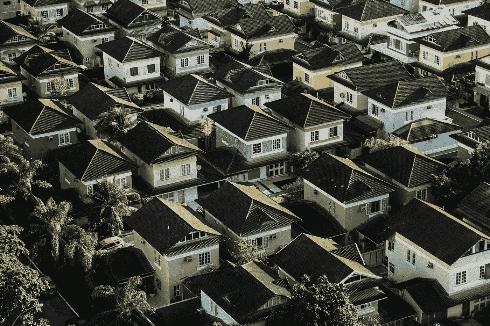**

**Photo by [Breno Assis](https://unsplash.com/photos/r3WAWU5Fi5Q?utm_source=unsplash&utm_medium=referral&utm_content=creditCopyText) on [Unsplash](https://unsplash.com/search/photos/houses?utm_source=unsplash&utm_medium=referral&utm_content=creditCopyText)**

## ****17。电网&对等能源市场****

****韩国政府**正在 [**为基于区块链的供电系统**](https://www.ledgerinsights.com/korea-blockchain-power-grid-energy/) 工作。**

**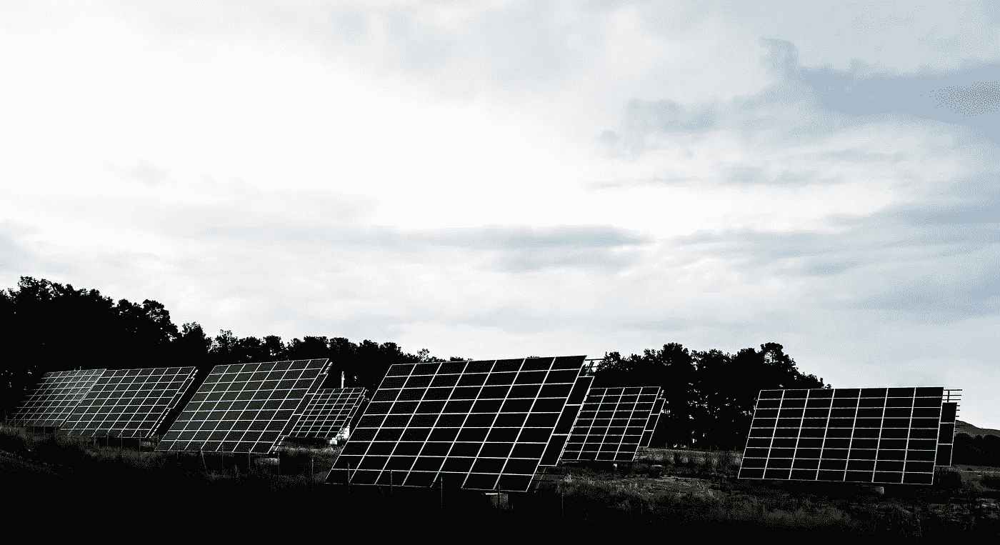**

## ****18。点对点支付****

**日本电信公司**软银** [**完成了**](https://www.coindesk.com/softbank-completes-blockchain-poc-for-cross-carrier-mobile-payments) 跨运营商 P2P 支付服务的概念验证。**

****

**Photo by [rawpixel](https://unsplash.com/photos/NCfIwDynL9E?utm_source=unsplash&utm_medium=referral&utm_content=creditCopyText) on [Unsplash](https://unsplash.com/search/photos/mobile?utm_source=unsplash&utm_medium=referral&utm_content=creditCopyText)**

## **19。自动化设备**

****沃尔玛** [**提交**](https://www.coindesk.com/walmart-explores-blockchain-for-connecting-automated-delivery-drones) 一项新专利申请，在区块链进行自动化无人机送货。**

**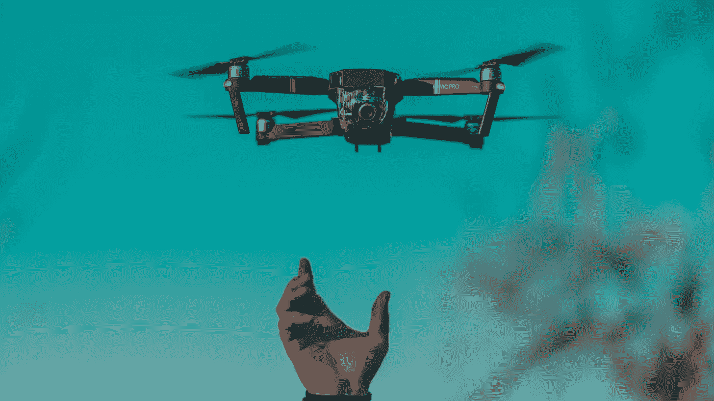**

**Photo by [Diana Măceşanu](https://unsplash.com/photos/3ciHxbx9H0U?utm_source=unsplash&utm_medium=referral&utm_content=creditCopyText) on [Unsplash](https://unsplash.com/search/photos/drone?utm_source=unsplash&utm_medium=referral&utm_content=creditCopyText)**

## **20。数字证据**

****英国司法部**正在 [**探索**](https://www.coindesk.com/uk-government-pilots-blockchain-in-bid-to-secure-digital-evidence) 使用区块链保护数字形式的证据。**

**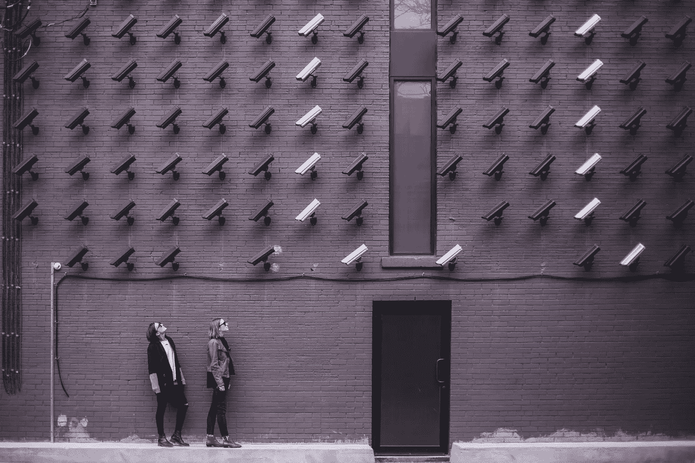**

**Photo by [Matthew Henry](https://unsplash.com/photos/fPxOowbR6ls?utm_source=unsplash&utm_medium=referral&utm_content=creditCopyText) on [Unsplash](https://unsplash.com/search/photos/security?utm_source=unsplash&utm_medium=referral&utm_content=creditCopyText)**

*****保持联系吧。关注我们的*** [***电报***](https://t.me/blockchaincircle)*[***Linkedin***](https://www.linkedin.com/showcase/blockchain-circle)***或者报名参加我们的*** [***简讯***](http://eepurl.com/dv2_5P) ***。******

***[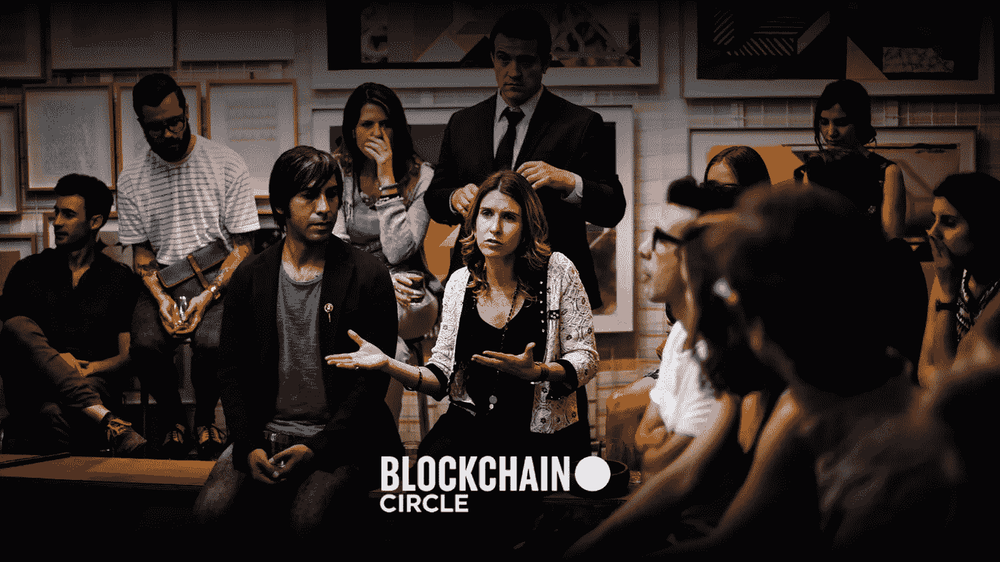](https://blockchaincircle.us7.list-manage.com/subscribe)***