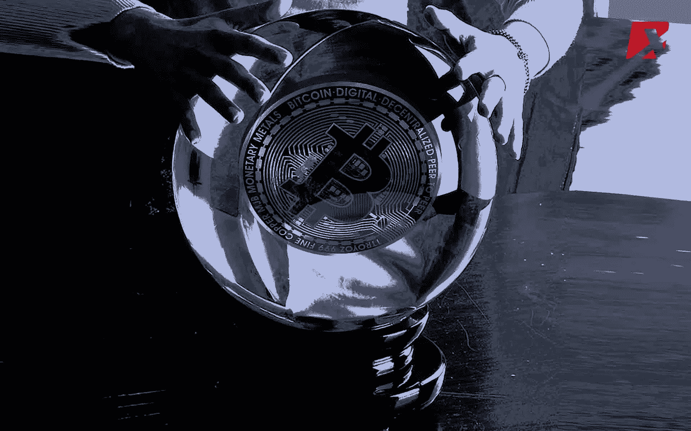

# 大多数人不同意的关于安全令牌的 20 个想法:第二部分

> 原文：<https://medium.com/hackernoon/20-ideas-about-security-tokens-that-most-people-disagree-with-part-ii-44dbc44ea456>

这是一篇文章的第二部分，探讨与证券代币市场相关的一些有争议的技术和经济观点。[第一部分](https://hackernoon.com/20-ideas-about-security-tokens-that-most-people-disagree-with-part-i-df86650fe55b)概述了 10 点，反映了偏离现状的关于安全令牌市场的观点:

*1。令牌化平台可能会商品化*

*2。标记化领域将会有少数赢家*

*3。从长远来看，以太坊可能不是安全令牌的首选平台*

*4。智能合约是实现安全令牌的一种可怕方式*

*5。如果没有黑仔的产品，安全令牌可能会被搁置多年*

*6。安全令牌的黑仔应用可能还不明显*

*7。如果没有合适的基础设施，安全令牌的黑仔应用将无法实现*

*8。端到端令牌化解决方案是当今的制胜之道，同类最佳的堆栈将很快出现*

*9。流动性是你建立的，而不是发生的*

10。安全令牌是加密空间的再集中载体

让我们探索下一组想法:

# 11-安全令牌只有两个新功能

可编程性和互操作性是加密证券作为一种新的资产类别的两大贡献。可编程性将允许我们将加密证券组合和分解成新的加密资产，以响应特定的市场条件。可编程性还与治理和遵从性等方面相关。互操作性是在不需要任何特定基础设施的情况下，跨不同的交易所和市场使用加密证券的好处。与安全令牌相关联的大多数其他好处已经以某种不同的形式或方式存在于市场中，并且从未变得特别流行。

# 12-证券代币最大的胜利可能不是创造新的证券，而是扩大现有的证券

今天，我们痴迷于使用安全令牌来创建新类型的资产，如房地产加密令牌或令牌化的私有股份。然而，安全令牌还有一个很大程度上被忽视的用例，它可能会在短期内带来最大的财务收益:令牌化外来证券。我所说的“另类”指的是债券、交易所交易基金(ETF)、房地产投资信托基金(REITs)、指数基金或全球散户投资者无法广泛获得的其他证券。由现有 ETF 担保的证券代币，将扩大全球投资者群体对基础衍生品的接触，这些投资者群体目前还无法接触到这种衍生品。此外，构建安全令牌的大部分难题(如定价、风险管理等)已经在现有证券中得到解决。

# 这三个加密金融原始协议是安全令牌空间中缺少的最重要的特征

不是监管，不是 KYC/反洗钱，甚至不是流动性。安全令牌拼命三个基本协议:股权，债务和衍生品。安全代币的行为类似于以下资产类别之一:股票、债券、商品、货币或衍生品。这些基本模式需要以加密协议的形式抽象出来，以使开发人员能够创建复杂的加密安全。目前，所有证券代币都是股票的基本数字表示，这使得 90%的有趣案例被排除在市场之外。

# 基于 14 债券的稳定债券将变得重要

市场上大多数稳定的硬币要么由法定货币担保，要么以某种形式的连锁储备担保。证券代币为创造稳健债券(如美国国债)的代币化表现形式打开了大门，这种债券实际上可以成为一种有趣的稳定货币形式。以债券为基础的稳定硬币可以有价格稳定的明显好处，同时也为代币持有者提供红利。

# 15-安全令牌需要新的共识模型

现有的共识机制，如工作证明、利益证明，甚至是在区块链世界变得相关的新形式，如授权证明，都不能很好地支持动态安全令牌。加密安全共识是关于两件事:证明你是谁，并主张一系列权利，如投票权、现金流或所有权。我相信这些动态是为安全令牌优化的新形式共识的基础。

# 债务是黑仔用例，但是我们需要协议

在安全令牌市场的这个阶段，令牌化债务是最有吸引力的用例之一。每周，我都会与 2-3 家考虑发行债务型证券代币的公司交谈，我的问题总是相同的:如何发行？目前，安全令牌平台缺少对债务动态建模的协议，如违约风险、股息分配、重组等。Dharma 是一个为债务动态建模的非凡协议，但需要适应安全令牌。如果没有这样的协议，令牌化债务将继续是一个好主意。

# 17-证券代币可能有助于我们重新定义证券

从概念上讲，金融证券是两个主要方面的结合:一些形成现金流所有权(股权或股息)和一些所有权-投票权。安全令牌的可编程性允许将这些概念组合和分解成新形式的证券。例如，我们可以设想一个证券令牌，它只代表债券产品的现金流部分或股票的投票权。类似地，我们可以有一个安全令牌，它只在达到特定的现金流状况后才激活投票权。斯蒂芬·麦肯教授在这方面有一些非常有趣的想法。

# 18 .加密交易所可能成为安全令牌交易所的重要收购方投资者

想想看，你是一家像币安或 CoinBase 这样的大型加密交易所，你想进入安全令牌市场，但你想避免监管机构破坏你当前基于实用令牌的基础设施，你会怎么做？你要么持有股票，要么干脆收购证券代币交易所。我相信大型加密交易所将成为安全令牌市场/交易所领域最活跃的投资者之一。[已经发生了](/@openfinance/press-release-huobi-one-of-worlds-largest-crypto-exchanges-invests-in-openfinance-network-44649b62de2)。

# 19 .安全-实用混合令牌可能是终极加密安全

很多时候，我很难对安全令牌中的投票权或治理机制等方面进行建模。虽然您可以在安全令牌智能合约中代表投票权，但平衡安全令牌的财务性质与治理机制会很快变得非常复杂。实用令牌是编程治理和投票机制的一个很好的机制。从这个意义上说，我相信安全令牌平台将包括一种形式的实用令牌，以在颁发的令牌中表示方面治理和遵从行为。

# 20-我们需要更多的代码和更少的对话

在新技术市场的发展中，传播新技术是一个非常重要的方面。然而，我认为，在非常早期的市场中，过多的宣传会造成混乱，并设定错误的预期。想想人工智能(AI)市场成为主流花了几十年的时间。

谈到安全令牌，我认为在许多行业领导者表达的主张和该领域的技术现实之间存在着巨大的差距。关于安全令牌，有一点很清楚，那就是我们不知道这个领域将如何发展。从统计数据来看，我们今天听到的大多数预测很有可能是错误的，随着市场的发展，新的机会可能会出现。在安全令牌的核心基础设施刚刚被想象出来的时候，我认为是时候投资于技术和财务的严格性而不是营销了。

我知道很多人不会同意我的观点，但是，嘿，我从来没有说过他们会同意😉。