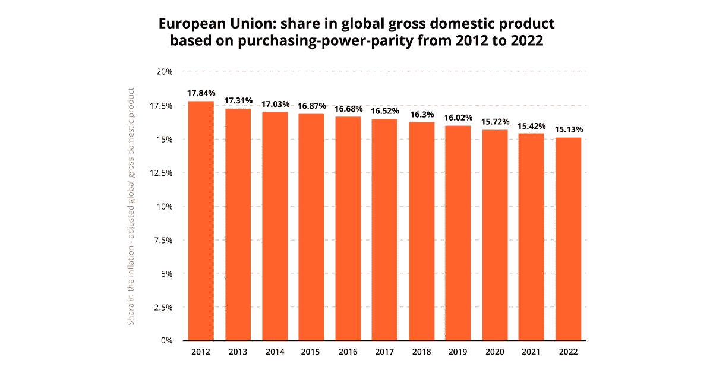
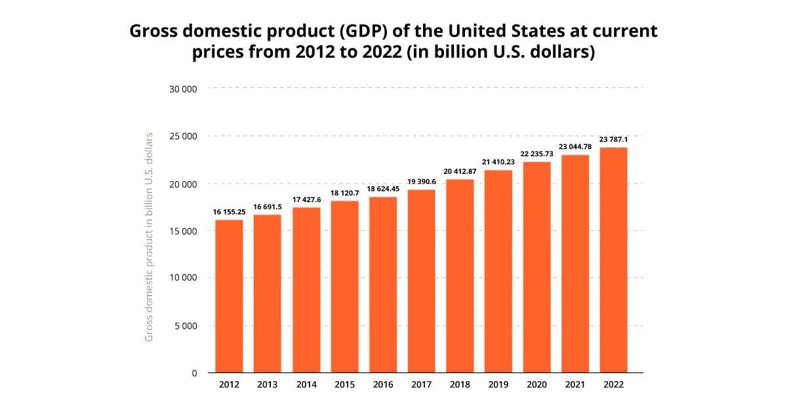
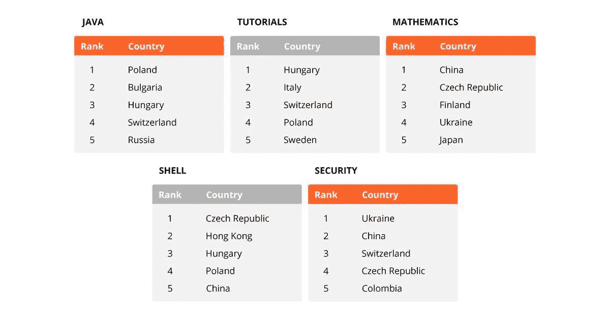
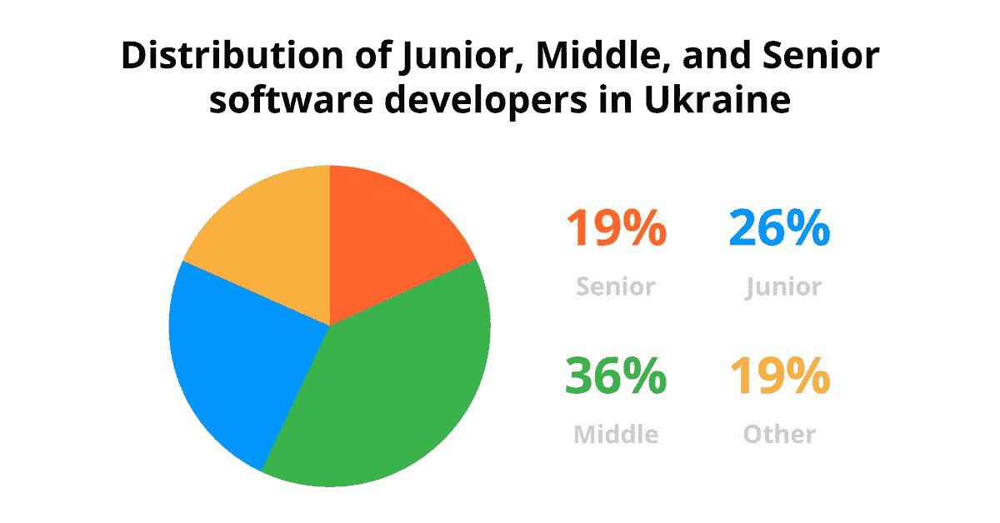

# 从乌克兰订购 IT 外包服务的 20 个理由

> 原文：<https://medium.com/hackernoon/20-reasons-to-order-it-outsourcing-services-from-ukraine-c0f4efb00e42>

将 IT 任务外包给公司外部的专门团队是当今的一大趋势。为什么企业更愿意将 IT 项目外包给乌克兰？20 个重要原因！

欧盟和美国是顶尖产品、技术和服务的主要提供者和消费者。它们在全球 GDP 中所占的份额约为 33-35 %( T1 ),主要包括数字服务、医疗保健和保险、房地产和高科技产品。

然而，这两个图表都显示了一种动态，当美国 GDP 稳步增长时，欧盟面临着稳定的全球 GDP 份额下降。原因是多方面的，但主要结果是不断增长的优化支出的需求，以保持对初创公司、中小企业和大公司等市场的竞争力。

> *美国和欧盟公司必须优化支出以保持竞争力，而信息技术外包是实现这一目标的途径*

外包资源最密集或人才需求最大的 IT 服务是一种全球趋势，这种趋势正在不断上升。德勤的一项深入的[全球外包调查显示，2014 年至 2016 年，IT 外包激增，并强调了三个主要原因:](https://www2.deloitte.com/us/en/pages/operations/articles/global-outsourcing-survey.html)

*   外包比简单地削减成本提供了更多的价值。专业的 IT 服务提供商从许多商业案例中积累经验，成为创新的中心。使用此类服务意味着可以即时获得最新的技术、最佳实践、优化的工作流程和创新。
*   **外包有助于应对行业法规和网络安全**。托管服务提供商必须遵守多项法规，如 [GDPR](https://itsvit.com/blog/gdpr-can-ruin-trampoline-business/) ，并在确保其处理的数据的安全性和完整性方面完善其工作流程。对于企业来说，这意味着所有的法规遵从性问题和风险都由外包合作伙伴来处理。
*   **外包成为一种全面的合作关系，而不仅仅是雇佣一名承包商来完成一项工作**。托管服务提供商可以审核现有的 it 基础架构和流程，优化系统和工作流，帮助消除运营瓶颈等等。

随着美国和欧盟企业意识到这种伙伴关系的全部潜力，外包量稳步增长。IT 外包的其他好处包括:

*   帮助企业将资源集中在核心业务上
*   确保运营灵活性，根据需要调整任何 IT 相关活动的范围
*   使公司经历[成功的数字化转型](https://itsvit.com/our-whitepapers/how-to-perform-a-successful-digital-transformation-guideline/)
*   优化和简化资源配置
*   [转变企业文化](https://itsvit.com/our-whitepapers/transition-to-devops-the-reasons-methods-and-results/)提高生产力

所有上述原因解释了全球 IT 外包以 6.2%的增长率增长，到 2022 年将达到近**5000 亿美元，根据[strategistics MRC 报告](http://www.abnewswire.com/pressreleases/it-outsourcing-market-2017-global-analysis-opportunities-and-forecast-to-2022_104181.html)。**

然而，从东欧国家到印度和巴基斯坦，全球有多个外包区域。选择哪个地区？我们列举了 20 个事实来证明东欧，尤其是乌克兰，是最好的选择。

# 20 关于东欧和乌克兰的 IT 外包事实

**1。** 10 个东欧国家入选[2018 年彭博创新指数](https://www.bloomberg.com/news/articles/2018-01-22/south-korea-tops-global-innovation-ranking-again-as-u-s-falls)。这些国家是捷克共和国、波兰、匈牙利、保加利亚、乌克兰、爱沙尼亚、立陶宛、拉脱维亚、罗马尼亚和摩尔多瓦。

**2。**根据 [HackerRank challenge](https://blog.hackerrank.com/which-country-would-win-in-the-programming-olympics/) 的调查，乌克兰的开发者在提供网络安全解决方案方面是最好的。波兰的 Java 应用程序排名第一，捷克的 Shell 排名第一，匈牙利的教程排名第一。

**3。来自华盛顿的国际商业评级机构 Clutch.co 列出了超过 1600 家来自东欧的网络开发和 IT 服务提供商。他们中的一些人在他们各自的领域里达到了世界排名的顶端。**

**4。罗马尼亚的 IT 部门正在蓬勃发展，罗马尼亚的人均 IT 专业人员比中国、美国、俄罗斯或印度都多。**

**5。**据乌克兰面向 IT 的商业门户网站 [DOU.ua](https://dou.ua/) 称，乌克兰 IT 行业员工**80%****英语流利**或处于中高级水平**客户和承包商之间没有文化障碍**。与全球许多其他外包地区相比，这是一个巨大的优势。

**6。**电信、游戏、电子商务和软件开发领域的 100 多个跨国公司研发中心位于乌克兰。这些中心背后最突出的全球公司包括苹果、三星电子、埃里克森、IBM、微软、波音、Skype、Wargaming、Magento 和易贝。

**7。** 18 家乌克兰 IT 服务提供商入选 IAOP[全球外包 100 强报告](https://www.iaop.org/GlobalOutsourcing100)。Clutch 将 IT Svit 列为乌克兰三大 IT 外包公司之一。

8。根据[窦报告](https://dou.ua/lenta/articles/portrait-2018/)显示，乌克兰 IT 外包市场正以每年**~ 30%**的速度增长，由此产生了大量的初级开发人员( **26%** )。辍学率很低，而且有大量拥有 3 年以上经验的中级开发人员( **36%** )和拥有 7 年以上经验的高级开发人员( **19%** )。其余的劳动力( **19%** )由各种辅助专业人员组成——开发运维工程师、大数据架构师和分析师、营销和销售人员等。

**9。**乌克兰 IT 服务出口**一年内增长 11 亿美元**，从 2016 年的 26 亿美元增长到 2017 年的 37 亿美元。33%的增长对于一个目前出口量排名第三、仅次于冶金和食品工业的行业来说是一个显著的成绩。

**10。**乌克兰拥有[欧洲第四大 IT 专业人才库](https://voxukraine.org/longreads/plugged-in-economy/index.html)，超过 **160，000 名 IT 专业人员**积极参与开发医疗保健、金融、电信和营销领域的多种产品。

**11。**根据[普华永道的报告](https://eba.com.ua/static/export_it_industryfinal_29092016.pdf)，乌克兰的 IT 服务出口额在全球排名**第五**。

12。时区为 GMT+2，这使得乌克兰的专门团队能够非常轻松地与他们的欧盟合作伙伴协作，而对于美国客户来说，任务通常在一夜之间完成。

**13。每年有 38，000 多名 IT 毕业生加入乌克兰劳动力大军**

**14。**乌克兰被 Gartner 列为[30 大 IT 外包和离岸目的地](https://www.gartner.com/doc/2667522/gartners--leading-locations-offshore)之一，并且每年都在排名中攀升。

**15。**2017 年，英国 GSA 将[乌克兰评为头号离岸和外包目的地](http://www.gsa-uk.com/files/1238.pdf)。

**16。**根据 Glassdoor 的数据，由于简化的 IT 行业税收计划，乌克兰 IT 专家的成本约为每位开发人员每月 3，000 美元，与雇佣美国内部团队相比，这可以节省约 70%的软件开发预算。

17。根据 AgileEngine 的调查，东欧是 IT 外包的最佳地区，乌克兰排名第三，仅次于波兰和罗马尼亚。

18。根据[世界银行集团](https://openknowledge.worldbank.org/handle/10986/28780)的数据，乌克兰跻身全球创业和经商环境最佳的前 20 个国家。

**19。据科技之星报道，基辅拥有大量的投资者，超过了奥斯陆、华沙、哥本哈根或维也纳。**

20。与 2016 年相比，2017 年在 DOU.ua 上发布的[职位空缺数量增加了**45%**。这又一次证明了乌克兰的 IT 产业正在腾飞，并将继续以每年 10-15%的速度增长**。**](https://dou.ua/lenta/articles/jobs-and-trends-2017/)

总而言之，东欧，尤其是乌克兰，是 it 外包的绝佳目的地。强大的教育背景，大量经验丰富的软件工程师，他们在各个行业都有深厚的专业知识，简化的税收制度带来了有竞争力的工资——所有这些都使乌克兰成为 IT 外包的首选。

# 关于从乌克兰订购 IT 服务的原因的最终想法

我们希望这份材料对你有用并且有趣。普华永道、彭博、福布斯、IAOP、AgileEngine、世界银行集团和 Clutch 等知名国际机构和杂志的多份报告和研究明确证明，包括乌克兰在内的整个东欧是一个非常有吸引力的 IT 外包目的地。

在本系列的后续文章中，我们将列出与专门的 DevOps 团队合作的好处，比较乌克兰 IT 外包市场的领导者，并列出全球十大 DevOps 服务提供商。敬请关注更新！希望外包一些 IT 任务？请告诉我们，我们很乐意为您提供帮助！

请随意浏览来自 IT Svit 的关于 DevOps、大数据、机器学习和区块链的最新见解和提示！

*原载于 2018 年 8 月 31 日*[*【itsvit.com*](https://itsvit.com/blog/20-reasons-order-outsourcing-services-ukraine/)*。*