# 你的在线技术商店的 20 个优秀主题

> 原文：<https://medium.com/hackernoon/20-superior-themes-for-your-online-tech-store-feb51b4bd99c>

如果你正在寻找机会建立自己的科技网站，那么这 20 个优秀的主题将会完全帮助你找到一个完美的解决方案。

# 为什么选择一个现成的主题对你有好处

如果你至少有一点销售经验，你可能知道你的产品展示得越好，你的顾客就会买得越多。相应地，你会获得更多的利润，你的业务会发展得更快。

最好也是最简单的方法是使用**现成的** [**电子商务模板**](https://www.templatemonster.com/ecommerce-templates.php?aff=hackernoon) ，来创建一个拥有实用工具的网站，以创建一个吸引人的演示文稿。

首先，自己经营网站不需要什么特别的技能。其次，借助现成的主题，你将花费最少的时间和金钱来启动你的网上商店。时间和金钱在任何生意中都是最重要的资源，所以你会有机会把它们花在一些紧迫的事情上。

最后，有各种各样的主题适合任何口味，所以你一定会找到适合你口味和需求的。

为了更深入地了解现成主题的优势，让我们更详细地看看每个主题。

我确信你会爱上其中至少一个主题。

# [1。方法](https://www.templatemonster.com/wordpress-themes/method-a-huge-multi-concept-wordpress-theme-65681.html?aff=hackernoon&utm_campaign=blog_site_hackernoon&utm_source=showcase&utm_medium=tech)

从这个主题的名字可以看出，它可以用于任何目的。这个主题是一键安装，随时出售，100%响应。

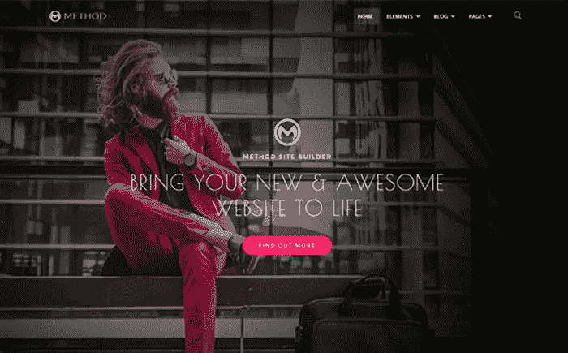

[**Details**](https://www.templatemonster.com/wordpress-themes/method-a-huge-multi-concept-wordpress-theme-65681.html?aff=hackernoon&utm_campaign=blog_site_hackernoon&utm_source=showcase&utm_medium=tech)

# [2。佛朗哥](https://www.templatemonster.com/magento-themes/64158.html?aff=hackernoon&utm_campaign=blog_site_hackernoon&utm_source=showcase&utm_medium=tech)

有了这个主题，你将会收到大约 16 个不同的主页，以供不同的设计选择。Franco 的颜色赏心悦目，设计简洁合理。

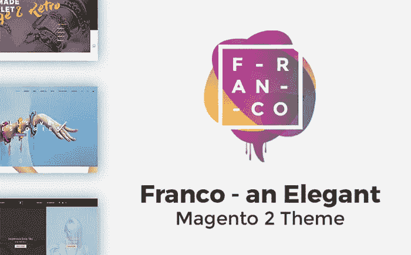

[**Details**](https://www.templatemonster.com/magento-themes/64158.html?aff=hackernoon&utm_campaign=blog_site_hackernoon&utm_source=showcase&utm_medium=tech)

# [3。勇敢](https://www.templatemonster.com/website-templates/64402.html?aff=hackernoon&utm_campaign=blog_site_hackernoon&utm_source=showcase&utm_medium=tech)

这个模板采用了流行的配色方案，附带了一大套 UI 元素和块，一定会给你的访问者留下深刻印象。此外，有大约 45 个现成的网页和 4 个博客布局，所以你将能够随时改变你的网站外观。

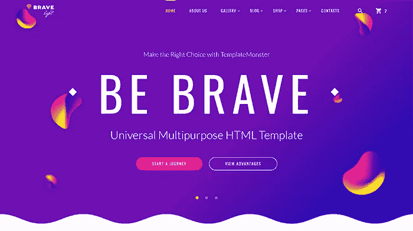

[**Details**](https://www.templatemonster.com/website-templates/64402.html?aff=hackernoon&utm_campaign=blog_site_hackernoon&utm_source=showcase&utm_medium=tech)

# [4。手机](https://www.templatemonster.com/shopify-themes/home-electronics-shopify-theme-58579.html?aff=hackernoon&utm_campaign=blog_site_hackernoon&utm_source=showcase&utm_medium=tech)

你想创建一个没有编码技能，却拥有强大功能和设计的科技商店吗？用这个 Shopify 主题，你不会后悔的！你可以根据最新的趋势轻松创建一个网上商店。

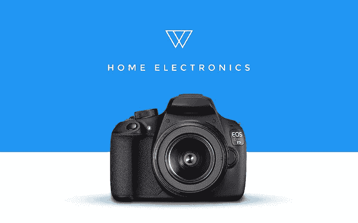

[**Details**](https://www.templatemonster.com/shopify-themes/home-electronics-shopify-theme-58579.html?aff=hackernoon&utm_campaign=blog_site_hackernoon&utm_source=showcase&utm_medium=tech)

# 5. [App 模板](https://www.templatemonster.com/app-templates/woocommerce-wordpress-app-template-65165.html?aff=hackernoon&utm_campaign=blog_site_hackernoon&utm_source=showcase&utm_medium=tech)

目前，越来越多的人更喜欢使用手机应用程序，而不是网站，因为它更舒适。此应用程序模板允许编辑源代码，随后创建更新的源代码。

[**Details**](https://www.templatemonster.com/app-templates/woocommerce-wordpress-app-template-65165.html?aff=hackernoon&utm_campaign=blog_site_hackernoon&utm_source=showcase&utm_medium=tech)

# [6。Audionica](https://www.templatemonster.com/magento-themes/62092.html?aff=hackernoon&utm_campaign=blog_site_hackernoon&utm_source=showcase&utm_medium=tech)

这个主题中最有用的功能是 MegaMenu:它允许为你的网站创建一个独特的菜单，更不用说这个功能会提高你的 SEO。此外，由于 MegaMenu，您的客户将能够选择类别和子类别，这很方便。

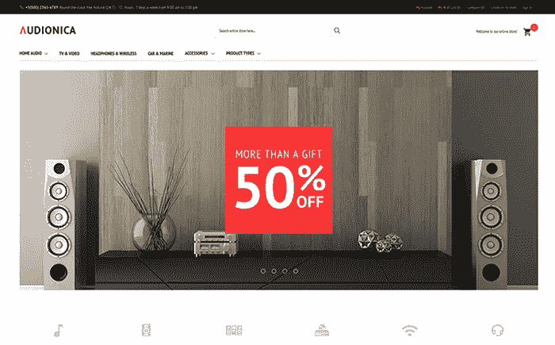

[**Details**](https://www.templatemonster.com/magento-themes/62092.html?aff=hackernoon&utm_campaign=blog_site_hackernoon&utm_source=showcase&utm_medium=tech)

# [7。软件应用](https://www.templatemonster.com/website-templates/software-responsive-website-template-59166.html?aff=hackernoon&utm_campaign=blog_site_hackernoon&utm_source=showcase&utm_medium=tech)

如果你是软件开发公司的老板，那么这个主题完全适合你。主题全面响应，这是任何网站必备的功能。它附带了一个非常有用的功能，比如“粘贴到顶部菜单”,可以将导航菜单放在页面的顶部。

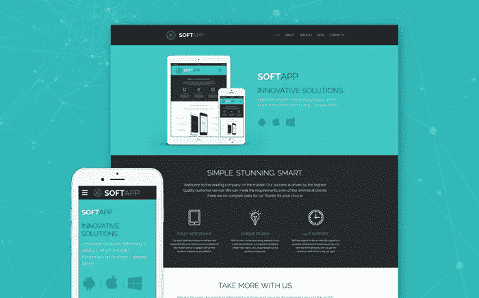

[**Details**](https://www.templatemonster.com/website-templates/software-responsive-website-template-59166.html?aff=hackernoon&utm_campaign=blog_site_hackernoon&utm_source=showcase&utm_medium=tech)

# [8。暴风城](https://www.templatemonster.com/magento-themes/64786.html?aff=hackernoon&utm_campaign=blog_site_hackernoon&utm_source=showcase&utm_medium=tech)

这个模板包含了大量的扩展，这将有助于您创建一个专业的在线商店。为了让你的网站设计更有趣，有两种主题布局，每种都有不同的配色方案。

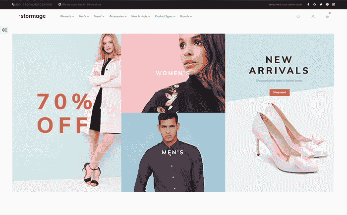

[**Details**](https://www.templatemonster.com/magento-themes/64786.html?aff=hackernoon&utm_campaign=blog_site_hackernoon&utm_source=showcase&utm_medium=tech)

# [9。C & N](https://www.templatemonster.com/woocommerce-themes/62049.html?aff=hackernoon&utm_campaign=blog_site_hackernoon&utm_source=showcase&utm_medium=tech)

拖放页面生成器，樱桃插件，多种布局选项，自定义部件和现场定制器都包括在这个模板中。C&N，[电子商务主题](https://www.templatemonster.com/category/electronics-woocommerce-themes/?aff=hackernoon)之一，完全响应，搜索引擎优化友好，并有一个净代码。

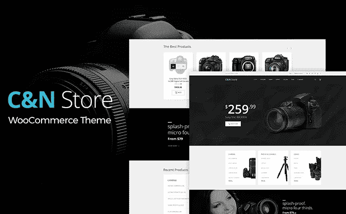

[**Details**](https://www.templatemonster.com/woocommerce-themes/62049.html?aff=hackernoon&utm_campaign=blog_site_hackernoon&utm_source=showcase&utm_medium=tech)

# [10。小发明先生](https://www.templatemonster.com/wordpress-themes/63987.html?aff=hackernoon&utm_campaign=blog_site_hackernoon&utm_source=showcase&utm_medium=tech)

尽管这个主题是为科技博客设计的，但由于内置的 Ecwid 特性，你可以很容易地免费添加一个在线商店。所以，有了这个主题，你将获得一个设计良好的博客和设备齐全的网上商店，这是两倍的好处。

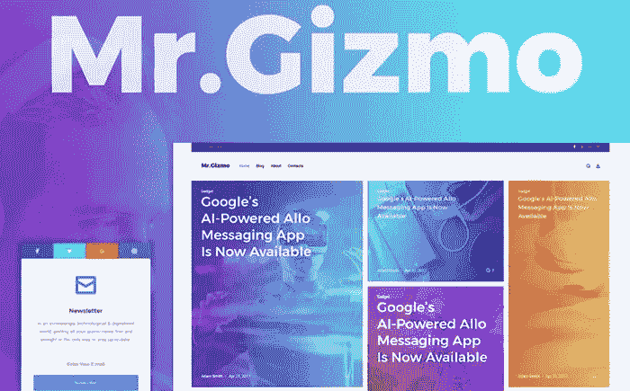

[**Details**](https://www.templatemonster.com/wordpress-themes/63987.html?aff=hackernoon&utm_campaign=blog_site_hackernoon&utm_source=showcase&utm_medium=tech)

# 11。智能屋

该模板中内置的明亮滑块将为您提供一个出色展示产品和服务的机会。在 MegaFooter 的帮助下，你的品牌会变得更有辨识度，也就是说会有更多的人知道你的产品。

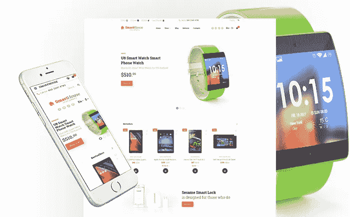

[**Details**](https://www.templatemonster.com/opencart-templates/electronics-store-responsive-opencart-template-63681.html?aff=hackernoon&utm_campaign=blog_site_hackernoon&utm_source=showcase&utm_medium=tech)

# [12。莫比尔兰](https://www.templatemonster.com/moto-cms-3-templates/63472.html?aff=hackernoon&utm_campaign=blog_site_hackernoon&utm_source=showcase&utm_medium=tech)

这个模板是按照最流行的设计制作的。至于特性，这里有很多！模板:完全响应和跨浏览器兼容；该包中包含拖放生成器；comfy widgets，您可以使用大量现成的预置轻松编辑；谷歌字体和字体图标也包括在内。

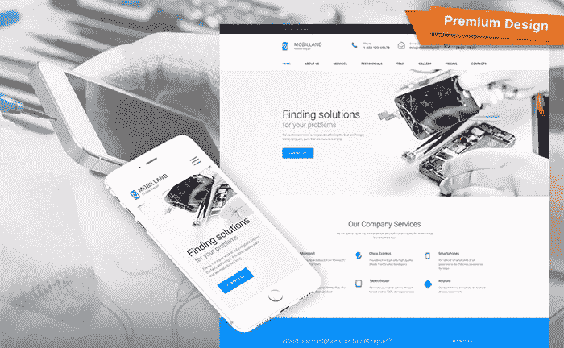

[**Details**](https://www.templatemonster.com/moto-cms-3-templates/63472.html?aff=hackernoon&utm_campaign=blog_site_hackernoon&utm_source=showcase&utm_medium=tech)

# [13。有效](https://www.templatemonster.com/website-templates/effective-website-template-64425.html?aff=hackernoon&utm_campaign=blog_site_hackernoon&utm_source=showcase&utm_medium=tech)

这个模板是基于 HTML 的，包含一个丰富的用户界面集，40 多个现成的页面，搜索引擎友好的代码和 4 个博客布局。除此之外，还有一个显著的特点是背景视频，它会给你的访问者留下视觉印象。

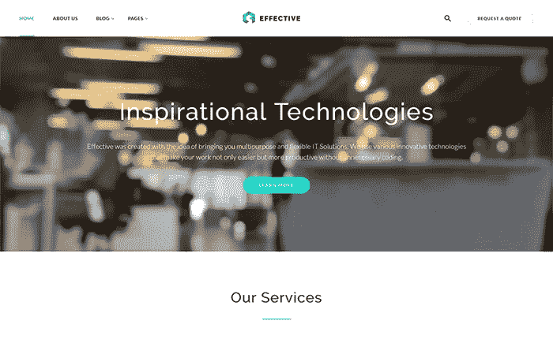

[**Details**](https://www.templatemonster.com/website-templates/effective-website-template-64425.html?aff=hackernoon&utm_campaign=blog_site_hackernoon&utm_source=showcase&utm_medium=tech)

# [14。快闪店](https://www.templatemonster.com/woocommerce-themes/flashshop-multipurpose-premium-wordpress-theme-woocommerce-theme-64147.html?aff=hackernoon&utm_campaign=blog_site_hackernoon&utm_source=showcase&utm_medium=tech)

Flashshop 配备了 6 个华丽的主页，多个产品，以及商店布局风格，MegaMenu 和垂直 MegaMenu。该模板是 100%可定制和响应。此外，有可能改变任何元素的颜色，并为您的商店选择网格或列表样式。

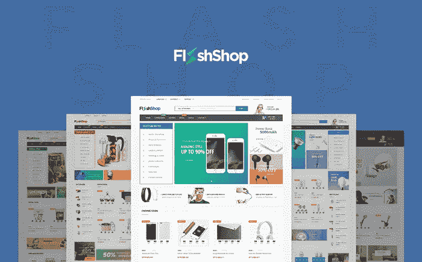

[**Details**](https://www.templatemonster.com/woocommerce-themes/flashshop-multipurpose-premium-wordpress-theme-woocommerce-theme-64147.html?aff=hackernoon&utm_campaign=blog_site_hackernoon&utm_source=showcase&utm_medium=tech)

# [15。史蒂夫·凯迪](https://www.templatemonster.com/psd-templates/64851.html?aff=hackernoon&utm_campaign=blog_site_hackernoon&utm_source=showcase&utm_medium=tech)

史蒂夫凯迪是在一个现代和时尚的方式:响应，明亮的色彩和单位。这将是一个完美的匹配任何音乐或娱乐商业网站。这里有 2 个主页布局，11 个制作精良的 PSD 文件，可以自由定制；免费的谷歌字体和图标和完整的文档。任何 CMS 都可以使用这个模板。

[**Details**](https://www.templatemonster.com/psd-templates/64851.html?aff=hackernoon&utm_campaign=blog_site_hackernoon&utm_source=showcase&utm_medium=tech)

# [16。软件](https://www.templatemonster.com/shopify-themes/software-store-responsive-shopify-theme-61210.html?aff=hackernoon&utm_campaign=blog_site_hackernoon&utm_source=showcase&utm_medium=tech) c

软件商店 Online Shopify 模板直接用于销售您的产品或服务。由于多币种功能，您将在世界各地拥有更多受众。

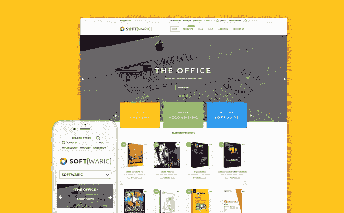

[**Details**](https://www.templatemonster.com/shopify-themes/software-store-responsive-shopify-theme-61210.html?aff=hackernoon&utm_campaign=blog_site_hackernoon&utm_source=showcase&utm_medium=tech)

# 17。伊莱克斯

模板以扁平和简约的方式制作。它由 Bootstrap 驱动，因此保证了 100%的响应性和与任何浏览器的兼容性。

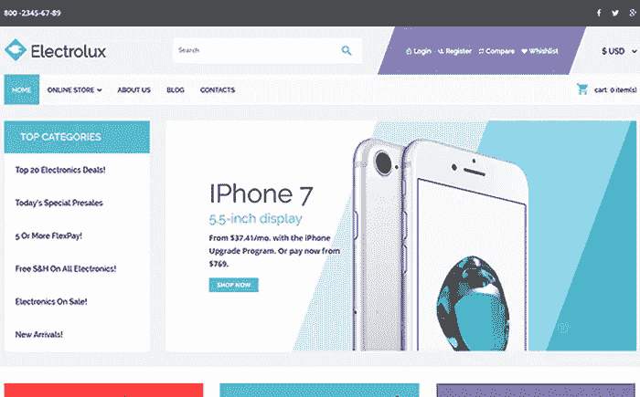

[**Details**](https://www.templatemonster.com/virtuemart-templates/electronics-store-responsive-virtuemart-template-64014.html?aff=hackernoon&utm_campaign=blog_site_hackernoon&utm_source=showcase&utm_medium=tech)

# [18。威尔逊&史密斯](https://www.templatemonster.com/woocommerce-themes/wilson-smith-electronics-woocommerce-theme-58569.html?aff=hackernoon&utm_campaign=blog_site_hackernoon&utm_source=showcase&utm_medium=tech)

这个主题是用 Bootstrap 构建的，这意味着你的网站将完全响应和兼容所有现有的浏览器。一个成功的网上商店有所有必要的功能:产品分类，产品传送带，产品类别标签和其他。

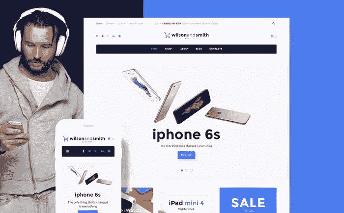

[**Details**](https://www.templatemonster.com/woocommerce-themes/wilson-smith-electronics-woocommerce-theme-58569.html?aff=hackernoon&utm_campaign=blog_site_hackernoon&utm_source=showcase&utm_medium=tech)

# [19。Moox](https://www.templatemonster.com/woocommerce-themes/61246.html?aff=hackernoon&utm_campaign=blog_site_hackernoon&utm_source=showcase&utm_medium=tech)

有了这个模板，您将能够轻松地创建和定制所有的页面，这要归功于拖放页面生成器。Cherry 和 WooCommerce 插件包将为您提供无限的定制和改进商店的可能性。该模板还反应灵敏，搜索引擎优化和用户友好。

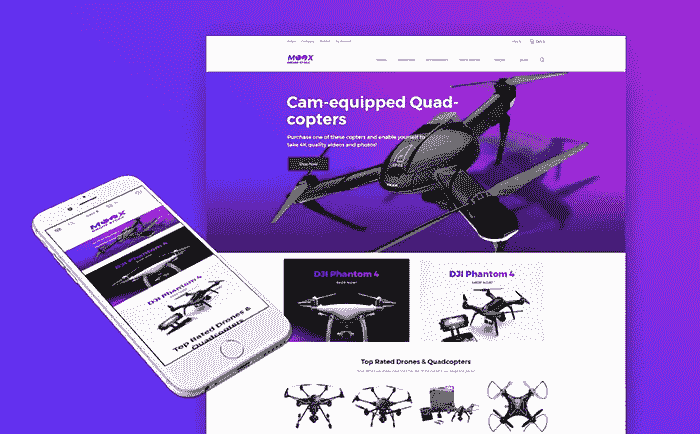

[**Details**](https://www.templatemonster.com/woocommerce-themes/61246.html?aff=hackernoon&utm_campaign=blog_site_hackernoon&utm_source=showcase&utm_medium=tech)

# 20。莫比利

这个 MotoCMS 模板是直接为成功的电子商务项目制作的。首先，我们想指出的是，有了它，你将有机会建立一个优秀的产品目录，这将使你的客户网上购物更舒适。

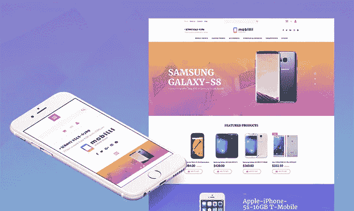

[**Details**](https://www.templatemonster.com/motocms-ecommerce-templates/63721.html?aff=hackernoon&utm_campaign=blog_site_hackernoon&utm_source=showcase&utm_medium=tech)

你最喜欢哪一个？什么样的模板特性对你来说最重要？请在评论中分享你的想法。感谢阅读！