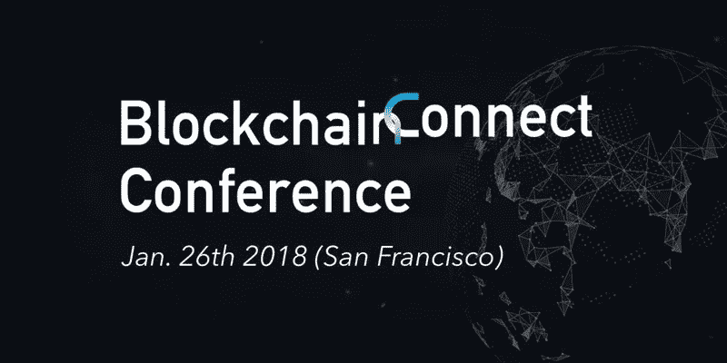

# 20 区块链连接大会

> 原文：<https://medium.com/hackernoon/20-take-a-ways-from-blockchain-connect-conference-4e92f81910a>

上周五，我参加了比尔·德雷珀在旧金山举行的首届年度区块链连接大会，我不得不说，这太棒了。毫无疑问，这是我多年来参加的最好的区块链会议。Andy Tang 做得很好，他邀请了具有独特视角和不同专业水平的演讲者参加讨论。一些比较著名的演讲者有:查理·李(Litecoin 的创始人)、布拉德·加林豪斯(Ripple 的首席执行官)、蒂姆·德雷珀、托德·查菲(IVP 的普通合伙人)、卡维塔·古普塔(Consensys Capital 的创始管理合伙人)、安迪·唐(Draper Dragon 的管理合伙人)等。下面我列出了会议的 20 个要点:

1.  日本政府批准所有数字货币在任何交易所上市
2.  只有 3%适用于币安的数字货币上市
3.  数字货币领域缺乏大规模采用的基础设施
4.  泡沫不会破裂，直到机构现在进入这个领域，把它们的利润转移到主流零售上。然而，现在进入的成熟资本将资助高质量的项目，这将有助于市场自然地过滤掉垃圾
5.  向主流采用迈出的第一大步将是大型企业。例如，如果苹果钱包有能力支持加密货币，这将自动使每个 iPhone 用户都能使用它
6.  顶级银行对加密货币持怀疑态度，因为他们缺乏对该技术的基本了解
7.  说你相信区块链但不相信加密货币，就像说你相信 tcp 但不相信互联网
8.  美国监管机构不会关闭加密货币交易所，但他们正试图完成三件事:让人们纳税，不希望人们被诈骗，并希望控制货币供应的某些方面。到目前为止，他们提出的唯一解决方案是监管纸币上的加密货币。
9.  所有人都认为创完全是个笑话
10.  涟漪价格的飙升与韩国人对货币的偏好有关
11.  风投或任何人对代币投资都没有使用正式的估值模型
12.  目前，工作证明主导了共识市场
13.  2018 年可能是 POS 硬币年(基于激励)，然而，POW 是最安全的(基于数学)
14.  说你不想要隐私币是因为你没什么可隐藏的，就像说你不想要言论自由是因为你没什么可说的
15.  “Ripple 有一个用例，那就是跨境支付。”布拉德·加林豪斯
16.  分散式交易所是未来的趋势
17.  希望看到 ico 利用授权计划并在不同阶段筹集资金
18.  银行最终会出售比特币
19.  隐私是风投非常感兴趣的领域
20.  可伸缩性是协议试图解决的一个大问题

数字货币在 2017 年向前迈出了一大步，并在 2018 年继续前进。总体而言，市场对数字货币投资者非常悲观，然而，市场开始过滤掉不良行为者，这对该领域来说是一个巨大的整体利好。

要了解更多信息，请访问我的网站:

www.masidigitalventures.com