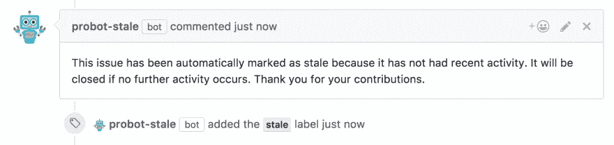
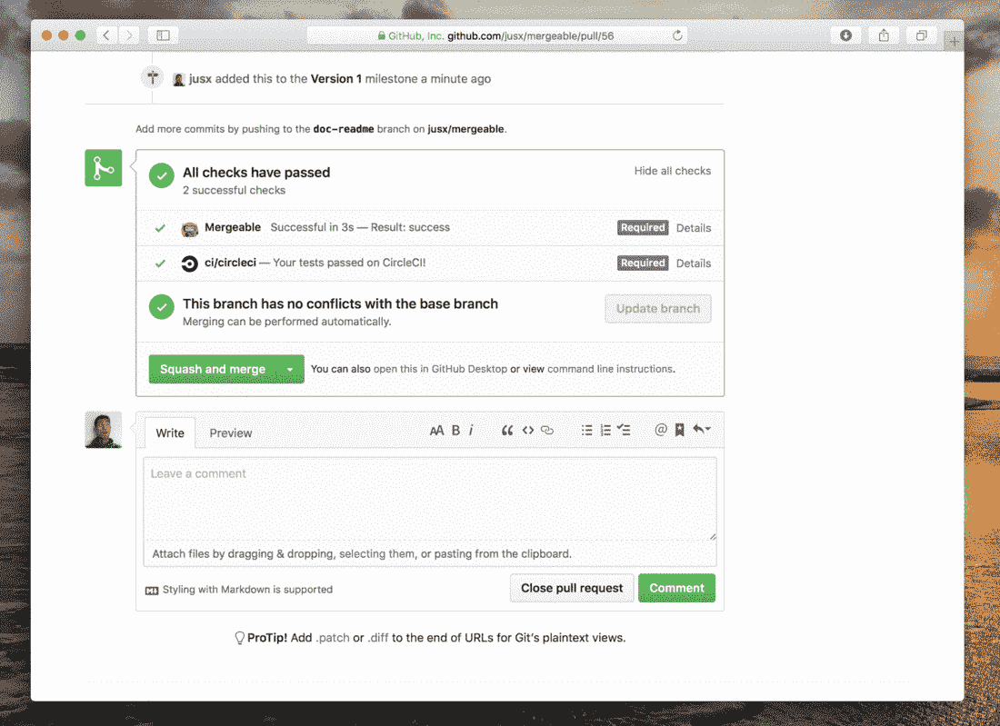
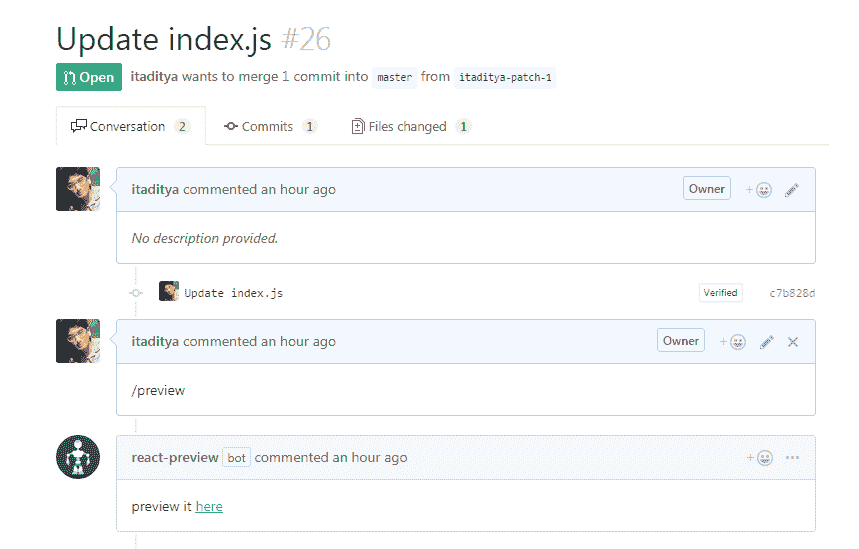
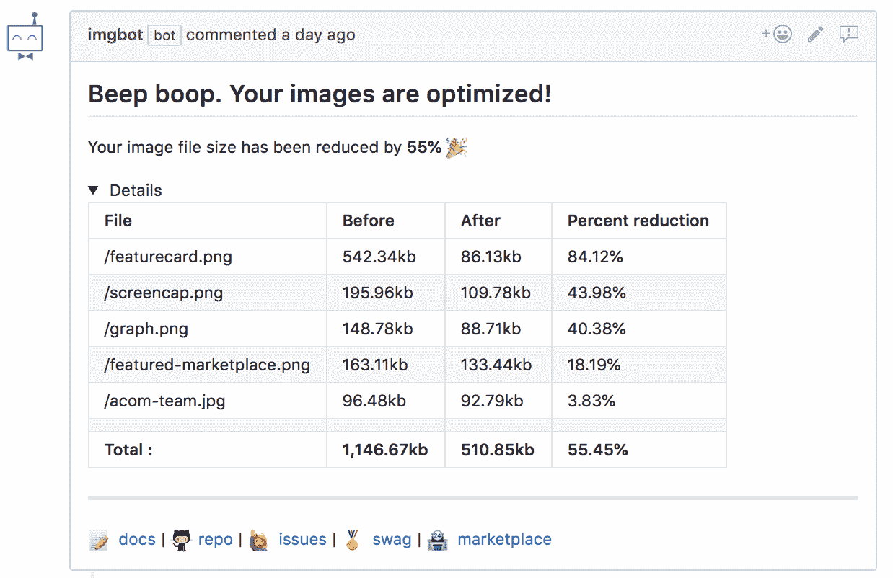
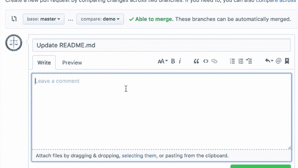
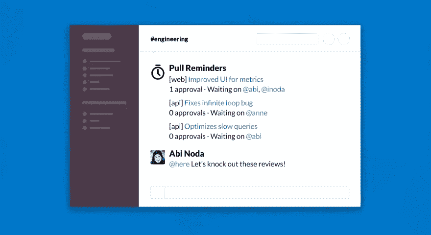
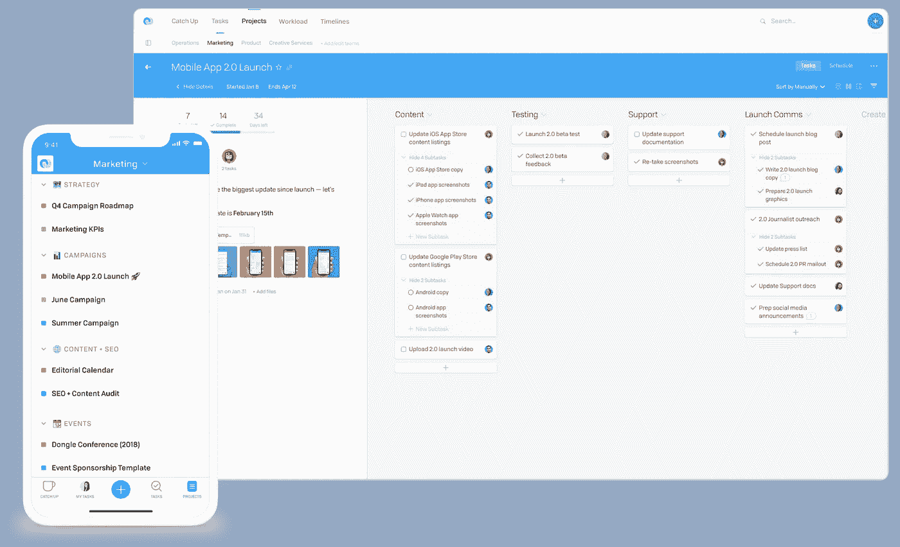

# 开源维护者的 20 个有用工具

> 原文：<https://medium.com/hackernoon/20-useful-tools-for-open-source-maintainers-ee86a09e04e5>

我为开源爱好者总结了有用的工具。

# [IssueHunt](https://issuehunt.io/) —由 [BoostIO](https://github.com/BoostIO) 创建

IssueHunt 是一个面向开源项目的基于问题的赏金平台。

你可以很容易地不仅在一个 bug 上，而且在 OSS 特性请求上投入一笔奖金。募集的资金将分配给项目业主:出资人=20%:80%(业主也可以自定义比例)。

将您的软件库提交到 https://issuehunt.io/的，并立即从世界各地的开发者那里获得帮助。

 [## 提升你的问题，增加你的快乐

### 发行 Hunt🦉⚒开放源码软件开发+奖金计划💰。IssueHunt 是一个基于问题的开源奖金平台…

issuehunt.io](https://issuehunt.io/) 

# [詹金斯](https://jenkins.io/) —由[詹金斯](https://twitter.com/jenkinsci)创建

Jenkins 是一个 CI(持续集成)工具，以其高度的通用性而闻名。与 CircleCI(在本列表的后面会提到)不同，它可以安装在服务器上。

安装和配置完成后，您可以使用 web 界面做许多有用的事情:

*   自动化构建流程
*   运行测试
*   将工件部署到服务器
*   以及几乎所有你讨厌手动完成的任务！

 [## 詹金斯

### Jenkins——一个开源自动化服务器，它使世界各地的开发人员能够可靠地构建、测试和…

jenkins.io](https://jenkins.io/) 

# [CircleCI](https://circleci.com/) —由 [Circle Internet Services，Inc .](https://twitter.com/circleci)创建

CircleCI——与 Jenkins 不同，Circle CI 是一种云服务，具有最少的设置，不需要在私有服务器上托管——超过两个容器将需要每月付费。

您可以轻松地建立到 GitHub 项目的链接，并且可以在一个简单的 YAML 文件(circle.yml)中轻松管理配置，因此操作难度不高。

 [## 持续集成和交付

### CircleCI 的持续集成和交付平台使各种规模的团队都可以轻松快速地构建和开发

circleci.com](https://circleci.com/) 

# [Travis CI](https://travis-ci.org/) —由 [Travis CI](https://twitter.com/travisci) 创作

Travis CI —与 Circle CI 类似，Travis CI 也是一种基于云的 CI 服务。Travis CI 将为所有开源项目免费提供服务。

但是，它也有一些缺点，比如不能将 SSH 连接到容器，也不能进行远程调试。

 [## Travis CI —满怀信心地测试和部署您的代码

### 编辑描述

travis-ci.org](https://travis-ci.org/) 

# [普罗博特](https://github.com/probot/probot)——由[布兰登·饲养员](https://twitter.com/bkeepers)创造

Probot 是一个用于构建 GitHub 应用程序的框架。

主要功能:

*   处理 GitHub 存储库中的每个事件
*   运行 GitHub API

你可以轻松做到！

 [## probot/probot

### 🤖构建 GitHub 应用程序以自动化和改进您的工作流程的框架— probot/probot

github.com](https://github.com/probot/probot) 

# [陈腐的](https://github.com/probot/stale)——由[布兰登守护者](https://twitter.com/bkeepers)创造

stale——Probot 插件——一个有用的机器人，它会在指定的时间段后关闭不相关的问题并拉出请求。

 [## probot/陈旧

### 用 Probot 构建的 GitHub 应用程序，在一段时间不活动后关闭放弃的问题和拉请求。…

github.com](https://github.com/probot/stale) 

# [Todo](https://github.com/JasonEtco/todo) —由 [Jason Etcovitch](https://twitter.com/jasonetco) 创建

Todo — Probot 插件—允许您通过简单地在源代码中添加关键字来轻松创建新的 GitHub 问题:

*   @todo
*   待办事项

 [## JasonEtco/todo

### 🤖✅ GitHub 应用程序，从代码中可操作的注释产生新的问题。—贾索内科/托多

github.com](https://github.com/JasonEtco/todo) 

# [发布起草人](https://github.com/toolmantim/release-drafter) —由[蒂姆·卢卡斯](https://twitter.com/toolmantim)创建

release Drafter——Probot 插件——在将提取请求合并到您的主分支时，自动为您的应用程序创建发行说明。

 [## 工具/发布-起草人

### 当提取请求合并到主版本中时，起草您的下一个发行说明。—工具/发布-起草人

github.com](https://github.com/toolmantim/release-drafter) 

# [GitHub 民调机器人](https://github.com/evenchange4/gh-polls-bot)——由[迈克尔·许](https://twitter.com/evenchange4)创建

GitHub Polls Bot——Probot 插件——允许您在存储库问题中创建投票表单。

 [## evenchange4/gh-polls-bot

### 在 GitHub 问题中自动创建投票。通过创建一个帐户，为 evenchange4/gh-polls-bot 开发做出贡献…

github.com](https://github.com/evenchange4/gh-polls-bot) 

# 可合并的——由查士丁·罗创造

可合并— Probot 插件—防止您合并不符合您设置的规则的请求。

此外，在创建问题时，如果您不符合要求，Mergable 会通知您。此外，Mergable 将通知作者和合作者过时的问题和拉请求。

 [## jusx/可合并

### 🤖所有缺失的 GitHub 自动化🙂 🙌。在 GitHub 上创建一个帐户，为 jusx/mergeable 开发做贡献。

github.com](https://github.com/jusx/mergeable) 

# [commit lint【bot】](https://github.com/z0al/commitlint-bot)——由[艾哈迈德·t·阿里](https://twitter.com/_z0al)创作

commit list—Probot 插件—检查提交和拉取请求，然后设置适当的状态。

 [## z0al/commit lit-bot

### 一个为你运行 commitlint 的 GitHub 应用程序！通过在…上创建帐户，为 z0al/commit link-bot 开发做出贡献

github.com](https://github.com/z0al/commitlint-bot) 

# [反应-预览](https://github.com/itaditya/react-preview) —由[阿迪亚·阿加瓦尔](https://plus.google.com/+AdityaAgarwaljss)创作

React-Preview — Probot 插件—自动创建 React 项目的预览。

 [## itaditya/react-预览

### 用 probot 构建的 GitHub 应用程序，为基于 react 的项目生成预览链接。—itaditya/react-预览

github.com](https://github.com/itaditya/react-preview) 

# [ForkHub](https://github.com/jonan/ForkHub) —由[Jon Ander pea alba](https://github.com/jonan)创作

Android 版 GitHub 客户端。

您可以使用它在存储库的问题页面上发表评论，过滤问题，并将其保存为仪表板上的书签。

您还可以使用它来“启动”(收藏)一个存储库，派生并关注用户。

 [## 乔南/福克胡布

### 基于废弃的官方应用——jonan/ForkHub 的 Android 版 GitHub 客户端

github.com](https://github.com/jonan/ForkHub) 

# [WIP](https://github.com/wip/app) —由 [Gregor Martynus](https://twitter.com/gr2m) 创建

WIP —一种应用程序，旨在防止意外合并正在开发的文件。

WIP 响应关键字(例如，“WIP”、“不合并”等)。)在拉取请求的标题中。如果找到关键字，它将“取消选中”该文件，因此它不会被检入。

 [## WIP/应用程序

### WIP GitHub 应用程序。通过在 GitHub 上创建帐户，为 wip/app 开发做出贡献。

github.com](https://github.com/wip/app) 

# [ImgBot](https://github.com/dabutvin/ImgBot) —由[丹·布特维尼克](https://twitter.com/danbut)创作

ImgBot —对存储库中的所有图像文件进行爬网，并在执行无损压缩后发送拉请求。

对于无损压缩，文件大小不变，质量保持不变。

 [## dabutvin/ImgBot

### Azure Function 解决方案可以抓取 GitHub 中的所有图像文件，并无损压缩它们。这将…

github.com](https://github.com/dabutvin/ImgBot) 

# [错字](https://github.com/chakki-works/typot)—[田崎敬浩久保](https://twitter.com/icoxfog417)创作

打字错误—检测拉取请求中打字错误的机器人。

 [## chakki-作品/错别字

### 自动检测错别字，通过检查来修复—chakki-works/错别字

github.com](https://github.com/chakki-works/typot) 

# [积压](https://github.com/pullreminders/backlog)——由[阿比野田](http://twitter.com/abi)创作

backlog——Slack 的一个插件，向 Slack 发布一个拉取请求提醒。

 [## 拉动提醒/积压

### 拉动式请求的自动时差提醒和指标—拉动式提醒/积压

github.com](https://github.com/pullreminders/backlog) 

# [Redmine](https://www.redmine.org/) —由 Redmine 创建

red mine——一个信息共享和交流工具。Redmine 提供简单的文件管理、wiki 功能，并提供共享信息的能力。

您可以将诸如 bug 解决之类的任务注册为票证，并检查和共享进度。

 [## 概述-Redmine

### 红矿

Redminewww.redmine.org](https://www.redmine.org/) 

# [Wrike](https://www.wrike.com/) — —由 [Wrike 公司](https://twitter.com/wrike)创建

Wrike——虽然在许多方面与 Redmine 相似，但 Wrike 是一个非常强大的工具，可用于按时间顺序查看项目(例如——查看按日期/时间排序的任务)和合并甘特图。

此外，您可以将子任务添加到任务中，并且可以跟踪每个项目或任务的时间。

 [## 您的在线项目管理软件——Wrike

### Wrike 是一个在线项目管理软件，让你完全了解和控制你的任务。与……

www.wrike.com](https://www.wrike.com/) 

# [体式](https://asana.com/)——由[体式](https://twitter.com/asana)创造

体式——一个最多可供 15 人免费使用的工具。

不幸的是，你不能像使用 Wrike 那样管理工时或使用甘特图，但是，在任务中可以聊天，可以更容易地与你的团队沟通。

 [## 使用体式来管理你的团队的工作，项目和在线任务

### 轻松组织和规划工作流、项目等，以便您可以按计划完成团队的工作。开始使用体式…

asana.com](https://asana.com/) 

# [流程](https://www.getflow.com/)—由[流程](https://twitter.com/flowapp)创建

Flow——一个项目管理工具，与前面提到的项目有许多相似之处，但是使用 Flow，您可以设置常规任务并在日历上操作任务。

您还可以将项目保存为模板，这样对于那些启动许多类似项目的人来说，它会是一个有用的工具。