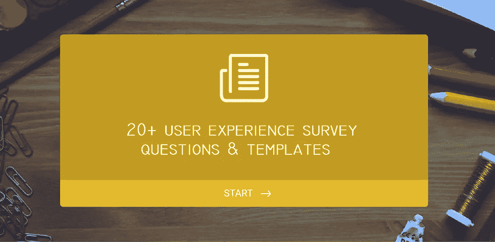
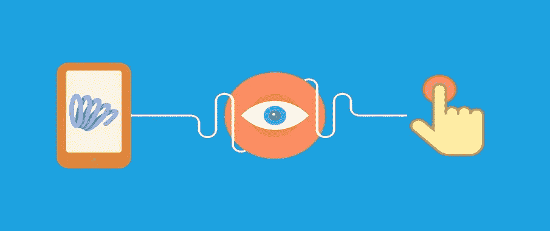
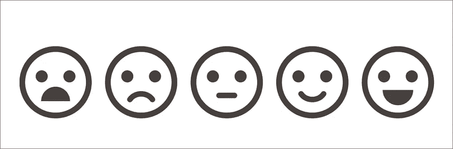
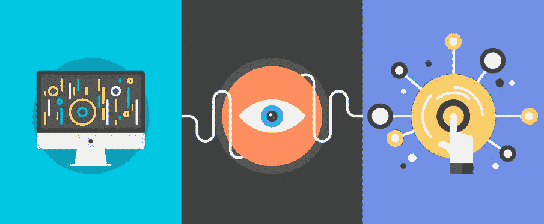
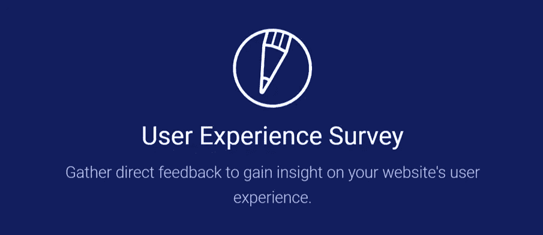
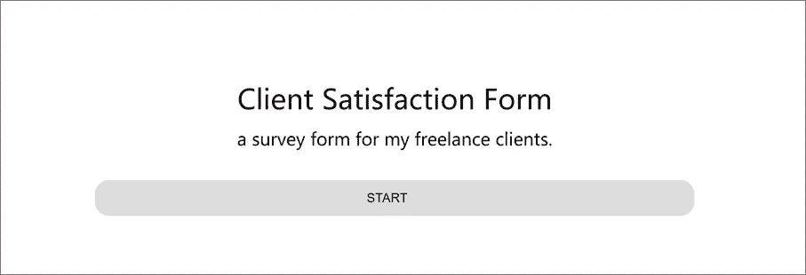
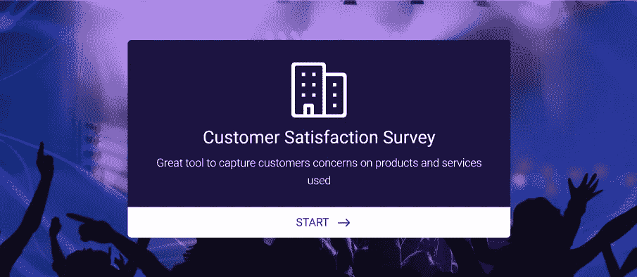

# 20 多个用户体验调查问题和启发模板

> 原文：<https://medium.com/hackernoon/20-user-experience-survey-questions-and-templates-for-inspiration-27d7ba4f94c7>

在线调查显示用户对你的产品的反馈。这里有 20 多个有用的用户体验调查问题(UEQ)给你。还有 10 多个用户调查模板和工具。

**用户体验调查**对于公司来说，大规模了解用户的反馈无疑是必不可少的。特别是当发布一个全新的产品或下一个迭代时，[用户体验](https://hackernoon.com/tagged/user-experience)调查发挥了很大的作用，并因其较低的资金、时间或网站费用成本而节省了大量预算。进行成功的用户体验调查的关键是什么？你问的问题。我选择了 **20 个最有用的用户体验调查问题(UEQ)** 给你灵感。

# 整篇文章包含 4 个主要部分:

**第一部分:如何恰当地提出用户体验调查问题？**

**第 2 部分:20 多个最有用的用户体验调查问题。**

**第 3 部分:10 个最佳用户体验调查模板。**

第 4 部分:UX 调查工具和网站推荐。

# 第一部分:如何恰当地提出用户体验调查问题？

问好问题不容易，问对问题才能得到有用的结果其实更难。当你问用户调查问题时，这里有一些建议:

**1)问题应该都集中在 UX 问题上。**

在收集用户反馈时，你最好保持你的在线调查简短。

没有必要问所有的问题。这取决于你的研究目标。比如有的 ueq 针对你的产品，有的针对你的网站，甚至两者都有。有些问题是针对现有用户的，有些是针对新用户的。

不要忘记问一些开放式的问题。诚然，你可能会问选择题以获得更高的回答率，但你也可以试着问“为什么”或“为什么不”来深入了解。这是获得更多关于你的听众的信息的好方法，这些信息可以给你提供重要的见解和想法。

**5)尽量把“访客”变成“注册用户”。你让访问者回答你的调查，这是一件好事。但是你如何抓住机会让他们注册成为你的潜在用户呢？您可以将访问者带到您网站的登录页面，或者提供表格或 CTA，让他们直接在您的调查中注册。**

# 第 2 部分 20 多个对用户体验调查最有用的问题

# 1.您最初是如何了解我们的产品/网站的？

这个问题可以评估你的营销渠道，并指出人们在哪里接触到你的品牌，因此你可以指出你的广告努力应该侧重于什么。诚然，谷歌分析可以显示访客来自某些渠道，如 AdWords 或脸书活动，有机搜索等。但是它不能告诉直接流量。

**建议:**

特别针对新访客。他们会记得如何更清楚地了解你。

# 2.您向朋友或同事推荐我们的产品/网站的可能性有多大？

这个问题直接展示了用户的反馈，也是衡量客户满意度的一种流行方式。如果用户不把你推荐给他们的朋友，他们可能会在某些方面感到失望。那是你应该改进的地方。

**建议:**

*   瞄准现有用户或多次访问您网站的访问者(基于 cookies 或浏览页面的历史)。
*   如果你得到了否定的答案，试着问“为什么不？”您可以使用自由文本或列出几个选项，如 ABCDE。

# 3.当考虑我们的产品/网站时，您会想到什么？

这是捕捉用户对网站或产品看法的好方法。但是你需要确保访问者或用户能够清楚地展示他们的观点。然后你可能会发现你的顾客对你的看法。

**建议:**

允许用户输入自己的单词(最少一个单词，最多一个你认为人们需要的单词)，或者用户可以从列表中选择一个或多个选项。像这样分析随机数据很难，但也许创建一个单词 cloud 会有所帮助。

# 4.如果给我们的产品/网站打满分，你会给我们打几分？

和网购做顾客评论和评分是一样的。你可以要求用户评论你的网站或产品。

**建议:**

*   要求总体评价或要求他们对特定领域进行评价。
*   使用 10 分制而不是 5 分制，因为这给了参与者更多的灵活性。你可以考虑一个后续问题:“你为什么给这个分数？”

# 5.在选择我们之前，您考虑了我们的哪些竞争对手？

了解你的竞争对手是一个很好的问题。你能从你的竞争对手身上学到的东西超乎你的想象。有时你可能会惊讶于谁被认为是你的竞争对手。这可能会给你带来不一样的启发

**建议:**

*   在购买后调查中使用此问题。
*   你最好提前知道你和谁竞争。

# 6.为什么选择我们而不是竞争对手？

知道自己相对于竞争对手的优势是一个很好的问题。用户选择你的原因有很多，可能是价格、品牌、功能等等。这个问题帮助你知道是什么让你真正脱颖而出。你会知道如何利用这些功能获得更多的客户。

**建议:**

*   在购买后调查中使用此问题。
*   向现有客户提出这个问题。

# 7.我们的产品/网站与 X 产品相比如何？

它帮助你调查你的网站或产品的优势和劣势。注意你选择的竞争对手。

**建议:**

*   你选择的竞争对手应该更好地为顾客所知。
*   考虑后续问题:“你更喜欢哪一个？”这让你更加了解如何应对竞争。

# 8.对于我们的产品/网站，您最不喜欢/最喜欢的是什么？

这是为了知道什么让你的用户难过，什么让他们开心。增加越来越多的新功能而忽视对现有功能的改进是不对的。这个问题帮助你了解如何解决痛点，改进现有功能。

**建议**:

*   你最好提供自由文本，而不只是提供一个列表。确保他们能够清楚地表达他们的痛点。
*   这个问题尤其适用于规划对你的网站或产品的任何改变。

# 9.我们的产品/网站使用起来有多简单？

这个问题是为了调查你的产品或服务的可用性。在这里提供一些选项，从非常容易到不可能，如“非常容易使用”、“容易使用”、“既不容易也不困难使用”、“难以使用”和“非常难以使用”。

**建议:**

*   选项不要平衡，不要提供 4 个肯定选项和 1 个否定选项的答案。
*   也可以考虑问“为什么？如果用户选择否定答案。它帮助您调查背后的原因并改进您的服务。

# 10.我们产品/网站的哪些功能对您最重要？

你非常了解网站/产品的重要特征，但是对于客户来说，他们可能会因为一个你永远不会想到的微小特征而选择你。这个问题可以帮助你关注对用户最重要的特性。如果这些特性不容易找到，你可能会利用它们。

**建议:**

瞄准现有用户。

# 11.我们产品/网站的哪些功能对您来说最不重要？

你不能否认，有些功能没人想要，或者没人觉得有用。这个问题有助于指出那些不必要的部分，让你专注于修复那些每个人都真正需要的部分。

**建议:**

瞄准现有用户。

# 12.你认为我们应该增加的最重要的功能是什么？

我们从我们的用户那里听到很多关于你应该增加某些功能的话。这个问题告诉你弱点和不足。此外，它可以帮助您构建一个良好的产品路线图。

**建议:**

*   目标回头客。
*   提供自由文本选项。

# 13.为什么开始使用我们的产品/网站？

这与您使用我们产品时的目标是一致的。访问者访问你的网站有不同的原因。有的想查你能做什么，有的想买，有的想看你博客上的一篇文章，有的甚至形成了你竞争对手的一面。最好知道是什么吸引了他们的注意力。

**建议:**

*   瞄准所有访客
*   问一些后续问题“你达到你的访问目标了吗？”。

# 14.是什么阻止了你购买？

优化你的购买路径，提高销量，这是一个问题。有几十种可能的原因会阻止用户购买。是价格吗？特色？你实际上没有明确的想法。嗯，这就是你可能会考虑问这个问题的原因。

**建议:**

*   请将此视为购买后调查问题。
*   特别针对注册访客。

# 15.您首选的付款/交付方式是什么？

你可能会认为有些人停止从你这里购买只是为了他们不用的付款，这很荒谬，但这是事实。确保你提供所有受访问者欢迎的方法。

**建议:**

*   针对所有浏览过你购买页面的访问者。
*   使用抽样。

# 16.你清楚我们的价格吗？

通常，我们提供包含不同功能的不同套餐。但是游客们清楚这两个计划之间的区别吗？

**建议:**

*   锁定在定价页面上花费超过平均水平的访问者。
*   问一个后续问题:“我们该如何改进？”当有人回答没有。

# 17.你进入网站的第一印象是什么？

第一印象很重要。人们仍然根据封面来收费。你的网站可以神奇地影响用户的情绪。举个例子，如果一个银行的网站看起来很烂很时尚，你会怎么想？

**建议:**

在主页上问这个问题，只针对新访客。

# 18.这一页有什么遗漏吗？

你的网页应该为访问者提供他们需要的所有信息。但不幸的是，要让所有游客都满意实在是太难了。有时候这些信息会让你不知所措。这个问题帮助你搞清楚哪些是必须的，哪些是不应该错过的。

**建议:**

*   将问题设置为在滚动 75%或更多后出现。
*   特别针对新访客。

# 19.你最喜欢的博客是什么？

客座博客现在是扩大你的影响的一种普遍而有效的方式。如何从人群中选择？去问问你的用户。

**建议:**

锁定你博客的读者和活跃用户。

# 20.如果你对我们不满意，我们怎么做才能让你回来？

这些问题可以唤起用户的情感，也可以节省发现任何客户问题的机会。

# 您可能会考虑的其他问题:

1.您认为我们的产品/网站最令人满意的一次是什么？

2.您是否购买过这些其他产品或工具？

3.对于这些其他产品或工具，您喜欢或不喜欢什么？

4.如果[你的产品或网站]不复存在，你会有多难过？

5.您还使用其他什么产品来完成类似的任务，为什么？

6.如果你能改变网站/产品的一件事，那会是什么，为什么？

7.您使用我们产品/网站的频率如何？

8.该产品有什么令人惊讶或意想不到的地方吗？

9.使用我们的产品时，您最常做的任务是什么？

# 第 3 部分:10 个最佳用户体验调查模板

1.[客户满意度调查模板](https://www.surveymonkey.com/mp/customer-satisfaction-survey-template/?ut_source1=mp&ut_source2=sample_survey_questionnaire_templates)

客户满意度调查可以帮助您了解人们对您公司的看法，获得对客户服务的反馈等等。如果您想更全面地了解客户体验的某一部分，您还可以自定义模板并添加问题。

2.[NPS 软件和应用客户反馈](https://www.surveymonkey.com/mp/software-app-customer-feedback-nps/?ut_source1=mp&ut_source2=sample_survey_questionnaire_templates)

该模板由调查研究专家测试、认证和构建，用于询问与提高软件公司和产品的 NPS 最相关的问题。将它发送给你的用户，发现是什么推动了他们对你的产品或服务的评价。你得到的反馈对改进你的产品或业务是非常宝贵的。

3.[净发起人评分调查模板](https://www.surveylegend.com/survey-examples-templates/customer-net-promoter-score-nps-survey-template/)

Net Promoter Score 样本调查模板旨在帮助您轻松了解客户的满意度。推广商净得分是通过让受访者用 0 到 10 分来评价他们将你的企业推荐给其他人的可能性而得出的。您还可以自定义我们的 NPS 模板，以帮助它适应您的产品，或者提出更多问题来更好地了解您的客户。

4.[客户服务调查模板](https://www.surveymonkey.com/mp/customer-service-feedback-survey-template/?ut_source1=mp&ut_source2=sample_survey_questionnaire_templates)

使用此调查模板的结果为您的客户服务团队提供支持和培训。这些问题有助于衡量客户满意度，并改善您的团队与客户的合作方式。如果您还有其他问题，请定制调查。

5.[客户意见调查模板](https://www.surveymonkey.com/mp/customer-comments-survey-template/?ut_source1=mp&ut_source2=sample_survey_questionnaire_templates)

您只需发出这份快速调查，就能了解客户对您公司的看法。调查要求客户解释他们的回答，这样您可以更好地了解他们的回答。如果您想询问其他问题，请自定义模板。

6.[产品反馈调查模板](https://www.surveylegend.com/survey-examples-templates/product-feedback-survey/)

此模板帮助您收集用户反馈，并提供解决方案。

7.[产品调查表](https://www.jotform.com/form-templates/product-survey-form)

使用此产品调查表，从您的客户那里获得对您产品的快速反馈。

8.[患者满意度调查](https://www.jotform.com/form-templates/patient-satisfaction-survey)

通过此在线满意度调查获得患者反馈，并改进您的服务。

9.[客户满意度调查](https://www.jotform.com/form-templates/customer-satisfaction-survey-3)

捕捉客户对所用产品和服务的关注的绝佳工具

10.[反馈表](https://www.jotform.com/form-templates/feedback-form)

从客户的角度看待你的业务或产品，帮助你保持领先地位。

11.[客户满意度表](https://www.jotform.com/form-templates/client-satisfaction-form-2)

给我的自由客户的调查表。

12.[买家问卷 Crg](https://www.jotform.com/form-templates/buyers-questionnaire-crg)

用于联系买家的表格。对房地产管理有用。房地产经纪人友好。

13.[用户体验调查](https://www.jotform.com/form-templates/user-experience-survey)

收集直接反馈，深入了解网站的用户体验。

# 第四部分:UX 工具和网站推荐。

1.  [**mock plus**](http://www.mockplus.com)**—一个原型和线框工具**

你如何确保一个产品/网站在一开始就获得良好的用户体验？如何充分展示那些好的想法和灵感？我建议你从原型开始。

Mockplus 以快速原型设计而闻名。有了 200 多个高度打包的组件和 3000 多个可用的矢量图标，您可以快速完成布局。

此外，Mockplus 通过快速简单的拖放操作添加了交互式设置。您可以在几分钟内生成可点击的动态产品原型。

它支持 8 种方式进行预览，您可以立即在本机设备上进行测试。您可以轻松地通过评论和标记设计来查看原型。

另一方面，在向你的用户发出调查之前，你最好用 Mockplus 做一个原型在里面测试。

答:Mockplus

更多原型工具:[2017 年 UI/UX 设计师最佳模型&线框设计工具&应用](https://www.mockplus.com/blog/post/the-best-mockup-wireframing-design-tools-apps-for-uiux-designers/?r=trista)

2. [**用户测试**](https://www.usertesting.com/) **—用户调查和用户测试工具**

你想知道什么时候有人访问过你的网站吗？访问者点击了哪里？他们找到他们需要的东西了吗？这些问题可以通过用户调查和用户测试工具来回答。

你可以考虑 UserTesting，一个可以提供多种方法来测试你的网站用户体验的工具。你可以自由选择任何一个用户进行调查。

# 其他工具/网站:

1.  优化— A / B 测试
2.  UEQ 在线-在线用户体验问题。
3.  PollDaddy —在几分钟内创建令人惊叹的调查、投票和测验。
4.  SurveyGizmo——先进的在线调查软件工具，提供卓越的客户服务。
5.  survey monkey——免费在线调查工具，捕捉用户的声音和意见。
6.  回望——记录用户的好工具。
7.  Wufoo 在线调查生成器。

如果你喜欢这篇文章，请不要犹豫，留下评论。谢了。