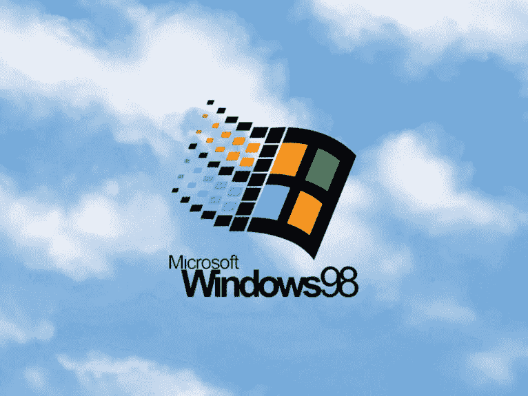

# 20 年

> 原文：<https://medium.com/hackernoon/20-years-ec9aadecc60>

世界上的每一家科技公司(无论是加州的还是其他地方的)都在把自己的未来押在人工智能上。例如，谷歌投资硬件([张量处理单元](https://en.wikipedia.org/wiki/Tensor_processing_unit))、软件，甚至像 [AlphaZero](https://en.wikipedia.org/wiki/AlphaZero) 这样的算法。脸书、亚马逊、微软等等，他们都公开宣称这是他们的未来。另一方面，这些公司中很少有人对区块链的公共技术进行类似的投资。

一个好问题是:为什么？这并不是因为在那里工作的人错过了我们这些密码爱好者看到的东西:我在这些公司认识的许多工程师实际上在他们的空闲时间研究、入侵甚至拥有密码资产。原因很简单，分布式账本“超出了”这些科技巨头的范围。**这些新兴技术之所以受到关注，是因为它们不符合他们的世界愿景。**顾名思义，它们是试图通过锁定其生态系统来建立和保持竞争优势的集中化组织。

This was the pinnacle of the PC era… and the year Google was born.

20 年前，在 90 年代中后期，类似的事情正在发生。当时的科技巨头是微软。我确信当时许多微软员工都是最早的拨号用户。但是微软作为一个实体，有一个巨大的盲点:网络。在搜索引擎市场上实际上“迟到”的谷歌诞生于 98 年，这并非偶然。不管是有意还是无意，微软对网络的摒弃使得谷歌和后来的脸书成为可能。当他们明白这将会产生的影响时，已经太晚了。Live 和 Bing 从来没有对谷歌的统治地位造成过大的影响。投资脸书充其量只是一种挽回形象的方式:微软已经错过了互联网。

具有讽刺意味的是，在那之前的 20 年，类似的事情发生过。IBM 显然是技术领域的领导者。70 年代末，个人电脑开始蓬勃发展:苹果，但更重要的是，微软，看到了未来。另一方面，IBM 仍然坚持他们的信念，即这个世界并不真的需要超过 5 台电脑，也没有理由让任何人在家里拥有一台电脑。IBM 没有插手 PC 领域，而是委托微软开发 MS-DOS，这为 Windows 铺平了道路。直到今天，IBM 仍未能从中恢复过来。

我不确定这 20 年的周期中有什么神奇的东西，但摩尔定律恰好发生在那之前大约 20 年。这当然也是科技史上的一个决定性时刻。批评者可能会质疑我对这些历史事件的理解，但我希望看到一种模式:是时候挑战现状了，我相信区块链、分布式账本和加密令牌正在非常有效地做到这一点。

阅读*下一个*:

 [## 印刷圣经…

### 理解区块链浪潮正在制造何种混乱，是打造未来赢家的关键。

medium.com](/@julien51/printing-bibles-bc829983bddd) 

*如果你喜欢这首曲子，请按下拍手按钮！此外，尽可能多地留下笔记、评论和重点。我已经开始着手一个新的加密项目，你的支持非常有价值！最后，如果你想了解更多，或者参与其中，请联系 julien@unlock-protocol.com。*