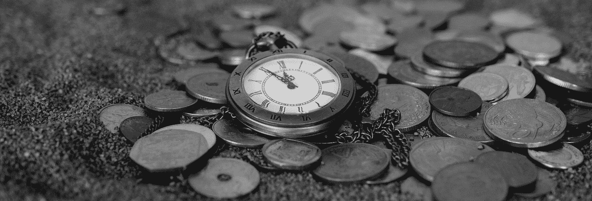
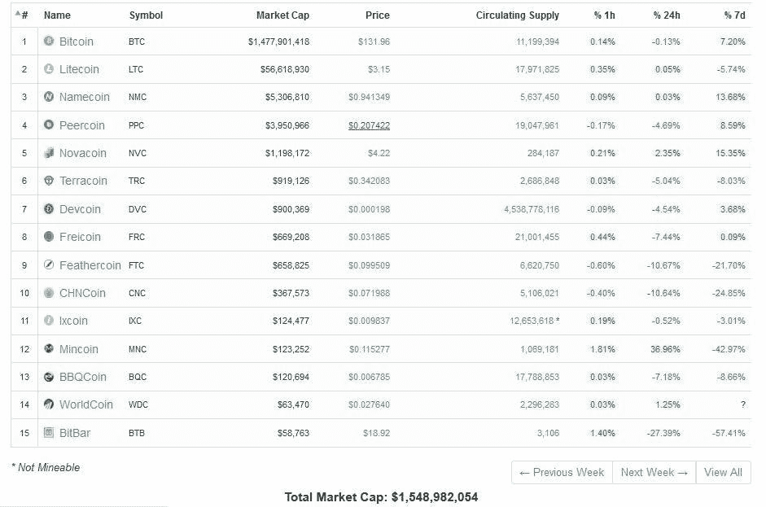
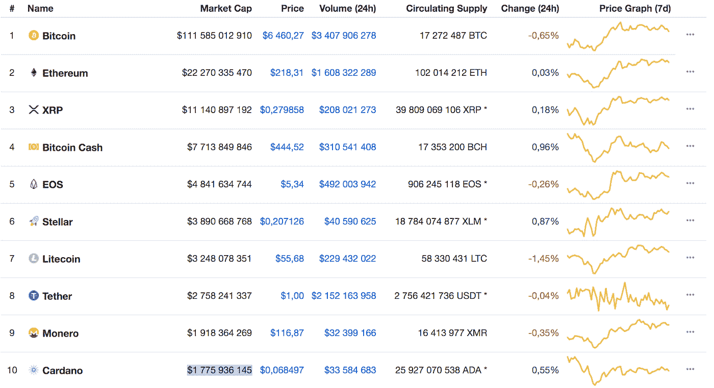

# “2013 Vs 2018”:五年前和今天的十大加密货币

> 原文：<https://medium.com/hackernoon/2013-vs-2018-the-top-10-cryptocurrencies-five-years-ago-and-today-8ef474aa18b8>

*Image credit:* [*Pexels*](https://www.pexels.com/photo/silver-round-coins-210590/)

数字货币在现实世界中的指数级增长和接受创造了许多戏剧、应用和争议，吸引了全世界的关注——特别是在 2013 年，它的流行像野火一样蔓延。

快进到 2018 年，数字货币的总市值超过 2000 亿美元。新的交易者、投资者和加密爱好者无法抗拒潜入蓬勃发展的加密货币市场。

虽然有太多的研究关注比特币、以太坊、Ripple 等的未来，但我们认为比较过去五年中十大加密货币的增长趋势更有价值，这样我们的读者可以从它们的发展中获得值得注意的提示。

# **加密货币如何随时间演变**

自 2009 年诞生以来，比特币一直主导着其他加密货币。多年来，它的影响导致了无数替代硬币的出现，这些硬币的趋势、价值和价值都是由其规则决定的。

2013 年 5 月 26 日，coinmarketcap.com 网站上只有 15 种加密货币。当时总市值价值***1548982054 美元。***

2013 年被福布斯命名为“比特币的 T8 年”。这一年，比特币赢得了许多饥渴投资者的心，以每枚 1242 美元的价格成为头条新闻，并迫使金价跌至每盎司 1240 美元的盘中低点。

它的价值扶摇直上，价值不断增长，并在讨论桌上，在线论坛和研讨会上不断出现。这种快节奏的发展导致了非常矛盾的观点，一方面认为加密货币是一个骗局，另一方面认为是一个富有成效和吸引力的项目。事实是，两种立场都令人惊讶地令人信服。由于加密货币市场的高度波动性，在随后的几年中，价值和观点出现了不稳定的波动。

*截至 2018 年 9 月，共有 1960 种加密货币在 coinmarketcap.com 上市，总市值为* ***$202，401，862，080。***

*Image: Top cryptocurrencies by Total Market Cap in 2013*

# 2013 年 10 大币及其 2018 年状态概述

## **1。比特币**

比特币的起源可以追溯到 2009 年 1 月 3 日，当时的匿名创始人中本聪因挖掘比特币的*创世纪区块而获得了 50 个比特币的奖励。经历了多年的起起落落，它以其极端的波动性、高风险和对政府和金融监管的抵制而广为人知。比特币是创造许多替代加密货币的灵感来源——2013 年比特币价值 1，477，901，418 美元，但在 2018 年仍是排名第一的加密货币，市值为 112，051，104，549 美元。*

## 2.莱特币

一种开源的点对点加密货币，允许在世界上接受货币的任何地方向任何人进行即时支付。它由谷歌员工查理·李于 2011 年 10 月 7 日创立。令人难以置信的是，莱特币在 24 小时内上涨了 100%，并在 2013 年 11 月达到 10 亿美元的市值。然而，这个榜单上的第二名现在被一种快速崛起的数字货币以太坊所取代。目前莱特币的市值为 3，269，333，322 美元，是第七大最受欢迎的加密货币。

## 3.命名硬币

Namecoin 是一种独特的替代货币，它与比特币一样依靠相同的工作验证算法发展壮大，但其数据单独存储在自己的区块链中。它是由 Vinced 在 2011 年 4 月 18 日设计的，之前在 2010 年 12 月的 Bitcointalk 论坛上进行过 BitDNS [讨论](https://bitcointalk.org/index.php?topic=1790.msg28696#msg28696)。虽然 2013 年 5 月其市值为 5，306，810 美元，但在 2018 年，Namecoin 在 Coinmarketcap.com 的加密货币名单中排名第 155 位，其资本化仅为 27，642，053 美元。跳到 2018 年，Ripple (XRP)以 11，140，897，192 美元的硬币市值排名前三位。它为所有加密、法定或任何有价值商品形式的代币提供便利。

## 4.皮尔科因

Peercoin 使用工作证明和利益证明系统，是 2013 年排名第四的加密货币。它旨在以最低的成本成为最安全的数字货币，同时给予用户每年 1%的 PPC 回报，用于通过挖掘加强他们的点对点网络。第四大最受欢迎的加密货币是比特币现金。它于 2017 年 8 月推出，以提高可处理的交易量。其市值为 7，713，849，846 美元。

## 5.诺瓦科恩

Novacoin 宣布了独特的块生成功能，支持单独的目标限制。它由 Balthazar 于 2013 年开发并推出，2013 年以 1198172 美元的市值跻身五大加密货币之列。然而，今天这个项目实际上已经死了(它被 CointMarketCap 排在第 434 位),并且有迹象表明[将其标记为“scamcoin”。新的第五大最受欢迎的加密硬币是 EOS，在 12 个月的代币销售期后，于 2018 年 6 月推出。它以 4841634744 美元的市值迅速占据了榜单的位置。](https://bitcointalk.org/index.php?topic=143221.0)

## 6.土币

与比特币不同，Terracoin 是用区块链(2012 年)开发的，应该支持更高的安全性和更快的交易处理。截至 2013 年 5 月，它的硬币市值为 919，126 美元。同年 7 月，该硬币被黑客攻击，其声誉也随之受损。攻击者设法暴涨网络的散列率，并完全控制它。现在，Terracoin 离它的光辉岁月(CointMarketCap 排名第 680 位)还差得很远。今天，Stellar 是排名第六的硬币，市值为 3，890，668，768 美元。

## 7.Devcoin

Devcoin 于 2011 年推出。这个项目致力于资助一个由开发者、程序员、音乐家、作家和电影制作人组成的社区。它在 2013 年变得更受欢迎，总市值达到 900，369 美元，但慢慢消失直至死亡。截至 2018 年 9 月，2013 年排名第二的 Litecoin 仍在争夺前 10 名，以 3，248，078，351 美元的硬币市值轻松排名第七。

## 8.自由硬币

Freicoin 追求中本聪的记录模式——区块链在创造比特币时采用的工作证明。该项目有一个在网络上强制硬币再分配的原始模型。Freicoin 在 2013 年获得了 669，208 美元的市值，但在 2018 年没有表现出任何活力。它的第八名被一家有争议的“稳定币”加密货币公司占据，该公司的市值为 2，758，241，337 美元。

## 9.羽毛硬币

Feathercoin 最初是比特币的升级版，源于莱特币，共享同一个去中心化的加密货币区块链。在 2013 年推出四个月后，Feathercoin 的市值达到了 658，825 美元。现在，这个项目的情况并不太好，因为它在 CoinMarketCap 的评级中排名第 314 位，市值为 10，771，187 美元。截至 2018 年 9 月，新的#9 硬币是一种开源的加密货币，名为 Monero。其市值为 1，918，364，269 美元。

## 10.中国硬币

和羽毛币一样，CHNcoin 也是基于 Litecoin。CHNcoin 的市值为 367，573 美元，在 2013 年 5 月的十大加密货币名单中名列前茅。这个项目现在早就停止了。如今排名第十的加密货币是 Cardano，它希望能够解决区块链行业的可扩展性、可持续性和互操作性问题。它价值 1，775，936，145 美元的总市场份额。

*图片:2018 年市值最高的加密货币*

尽管 2013 年十大加密货币中的大多数都引起了大量的炒作，但不幸的是，它们中的大多数都不值得在 2018 年上榜。加密货币与 FUD(恐惧、不确定和怀疑)和 FOMO(害怕错过)的关系不健康。FUD 暗示了在论坛和社交媒体上分享的关于加密货币的负面观念。

加密货币的未来在很大程度上受到不同国家政府法规的影响。在加密货币被大规模采用之前，我们将不得不拭目以待世界的现状。

# 结论

加密货币的数量不断增长，市场形势瞬息万变。在过去几年中，顶级加密货币的名单已经发生了多次变化，最受欢迎的硬币的市值或价格也是如此。每天发生的变化的数量和速度很难手动跟踪和分析，这会导致错失机会和投资失误。

为了解决这个问题，并为加密投资者提供一个解决方案，帮助他们建立高性能和低波动的投资组合，可以使用 [Cryptoindex100](https://cryptoindex.io/) (CIX100)工具。这是一个完全自动化的索引，由一个复杂的基于人工智能的算法 Zorax 组成。为了建立自己的 100 种表现最佳的加密货币指数，它使用一套神经网络来分析来自多个来源(加密交易所等)的数据。)关于硬币价格、交易和情绪数据等其他参数。

使用该指数作为基准，交易者可以降低投资组合的波动性和风险，通过每秒钟基于 200 多个因素分析数千笔交易和信号，展示最有前途的硬币。