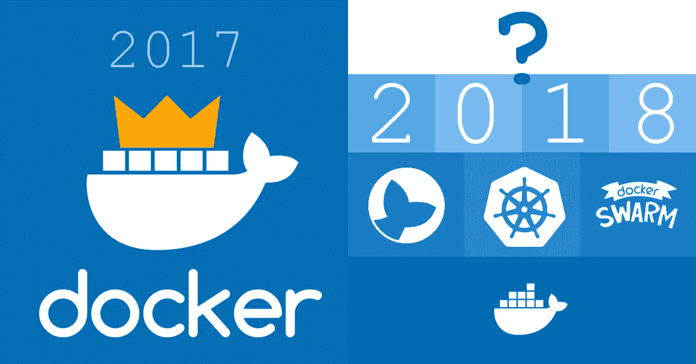
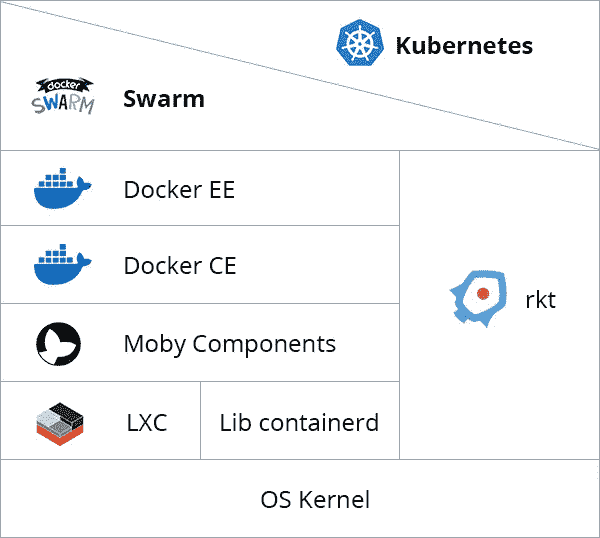

# 2017 for Docker:国王已死，国王万岁？

> 原文：<https://medium.com/hackernoon/2017-for-docker-the-king-is-dead-long-live-the-king-62ee3404e29>

在整个 2017 年，Docker，Inc .做出了多个有问题的决定，这些决定可能会严重影响公司的未来。2017 年给 Docker 带来了什么？

Docker 于 2010 年首次发布，是一款基于 LXC 图书馆的优秀工具。Docker 将多个 Linux 原语组合成一个强大的工具，正如我们所知，这对 DevOps 的兴起至关重要。由于获得了大量的支持和对开源的追求，该公司聚集了一个热情的社区，帮助推动开发不断向前发展。

糟糕的是，作为硅谷最受青睐的[初创公司之一，Docker，Inc .通过几轮风险投资筹集了高达 2.5 亿美元的资金](https://www.crunchbase.com/organization/docker)，它遵循了与许多其他公司相同的行为路线。

**1 错误**试图通过[持续推广 Docker Swarm](https://blog.docker.com/2016/03/swarmweek-docker-swarm-exceeds-kubernetes-scale/) 来掌握集装箱管理市场。Docker Swarm 本身还不错，在大尺度上可能比 Kubernetes 有更好的表现，但是 Kubernetes 有更强的社区，因此保证了更好的可靠性。Docker，Inc .最终放弃了，并在去年 11 月实现了对 Kubernetes 的开箱即用支持，这个事实我们已经在我们的博客上的一篇帖子中介绍过了。

第二个错误是他们处理莫比项目发布的方式。它实际上就像一个“Lego set ”,提供了构建容器管理平台所需的所有组件和工具，Docker 构建在它们之上。

最棒的是，任何公司都可以将他们定制的组件与 containerd 和 swarmkit 等现成的解决方案结合起来，构建他们的定制平台，莫比回购公司就是一个建筑工地。

糟糕的是，信息传达得很糟糕，这种转变造成了很多负面印象，公司形象也因此受损。

尽管如此，我们确信莫比是向前迈出的一大步，因为它标志着从一个整体引擎到一组通过 API 进行通信的可互换组件的过渡，这是当今任何软件产品演变的自然方式。

# 目前为止的结果

别误会，Docker 作为一款产品还是很牛逼的，毫无疑问。许多决定都是伟大的(如[向 CNCF](https://blog.docker.com/2017/03/docker-donates-containerd-to-cncf/) 捐赠 containerd)，而某些行动有些争议(如未宣布的将开源 [Docker repo 重新命名为莫比项目](https://github.com/moby/moby/pull/32691) repo on GitHub)，这在社区中引起了很大的轰动和质疑。

因此，2017 年对 Docker 来说是艰难的一年。集装箱化之王是一个整体式引擎，在库贝内特斯、码头工人群、莫比或任何其他集装箱化平台下被分割成一组砖块。到目前为止，很难说 2018 年会带来什么，但我们可以肯定一件事——这将是非常有趣的一年。

# 关于 Docker 公司截至 2017 年状况的最终想法

Docker 公司会重组他们的结构吗？会有并购吗？或者我们正在目睹一只跳跃式前进的老虎，而 Docker 有一些令人敬畏的前景，就藏在角落后面？你对这件事有什么想法？请在下面的评论中分享！

> 之前我已经在我公司的博客上发布了这篇文章:[https://it svit . com/solutions/devo PS-solutions/2017-docker-king-dead-long-live-king/](https://itsvit.com/solutions/devops-solutions/2017-docker-king-dead-long-live-king/)