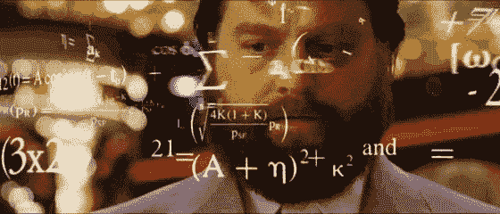

# 2018 年风险投资的 12 个预测

> 原文：<https://medium.com/hackernoon/2017-is-over-but-2018-is-here-to-keep-it-going-6caf688c366b>

## 2017 年已经结束，但 2018 年将继续下去

## 那是有趣的一年！因此，让我们以时尚的方式总结一下，并开始预测明年会发生什么，以及我们如何超越它，因为一切都需要上升和向右。

1.  更大的种子轮将会继续。正如我在上一篇文章中提到的，筹集的小额资金达到了历史最高水平，但交易量并没有增加，只是平均规模有所增加。随着大型风险投资基金的到来，种子和首轮融资的规模将继续增长(对他们来说很难开小额支票)，因为他们加倍下注，并为他们的投资提供更多资本。
2.  **通过 IPO/M 获得更多流动性& A.** 随着股市创下历史新高，2017 年科技股 IPO 相对成功(Roku，Stitchfix)，以及有望增加利润和汇回数十亿美元的减税，我们应该会看到这里的活动有所增加。一旦有了更多的流动性，你可以打赌它会被再投资——真是祸不单行。不幸的是，随着禁售期的结束，这一影响将推迟到 2019 年。你可以在这里[看到今年以来大约 60 家 IPO 的名单，看看他们已经筹集了多少资金。](https://docs.google.com/spreadsheets/d/1d623Zk-JZiPdfIYRdP3gcZO_p0vNAe3cma6cwIr-FEw/edit?usp=sharing)
3.  **VR/AR 将需要更多的时间。这得到了大量的宣传，但还没有实现，但我不认为明年会有大规模的消费者采用。是的，Magic Leap 在明年的某个时候宣布了他们的“One ”,但我认为最大的问题是他们的“溢价”价格点和缺乏内容。即使另一家大型科技公司明年发布他们的产品，我认为这更像是 2019 年的转折点。也许电影《玩家一号》(爱书！)能给它带来一点销量的提升。**
4.  **电竞会升级。** 2017 年是该行业大肆宣传的一年，我认为最终将开始获得可观的收入。是的，有巨额奖金，售罄的体育场和一个联盟成立(猫头鹰)，但 2018 年将通过赞助和流媒体权利推动大品牌进入该行业，这意味着$$$。前提是拥有它的发行商(动视暴雪、RIOT 等)都表现良好。
5.  **区块链/ICO 什么的最后会交付一个产品，令人失望。**这不是对它的抨击，而是一种现实的观点，因为它是一种不性感的后端技术，可以从根本上改变我们的“互联网”，但没有任何真正的消费者日常使用。我这么说只是因为它现在很流行，但作为一个正常人，如果它能完美地工作，我们最终会不知不觉地使用它。即使出现诈骗和失败，对这个领域的兴趣也将继续增加——只是要小心！
6.  用所有的行话来说，增加前沿技术投资。更具体地说，在机器人、人工智能、自动驾驶汽车和太空中，所有我喜欢说“必须”发生的事情最终都会发生。大多数人才/资源仍将被锁定在大型科技公司，但预计会有一些值得注意的新员工和一些突破性的资助。
7.  **突发新闻:媒体又将迎来艰难的一年。**对于媒体来说，这是一个艰难的年末，Buzzfeed 未能实现目标，Mashable 的售价大大低于其上次估值，一些其他出版物解雇了记者。不要指望有很多媒体公司得到资助的报道，尽管像 Axios 和 Cheddar 这样的少数公司可能会率先表明你可以建立一个可增长的品牌。基本上《赫芬顿邮报》和《商业内幕》在业内都是误报，脸书和谷歌还没有拿走所有的钱。媒体将不得不开始在新的地方寻找收入，或者被迫整合更多。

## 现在是时候做一些疯狂有趣的预测了:

1.  苹果和/或微软将对 Magic Leap 展开竞购战。这将使苹果能够凭借完整的手机、手表和耳机与其他所有人竞争/我对 HaloLens 了解不多，也不太喜欢演示。或者软银会再给他们几十亿，因为他们需要。
2.  政治将试图监管大型科技公司，但没有效果。我们将会看到谁真正试图对抗网络中立，谁只是为了公关才这么做的…
3.  口头上会有“技术反弹”，但我们太沉迷于社交媒体，在情况好转之前只会变得更糟。大品牌广告是这里的主要催化剂，所以如果我们想要改变，我们需要吸引他们。
4.  亚马逊将宣布一些关于自动驾驶汽车的事情。

## 我想做的五件事是:

1.  多读书——谢谢大家给我的好清单
2.  删除我手机里所有没用/没脑子的浪费时间的游戏。
3.  办公时间帮助更多的人——我的电子邮件是 t@nyvp.com。这是更多的建议，而不是潜在的投资。
4.  少花点时间在脸书/Instagram 上——基本上不要在人群周围打开，漫无目的地滚动。
5.  多打电话和见朋友——发短信/电子邮件很好，但打电话或面对面更好。