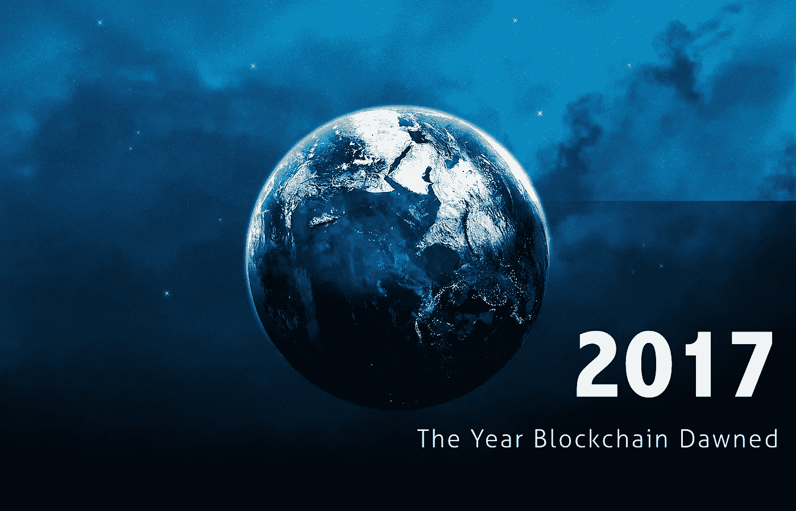
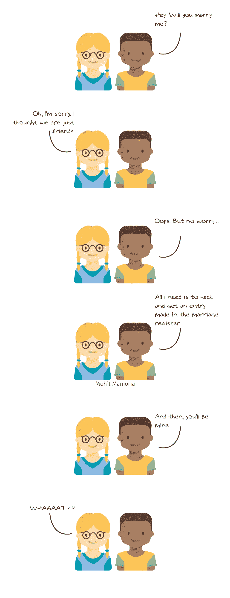
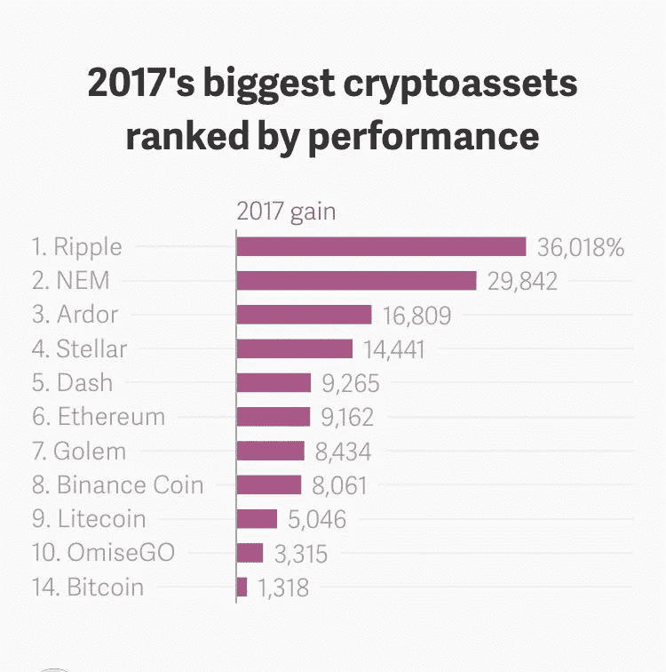
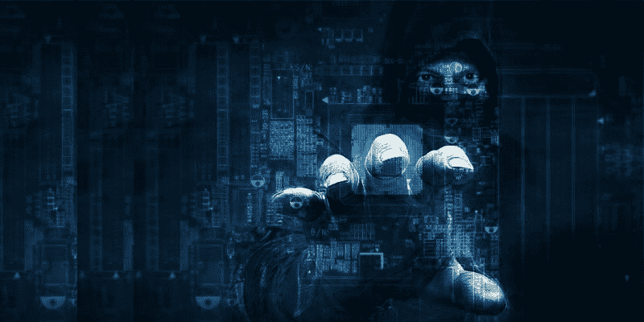

# 2017 年——区块链成为主流的一年。

> 原文：<https://medium.com/hackernoon/2017-the-year-blockchain-went-mainstream-119863d5d9f3>

## 这是一整年的一篇文章。

***/年度综合报道作者——***[***尼坦什·拉斯托吉***](https://twitter.com/nitanshr)***&***[***莫希特·马莫里亚***](https://twitter.com/mohitmamoria)***/***

自从一个名叫中本聪的匿名人士(或一群人)提出一个被称为比特币的 P2P 电子现金系统的想法以来，已经过去了将近十年。

虽然最初仅限于极客、软件开发人员、自由主义者和网络朋克，但 2017 年是虚拟货币及其底层技术开始成为主流的一年。也是在这一年，我们开始看到它将如何改变我们周围的世界，而不仅仅是听到区块链带来的无信任社会的好处(阅读[这篇](https://hackernoon.com/wtf-is-the-blockchain-1da89ba19348)全面的指南以了解这项技术，但长话短说，这是一个分散的公共记录分类账)。

普通大众开始意识到，我们生活中最重要的东西大多只是一些数据库中的记录。想想看——我们的名字、我们的公民身份、我们的银行账户、我们的车辆和土地所有权、我们的婚姻、我们的基本权利、我们的法律、我们的法庭案件——所有这些都只是某个数据库中的记录。

**为了保护这些数据库的完整性，**我们有一个权威机构来照看它。但我们凭什么相信权威？我们不知道。“我们需要有人来照看我们的数据”这一假设最终受到了质疑。寻找这个问题的答案的追求导致了对去中心化世界的更强烈的信念，这种信念的种子终于在 2017 年发芽了。

当然，当人们看到加密货币价值的增长时，过去的 12 个月真是疯狂——这超出了所有人的预期。短短 365 天内发生了如此多的事情，重要的是要看看虚拟货币这个狂野世界的后视镜，以正确看待事物。

此外，我们每周都会在[**LastWeekInCrypto**](https://lastweekincrypto.com/)对密码世界发生的所有事情做一个综述。但推出这个领域的年度重要事件综述是非常有意义的。我们开始吧。

# 区块链>比特币💰

> “区块链只做一件事:它用数学证据取代第三方信任，证明发生了什么。”—亚当·德雷珀

**随着比特币人气飙升，**为其提供动力并使其真正去中心化的技术——区块链也是如此。世界各国政府以及大公司已经开始研究如何利用其潜力。在印度，Visakhapatnam 与瑞典初创企业 Chromaway 合作[利用区块链保存土地记录](https://www.techinasia.com/indian-state-running-pilot-put-land-records-blockchain)，以避免财产欺诈和腐败。

像 IBM 和微软这样的传统科技巨头已经有了分布式账本技术的项目，今年他们甚至更进一步。国际蓝色机器与 Stellar(Stellar Lumens 虚拟货币背后的公司)携手合作，实现更快、更便宜的跨境支付。利用这项技术，该公司还使领先的食品品牌如雀巢和联合利华能够[监控和维护食品安全标准](https://www.ibm.com/blogs/cloud-computing/2017/08/blockchain-food-safety/)。从食物链到供应链，区块链正在颠覆每一个链条。

> ***【外卖】*** *区块链变得比比特币本身还要大。比特币让这个想法变得流行，但现在它流行了，我们正在它的基础上建立几个想法进行实验。*

# 华尔街也加入了行动🏦

> “主要事件不是比特币。它在利用区块链扰乱其他行业和华尔街。”帕特里克·m·伯恩

**甚至金融机构和华尔街**——早先淡化比特币及其同类——也开始理解(并承认)其重要性。接近年底的时候，我们看到 CBOE 和芝加哥商业交易所推出了比特币期货，这使得任何人都可以押注比特币会上涨还是下跌，而无需经历购买比特币的复杂过程。

这对比特币来说是一个巨大的胜利，因为那些担心比特币具有投机价值的人，将可以在监管框架内玩比特币。明年，甚至纳斯达克也有望在其交易所推出期货，我们可能会看到比特币交易所交易基金(ETF)的推出。

另一方面，银行已经开始使用区块链进行防篡改记录。在印度，SBI 和其他 27 家银行携手成立了银行链，以实现智能合约和存储 KYC 的详细信息。总部位于美国的美国运通和英国的桑坦德银行已经与 Ripple 合作，实现实时跨境交易。

> 到目前为止，所有大型机构都在各自为政，为了在快速接近我们的新世界中保持相关性，他们必须适应，我们在 2017 年看到了这种情况。

> ***【外卖】*** *那些因其波动性而对加密货币不屑一顾的机构认识到了区块链的潜力，并开始对其进行实验。*

# 替代硬币的兴起📈

> "风筝迎风飞得最高——而不是顺风."——温斯顿·丘吉尔

**简单浏览一下 coinmarketcap.com**(一个列出加密货币、其价格和市值等内容的网站)就会告诉你，那里有近 1400 种数字货币。然而，更重要的是，尽管比特币是第一种也是最主要的加密货币，但它的主导地位正在下降。

今年年初，比特币的份额超过 90%，现在几乎减半，只有 47%。从估值的角度来看，这也是值得注意的。虽然它从 2017 年 1 月 1 日的 963 美元增长了近 2000%，几乎达到了 2 万美元，但还有一些硬币见证了更大的爆炸式增长。

比如以太坊，从年初的个位数(8.26 美元)涨到了将近 800 美元。同样值得注意的是，现在我们看到第二代和第三代虚拟货币的目标不仅仅是价值储存，这将我们带到下一点。

> ***【外卖】*** *比特币并不是身边唯一的巨型货币。它仍然拥有最大的市场份额，但是其他的不能再被忽视了。是时候了，我们应该结束“替代硬币”这个术语了。*

# ICO 热潮💥

> “赚钱是艺术，工作是艺术，好的生意是最好的艺术。”——安迪·沃霍尔

**首次公开募股——一个模仿首次公开募股而创造的术语**，但实际上应该被称为代币产生事件(TGE)——并不是一个新事物。但今年，根据 Coindesk 的 ICO 追踪器，他们通过筹集超过 30 亿美元的资金颠覆了传统的风险投资公司，成为一个现象。

有趣的是，与任何其他形式的融资不同，ICOs 允许任何公司——甚至没有一个可用的产品——用代币从消费者那里获得资金。正如所料，虽然几个项目理所应当地筹集了数百万美元，但许多项目最终被证明是一个骗局。

幸运的是，随着监管和意识的提高，今年我们可以期待只有真正的公司寻求通过 ico 融资。当然，像任何淘金热一样，许多愚蠢的钱进入了加密市场，但我们将看到一些理智在今年占上风。

ICOs 还让已经上市的公司更容易筹集资金。例如，流行的信息应用 Kik 推出了自己的代币 Kin。随着这样的发展，我们可以期待在未来的一年里看到一些非常脆弱但分散的生态系统出现。

**【外卖】**2017 年，ICO 让企业融资数亿美元。今年，我们将看到一些公司带着他们的产品投入使用，而一些公司将会破产。

# 政府和监管机构的打击🌪

> "政府的首要职责是保护人民，而不是管理他们的生活。"—罗纳德·里根

**你知道爱沙尼亚的目标是**成为世界上第一个拥有自己的加密货币的数字国家吗？作为其电子居住倡议的一部分，它将引入 Estcoins，这将使个人能够拥有他们的数字签名，并将其用作忠诚度积分。另一方面，白俄罗斯不仅给了它们合法的身份，还让加密货币在未来五年内免税。日本还将加密货币交易交易所合法化。

然而，并不是每个国家都对比特币及其同类产品抱乐观态度。中国在 6 月份首次禁止 ico，后来又禁止在中国交易所将法定货币转换为加密货币。美国证券交易委员会(SEC)对 ico 发出了警告。回到印度，政府继续对虚拟货币持中立态度。虽然它建议要有一个适当的谨慎，因为不稳定的性质，并表示这是用户的责任，以防他们失去他们的钱，这仍有待观察，他们是否会合法化。

> 当一些政府张开双臂欢迎这个新世界时，一些政府却以保护普通投资者的名义追逐这些项目。和往常一样，一些国家仍在考虑。但有一点是肯定的，没有哪个国家会忽视这种破坏。

# 黑客双倍下注☠️

> "垃圾可以为黑客提供重要的细节:姓名、电话号码、公司内部行话."—凯文·米特尼克

**加密货币应该是极其安全的——但当你把它们储存在交易所时就不是这样了。虽然我们过去很少听到黑客攻击事件，但这在 2017 年成为了一种普遍现象。Bitfinix(价值 3100 万美元的系绳被盗)、NiceHash 和 Youbit 等主要交易交易所和矿业市场被黑客攻击，损失数百万美元。可悲的是，就连钱包也不安全，因为流行的钱包提供商 Parity 遭到了黑客攻击——两次！它的代码中有一个严重的错误，导致了同样的结果。根据各种估计，今年我们总共看到近 5 亿美元被盗。**

> *勒索软件制造商也开始使用加密货币来勒索钱财。今年 5 月，WannaCry *迅速在 Windows 笔记本电脑上广泛传播。黑客要求价值 300 到 600 美元的 BTC 释放受害者的文件。**

> ***【外卖】*** *虽然区块链本身非常安全，但有太多的故障点，黑客利用这些故障在 2017 年窃取了数百万美元。这个建议“保存你的私人钥匙，就像你的生命依赖于它一样”，仍然适用。*

# 叉还是不叉🍴

> “每艘团队船都会有分歧和争论，但如果它不会杀死我们或船，它会让我们变得更强大。”—肯·华莱士

**比特币及其支撑技术的最大成就之一**是授权交易的共识机制。但是如果社区在某些事情上没有达成一致呢？这是 forks 的[基础——这一概念意味着社区在不同的道路上分叉(或者在这种情况下是街区)，因此产生了另一个虚拟货币，它有望拥有类似的理念，以及更好的功能。](https://hackernoon.com/cash-gold-2x-what-the-fork-272ecc0ad370)

随着比特币人气飙升，其每秒 7 笔交易的交易吞吐量明显偏低，交易费用也在变高。为了缓解这一问题，不同的利益相关者旨在与 Segwit2X 达成协议来解决这一问题。但在取消之后，一群人决定用比特币创造比特币现金，这种现金有更大的块大小，可以处理更多的交易。

当然，这不是这些分叉开始发生的那一年，但考虑到比特币的网络被交易堵塞，这肯定是分叉实际上似乎变得越来越重要的一年。我们还看到了许多其他形式的比特币，如比特币黄金、最近发布的比特币钻石，甚至还有一个在 12 月 25 日左右创建的叉子，被恰当地命名为比特币之神。这一趋势预计明年也将继续；或许，除了比特币，还有更多货币。EtherZero 预计 2018 年 1 月 10 日到货。

> ***【外卖】****2017 年比特币经历了几乎半打分叉。分叉似乎变得很酷。今年，我们将见证更多的叉子，更多的货币。*

# 那么，接下来的一年对我们来说意味着什么呢？🗓

嗯，没有人真正知道。但是有一点是明确的，加密货币将会存在，区块链将会改变世界，迟早会发生。

> 这是人类历史上第一次，我们能够信任一群陌生人，而不是一张熟悉的面孔。

看来我们终于学到了一课，如果我们都诚实地一起工作，我们不需要一个权威来告诉我们该做什么和不该做什么。

最后，你可以在我们的时事通讯上关注我们的每周综述👉🏻 [**LastWeekInCrypto**](https://lastweekincrypto.com/) 。

## 感谢阅读！:)如果你喜欢，请鼓掌支持👏🏻还有分享帖子。请随意发表评论💬下面。

[Mohit Mamoria](https://twitter.com/mohitmamoria)

*莫希特·马莫里亚是*[***Authorito Capital***](https://authorito.com)**(一家加密基金)的首席执行官，也是 Crypto* *上周* [***周刊的编辑，每周一发邮件，内容包含上周在加密空间发生的一切。***](https://lastweekincrypto.com/)*

**这个故事最早出现在 YourStory* *上* [*。有反馈？在推特上做朋友*](https://yourstory.com/2017/12/2017-the-year-when-blockchain-went-mainstream/)**。*🙌🏻**