# 2018:我的一年回顾

> 原文：<https://medium.com/hackernoon/2018-2412e9718f07>

## 日子很长，但人生很短

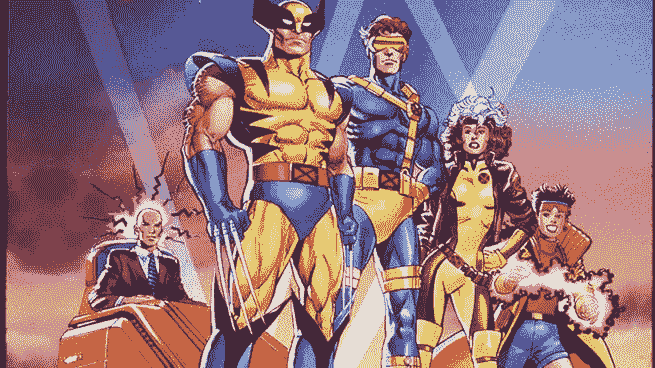

我不敢相信今年就要结束了。2018 年是一场冒险的旋风——一个不可预测的混乱和极端学习的时期。

我发表这个“年度回顾”( [2016](/@jordangonen/2016-a-year-in-review-eb2bc05a44e9) ， [2017](https://hackernoon.com/2017-my-year-in-review-d05aa3f48446) )作为一个记忆、反思、理解和感恩的机制。

## 首先，我想强调一个重要的免责声明:

> *这篇文章不是建议。我是* [*怪异*](https://gonen.blog/im-weird/) *。* [*我一无所有*](http://paulbuchheit.blogspot.com/2011/08/i-am-nothing.html)****运气*** *在我的生活中起着举足轻重的作用。再者，列举微小成就的有* [*不可观的或重要的*](https://twitter.com/julien/status/1074063712254857218) *。运动不是进步* ***说话不是做事。*** *没有参赛奖杯。所以请你自己想一想(如果你愿意)——我的生活不是一个例子。**

## *其次，谢谢你，这一年棒极了。*

*我真的欠每个人一切……虽然生活很大程度上是单人游戏，但我知道我正站在巨人的肩膀上。我无限感激……持续的支持、[非理性的帮助、](https://gonen.blog/taking-irrational-chances-on-me/)、“忍受乔丹”……这一切对我来说意味着一切，*谢谢。**

*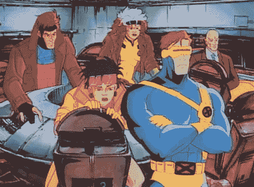*

*“Mankind has always feared what it doesn’t understand”*

*总之，非常感谢你花时间和我一起回顾这一年。**请不要犹豫，伸出手来******如果有什么我能做得特别有帮助的，请尽情享用！*****

***这整篇文章大约是 11 分钟的阅读。我链接了很多相关的内容，并把我最喜欢的内容加粗。***

# ***个人总结***

*   ***今年每隔一天*发表一篇文章，让我的[连写](https://gonen.blog/)达到 1000+天。30 万+的浏览量！我绝不是专业人士(也不希望成为)……我写作是为了学会思考，而不是为了教书……迄今为止，这是一段令人惊叹的旅程。我还制作了一份 [**时事通讯**](https://jordangonen.substack.com/) ，在那里我每周都会分享我发现的最有趣的链接(1000 多名活跃读者)。****
*   ****环游世界，游历了欧洲、亚洲和北美的 39 个城市和 15 个国家。我留下了一些不可思议的记忆…在日本和巴塞罗那开派对，独自游览中国中部，以及在密苏里的某个偏僻的地方游荡。我住在 PHX，旧金山，香港和旧金山。我参加了 6 场大型音乐会/音乐节，品尝了最美味的食物，参加了真正令人兴奋的体育赛事。我试着活在当下，把经历放在财富之上，有意识地努力去做新的事情。( [**旅游博客此处**](https://medium.com/giantleaps) )****
*   ****我遇到了成百上千来自世界各地的不可思议的人，他们以各种方式挑战我。我还加强了与家人、密友和同龄人的关系……[日子感觉很长，但人生很短](https://twitter.com/jrdngonen/status/897670091546005505)。没有什么是容易的([也不应该是](https://gonen.blog/not-supposed-to-be-easy/))。今年有很多起伏，因为我被提醒说 [**每个人都在打你可能不知道**](https://gonen.blog/everyone-is-fighting-their-own-battles-that-you-likely-do-not-know-about/) 的仗。我犯了很多错误，我[与恶魔](https://gonen.blog/demons/)对打，我 [**释放自我**](https://gonen.blog/let-the-words-fly/) ，最终找到了一些[和谐](https://gonen.blog/harmony-is-everything/)的感觉。****
*   ****挑战我的直觉，通过创作发掘我的好奇心……公开[推出 9 个全栈项目](https://producthunt.com/@jordangonen)，获得数万用户，*关闭*两个*盈利*业务。还没有大的胜利。我也再次在旧金山实习，学到了很多东西。我非常幸运地与我认为绝对是世界上最好的人一起工作…是的，我们正在继续慢慢地将复仇者联盟聚集在一起。****
*   ****结束了 3.5 年的大学生活——离毕业还有一个学期。努力充分利用我剩余的时间，为有趣和独特的体验而优化。多[做](https://gonen.blog/investing-time-in-college/)，少 [**甜甜圈**](https://gonen.blog/no-donuts/) 。****

****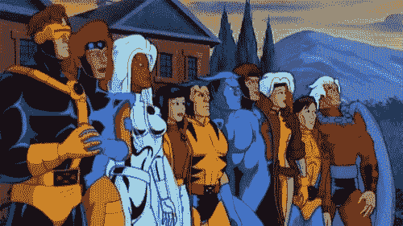****

# ****一月****

*   ****在亚利桑那州的家中度过了新年，大部分时间都在打竞争激烈的篮球，和老朋友聚聚。还参观了西 T21 的塔里耶辛博物馆。****
*   ****我体验了“数字游牧生活”，和我的超极简主义朋友杰里米在纽约待了一周。在那里的时候，我做了一些艰难的商业决定，努力让自己更符合未来。****
*   ****[获得了](https://twitter.com/jrdngonen/status/958122170625871872)[年度最佳制造商奖](https://medium.com/u/b8b4445269d0?source=post_page-----2412e9718f07--------------------------------)的亚军。****
*   ****飞往巴塞罗那，幸运地与我的两个好朋友(Benji & Justin)一起住了一周。 [**是一段令人敬畏的时光**](/giantleaps/barcelona-3ec135f2b04b)**——参观了诺坎普和圣家堂，吃了很多小吃，享受了西班牙的夜生活。******
*   ******冒险去新加坡！遇到了几个学校的朋友，花了六天时间在科技发达、潮湿的丛林中游荡。我们住在一个可怕的旅馆里，做了所有你会从天真的旅行者那里期待的旅游活动。******
*   ******[抵达](https://gonen.blog/starting-school-in-hk/)香港(我春季学期的大本营)，在那里我将在[香港科技大学](https://www.ust.hk/)学习计算机科学。我和我最好的朋友肯尼住在一个鞋盒大小的宿舍里。******

******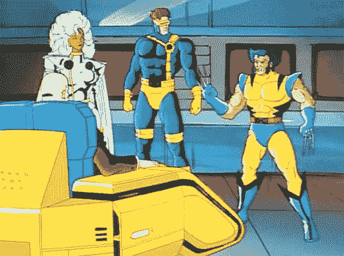******

# ******二月******

*   ******和我学校里的几个最亲密的朋友(以及几十个同龄人)一起出国留学是一次不可思议的冒险。在这 5 个月的时间里，我非常幸运有了这么多独特的经历。从去兰桂坊[到看赛马，再到徒步穿越随机的海滩……我有意识地努力“答应”去做更多的事情。香港是一个特别的地方，我可以写不完——如果你需要推荐，请联系我。](https://en.wikipedia.org/wiki/Lan_Kwai_Fong)******
*   ******[**去了台北**](/giantleaps/taipei-93bb5c306304)**——参观了博物馆，参加了一个[令人难以置信的烹饪班](https://gonen.blog/ivy/)，登上了台北 101 大楼，吃了很多 DTF 美食。********
*   ********在香港庆祝中国新年。还去看了一场亚洲冠军联赛的足球比赛。********
*   ********Arani、Jacob、Jared、Sachin 和我推出了 StartupSift 搜索引擎。********
*   ********[**飞往上海**](/giantleaps/shanghai-7dc65320576f) (和安东尼、麦克、诺法尔、莱恩一起)——参观了几座寺庙，参观了世界第二高楼，去了一些我去过的最有趣的夜店。喝了[白酒](https://en.wikipedia.org/wiki/Baijiu)。还有，吃了很多很多的饺子。********
*   ******跨越两年的 [**每日博客**](https://gonen.blog/)[搬回 Wordpress](https://gonen.blog/hello-world-again-moving-back-to-wordpress/) 。******

******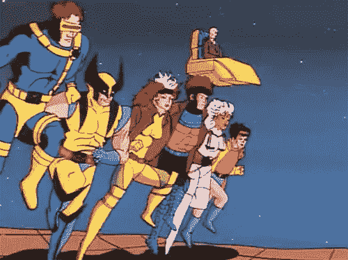******

# ******三月******

*   ******[**独自*旅行*到越南中部**](/giantleaps/da-nang-hoi-an-hue-2f4531944810) (岘港、会安和顺化)——骑自行车到乡下，在海滩上放松，吃大量的越南河粉，探索大理石山，穿过海运关，参观帝都。******
*   ******[**独自*前往中国西安***](/giantleaps/xian-870016b861e0)*——参观了兵马俑，在一个露天食品市场迷路了，吃了一些最令人惊叹的正宗食物(可能是我最喜欢的一餐)。*******
*   *******[飞往中国北京](/giantleaps/beijing-c7ca686405f4)——滑下长城，游览故宫，喝更多白酒，又一次迷路了。北京还有一些最意想不到的丰富多彩的夜生活。*******
*   *******和我的四个最亲密的朋友冒险去了清迈、曼谷，留下了一些美好的回忆——和大象一起洗泥浴，爬一个粘稠的瀑布，参观风景优美的寺庙。此外，在整个行程中保持逾越节。*******

*******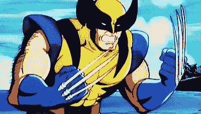*******

# *******四月*******

*   *******[**从曼谷飞到暹粒**](/giantleaps/thoughts-on-siem-reap-9c202d5388b8)——在吴哥窟看世界上最美的日出，骑着沙滩车穿越柬埔寨的乡村田园。*******
*   *******坐通宵巴士从暹粒到金边——参观悲惨的杀戮场和种族灭绝博物馆，这是一次情感上的转变。也骑自行车穿越繁华的城市。最后在曼谷机场停留了 12 个小时。*******
*   *******我和我的朋友雅各布坐地铁从香港到中国深圳。[在深圳](/giantleaps/thoughts-on-shenzhen-b0e415c767ae)，我们迷路了，逛了逛电子市场。第二天我们坐动车去了[桂林](/giantleaps/thoughts-on-guilin-and-yangshuo-china-a07483153bec)，在那里我们漫无目的地徒步旅行和探险。然后我们乘竹筏进入阳朔(我去过的最美丽的城镇)，在那里我们骑自行车去了月亮山(拍了一些不可思议的照片)。*******
*   *******[**和四个朋友去韩国首尔旅游**](/giantleaps/seoul-6819548c30c1)——逛复古服装市场，逛 DMZ，玩 VR，吃成吨的 KBBQ，去弘大，去八角。*******
*   *******[**冒险去泰国南部(Ko Phangan，Ko Samui，Surat Thani)过满月节**](/giantleaps/thoughts-on-ko-phangan-ko-samui-and-surat-thani-a3426a9979e9)——一个通宵的海滩派对，变成了跳绳和燃烧的火炬(对人类来说是一个非常不健康的环境)。太棒了。*******

*******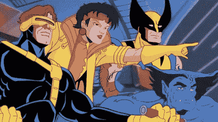*******

# *******五月*******

*   *******飞往巴厘岛(与岚娜、茱莉亚、诺法尔和瑞秋)庆祝肯尼的生日——在海滩俱乐部放松，在日出前徒步旅行火山，吃美味的食物。*******
*   *******[雅各布](https://twitter.com/jacobschein)、[亚历克斯·巴纳加](https://medium.com/u/a55c7384042f?source=post_page-----2412e9718f07--------------------------------)、[本·朗](https://medium.com/u/24bbea13727?source=post_page-----2412e9718f07--------------------------------)、[亨利·考夫曼](https://medium.com/u/579b0f53b4d2?source=post_page-----2412e9718f07--------------------------------)和我建立了[读书俱乐部](https://www.producthunt.com/posts/bookclub)——一种建立和分享你的数字书架的简单方法。成千上万的人建立了账户，并探索这一产品。虽然[站点](https://bookclub.cool/)仍在运行，但我们已经降低了实验的优先级，将注意力放在了其他事情上。这绝对是一个在这个领域完善一些令人敬畏的东西的机会。*******
*   *******[乔丹·辛格](https://medium.com/u/9e4a422b4c5f?source=post_page-----2412e9718f07--------------------------------)、[摩根·赫克](https://twitter.com/morgan_heck)、[希夫·康思](https://medium.com/u/b6485cfd513?source=post_page-----2412e9718f07--------------------------------)，我终于推出了 [Wonder for Slack](https://www.producthunt.com/posts/wonder-for-slack) ，Wonder Bot 通过了 10 万次安装。*******
*   *******去了日本[京都](/giantleaps/thoughts-on-kyoto-26f93711111b)和[东京](/giantleaps/thoughts-on-tokyo-24f9e649519e)——参观了美丽的花园，吃了神户牛肉，玩了马里奥赛车 VR，去了日本 EDC(在瓢泼大雨中)，在那里我们看了 Jai Wolf 和马丁·盖瑞斯的表演。*******
*   *******我 21 岁了，写了一篇关于我的生日问题的文章。坐渡轮去澳门，参观了世界上最大的赌场！*******
*   *******莫名其妙的通过了我的四门期末考试，告别了香港。下面是国外 5 个月的 [**107 张照片**](/giantleaps/107-photos-5-months-abroad-42f31d157ada) 。*******
*   *******航行了 30 个小时回到亚利桑那州。海南航空一路上只丢了我一个包！*******

*******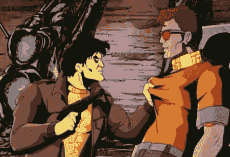*******

# *******六月*******

*   *******我在亚利桑那州度过了短暂的 72 小时，然后带着我的行李去旧金山度夏，在那里我将和雅各布 T20 合住一个房间(和我的另外两个朋友伊兰和贾斯汀合住一套公寓)。抛开疯狂的房租不谈，回到旧金山(连续第三个夏天)令人兴奋。*******
*   *******我在 [Blend](https://blend.com/) 开始了产品经理的实习。我很幸运有机会与世界级的运营商一起工作(并向他们学习)，解决真正重要的问题。感谢与一个令人敬畏的团队和超级乐于助人的导师/经理一起工作。获得了许多经验/见解→一周后，我飞往西雅图，与我们的一些客户呆了一天。*******
*   *******作为一名知情人参加了一个项目，在那里我跟踪了一家风险投资公司，遇到了一些非常棒的人(感谢[安](https://twitter.com/annimaniac)、[迈克](https://twitter.com/m2jr)、[米切尔](https://twitter.com/mkogan17)和[幸](https://twitter.com/advencap))。*******

*******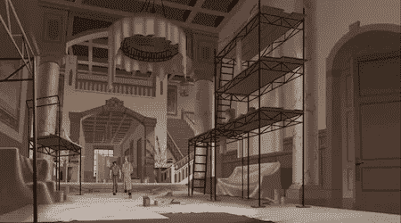*******

# *******七月*******

*   *******在 SF 联系了几个老朋友和很多新朋友。把几个事件放在一起，一个和[罗恩](https://twitter.com/aranibatta?lang=en)一起，另一个和[伊恩](https://medium.com/u/ab2912824b13?source=post_page-----2412e9718f07--------------------------------)一起，还有几个和[拉胡尔](https://medium.com/u/3a7a57feb380?source=post_page-----2412e9718f07--------------------------------)一起。把各种各样有趣的思想家聚集在一起的感觉真的很棒。整个 7 月，我进行了几十次非常有趣的谈话，其中一些是我最喜欢的，是与乐于助人的朋友安迪、大卫、张克帆、乔纳森、洛根、瓦伦丁以及其他许多人的谈话。*******
*   *******陷入常规(几个月来第一次)…长时间工作，并有一个一致的锻炼计划。花了很多时间在多洛雷斯玩扣球。7 月 4 日很有趣！*******
*   *******与 Ilan、Jacob、Justin 和 Kevin 一起去太浩湖公路旅行——乘坐油管，进行了 14 英里的徒步旅行(在那里我们用完了水，很惊讶我们成功了)。*******

*******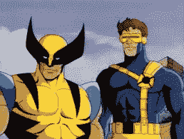*******

# *******八月*******

*   *******去了外面的世界(第一次)——看了 Illenium 和 Future。*******
*   *******在亚利桑那州过了一个周末，和家人朋友一起出去玩。*******
*   *******随着我们的租约到期，最后两周我和亚历克斯、本、埃扎安和维哈尔住在教会里。然后结束了我在旧金山为期 12 周的实习……打包行李回到圣路易斯开始我的高三生活。*******
*   *******回到学校，我写了一篇名为“ [**亲爱的大一我**](https://mystudentvoices.com/dear-freshman-me-50cde2f526e4) **的作文。**“我还决定 [**不参加招聘**](https://gonen.blog/everyone-else/) 。搬到校外是匆忙而忙乱的(幸好有我的室友本和诺亚在身边)。因为我出国了，回到学校是特别新鲜和令人兴奋的。开学前的“欢迎周”总是这学期最有趣的时光。*******

*******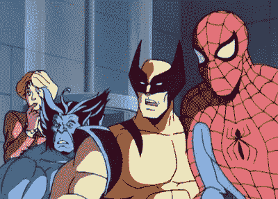*******

# *******九月*******

*   *******发表了一篇关于我如何看待 [**手机是赌场**](https://gonen.blog/phones-are-casinos/) →我删除了我珍贵的 Instagram 账号，把我的手机变成黑白的，真正开始尝试欣赏存在感。[学习减缓时间](https://gonen.blog/learning-slows-down-time/) (h/t [Arjun Sethi](https://medium.com/u/9e52e7e52012?source=post_page-----2412e9718f07--------------------------------) )。*******
*   *******将我的整个生活都转移到了概念上(取代了 Evernote ),并开始了个人课程，在那里我学到了很多关于各种主题的知识，包括蒙古人、水培法、废物管理和城市建设(后来缩减了这项练习)。*******
*   *******经过两年的销售(销售到几十个国家，几乎每个州)，[丹尼尔](https://medium.com/u/cb4da2f08c8d?source=post_page-----2412e9718f07--------------------------------)，[杰里米](https://medium.com/u/78a4fb4fcfe7?source=post_page-----2412e9718f07--------------------------------)，我决定关闭 [**扰乱卡**](https://disrupt.cards/) 。*******

*******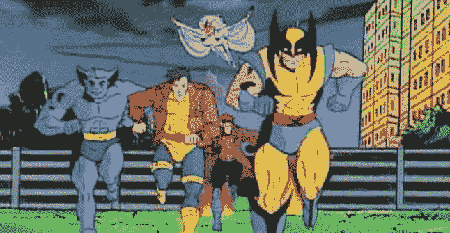*******

# *******十月*******

*   *******为了参加[分离音乐节](http://www.breakawayfestival.com/)，和一群人(s/o Fannie 4 driving)一起去了纳什维尔——看了 DJ Diesel、Blau、Illenium、Lil Pump 和 Lil Skies。*******
*   *******去芝加哥参加 WashU 的毕业旅行——吃了很棒的披萨，和校友们见了面，探索了这座城市。还去了圣路易斯的啤酒节。*******
*   *******[达尔希尔·帕特尔](https://medium.com/u/b94fcf02c078?source=post_page-----2412e9718f07--------------------------------)、[马斯·拉兰尼](https://medium.com/u/ae233c02964a?source=post_page-----2412e9718f07--------------------------------)和我发起了[清除虚荣指标](https://www.producthunt.com/posts/remove-vanity-metrics)，这是由[泰勒·洛伦茨](https://medium.com/u/2328753fa549?source=post_page-----2412e9718f07--------------------------------)在[大西洋](https://www.theatlantic.com/technology/archive/2018/10/twitter-should-kill-retweet/574321/)中所涵盖的。*******
*   *******我写了一篇关于生产力的文章，还和 NBC 做了一个关于结构化拖延的 [**小采访**](https://www.nbcnews.com/better/pop-culture/how-use-procrastination-your-advantage-ncna925631)(h/t[Marc](https://medium.com/u/fa65e64cf273?source=post_page-----2412e9718f07--------------------------------))。*******
*   *******[**路绊带着诺亚、本和肯尼去密苏里州的赫尔曼**](/giantleaps/thoughts-on-hermann-missouri-fd56bea4e4) (三千人的巴伐利亚小镇)参加啤酒节。*******

**************

# *******十一月*******

*   *******达尔希尔、马斯和我随后推出了[Just Focus](https://www.producthunt.com/posts/just-focus-4151b38d-62a0-4b51-97cb-686565991438)——chrome 的一个简单的网站拦截器(目前已有超过 1300 次下载)。我们还建立了[方正倒带](https://www.producthunt.com/posts/founder-rewind)，获得了数万次页面浏览量。*******
*   *******雅各布和我受到丹尼尔·格罗斯的启发，推出了磁铁——一种在谷歌表单中收集电子邮件回复的简单方法。*******
*   *******我去杜克大学看望我的哥哥亚当和密友贾里德。核对了去杜克大学篮球赛的遗愿清单。那个周末我的肩膀也脱臼了。*******
*   *******达尔希尔、马斯、加文和我创造了[CreateASignature](https://www.producthunt.com/posts/create-a-signature)——有数千种用途。同一个星期，我们迅速构建了[FinalGradeCalc](https://www.producthunt.com/posts/final-grade-calculator)——一个非常简单的工具，用于计算你在期末考试中需要什么。*******
*   *******我发表了 [**信号**](https://hackernoon.com/the-signal-e1686be6f749)——一份 50 多家高增长公司的便利清单。*******
*   *******Jacob 和我去看了 Wild 'N Out 的现场演出——这是一次超级有趣的经历。*******

*******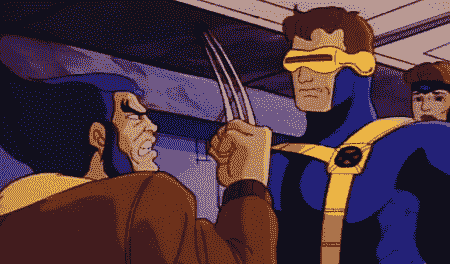*******

# *******十二月*******

*   *******本朗和我进行了一项实验，我们将数百名雄心勃勃的创客介绍给彼此。得到了非常好的反馈，我们希望在一月份再次这样做。如果你想加入，请告诉我。*******
*   *******举办了几次登月活动，我和几个朋友聚在一起讨论世界上发生的各种有趣的事情。还举办了几次晚宴(希望明年能举办更多)和光明节派对。*******
*   *******我和我的朋友布伦特自发地穿越密苏里州去观看充电器对酋长队的比赛(非常感谢拉塞尔·奥肯的这次经历)。*******
*   *******通过了我的期末考试，完成了我的计算机科学专业…我将完成我的金融专业，下学期毕业。*******

*******这就把我们带到了今天…我最近飞回了亚利桑那州的家，并将在这里多呆几天。12 月 24 日，我将飞往纽约，然后和我的四个好朋友(Kenny、Noah、Tej 和 Vihar)在接下来的三周时间里去荷兰、比利时、匈牙利、印度和香港旅行。如果你有任何建议，请告诉我…应该是另一次冒险。我会在[推特上发布](https://twitter.com/jrdngonen)。*******

*******2019 年将是令人兴奋的……我有很多工作要做。*******

*******非常感谢你阅读我的一年。正如我之前提到的，我欠每个人一切。我很幸运，感谢你们所有的支持。*******

*******我希望你(和你的家人/朋友)度过健康充实的一年。*******

*********祝你 2019 年一切顺利。*********

# *******如果*有什么*我能帮忙的，[请联系](https://twitter.com/jrdngonen)*******

*******如果你以前从未见过我，这里有更多关于我的[。](https://gonen.blog/me/)*******

## *******保持联系的最佳方式？*******

*   *******[我的简讯](http://www.jordangonen.com/newsletter)和我的[推特](http://twitter.com/jrdngonen)*******
*   *******我的邮箱是 jordangonen 1，在 gmail dot com。*******