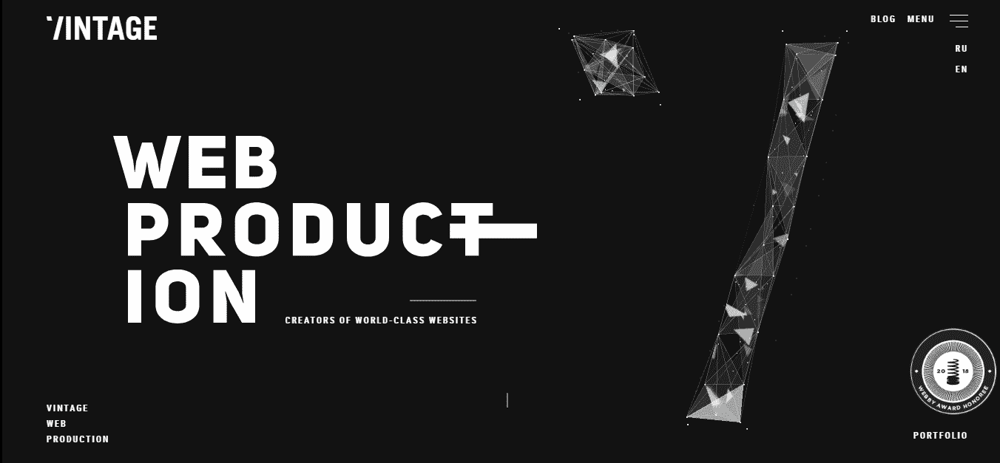
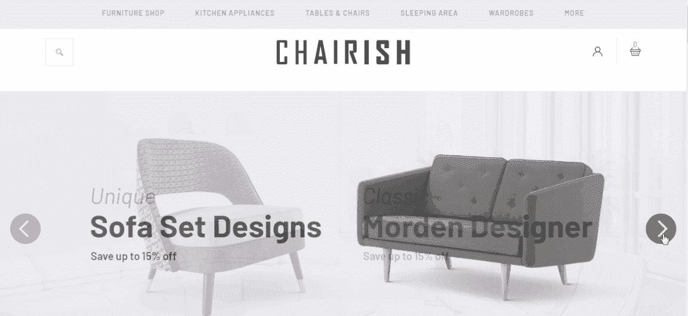

# 2018 最佳网页设计:给你的 19 个创意网页范例和模板

> 原文：<https://medium.com/hackernoon/2018-best-web-design-19-creative-web-examples-and-templates-for-you-aae095126cfe>

2018 年 19 个最好的网站设计实例和模板，包括创意 WordPress/ecommerce/极简主义网页，收集起来提升你的创造力。随着**网站设计趋势**每年都在变化，2018 年上半年，出现了一些新的趋势，如破碎的网格布局、排版动画和流体效果。

我们也继续看到 2016 年和 2017 年或者更早的的一些[网页设计趋势，比如极简/干净的网页设计、](https://www.mockplus.com/blog/post/latest-web-designs)[平面网页设计](https://www.mockplus.com/blog/post/flat-web-design-examples)、[响应式网页设计](https://www.mockplus.com/blog/post/free-responsive-html5-web-design-templates)和[交互式网页设计](https://www.mockplus.com/blog/post/interactive-website-example)等。

作为一名 UX/UI 设计师，你想跟上 2018 年的这些网站设计趋势，设计出一个有创意、实用的网站吗？

你来对地方了！我们已经发现了 2018 年的 **19 个最佳网站设计示例和模板，包括一些新鲜和有创意的 WordPress 网站、电子商务网站和最佳干净/极简主义网站示例，以帮助提高你的创造力和启发你。**

一些网站原型设计技巧也将借助于[一个更简单、更快速、更智能的原型工具](https://www.mockplus.com/)，Mockplus。如果你在设计团队工作， [Mockplus iDoc](https://goo.gl/s3ox7m) 有助于连接你的整个产品设计工作流程！

# 最佳 WordPress 网站设计

# 1.酷俱乐部

**评分** : ★★★★

**亮点:丰富的微交互、悬停效果和留白**

这个酷俱乐部网站包括许多有趣的[微互动](https://www.mockplus.com/blog/post/micro-interaction-design)。

例如，用户可以轻松地点击卡盒，一张一张地发牌。此外，当您将鼠标光标移动到位于导航栏上的单词上时，它们会相应地摇动和波动。总的来说，所有这些微小的互动造就了一个有趣且有吸引力的网站设计。

而且，这种设计也充分利用了留白来突出自己的产品，抓住用户的注意力。

**你能学到什么:**

通过丰富的微交互、小游戏和有效利用空白空间，让你的网站设计更好

**原型设计技巧**:

微交互设计已经被 UX/UI 设计师广泛用于创建有趣且引人注目的网站原型。我们强烈建议您免费下载并使用[，这是一个功能强大的原型开发工具，具有丰富的交互命令](http://doc.mockplus.com/?cat=23)。

# 2.Papazian 珠宝展示

**评分** : ★★★

**亮点:鼓舞人心的全屏视频背景和极简的网页设计风格**

这个网站以全屏视频动态展示其产品的生产过程为背景。这种方法突出了他们对每件珠宝细节的关注，迫使用户购买高质量的产品。

此外，背景视频与整体设计和配色方案的协调有助于整体的优雅和时尚感。

这个网站也是[极简网站设计](https://www.mockplus.com/blog/post/minimalist-web-design)的绝佳范例。

**你能学到什么:**

用视频优化你的网站

**原型设计技巧**:

通过 Mockplus，设计师可以轻松地使用其“GIF”组件来为他们的 web/app 界面设计导入和编辑视频。此外，Mockplus 提供了超过 3000 个矢量图标，这对于整合到一个惊人的极简主义网站/应用程序中非常有用。

*Mockplus 允许用户使用其“GIF”组件和其他矢量图标轻松创建引人注目的极简主义网站。*

# 3.起草

**评分** : ★★★

**亮点:破碎网格布局、动态文本动画和选择效果**

这个设计工作室网站在加载的同时，用动态的文字动画来引起用户的兴趣。破碎/不对称网格布局用于逐个展示他们的投资组合项目，选择效果用于增强每个列表。

这些设计元素可以有效地激发用户的兴趣，鼓励网站互动。

**你能学到什么:**

*   用破碎的网格布局个性化你的网站
*   使用动态文本动画来显示界面内容

请注意:这并不意味着你必须在你的网页/应用程序设计中使用不对称的网格布局。对称的网格布局也足够有效(见下文)。

*Mockplus 凭借其“***”和“* [*【自动数据填充】*](https://www.mockplus.com/newfeatures/post/auto-data-fill-newfeatures) *”的特性，可以帮助你做出干净直观的对称网格布局。**

# *4.瓦阿克*

**

***评分** : ★★★★*

***亮点:出色的流体效果***

*这个设计工作室网站使用非常酷的流体效果来吸引和留住用户。而且，其图文并茂的设计风格引人注目。*

***你能学到什么:***

*   *用流畅的效果增强网站的视觉吸引力*
*   *流体效果在 web/app 界面设计中越来越受欢迎。值得将这个设计元素添加到您的 UI 设计中。*

# *5.古巴山中心*

**

***评分** : ★★★*

***亮点:动态文字与照片的完美结合***

*不同于其他园林网站使用静态的照片和文字，这个植物园网站将动态的文字和高质量的照片完美地结合在一起。*

*当用户在虚拟世界中“漫步”时，他们可以看到高质量的照片，这些照片展示了美丽的风景和花园的相关信息。*

***你能学到什么:***

*使用动态文本和照片的直观界面*

*而且，在具体的设计案例中，为了让你的网站更加美观和吸引人，也要为 UI 的文字和照片定制一些特效。*

**

*为您的网页/应用程序界面文本、照片、形状和图标添加特殊效果，以获得更好的性能。*

# *最佳电子商务网站设计*

# *6.旅游癖公司*

**

***评分** : ★★★*

***亮点:有趣的鼠标光标样式***

*这个珠宝店网站因其智能搜索、过滤和导航功能而脱颖而出，促成了时尚和视觉上吸引人的设计。*

*此外，该网站还为每个珠宝类别提供了多样化的鼠标光标样式。当用户浏览不同的珠宝类别时，鼠标光标样式会自动改变。这创造了一个互动和迷人的设计元素。*

***你能学到什么:***

*根据网站或产品的特点，用更人性化的设计元素来增强你的网站，例如改变鼠标光标的样式、字体、颜色或配色方案等。*

# *7.椅子式*

**

***评分** : ★★★*

***亮点:促销产品传送带***

*这个家具网站模板使用一个特殊的转盘在主页上推广热门产品。带有文本的扁平图标帮助用户快速搜索和检查所需信息。*

***能学到什么:***

*   *在主页上展示推广的新闻或产品*
*   *用平面图标或设计简化你的网站界面*

***原型设计技巧:***

*Mockplus 让您直观地展示促销新闻或产品。只需拖放“图片轮播”组件，即可显示不同的产品照片。它的“图标和标签”组件在创建带有文本的图标按钮时也很有用。*

*当然，您也可以在这些图标按钮中添加交互，以获得更好的性能。*

# *8.伍登多特*

**

***评分** : ★★★*

***亮点:贴心的在线帮助面板***

*这个电子商务网站设计有一个周到的在线帮助面板，允许用户随时寻求帮助。此外，该功能在不使用时可以隐藏，以获得更好的 UX。*

***你能学到什么:***

*添加特别推广，问答或帮助面板，以改善网站 UX*

# *9.曼纽尔·鲁埃达*

**

***评分** : ★★★★*

***亮点:视差滚动设计***

*该网站具有惊人的视差滚动效果，使用户能够通过滚动鼠标滚轮轻松浏览一系列视频。最终结果是类似于看电影的用户友好的体验。*

***你能学到什么:***

*[使用视差滚动设计](https://www.mockplus.com/blog/post/parallax-scrolling-websites)突出视觉层次、布局和重要产品*

# *10.信号增强器*

**

***评分** : ★★★*

***亮点:精美插画设计风格***

*这个网站采用插画设计风格来展示所有的界面组件，使得整个设计美观有趣。*

***你能学到什么:***

*   *用插画/漫画/水墨设计风格打动用户*
*   *插画/漫画/水墨设计风格因其独特而有趣的视觉审美而成为设计师的流行趋势。*

*卡通设计风格可以让你的网站用户界面非常漂亮，非常吸引人。*

# *最佳简洁/极简网站设计*

*干净/极简网站通常简单、整洁且用户友好。并且在 2018 年上半年，有很多优秀的干净/极简网站设计。让我们来看看几个例子:*

# *11.迈克尔·维拉尔*

**

***评分** : ★★★*

***亮点:醒目的选择效果***

*这个网站是一个优秀的极简主义网站范例。黑色背景与白色文本和图标完美搭配。而且还使用了非常醒目的选择效果，让整个设计更有吸引力和趣味性。*

***你能学到什么:***

*用特殊的选择效果突出你的极简网站*

# *12.不是你的标准*

**

***评分** : ★★★*

***亮点:左侧有用的导航栏***

*导航系统直接影响用户对网络/应用的体验。为了提高 UX，这个网站包含了一个左侧导航栏，可以根据用户的需要自由隐藏或取消隐藏。*

***你能学到什么:***

*为你的网页/应用程序添加实时、交互式的导航元素以获得更好的 UX，例如隐藏导航栏、侧边栏等。*

# *13.马克·戈尔茨坦*

**

***评分** : ★★★*

***高光:冷色调渐变***

*这个网站示例使用漂亮的动态颜色渐变，通过高视觉吸引力来吸引用户。非常酷。*

***你能学到什么:***

*使用正确的配色方案或颜色渐变来增强网站的视觉效果。*

# *14.新鲜的青蛙*

**

***评分** : ★★★*

***亮点:有效的产品推广***

*该网站通过使用不同大小和版式的简单文本，加上诱人的产品照片，吸引用户点击了解详情或直接购买，从而提高产品销量。*

***你能学到什么:***

*通过突出产品的独特功能来展示产品*

# *其他创意网站设计示例*

# *15.二元组*

**

***评分** : ★★★*

***亮点:** [**响应式网站**](https://www.mockplus.com/blog/post/free-responsive-html5-web-design-templates) **，高质量照片与文字的完美结合***

*这个食谱分享网站是一个响应式网站，可以自动呈现给不同操作系统或屏幕大小的不同设备。*

*此外，该网站的食谱以高质量的图片和文字吸引人。*

***你能学到什么:***

*   *为更好的用户界面和 UX 创建响应性网站*
*   *使用“照片+文字”组合，让你的界面更有吸引力和说服力*

# *16.五人晚餐*

**

***评分** : ★★★*

***亮点:清晰直观的视觉层次***

*这个网站用非常清晰和直观的视觉层次结构明智地组织文本，这对于用户快速阅读和找到他们需要的信息是非常实用的。*

***你能学到什么:***

*[使用清晰直观的视觉层次结构来改进您的网站设计](https://www.mockplus.com/blog/post/ui-visual-hierarchy)*

*你可以通过使用不同的字体、大小、位置、颜色、排列、布局和其他方法为你的网站设计创造一个清晰直观的视觉层次。*

***原型设计技巧:***

*使用 Mockplus，您可以通过设置组件的大小、位置、颜色、对齐和更多属性，轻松地为您的 web/app 原型构建清晰的文本或视觉层次结构。*

# *17.La Shop 工作室*

**

***评分** : ★★★★*

***亮点:互动网站、创意音频设计***

*这个工作室网站允许用户通过他们的鼠标光标与网站互动并创作音乐，即使他们对音乐一无所知。*

***你能学到什么:***

*   *创建一个有吸引力和有趣的互动网站*
*   *用声音或音频改善您的网站*

*如今，web/app 的 UI 设计不再仅仅依赖于视觉表现。越来越多的设计师在他们的设计中加入声音或音频，以获得更好的用户界面和 UX。*

# *18.字形工作室*

**

***评分** : ★★★*

***亮点:3D 技术和有趣的悬停效果***

*这个网站有一个用户可以旋转的 3D 球。此外，该网站还在几个按钮上使用了悬停效果。*

***你能学到什么:***

*使用 3D 技术显示页面内容以获得更好的视觉效果*

*[用创造性的微交互](https://www.mockplus.com/blog/post/micro-interaction-design)改进网站，例如特殊的悬停效果*

# *19.大 Dropinc 公司*

**

***评分** : ★★★*

***亮点:活力配色***

*这个网站使用了[极简主义的网页设计风格](https://www.mockplus.com/resource/post/25-minimalistic-logo-free-templates-for-commercial-use)来提供直观和更容易理解的界面。它将设计与充满活力的配色方案相结合，以保持用户的注意力。*

***你能学到什么:***

*自定义网站配色方案*

***原型设计技巧:***

*Mockplus 为每个设计组件提供了强大的颜色选择器，以便设计师可以轻松地编辑颜色，并为他们的应用程序/web 设计定制配色方案。*

*此外，Mockplus 还设计了许多强大的功能(如图标库、组件样式库和[原型样本库](https://www.mockplus.com/sample))，供用户快速有效地原型化其 web/app。*

*例如，Mockplus 提供了 8 种测试和共享项目的方法，以便设计师可以轻松测试、迭代和改进他们的原型，并实时收集反馈。*

*Mockplus 新引入了一个[团队管理和协作](https://www.mockplus.com/newfeatures/post/team-management-collaboration)特性来帮助用户更有效地协作。*

*总的来说，Mockplus 确实是您轻松快速地原型化、测试、迭代和演示您的网站/应用程序设计的最佳选择。*

# *包裹*

*不管他们是什么类型的网站，上面提到的所有最好的网站设计例子和模板都应用了流行的网站设计趋势，并或多或少地展示了网页设计技能。*

*我们希望这些例子能激励你创建自己的有创意的、引人注目的网站或应用程序。*

*当然，在设计你的网站的同时，别忘了使用[一个简单有效的原型制作工具](https://www.mockplus.com/)，就像 Mockplus 一样，及时测试和迭代你的设计思路。*

***你可能也喜欢:***

*[2018 年移动应用 9 大 UI 设计趋势](https://www.mockplus.com/blog/post/mobile-app-ui-design-trend)*

*【2017 年五大网页设计趋势*

*[2016 年 UX/UI 设计趋势](https://www.mockplus.com/blog/post/152-design-trends-for-ux-and-ui-designers-in-2016)*

*[制作令人惊叹的简约网站的 9 个最佳设计秘诀](https://www.mockplus.com/blog/post/minimalist-web-design)*

*[2018 年 7 款最佳免费网站设计工具](https://www.mockplus.com/blog/post/best-free-website-design-tools)*