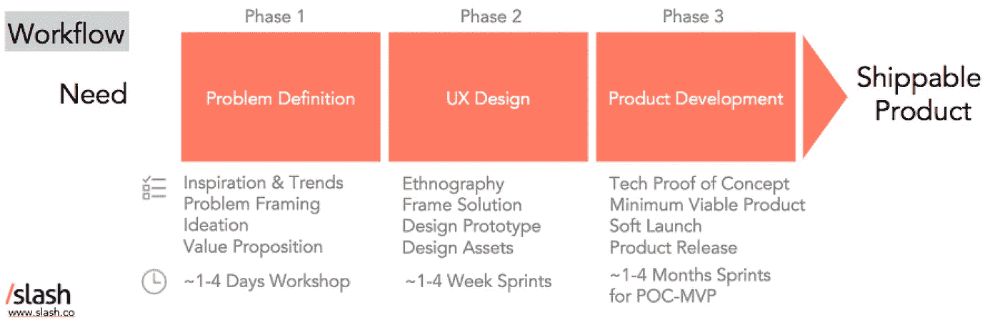
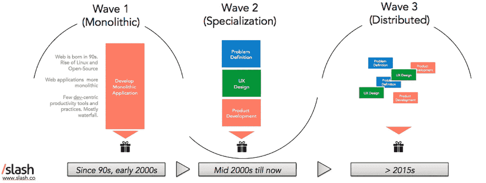
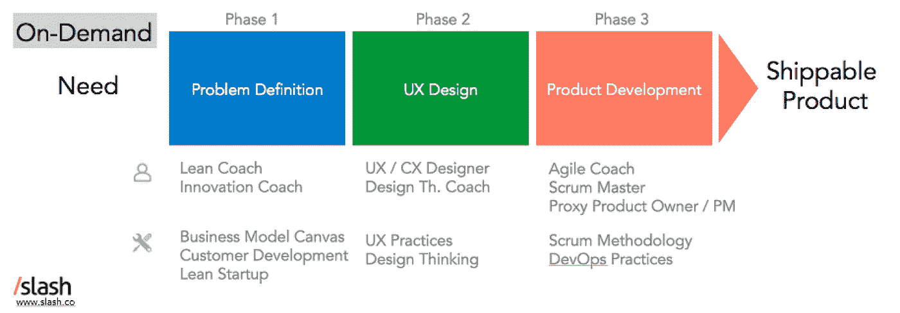
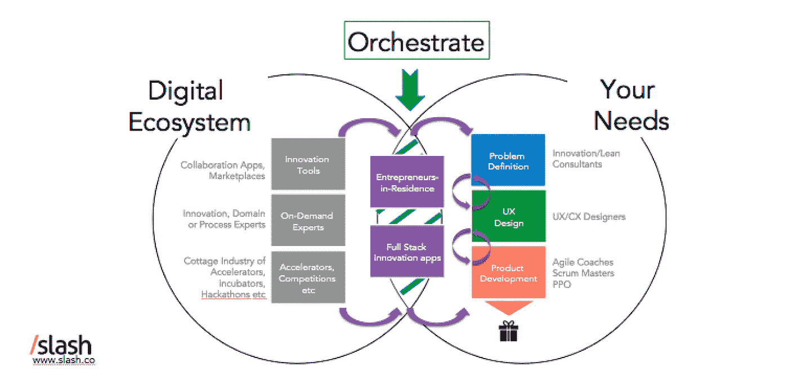
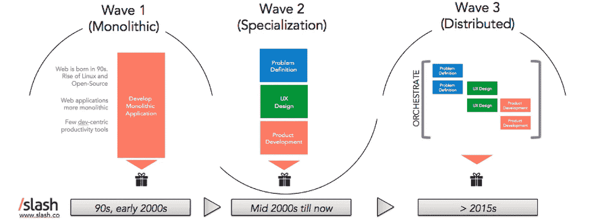

# 理解数字创新的 2018 框架

> 原文：<https://medium.com/hackernoon/2018-framework-to-understand-digital-innovation-67258ba1e831>

从初创公司到大公司，每个人都在拥抱数字创新。新的工具、框架和服务提供商似乎每天都在涌现，以帮助公司将模拟问题转化为数字解决方案。

数字化行业才刚刚起步。更多的趋势和变化正在发生。为了跟上时代，了解数字产品创新的过程非常重要。

在[斜线](http://www.slash.co)处，我们使用以下框架。

**工作流程**

产品开发可以分为三个步骤:定义、设计和开发。

这假设作为一家公司，你已经回答了你的业务目标是什么以及“数字化”如何融入其中的更广泛的战略问题。换句话说，作为一家公司，你知道自己有数字化需求，即使你还不能清楚地表达出来。

Product Innovation in 3 steps

**问题定义**

这可能是最关键、最具战略意义的一步。在这里，产品所有者或决策者确定需要解决的需求，并提出一些关于产品化解决方案的想法。

关键流程是:

*   **灵感&趋势**(可选):对于想要了解关键趋势以及其他人如何设置他们的创新功能以及他们为用户提供什么服务的组织和团队来说，这是一个很好的起点。这是咨询公司的领域，比如创新无处不在。
*   **问题框架**:确定你的问题，提出你的假设，明确你的需求是确定你想做什么的第一步。这种“问题定义”咨询的一个很好的例子是 [Innovator。SG](https://www.innovator.sg/) 。
*   **构思**是指通过会议产生想法和解决方案，从头脑风暴到快速草图和头脑写作。许多人以前都经历过头脑风暴会议，尽管富有成效的想法会议并不容易做到。交互设计基金会在上面写了一篇[有用的文章](https://www.interaction-design.org/literature/article/what-is-ideation-and-how-to-prepare-for-ideation-sessions)。
*   **价值主张**抓住决策者确定的高层次客户需求和产品解决方案，指导进一步的设计和开发。像 T21 咨询公司这样的公司咨询公司致力于此。

而创业企业家通常自己经历完整的周期(而且很多次！)，企业团队通常会让创新顾问和专家参与进来，通过互动研讨会来推动这些步骤。

事实上，这些过程并没有明确划分或二进制化。从一项活动跳到另一项活动是很常见的。许多咨询公司模糊了解决方案之间的界限，或者提供了完整的解决方案。

**UX 设计**

通过以用户为中心的设计过程，最初的解决方案变得天翻地覆。这可以从仅仅为一个数字产品创建简单的线框图，到对你的用户进行一个复杂的人种学研究。

UX 设计，以及更广泛的以人为中心的设计，最著名的支持者可能是全球设计咨询公司 [IDEO](http://www.ideo.com) 的人。设计思维的[起源可以追溯到 20 世纪 50 年代麻省理工学院的 Buckminister Fuller 的工作。](/@szczpanks/design-thinking-where-it-came-from-and-the-type-of-people-who-made-it-all-happen-dc3a05411e53)

概括地说，这些是典型的流程:

*   **人种学**通过社会研究提供对用户的洞察。这有助于展现您的用户角色，挑战您对用户行为的关键假设，并绘制出您的客户接触点。像[青蛙](https://www.frogdesign.com/)和[何这样的公司！st](https://www.heist7.com/) 已经在这一领域声名鹊起。
*   **框架解决方案**:对*“我们的【产品】通过【解决方案】帮助想【问题】的【用户】”中空白处的回答*。通常，您需要在客户端和设计团队召集广泛的利益相关者来确定这一点，并确保(1)这是一个值得解决的实际问题，以及(2)技术在解决这一问题中发挥着重要作用。
*   **设计原型**:为了从高层次的框架转移到具体的概念，需要对想法进行排序，使用交互式原型进行可视化，并由设计师和实际用户快速评估或测试。这里的关键是“快”。
*   **设计资产**是在用户测试了粗略的原型之后创建的。这些资产包括详细的结构、工作流程、模型或线框，以及其他视觉资产，如徽标、品牌等。这是大多数人想到‘设计’时所熟悉的。遗憾的是，大多数初创公司没有预算或能力投资创造性研究和构思，因此许多 UX 设计机构主要专注于创造资产。

对于每个过程的详细但可访问的细分，请查看我们在 [Startup Jungle](https://www.facebook.com/Startup-Jungle-159759628096362/) 举办的优秀的[设计思维研讨会](https://www.slideshare.net/slash_co/startup-jungle-cambodia-user-experience-design-done-right)，学习社区 [Slash](http://www.slash.co) 在金边运行，感谢 CX 在 [DMI](https://dminc.com/) 的负责人 Elliot Yeung 的介绍。

**产品开发**

在这里，实际的产品得到发展。这是产品创新周期中最耗时、通常也是最昂贵和最令人沮丧的部分。

虽然开发可以被认为是一个线性的过程，但是更有帮助的是把它看作一个增量的旅程，在这个旅程中，产品迭代地变得生动起来。现代软件开发方法，像 [Scrum](http://scrummethodology.com/) 相对于[瀑布](https://en.wikipedia.org/wiki/Waterfall_model)方法，更加“敏捷”,并且将整个交付过程和资源分配与这些增量步骤相结合，使得过程中的每一步都可以看到进展。那是另一个帖子！

在[斜线](http://www.slash.co)，这是我们的面包和黄油。我们通常将软件开发分为 4 个过程:

*   **概念验证(POC)** :概念验证是指通过开发和部署包含最关键构建模块的粗略解决方案，快速验证技术架构。对于简单的项目，通常跳过这一步。复杂的项目可以从 POC 中受益，以获得组织利益相关者的认可，并给予技术团队更多信心，使解决方案能够按计划进行。这篇维基百科[文章](https://en.wikipedia.org/wiki/Proof_of_concept)在阐述概念证明的价值方面出奇的好。
*   最小可行产品(MVP) :这是你的产品的最简单版本，满足早期用户。精益创业运动已经强行占领了数字创新的世界，关于这一点已经写了很多。我们从 MVP 中学到的是拥有一个积极参与的产品所有者或客户的重要性。最终，一个成功的 MVP 是关于优先化一部分特性，并和用户一起测试这些特性。
*   **试运行:**在这里，您的解决方案部署在生产(“实时”)环境中，具备所有必要的功能，最终用户可以开始与之交互并提供反馈。一种流行的方法是将它构建为可信用户的私有测试(通常称为“私有测试版”)；或者通过分阶段释放软启动。
*   **产品发布:**这是期待已久的“发布会”。如果新的解决方案取代了现有的解决方案，这也需要迁移:将遗留系统切换到新的系统。

恭喜你！按照这个工作流程，你应该有一个活的产品。)解决了你的需求。

**三波产品创新**

这些过程正在迅速演变。随着数字化触及社会的每个行业和领域，考虑这些实践将会或应该如何进一步改变是很重要的。

为了客观地看待问题，不妨回顾一下历史。自从现代网络诞生以来，数字产品创新已经经历了三次浪潮。

How product development evolved since the birth of the Web

**第一波:单片**

在 20 世纪 90 年代和 21 世纪初，web 和桌面应用程序大多是“单体”的，作为集成的工作单元交付。创新、设计和开发通常是由同一个人完成的。几乎没有以开发为中心的生产力工具，实践也更加分散。当我在 1998 年十几岁时开始编程时，从设计和编码到服务器部署，我必须自己做所有的事情。

**第二波:专业化**

92 年，Linux 和开放源码运动越来越强大，基本的生产力工具开始进入市场。2000 年代初，这些工具被技术社区更广泛地采用，让专家脱颖而出。例如，Atlassian 成立于 2002 年，Heroku 成立于 2007 年，GitHub 成立于 2008 年。

这与主流产品中 API 的出现不谋而合，如 Salesforce &易贝(2000)、亚马逊(2002)、Flickr (2004)和脸书(2006)。通过将核心应用程序和用户服务分解成独立的模块，API 在设计应用程序架构方面提供了更大的灵活性。关于 API 的历史及其影响的很好的介绍，请看 [API 布道者](https://apievangelist.com/2012/12/20/history-of-apis/)。

**产品创新的第二波**诞生了，**专业化**。开源运动和现代 API 经济催生了贯穿整个创新过程的专业化，包括专业团队、框架和工具，还有一些听起来很好听的名字，比如“商业模型画布”、“精益创业”、“DevOps”等等。

**第三波:分布式**

从那时起，全球化和互联互通有助于公平竞争。在 21 世纪初的某个时候，公司意识到人才和创业服务提供商可以在任何地方找到和访问。现在，跨职能的产品团队分布在全球各地，几乎按需组装。

On-Demand Innovation

**按需创新的未来**

分布式团队和工具的挑战，以及更广泛地依赖于分布式解决方案的[架构的挑战，是管理拥有如此多移动部分的复杂性。这种灵活性有一个隐藏的成本:它需要大量的组织协调和整合。](https://apiumhub.com/tech-blog-barcelona/microservices-vs-monolithic-architecture/)

对于缺乏经验或承诺来将正确的过程放置到位的组织和团队来说，这可能是混乱的和昂贵的。对于开始数字化转型之旅的公司来说尤其如此。

新技术将在不久的将来被开发出来，在所有不同的利益相关者之间“协调”整个创新过程，从想法到可运输的产品。我们已经开始看到两种编排功能的出现。

New orchestration capabilities will help streamline on-demand innovation

**#1 人类调解人**

如果你最近关注了你的 LinkedIn，你可能已经注意到了更多奇特的职位名称。精益蔻驰，常驻企业家，首席数字官等。在最基本的层面上，这些角色负责确保组织能够将模拟想法转化为成功的数字产品。

我们希望看到内部企业家发挥更大的作用，他们由公司分配创新项目组合。他们运用自己的企业家本能，在母公司给他们的限制范围内，驾驭从零开始构建东西的复杂性。

当然，公司并不是唯一试图解决这个问题的公司。在过去的十年里，最初的创业加速器——Y Combinator 和 tech stars——已经催生了一个加速器的[家庭工业](http://knowledge.wharton.upenn.edu/article/why-startup-accelerators-are-feeling-pressure-to-evolve/)，估计全球范围内有 300 到 2000 多个加速器(关于 400 个固体加速器的列表，请查看“[MBA 已死](https://thembaisdead.com/)”)。这些加速器试图通过向大型组织提供创新服务来填补一些真空，T4 取得了喜忧参半的成功。有太多的孵化器和加速器，其中一些将会合并或消失。很少有加速器能够成功实现可持续的投资回报率，它们的许多模式都在朝着提供荣耀的企业咨询服务的方向发展。但那是另一个帖子的内容！

我们现在看到的总体趋势是，许多公司在内部控制他们的数字创新功能。

**#2 全栈创新工具**

Jeff Gothelf 在他的书[精益 vs 敏捷 vs 设计思维](https://theindex.generalassemb.ly/how-blending-lean-agile-and-design-thinking-will-transform-your-team-6a4c1041649a)中，阐述了当公司试图发展、采用和拥抱数字化到他们的商业模式中时，“一连串的过程和方法”是如何争夺他们的产品团队的注意力的。

新的“全栈”创新工具将出现，以弥合不同方法和团队之间的概念分歧，并更紧密地调整和集成工作流。这将实时按需进行。

这种工具的一个很好的早期例子，是我们在 [Slash](http://www.slash.co) 共同创立的一项投资和风险投资，名为“ **Augmented Tribe** ”(即将推出)。这是一个企业创新应用程序，为公司的 PMO /创新部门提供了一个平台，在按需专家的支持下，释放创新团队的创造潜力。

我们期待在不久的将来看到更多这样的新工具！

How orchestration helps to manage the complexity of having distributed teams and methods