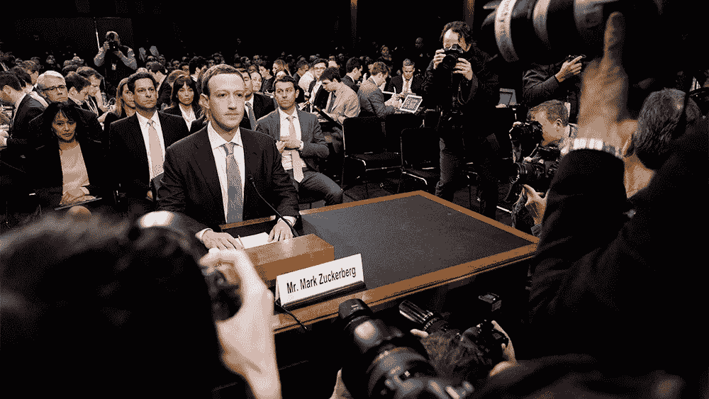
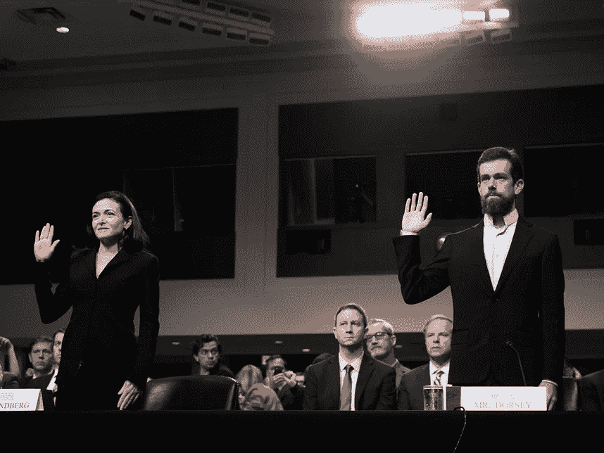
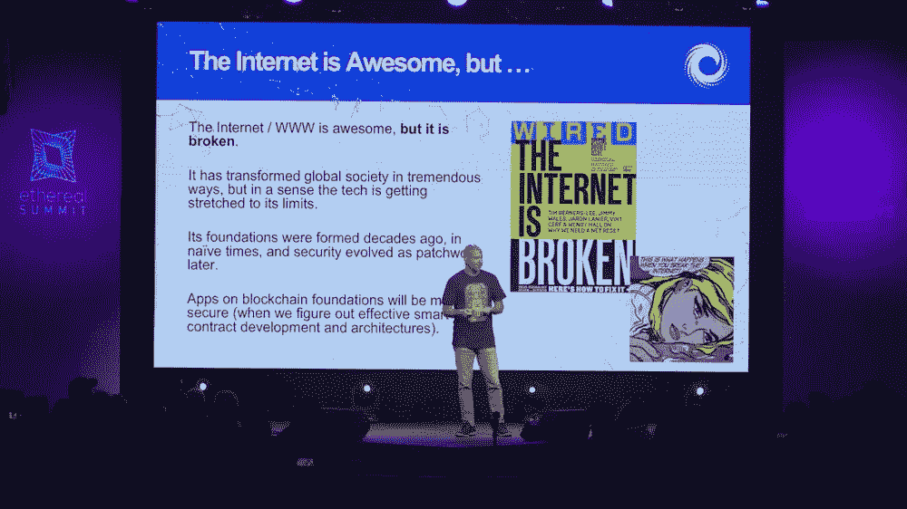
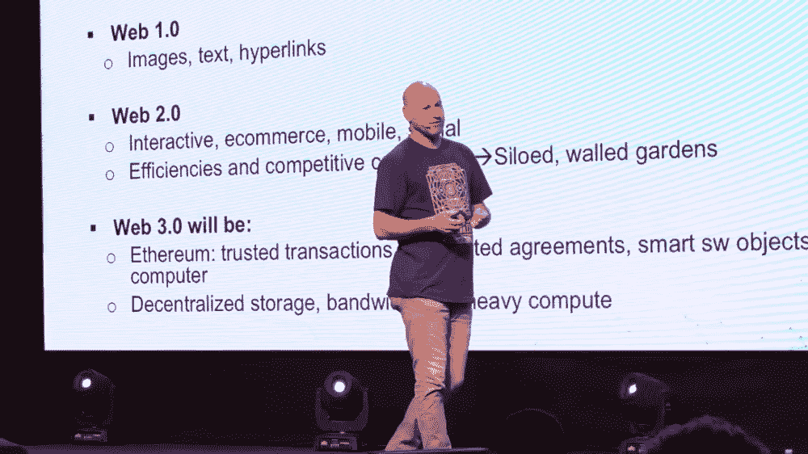
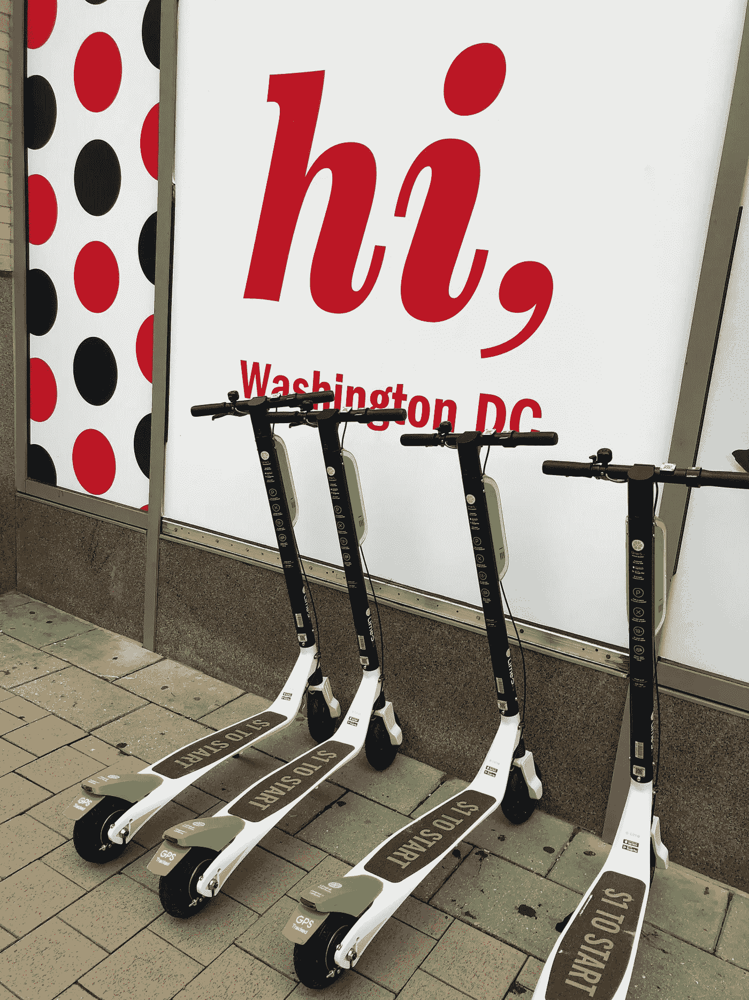

# 2018 年回顾:8 个最受关注的科技趋势

> 原文：<https://medium.com/hackernoon/2018-in-review-8-most-talked-about-in-tech-e6a60df7f838>

## 2018 年，技术是最两极分化的话题之一，从假新闻和政治，到人工智能和区块链。

## 这是一年中编辑“最佳”清单的时候，对我们的现状和发展方向进行评估。

科技和硅谷是今年新闻的主要话题之一，也是社交媒体和公共辩论中最两极分化的话题之一。

从假新闻和世界各地的政治选举到人工智能和区块链，每个人都是在线和离线对话的一部分。

# 1.假新闻

虽然假新闻是 2018 年最流行的词汇之一，但根据 Dictionary.com[的说法，今年的年度词汇是:](https://medium.com/u/520a68fa9e65?source=post_page-----e6a60df7f838--------------------------------)

> 误传。

“错误信息的猖獗传播给 2018 年的生活带来了新的挑战，”[在一份声明](https://www.dictionary.com/e/word-of-the-year/)中写道。“作为一部字典，我们认为理解这个概念对于识别野生环境中的错误信息至关重要，并最终遏制其影响。”

Dictionary.com 强调，“虽然误传这个词自 16 世纪晚期就已经存在，但随着社交媒体的兴起，信息传播的本质在过去十年经历了巨大的转变。”

误传一词——定义为“传播的虚假信息，不管是否有误导的意图”——经常与假新闻和/或“虚假信息”一词互换使用，尽管它们是不同的现象。

然而，Dictionary.com 将假新闻定义为“虚假新闻故事，通常具有耸人听闻的性质，旨在广泛分享或传播，以创造收入，或宣传或诋毁公众人物、政治运动、公司等。”虚假信息是“故意误导或有偏见的信息；被操纵的叙述或事实；宣传。”

但 2018 年无疑是假新闻一词的一年，无论它是用于错误信息、虚假信息，还是只是社交媒体上的一个普通标签。

假新闻的定义和本质继续引发围绕社交媒体的辩论。识别假新闻仍然是脸书、谷歌和推特等平台的重点，他们今天的证词(见下文的书面证词)和对众议院司法委员会的答复中强调了他们打击这一现象的行动。

在过去的一年里，关于假新闻本质的问题出现了很多次。由于假新闻与我们作为社交媒体用户的活动密切相关，平台对这一现象的反应和反击方式是更好地理解它的关键。

2018 年是国会山的科技听证会年。就连脸书的创始人兼首席执行官马克·扎克伯格、公司首席运营官雪莉·桑德伯格以及推特的联合创始人兼首席执行官[杰克·多西](https://medium.com/u/ab69c5472679?source=post_page-----e6a60df7f838--------------------------------)今年都受到了美国参议员和国会议员的盘问。扎克伯格甚至出现在伦敦和布鲁塞尔的国会听证会上。扎克伯格甚至在 T2 欧洲议会主席 T4 安东尼奥塔亚尼和欧盟议会主席会议前作证。

然而，更有趣的评论来自社交媒体公司低层官员的听证会。在 7 月国会山众议院司法委员会的听证会上，众议员普拉米拉·贾亚帕尔的一个有趣的评论引起了我的注意。

“这里的挑战是，很难准确确定什么可以被定义为虚假新闻。但对我来说，更大的问题是，不知何故，我们达成了一个标准，即真相是相对的，”她在谈到当前关于社交媒体上假新闻和错误信息的辩论时说。

> 真理不是相对的。苹果就是苹果。不可能明天是番茄，昨天是梨。这是一个苹果。

作为回应，脸书全球政策管理负责人莫妮卡·比克特(Monika Bickert)解释说，她的平台在面对这个问题时会做一些不同的事情，她是听证会上与谷歌和 Twitter 一起的三名证人之一。

事实上，脸书承认，“我们在社交媒体上看到的大部分虚假新闻往往来自垃圾邮件发送者和有经济动机的演员。”

“这违反了我们的政策，”比克特说。“我们有技术手段来检测并删除这些账户。过去几年，我们取得了很大进步。”

她补充说:“还有一些内容人们可能不同意，或者可能被广泛认为是虚假的。我们确实听到反馈说，人们不想让私人公司来决定什么是真的，什么是假的。但我们知道，如果我们认为有信号——如第三方事实检查员——表明内容是虚假的，我们可以做的是通过降级帖子并向人们提供额外信息，以便他们可以看到文章是否与互联网上其他主流来源所说的一致。”

在回答之前由众议员 Ted Poe 提出的关于假新闻本质的问题时，Bickert 强调“我们没有消除假新闻的政策。”

她补充说:“我们所做的是，如果人们将内容标记为虚假，或者如果我们的技术，或者如果评论和其他信号检测到内容可能是虚假的，那么我们会将其发送给这些事实核查组织。”

听证会早些时候提到了与脸书合作的事实核查组织。它们包括美联社、[《政治报》](https://medium.com/u/e2c91a75057f?source=post_page-----e6a60df7f838--------------------------------)、[《每周标准报》](https://medium.com/u/1ccf20179a6c?source=post_page-----e6a60df7f838--------------------------------)、FactCheck.org 和 Snopes。

“如果他们认为这些内容是假的——但没有一个人认为是真的——那么我们将减少这些内容的传播，并添加相关文章，”Bickert 说。

在议员的催促下，她再次强调:“分享虚假信息并不违反我们的政策。”

但在听证会上，关于假新闻性质的问题出现了几次，谷歌在 Youtube 的公共政策和政府关系全球负责人朱尼珀·唐斯(Juniper Downs)在回应众议员迈克·约翰逊时，确定了一个范围。

“假新闻是一个用来定义内容范围的术语，”她回答道。“一方面，我们有恶意的、欺骗性的内容，这些内容通常由巨魔农场传播。该内容将违反我们的政策，我们将迅速采取行动删除该内容和/或传播该内容的账户。在中间，你有可能是低质量的错误信息。这就是我们的算法开始提升更权威的内容和降级较低质量的内容。当然，你也听说过这个词指的是主流媒体，在这种情况下，我们什么都不做。我们在那种情况下不接受这个术语。”

# 2.科技和选举

与假新闻问题密切相关的是技术和政治之间的关系，以及社交媒体平台在世界各地政治选举中的作用。

美国的中期选举仍然是新闻周期的一部分，而欧洲选举正在迅速临近，超过 3.5 亿欧盟公民将在 5 月份投票。

社交媒体公司已采取措施改善其管理政治广告和错误信息的政策，重点是试图影响世界各地选举的国家和非国家行为者。

9 月，在由两党政策中心主办的一次活动中，脸书的全球政治和政府外联主任 T2 表示，虽然脸书已经采取措施，但它认为 2018 年的中期选举是 2020 年美国总统选举之前的“一个很好的里程碑”。

“老实说，直到 2020 年后，我们才真正能够知道我们和其他平台正在进行的变化的影响，”FCW 援引哈伯斯特的话说。“我们才刚刚开始。…这将一直是我们努力解决的问题。”

脸书网络安全政策负责人内森奈尔·格莱彻在一份声明中写道，“作为我们防止脸书在选举期间受到干涉的努力的一部分，我们与执法部门、外部专家和世界各地的其他公司保持定期联系。”。“这些合作关系，以及我们自己的调查，帮助我们在去年的许多场合发现并清除了脸书的不良分子。”

在推特上，高级公共政策经理布里奇特·科因在一份声明中解释说，“在过去的几个月里，我们采取了重大措施，通过减少虚假信息的传播，加强对政府利益相关者的外联，以及简化我们的执法流程，来维护围绕美国选举的对话的完整性。”

她补充说:“我们致力于在我们的平台上为关于选举的公众对话服务。”

展望未来，谷歌的欧盟公共政策和政府关系总监 Lie Junius 解释说，在欧洲，为了准备欧盟议会的更新选举，“为了支持这一民主进程，我们正在推出产品和程序，以帮助人们获得投票所需的信息。”

谷歌的努力包括让选民获得他们在选举过程中导航所需的信息；用更透明的广告帮助选民更好地理解他们看到的政治广告；和在线保护选举信息。

Tweet via [Mary Ritti](https://medium.com/u/d75189f1f9b6?source=post_page-----e6a60df7f838--------------------------------), Snap Inc VP of Communications.

热门社交媒体服务 Snapchat 背后的公司 Snap 显示，在美国，该平台的选民登记和参与工作取得了巨大的成果。

对于中期选举，Snapchat 在其 Snap Map 中添加了投票地点，这是其应用程序中的一项功能，可以实时显示世界各地发生的事件。

这是在今年中期选举前让 Snap 用户参与公民活动的更大努力的一部分。由于与 Turbo Vote 的合作，超过 40 万名用户(主要在 18 至 24 岁之间)注册使用该应用程序投票。

# 3.数据保密

剑桥分析公司(Cambridge Analytica)丑闻的反弹不仅对用户产生了深刻影响，他们现在比以往任何时候都更清楚自己的数据在社交媒体上是如何被使用的，还对世界各地的科技行业和政府立法者产生了深刻影响。

> “科技肯定会受到监管。或许这是最好的结果。”

这是来自 [Aaron Levie](https://medium.com/u/c72d99a62d0d?source=post_page-----e6a60df7f838--------------------------------) 的一条推文，他是 Box 的联合创始人、首席执行官和自封的*首席魔术师*。这是他在 3 月份剑桥分析公司非法获取 5000 万份美国选民的脸书资料的新闻后的首次评论。

几天后，列维又在推特上评论道:

“科技公司的责任呈指数增长，”他指出，同时承认说它们“仅仅是平台和管道”不再是一个可持续的论点。

甚至在脸书和剑桥分析公司丑闻爆发之前，万维网的发明者和网络基金会的创始人蒂姆·伯纳斯·李爵士就呼吁对大型科技公司进行监管，以防止网络被“大规模武器化”。

伯纳斯-李的声明是纪念万维网 29 周年的公开信的一部分。预言？还是只是常识？

“近年来，我们已经看到社交媒体平台上的阴谋论趋势，虚假的推特和脸书账户加剧了社会紧张局势，外部行为者干预了选举，犯罪分子窃取了大量个人数据，”他写道，并指出立法者目前的反应是“从平台本身寻找答案”——他认为这既不公平，也不太可能有效。

# 4.区块链

互联网“在很多方面都很壮观”， [Joseph Lubin](https://medium.com/u/6a370863659c?source=post_page-----e6a60df7f838--------------------------------) ，创业公司 [ConsenSys](https://medium.com/u/6c7078bf7b01?source=post_page-----e6a60df7f838--------------------------------) 的创始人和[以太坊](https://medium.com/u/d626b3859bc9?source=post_page-----e6a60df7f838--------------------------------)的联合创始人，在五月份的以太峰会上发表主题演讲时说[。“它改变了全球社会，但它已经崩溃了。”](https://hackernoon.com/the-internet-is-broken-blockchain-can-fix-it-8142f8277c50)

在他的主题演讲中，Lubin 指出了互联网和万维网背后的技术是如何“达到极限”的，安全是主要问题之一。

“它的(互联网)基础形成于几十年前，在天真的时代，”Lubin 在他的一张幻灯片中强调。"安全性后来演变成一种拼凑."

> 区块链将是 IT 安全领域的一场革命，因为针对基础设施的每一笔交易都经过了强有力的加密认证和精确授权。

Joseph Lubin on stage at ConsenSys’ Ethereal Summit 2018.

“你有一种普遍去中介化的力量”,使内容创建者、资源提供者、服务提供者能够直接接触消费者，而很少或没有中介提取价值，没有增加任何相称的价值。

ConsenSys 已经在探索这些方法，比如针对音乐的 [Ujo](https://medium.com/u/1c6cd0b77cb7?source=post_page-----e6a60df7f838--------------------------------) 、针对新闻的[Civil:Self-sustain Journalism](https://medium.com/u/af0892caae93?source=post_page-----e6a60df7f838--------------------------------)以及针对多种形式的合作、粉丝众包和粉丝策划的故事的 Cellarius。而且在服务和资源领域，将他们与消费者直接联系起来，像[假人项目](https://medium.com/u/8b0d088e8160?source=post_page-----e6a60df7f838--------------------------------)、 [SONM](https://medium.com/u/e3aa487333b3?source=post_page-----e6a60df7f838--------------------------------) 、[考利团队](https://medium.com/u/f32dd25840e?source=post_page-----e6a60df7f838--------------------------------)、 [Swarm](https://medium.com/u/1c28b7c1f579?source=post_page-----e6a60df7f838--------------------------------) 、 [Storj Labs](https://medium.com/u/31bb19d6e641?source=post_page-----e6a60df7f838--------------------------------) 、[盘古](https://medium.com/u/7d9a5f7f05c0?source=post_page-----e6a60df7f838--------------------------------)等许多其他项目。

这构成了 ConsenSys 及其项目网的 Web 3.0，具有可信交易、自动化协议和以太坊上的智能软件对象、单一世界计算机、单一执行空间；以及其他协议，如分散存储、分散带宽和繁重计算。

> 所有这些都将使我们作为人和公司能够更加流畅地进行互操作。

在某种程度上，Web 3.0 将互联网作为一种去中心化的架构带回了起点。

“但是效率和对财富的追求导致了封闭的围墙花园，”Lubin 在幻灯片中强调。"这是由于缺乏共享开放平台所有权的机制."

> Web 3.0 是我们刚刚处于的风口浪尖。Web 4.0 将会非常有趣。

Lubin 提到 Web 4.0 是“我们刚刚开始考虑的东西”在这个系统中，人工智能代理通过区块链和令牌被赋予价值。“机器经济的互联网将会非常有趣，肯定会在你附近的区块链出现，”他说。

> 基本上，在 1-2-3 年内，我认为区块链会变得无处不在。现在还不是真的。

# 5.AI 为好

人工智能和机器学习代表了技术领域最令人兴奋的趋势之一:虚拟助手、自动驾驶汽车、自学习算法。这些是许多科技公司和初创公司在推动创新方面面临的挑战。但人工智能批评者的数量正在成倍增加，因为这些技术也有黑暗的一面。

2018 年是人工智能的关键一年，因为人们对人工智能对社会和人类活动的影响的担忧越来越多，甚至在大型科技公司内部也是如此。信任也是一个大问题，因为一些人认为，最近对人工智能的热潮可能表明，我们正在把理性的钥匙交给机器。

然而，像谷歌、微软和亚马逊这样的公司现在正在探索将人工智能用于社会公益和人道主义项目和援助的方法。

谷歌是最新一个进入这个被一些人称为永久人工智能的领域的公司。该公司在 11 月宣布了其 *AI Impact Challenge* ，将在 2019 年向寻求使用人工智能加快和发展努力的人道主义和环境项目提供约 2500 万美元的全球资助。

路透社指出，“专注于人道主义项目可以帮助谷歌招募人员，并通过展示其对机器学习的兴趣超出其核心业务和其他利润丰厚的领域，如军事工作，来安抚批评者。”

今年早些时候，在遭到员工的严厉和公开反对后，谷歌宣布不会续签一项在基于人工智能的程序中分析美国军用无人机镜头的协议。

谷歌人工智能首席运营官伊琳娜·考夫曼告诉路透社，新的人工智能公益项目不是对今年早些时候发生的事情的反应，而是指出，成千上万的员工渴望为“社会公益”项目工作，尽管这些项目通常不会直接产生收入。

另一方面，微软只是默默地宣布，它将向美国军方和情报机构出售他们需要的任何先进技术，“以建立强大的防御”，包括其机器学习和人工智能工具。

微软总裁布拉德·史密斯在博客中写道:“我们希望这个国家的人民，尤其是为这个国家服务的人们知道，我们微软是他们的后盾。”。“他们将获得我们创造的最佳技术。与此同时，我们意识到技术正在创造新的伦理和政策问题，这个国家需要以深思熟虑和明智的方式来解决这些问题。这就是为什么我们作为一家公司参与这些问题的公共对话非常重要。”

面对越来越多的批评，微软最近推出了一系列新的人工智能项目，总额为 1.15 亿美元，包括让人工智能为我们星球的未来服务的新项目 *AI for Earth* ，以及新的 4000 万美元的五年期项目 *AI for Humanitarian Action* ，该项目利用人工智能的力量专注于四个优先事项——帮助世界从灾难中恢复，解决儿童的需求，保护难民和流离失所者，以及促进对人权的尊重。

# 6.GDPR

从哪里开始？

GDPR 是 2018 年最著名——也是最臭名昭著——的缩写之一。科技行业的每个人，不管是好是坏，都听说过它，致力于实施它，或者研究它在世界各地的立法和监管意义。

Tweet via the [European Commission](https://medium.com/u/960f4c0ad987?source=post_page-----e6a60df7f838--------------------------------).

GDPR 代表*通用数据保护条例*，一项新政策于五月底在欧盟生效。GDPR 过去和现在都对欧洲互联网企业的运营产生了重大影响，无论它们是大是小，位于何处，是否在欧盟境内运营。

《连线》甚至[也写道](http://www.wired.co.uk/article/facebook-mark-zuckerberg-congress-testimony-cambridge-analytica-gdpr-privacy):“一旦被嘲笑，欧洲新的数据保护已经成为大西洋彼岸嫉妒的来源。”“当 GDPR 法案第一次通过时，美国评论家认为这是一种嫉妒的保护主义，”罗兰·曼索普(Rowland Manthorpe)解释道，并引用了《纽约时报》(New York Times)的一篇社论(现在呼吁制定类似的规则)。

“新的欧洲规则并不完美——它们包括所谓的被遗忘权，这种权利允许人们要求公司删除他们不再希望分享的个人信息，”这篇社论写道。“但欧洲人在解决美国最近凸显的一些问题方面取得了进展。”

GDPR 规则甚至在 DC 国会山的许多技术听证会上被提及，包括脸书的马克·扎克伯格的听证会。

Via [Stefan Becket](https://medium.com/u/a9c05e1fab37?source=post_page-----e6a60df7f838--------------------------------) on Twitter

扎克伯格听证会笔记的照片甚至在网上疯传。它显示了扎克伯格的法律和公共政策团队提供给扎克伯格的笔记，包括总法律顾问科林·斯特里奇、美国公共政策副总裁乔尔·卡普兰；首席隐私官艾琳·伊根；[米里娅·乔丹](https://medium.com/u/e25576ea95fe?source=post_page-----e6a60df7f838--------------------------------)，国会事务公共政策主任；合规副总法律顾问 Pearl Del Rosario 公共政策主任布莱恩·赖斯。

这份备忘录包括了大量话题和问题的谈话要点，包括俄罗斯的干涉和选举诚信、多样性、竞争和隐私……甚至包括脸书对苹果公司蒂姆·库克关于公司商业模式和领导力的评论的反应。

在注释中，当涉及到隐私时，新的欧洲 GDPR 法规相当突出。

笔记建议扎克伯格:“不要说我们已经做了 GDPR 要求的事情。”

Lime electric scooters in Washington DC.

# 7.移动和共享经济

正如我在 11 月份写的那样，我不明白城市和通勤者对无码头电动滑板车和自行车共享初创公司的爱恨情仇，比如 [LimeBike](https://medium.com/u/881e39a1e63a?source=post_page-----e6a60df7f838--------------------------------) 、Bird，现在甚至还有 [Lyft](https://medium.com/u/54708edc644b?source=post_page-----e6a60df7f838--------------------------------) 和[优步](https://medium.com/u/b97b1b381b5a?source=post_page-----e6a60df7f838--------------------------------)。

我当然不同意埃隆·马斯克的观点，在与卡拉·斯威舍的播客中，他说滑板车“缺乏尊严”

尊严？

我是一名自行车手，我看到了这些新的最后一英里交通方式可以给我们的城市带来的好处。它们有助于减少拥挤和交通；他们绿化我们的环境；它们限制了我们的通勤时间，而且很有趣。此外，骑自行车是一种非常健康的出行方式，同时，自行车和踏板车，无论有无停靠，都非常实惠。

当然，有利也有弊。教育踏板车使用者——使用头盔，限制未成年人使用，遵守交通法规——并与城市和地方管理部门合作是让这种新模式为每个人服务的关键。但同样重要的是，在我们仍然赖以生存的工业革命电网和计划之外，重新思考我们的城市，汽车仍然主导着我们的交通系统，行人不得不适应汽车主导的局面。通常，骑自行车的人甚至不是这种流动性等式的一部分，城市很难适应新的，创新的通勤计划。

城市不擅长扰乱系统，远离现状。城市不擅长做创业公司运营。但是他们应该。

 [## 提高城市流动性的 12 种方法

### 作为一名骑自行车的人，我希望我们的城市能从市民的角度重新思考交通网络，而不是汽车或公司。

medium.com](/swlh/12-ways-to-improve-mobility-in-our-cities-1827f245bf7d) 

# 8.AIRBNB 10 岁

4 月，在 Airbnb 成立 10 周年前夕， [Airbnb Citizen](https://medium.com/u/9046b133b73f?source=post_page-----e6a60df7f838--------------------------------) 启动了[健康旅游办公室](https://press.airbnb.com/airbnb-launches-global-office-of-healthy-tourism/)，“这是一项在全球各国和各城市推动本地、真实和可持续旅游的举措。”

随着该办公室的推出，Airbnb 还发布了数据，显示健康旅游对世界各地的东道主、客人和城市的好处，并宣布成立新的旅游顾问委员会，该委员会将由世界各地的旅游业领袖组成。

Airbnb 全球政策主管[克里斯·勒汉](https://medium.com/u/7e2fea5be5c4?source=post_page-----e6a60df7f838--------------------------------)在一份声明中说:“随着旅行和旅游业的增长速度超过经济中的大多数其他领域，让尽可能多的人受益是至关重要的——现在并不是所有的旅游业都是平等的。”。“为了让旅行的好处大众化，Airbnb 为困扰城市几十年的大众旅行提供了一种健康的替代方式。Airbnb 支持本地、真实、多样、包容和可持续的旅游。通过我们的全球主机社区马赛克赚取的有意义的收入；我们向最需要的地方推广旅游业的能力；以及托管的内在可持续利益，Airbnb 提供了最适合目的地、居民和旅行者的旅行类型。”

# 2018 特别提及

## 媒介出版的第一本书

在 [Medium](https://medium.com/u/504c7870fdb6?source=post_page-----e6a60df7f838--------------------------------) 上发布的一份科技领域最受关注的列表中，不得不提到 Medium 本身。

10 月，Twitter 联合创始人 Ev Williams 创办的出版平台出版了其第一本书，这是一本关于科技的讽刺小说，作者是谷歌前通信主管杰西卡鲍威尔。

这本书名为《大颠覆:一个完全虚构但本质上真实的硅谷故事》，是一本小说，不是谷歌的全部。它“从一个大部分职业生涯都在这个行业中度过的人的角度审视硅谷，”埃里克·约翰逊在《再编码》上写道。

 [## 大破坏

### 一个完全虚构但本质上真实的硅谷故事

disruption.medium.com](https://disruption.medium.com/) 

“就个人而言，[我]有一种感觉，好像和我共事多年的人会认为我背叛了他们，”鲍威尔告诉 Recode。“但我从未想过我正在写一本关于他们或他们的书……这比那要广泛得多。”

正如《T2 卫报》T3 指出的那样，“*大颠覆*仍然是一个 9 万字的标语，应该让任何有点反思的科技工作者至少在认可时傻笑。”