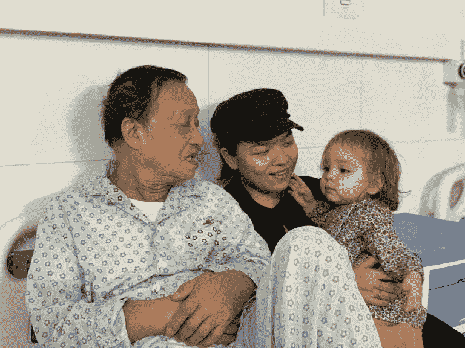

# 2018 反映:股权众筹，乌云背后，奶奶。

> 原文：<https://medium.com/hackernoon/2018-reflected-b289fc758404>

随着 2018 年即将结束，我想我应该花一些时间来反思我在 2018 年学到的两个最重要的教训，第一个是关于股权众筹成功的预测，第二个是关于艰难时期的一线希望。

第一课:股权众筹很强大，也很有力量，但并不适合所有人。当你的业务是 1 时，这是最有意义的。面向社区和 2。独立拥有。

*为什么面向社区？*

自推出以来，【startengine.com/hackernoon】的[已经吸引了 38000 次访问，>其中 85%来自黑客正午社区。我们将活动链接放在 hackernoon.com、时事通讯、社交媒体渠道和其他媒体资产的顶部。很明显:我们的社区确实团结在我们身后。总的来说，他们在告诉我们:请继续为技术专业人士发布最好的技术故事！](http://startengine.com/hackernoon)

我们有什么关系？我们不是下一个很酷的软件、行业颠覆或开创性的想法。我们确实有 20 万每日读者、7 万作者和 800 万每月浏览量。我相信，区别在于:已经知道并使用我们网站的人现在可以拥有我们公司的一部分。体验的接收者现在可以帮助设计体验。你多久会有机会拥有你所阅读的网站的一部分？这是相当该死的授权。

你可以是一家小而受欢迎的餐馆，一个脸书的“办公室粉丝”团体，或者一所学校。如果你已经有了一个很棒的社区，众筹可能是一个不错的选择。

*为什么要独立拥有？*

在决定发起这项活动之前，我们确实进行了几次收购谈判。这个过程很辛苦，但却极具教育意义。许多人对此感兴趣，但没有人准备好用正确的条款承诺正确的数字。大公司希望以自己的方式获得高额回报。像我们这样的小公司很少能负担得起我们自己的条件。

有了股权众筹，我们公开了我们的条款，前面和中间，可供公众剖析。潜在投资者可以选择他们能够承受的损失。最低价格是两人一顿大餐的价格。而是找到公平的市场价值。

现在，我们不是有几个大老板，而是有几百个小老板，其中一些是我们的家人和朋友，大多数是我们的读者和作家。太美了。

作为一个独立的媒体网站，我们高度重视这种对既得利益的独立性。它使我们能够优化我们的工作流程和我们想要的产品。这是一个双赢的局面。

第二课:在艰难时期，珍惜一线希望。

> 我一直喜欢荷花。它是越南的国花，从泥土中绽放。莲花让我想起了力量，韧性，克服一切困难的美丽。

就个人和职业而言，今年对我来说是艰难的一年。[就在我们被告知赞助在黑客正午](https://hackernoon.com/david-fell-into-the-pit-6cbb1f0b6726)不再存在之前，大卫遇到了意外。然后，这个众筹活动一发起，我奶奶就在地球的另一边得了重病。她在最后一次见到我或大卫，第一次见到她的曾孙女之前就去世了。

**然而，在这些艰难的时刻，我找到了一个又一个恩典。**

大卫的事故让我重新思考如何在个人和职业之间游走。作为企业主，我们愿意将自己生活中的多少时间出租出去？到最后，我们决定变得脆弱和诚实。人们似乎与此相关。假装我们不是真正的人是没有用的，我们过着如此完美的生活，我们唯一的工作就是为生意奔波。亚历克西斯·奥哈尼安称之为色情骗局，我完全同意。# stopwiththehustleporn

被告知我们不能再在我们的网站上做赞助很难接受，因为这是我们的主要收入来源。但这确实导致了我们今年迄今为止最好的决定:拒绝可笑的收购要约，低价收购要约，甚至有点有趣的收购要约。相反，我们决定硬着头皮进行战略投资。我们离完全认购还有很长的路要走。但是，如果我们继续使用 Medium 的内容管理系统，我们的处境会比现在好得多。

我奶奶的去世提醒了我生命是多么的短暂和脆弱。而我爷爷[还健在](https://www.facebook.com/photo.php?fbid=10155727431030653&set=pcb.10155727435440653&type=3&theater)多珍贵啊，刚好够看孙女。我奶奶永远都做不到。我的父亲[是一名职业小提琴手](https://www.youtube.com/watch?v=vuGNhF2kUDg&list=PLpN0AJEvREMGCRaIbF81P2q2a1s5ORlvI)，他放弃了每天 100%的义务去照顾我们的女儿诺拉。这使得我们比在科罗拉多州时每天工作更多的时间。在美国呆了两年半之后，我们终于回到了越南，看到了在地球的另一端，越南的社区是如何繁荣的，技术是如何发展的，上周六参加我们在[举办的活动](https://www.facebook.com/media/set/?set=a.2493185494241917&type=1&l=d44bf7a1bd)的 75%的人都读过《黑客正午》！我知道我奶奶会很高兴知道这一切都是因为她而发生的！

如果你读到这里——谢谢。如果你决定点击我们众筹页面上的投资按钮，请记住这一点:在这些文字、这些数字和这项业务背后，我们是真正努力工作、积极思考的人。我们希望能见到你们每一个人。我们无法表达我们的感激之情。为了你，我们每天会越来越努力。

继续向上，到 2019 年！