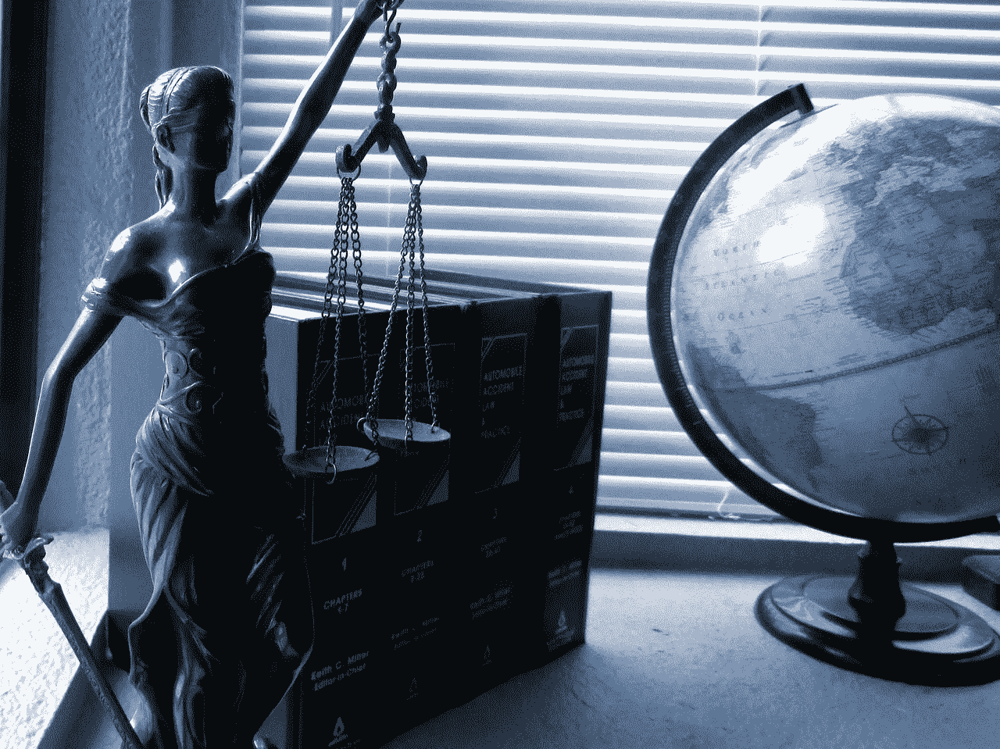
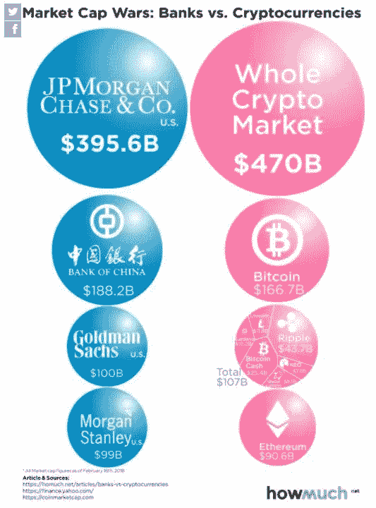

# 2018 年:加密货币监管年

> 原文：<https://medium.com/hackernoon/2018-the-year-of-regulations-for-crypto-currencies-22730462789e>

## 作者:夏晨

目前，世界各地的监管者都面临着同样的问题。我们应该如何监管加密资产？这个令人难以置信的问题背后的原因是，从大宗商品到衍生品，代币的性质各不相同。

**美国监管机构**

例如，美国证券交易委员会(SEC)将加密货币标记为证券。另一方面，商品期货交易委员会(CFTC)将加密资产认定为商品。CFTC 提出[比特币](https://hackernoon.com/tagged/bitcoin)与黄金的相似度大于证券；政府既不支持它，也不会承担责任。奇怪的是，监管反洗钱/KYC 的机构金融犯罪执法网络(FINCEN)和美国外国资产控制办公室(OFAC)将加密货币视为货币。

加密货币的最后一个标签是财产，由美国国税局(IRS)提供。不足为奇的是，在这种情况下，财产的定义不是建筑，而是一种需要纳税的收入形式。

**新加坡监管机构**

2018 年 11 月 30 日，新加坡金融管理局(MAS)针对加密货币采取了一种有趣的方法。新加坡金融管理局建议数字代币发行者/交易所检查每个代币的特征，而不是给它们贴标签。新加坡金融管理局发布的《数字代币发行指南》列举了 11 个案例研究，说明证券法对数字代币发行者和交易所的适用性。

如果代币不属于 11 个案例研究中的任何一个，这是否意味着项目所有者不能发行代币？简单的回答是没有。

最长的答案是，代币发行人有责任寻求法律建议，并在开始代币发行之前遵守 SFA 下的招股说明书要求(如果适用)。此外，法律咨询必须由新加坡合格的律师提供。

数字令牌发行者和交易所还应了解指南中提到的支付服务法案。一旦该法案获得通过，将为数字代币发行者/促进者建立一个许可证制度；该许可证将通过要求他们实施降低风险的程序来解决洗钱和恐怖主义风险。

**世界其他地方**

世界各国领导人参加了 G20 峰会，并在可持续经济增长的讨论中提出了加密货币的话题。整个加密市场目前价值 4700 亿美元，远远高于世界上的主要银行(参见图 1)。它可能不一定会成为泡沫，但加密市场的波动可能会对传统的资本/外汇市场产生影响。因此，峰会成员承认全球金融基础设施正变得更加数字化，并寻求对加密货币和区块链业务采取更强有力的措施。此外，有人呼吁政府对加密资产和交易制定更明确的税法。

图 1

来源:CoinTelegraph，比特币杂志，howmuch.net， [MAS](http://www.mas.gov.sg/~/media/MAS/News%20and%20Publications/Monographs%20and%20Information%20Papers/Guide%20to%20Digital%20Token%20Offerings%20last%20updated%20on%2030%20Nov.pdf) & [CNP Law](https://www.cnplaw.com/clientupdate/clientupdate18-07.html)

请访问 [www.blockasia.io](http://www.blockasia.io) 了解亚洲和世界各地的更多区块链和加密货币新闻。

请关注我们今天在 Facebook.com/BlockAsia.io[和 Twitter.com/block_asia](https://www.facebook.com/BlockAsia.io/)[的最新动态！](https://twitter.com/block_asia)

*原载于 2018 年 12 月 6 日*[*www . block Asia . io*](http://www.blockasia.io/2018-the-year-of-regulations-for-crypto-currencies/)*。*