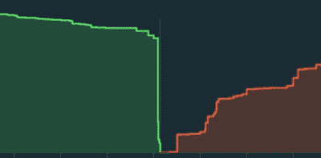
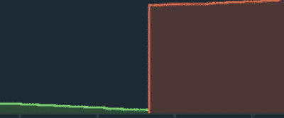
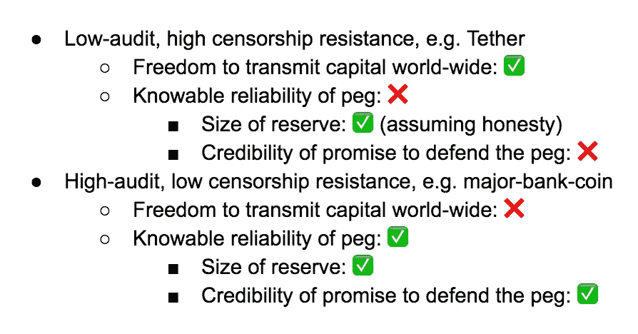

# 2018 年——稳定之年

> 原文：<https://medium.com/hackernoon/2018-the-year-of-the-stablecoin-6a6ca5d3637b>

Stablecoin article images are always rocks precariously stacked. C’mon guys, this is what we’re after!

2018 年是[稳定的一年](https://hackernoon.com/tagged/stablecoin)。(如果你不熟悉这个术语，先读读我的朋友哈齐布·库雷希的[这篇精彩的总结](https://hackernoon.com/stablecoins-designing-a-price-stable-cryptocurrency-6bf24e2689e5)。)最近，一些稳定币已经筹集了大量资金，给人的印象是稳定币问题一定会得到解决。毫无疑问，至少有一个已经集体筹集了数亿美元的项目，或者几十个仍在隐藏中的项目之一，会产生一个有效的解决方案……对吗？

我觉得这种印象是一种错觉。许多人已经忘记了过去著名的稳定币尝试，其中[有](https://coinmarketcap.com/currencies/nubits/) [失败](https://coinmarketcap.com/currencies/bitusd/)。(随着这些尝试，我们认为 [Tether](https://coinmarketcap.com/currencies/tether/) 是一个失败，因为它在生态系统中缺乏信任，并推测如果它是一个值得信赖的解决方案，Tether 的市值将会高得多。)我相信，许多现有的尝试也可能会失败。多年来，加密生态系统的领导者们已经意识到需要一个稳定的核心。创造获胜的稳定硬币的经济动机是巨大的。这种类型的经济协议设计很难——如果容易的话，几年前就已经解决了。

有人说，这些新项目将更新他们的计划，复制彼此的工作，并在启动前全部落实功能协议。我认为这过于乐观了。由于经济协议[的设计](https://hackernoon.com/tagged/design)很难，一个没有知识的团队在几个月的时间里设计出一个没有缺陷的协议，可能无法理解所有需要理解的东西，从而做出所有相关的最终设计决策，并得到一些功能性的东西。如果一个团队为一个新的智能合约平台设计了一个有缺陷的共识机制，但相信它足以筹集数百万美元，你会相信他们会在以后修复这些缺陷吗？即使这些团队拥有成功所需的知识，在许多情况下，当他们向数十或数百名投资者预先出售的令牌与他们最终需要建立的令牌并不完全相似时，他们会发现自己陷入困境，这要求他们违反或重新谈判法律和社会合同，以便转向。

为了正确评估哪些 stablecoin 设计有可能成功——业界现在确实需要能够做到这一点——你需要理解一些重要的原则，并愿意花大量时间应用它们。

# 汇率挂钩

迄今为止提出的每一种稳定货币设计都是在实施汇率挂钩，即一种货币与另一种货币的汇率保持稳定。为了评估稳定的货币设计，理解汇率挂钩的基本原理是很重要的。

中等收入国家通常将其货币与更突出的货币挂钩，以保持稳定的购买力。所以从某种意义上来说，stablecoins 只是一种被移植到新领域的旧技术。

为了理解货币挂钩，你需要三个背景概念:买墙、卖墙和套利。

买入墙是指市场参与者愿意以单一价格买入大量资产。例如，假设 Alice 愿意在 GDAX 上以当前市场价格购买高达 100 万 BTC，比如每只 10，000 美元，也就是说，她已经以 10，000 美元的价格提交了 1，000，000 BTC 的限价单，而最近的交易也是 10，000 美元。现在假设鲍勃想在 GDAX 上以他能得到的最好价格卖出 1000 BTC。他发布了 1，000 BTC 的市场卖单。爱丽丝和鲍勃将被匹配，爱丽丝将以每人 10，000 美元的价格购买鲍勃的所有 1，000 BTC。爱丽丝还有 999，000 个 BTC，每个 10，000 美元。如果卡罗尔想以最好的价格卖出 1，000 个 BTC，她也将与爱丽丝匹配，爱丽丝现在还有 998，000 个待售。市场价格——最近交易的价格——将保持在 10，000 美元。直到市场参与者将总计 100 万 BTC 卖给爱丽丝，市场价格才会下降。买入墙得名于它在[市场深度](https://en.wikipedia.org/wiki/Market_depth)图中产生的形状:

A buy wall on GDAX — hard to move the market price downward

一个**卖出墙**和一个买入墙是一样的，但方向相反。它不是阻止市场价格下跌，而是阻止它上涨:

A sell wall on GDAX — hard to move the market price upward

套利是一个简单但有时会被误解的概念。不仅仅是指低买高卖；意思是同时低买高卖*。假设大卫可以在 GDAX 上用 10，000 美元买 1 辆 BTC，同时*在 Gemini 上用 10，100 美元卖出 1 辆 BTC。他在 BTC 获得了同样的职位，赚了 100 美元。他在 GDAX 上的买入将提高市场价格(只要没有卖出墙)，并降低 Gemini 上的价格(只要没有买入墙)。这一简单的行动伴随着强大的经济激励，使 BTC 所有交易所的价格保持相对一致。**

*如果我刚才说的没有意义，你会想谷歌一下，花点时间思考，再读几遍，问问你的朋友，或者其他任何需要做的事情，直到你可以通读它，并有“是的，有意义”的体验，然后剩下的事情就会增加。请花时间做这件事！我们需要更多能够清晰思考稳定问题的人:)*

*为了将货币 A 与货币 B 挂钩，一方只需要做两件事:(1)在单个交易所的货币 A 和货币 B 之间的市场中维持买入墙，以及(2)在该交易所的货币 A 和货币 B 之间的市场中维持卖出墙。这些买卖墙保持交易所的市场价格固定，只要该方没有用完货币 A 或货币 b。如果其他交易所在任何给定时间点具有不同的市场价格，套利者将同时在一个交易所买入，在另一个交易所卖出，以赚取无风险利润。这使得其他交易所的市场价格更接近该方维护买卖墙的交易所，但它不会移动具有买卖墙的交易所的价格，因为它们阻止它移动。因此，货币 A 和货币 B 之间的市场被带到了与有买卖墙的交易所相同的价格。*

*现在我们可以问:钉子什么时候断裂？答案很简单:当党耗尽货币来维持一个买或卖的墙。一旦两边都没有墙，市场价格就会向那个方向移动，就像 BTC 的情况一样。*

*钉子会断吗？是啊！历史上到处都是断钉。例如，泰铢(以及其他几种货币)在 1997 年亚洲金融危机中的表现，以及 T2 货币的价格历史。*

*当一个国家将其货币与另一种货币挂钩时，它是这样做的:( a)持有外汇储备，并用它来维持本币在某一特定价格的买入墙，以及(b)铸造尽可能多的本国货币，以维持相同价格的卖出墙，无论它与哪种外币挂钩。(b)是比较容易的部分，因为央行可以随心所欲地铸造本国货币。(a)是困难的部分——当它耗尽外汇，或决定不再用外汇储备来捍卫钉住汇率制时，它就不能再维持购买墙，这就是导致钉住汇率制崩溃的原因。*

*这意味着，要想预测传统的盯住汇率制度能否维持下去，人们只需了解它的两个特征:*

1.  *该方持有的外汇总价值*
2.  *该党是否会选择用这些货币来维持购买墙*

*一个更重要的细微差别是，为了将货币 A 与货币 B 挂钩，一方不一定需要持有货币 B 作为储备。它可以持有任何具有流动性和可进入市场的有价值资产。例如，一个国家可以持有黄金，以便将其货币与美元挂钩。只要它总是愿意用价值一美元的黄金来换取一个单位的本国货币(按照目前黄金的美元市场价格)，它就能够将其货币价格稳定在 1 美元。*

*再一次，我鼓励你尽你所能去阅读前面的部分，并对每一个主张感到完全舒服。上面这个简单的两件式框架对于思考任何新的 stablecoin 提案至关重要，并帮助 [Reserve](http://reserve.org) 团队分析了我们发明和遇到的几十个潜在设计。*

# *三种常见的稳定连接方法*

*再一次，每一个现有的稳定币提案都是在实行钉住汇率，通常是钉住美元。稳定一种[浮动货币](https://en.wikipedia.org/wiki/Floating_exchange_rate)的购买力的工作[要复杂得多](https://en.wikipedia.org/wiki/Inflation_targeting)，而且很可能不会很快适合智能合约的自动化，如果有的话。*

*在货币政策中，有一个关于“规则与自由裁量权”的价值的长期辩论——是允许人类自由选择如何管理货币供应更好，还是提前制定固定规则并严格遵守它们更好。像美国这样通过操纵利率(以及其他方式)来改变购买力的国家需要做出一系列复杂的决定，而这些决定往往需要谨慎。将本国货币与其他主要货币挂钩的国家通常有所谓的“货币局”，它只是维持储备，并用储备来买卖本国货币——这一过程更容易编纂，因此可以自动化。*

*当考虑任何给定的稳定币是否会工作时，将其设计转化为这些概念是非常有帮助的。让我们看看到目前为止已经提出的三种稳定货币的主要方法，并把它们翻译成货币经济学的语言。为简单起见，我们假设所有稳定的货币都打算与美元一对一挂钩。*

# *传统资产担保债券*

***最突出的例子:系绳***

*传统的资产支持稳定币很容易描述，在实践中只会变得复杂。发行者以每张 1 美元的价格出售代币，并将出售所得的所有美元储存在银行账户中。任何时候，只要有人愿意，他们都可以向发行者兑换代币。这种设计最好带有可信任的审计机制，比如 Trust Token 用于 [TrueUSD](https://www.trusttoken.com/trueusd/) ，以便让持有者确信钱在那里。*

*这意味着发行者可以在任何时候维持一个等于 100%稳定流通货币供应量的购买墙。如果它是一个值得信赖的行为者，而且事实上维持了购买墙，它就可以实施一个完美的货币挂钩。这种制度很像香港的货币发行局制度，传统上，香港一直保持着非常高的美元储备，并且在我们前面提到的亚洲金融危机中安然度过风暴，在这场危机中，许多联系汇率制度被打破。*

*但实际上，传统的资产支持稳定债券存在两个核心问题:*

1.  *交易对手风险——如果发行方在某个时候选择不维持买入墙，该怎么办？标题“加密公司携 30 亿美元资产潜逃”听起来并不太牵强。我们认为，最好的传统资产支持债券将由可信的银行发行，也可能由可信的政府发行，这两者都能很好地解决这个问题。但即使是银行和政府在世界各地也不被信任。*
2.  *政府干预的风险——如果当地政府决定冻结资产，或者强大的外国政府决定对发行人施加压力，该怎么办？各国政府在防止洗钱方面拥有成熟的能力，过去洗钱曾被用来关闭多种虚拟货币。(下面是[一些有趣的相关阅读](https://blog.bitmex.com/tether/)。)在实践中，这可能不会达到资产扣押的阶段，可能只会导致发行人一次又一次地失去银行关系，因为银行希望得到当地政府的青睐。*

*这两个核心问题造成了根本性的紧张:*

*   *审计机制越好，动用外汇储备来维持“购买墙”从而捍卫联系汇率制的承诺就越可信，但政府找到并冻结资产的工作也就越容易。*
*   *审计机制越糟糕(一直到不提供任何审计和对银行关系保密，甚至不告诉银行他们持有加密公司使用的资产)，政府就越难找到和冻结资产，但市场就越难评估发行人的偿付能力和维持购买墙的能力。*

*如果用户都必须通过 KYC 过程，这将大大限制令牌允许资金跨境自由流动的可行性。*

*这为我们提供了传统资产支持的稳定债券如何发挥作用的以下细分:*

**

*我们认为这两种结果都不会成为新的全球储备货币。不值得信任的选项显然是不可能的。值得信赖的选择并不服务于 BTC 除了投机以外的主要用途:跨境自由转移资金。为了取代美元，成为新的储备货币，我们认为跨境自由转移至关重要。*

# *抵押债务稳定债券*

***最突出的例子:创客道***

*抵押债务稳定币为资产持有人提供了一种方式，让他们可以获得由他们的加密资产支持的贷款，然后这些加密资产成为系统中的抵押品。用户可以将加密资产存入智能合约，然后智能合约会为他们铸造一种新的稳定币。稳定币的价值必须低于抵押品，因此，假设用户存入价值 2 美元的 ETH，并收到目标价格为 1 美元的稳定币。用户现在可以把稳定的收入花在商品和服务上，而不必放弃他们在 ETH 中的位置。当他们希望他们的钱回到他们的控制之下来消费或交易时，他们不得不偿还他们的稳定的货币贷款来收回这些钱。一个常见的用例是在加密资产上进行[保证金交易](https://www.investopedia.com/university/margin/margin1.asp)；用户可以用 1 美元的稳定币购买 ETH，然后持有价值 3 美元的 ETH，而不是仅仅价值 2 美元。如果 ETH 升值，他们会赚得更多，如果 ETH 贬值，他们会损失更多。*

*即使你理解了你刚刚读到的内容(如果你不熟悉这一特定领域，这将花费你几分钟时间)，接下来一个很好的问题是:在所有这些中，联系汇率制在哪里？在创客体系中，有三个答案。*

***首先**，更容易理解的是，如果所有被锁定的抵押品的价格开始快速下跌，或者发生了其他不可靠的事情，一群拥有特殊权利的人可以选择关闭系统。如果他们这样做了，所有稳定币持有者都可以用他们的硬币换取价值 1 美元的附属加密资产。(系统可以再次启动，但不会永远消失。)由于这一承诺的存在，理论上，投机者将希望在稳定的硬币低于 1 美元时购买它，以便能够(a)在二级市场价格回升时以 1 美元出售它，或者(b)在这种逐渐减少的情况下以 1 美元的抵押资产赎回它。理论上，这些投机者会以略低于 1 美元的折扣价提供一堵买入墙，只要他们有资本，就会维持联系汇率。*

*这种机制的问题在于，在投机者真正押注之前，很难判断他们手中有多少可用资本。因此，实施购买墙的隐含储备可能很大，也可能不大，而且可能会根据市场情绪和要求或激励投机者将资本转移到其他地方的事件而随时变化。毕竟，他们不是负责维持联系汇率的尽职尽责的货币局，他们是寻求利润的投机者，而这种押注需要在可能很长一段时间内分配资本。*

***第二个**，如果被锁定的抵押品价值足够低，系统将开始自动平仓抵押贷款。它通过使用一些抵押品在拍卖中重新购买稳定的硬币代币，销毁稳定的硬币代币，并将剩余的抵押品返还给原始债务人。*

*然而，无论稳定币的市场价格是多少，协议都必须这样做，因此这将对稳定币价格提供不加选择的向上压力，而不是在目标价格的买入墙。假设抵押品不会很快贬值(这可能是一个问题)，这一机制的主要问题是，在对稳定硬币的需求可能上升的时候——当其他加密资产价格下降的时候，它会减少供应，提高稳定硬币的市场价格。这意味着市场*和*系统将同时推动价格上涨，而不是将价格带到目标价格。*

***第三个**，比前两个更微妙的是，每当债务人在获得贷款后出售他们的稳定资产，他们就有动机回购稳定资产，并在任何时候以低于卖价的价格偿还贷款。假设你存了 2 美元的 ETH，收到 1 美元的 stablecoin，并以 1 美元的价格卖出。然后稳定硬币的市场价格下降到 0.95 美元。现在你可以以折扣价回购稳定币，关闭你的贷款(这破坏了稳定币)，并收回你的 2 美元，获得 0.05 美元的免费利润。每个债务人都有这种动机。因此，只要所有债务人都以 1 美元卖出了他们的稳定债券，这就提供了一个在 1 美元以下的买入墙！*

*第三种机制的问题是，不是所有的债务人都会打开他们的抵押贷款，以 1 美元的价格出售他们的稳定币。如果他们以不同的价格出售，比如 0.95 美元或 1.05 美元，他们会有相同的动机，但相对于其他价格而言。因此，这种机制不会在 1 美元产生完美的买入墙，而是会在 1 美元左右的不同价格产生大量需求。这很酷，但并不完全是为了保持稳定的汇率而想要的。如果事情开始波动，更多的人开始贷款并以 1 美元以上的价格出售他们的稳定币，我们担心这可能会导致更多的波动，而自我实施的负反馈循环是稳定币协议中要避免的事情。*

*Maker 的设计具有去中心化的优点，因此可以抵抗审查(除了决定何时触发系统关闭的一小部分人，他们可能会被分配给更多的令牌持有者)。但它并没有实施一个强有力的、可预测的汇率挂钩机制。因此，我们预测，寻求稳定的用户将不会对波动的价格历史感兴趣，可能会转向其他地方，因此像这样的方法也不太可能为世界产生下一种储备货币。*

# *未来增长支持的稳定收入*

***最突出的例子:基础***

*一种[未来](https://hackernoon.com/tagged/future)增长支持的稳定币向投机者提供稳定币市值的未来增长部分，以换取在需要时提供盯住一种货币的资本。这个设计最初是由罗伯特·萨姆斯在几年前的一份[非正式文件](https://bravenewcoin.com/assets/Whitepapers/A-Note-on-Cryptocurrency-Stabilisation-Seigniorage-Shares.pdf)中提出的。在最初的设计中，有两个令牌，stablecoins 和 shares。当稳定硬币的价格高于目标价格时，系统会铸造更多的稳定硬币，并在拍卖中出售。拍卖中用于购买稳定硬币的货币是股票代币——因此只有股票代币持有者才能参与，最高出价者是新铸造的稳定硬币的接收者。稳定的货币供应的增加大概会使市场价格回落到目标水平。当稳定币的价格低于目标价格时，就会发生相反的情况——系统铸造新的股票，并拍卖掉它们以获得稳定币。通过这样做，系统可以减少稳定的硬币供应，使价格回升。*

*为什么人们会购买股票？这个想法是，你现在可以用你的稳定股票换 N 股，然后当系统需要增加供应以跟上新一波需求时，再用这些股票换回 N 股以上的稳定股票。*

*这是一个有趣的设计，因为没有来自系统之外的附属部分——它是完全独立的。因此，我们必须问:如果中国实行盯住汇率制度，那么储备在哪里？我们如何使用我们的框架来分析联系汇率的可靠性？*

*为了做到这一点，我们可以把它转化为我们框架的条款。我们必须考虑储备规模的原因是，为了应对需求的下降，可以减少多少联系汇率的供给。在这个系统中，可以实现的供应减少水平仅仅是在任何给定的时间点上可以铸造和出售的稳定的股票的美元价值的数量。让我们称之为“隐含储备”*

*隐含储备由投机者持有的资产构成。你可以想象一大群人和交易机器人在那里，准备在合适的条件下购买拍卖股票；无论他们在任何特定时刻愿意付出多少钱，都相当于一个实行盯住汇率制度的国家愿意从其外汇储备中付出多少钱。这就是构成买入墙的原因——任何时候稳定硬币的价格低于 1 美元，系统就开始提供股票，为了购买股票，你需要稳定硬币，所以投机者都以略低于 1 美元的价格在二级市场上购买硬币。*

*这种设计的核心问题是，如果在任何时候这些投机者失去了购买股票的兴趣，挂钩就会失效，因为没有稳定的股票可以退出流通。这类似于一个国家持有外汇储备，但出于某种原因决定不动用这些储备来捍卫联系汇率制。如果市场认为稳定币的市值很有可能增长，这种情况就不太可能发生，因为市场很清楚，以某个价格购买股票总是可以赚钱的。但在采用的早期阶段，stablecoin 的市值增长有时可能不会被认为是非常可能的。*

*考虑到这个问题，一种未来增长支持的稳定货币必须解决一个自举问题，即获得足够多的支持，以至于未来的增长几乎不可避免。如果是这样，我们相信它可以达到一个稳定的状态，如果不是这样，它可能会失败，也许是灾难性的。我提到 Basis 是这种类型中最突出的设计，我们对 Basis 协议的这种失败有[的担忧](/reserve-currency/our-analysis-of-the-basis-protocol-cf1e0713b849)。*

*如果一种未来增长支持的稳定货币确实达到了这种稳定均衡状态，它的好处是完全分散化，因此可以抵制审查，并且能够很容易地扩大规模，以应对不断增长的稳定货币需求。但由于自举的困难和灾难性失败的风险，我们看到的大多数此类设计似乎都不是构建全球加密货币的安全方法。*

# *稳定硬币生产者令人难以置信的责任*

*创建稳定币与创建普通加密令牌非常不同。一般来说，此时的标准预期是市场价格的高度波动。稳定币就不是这样了，至少一旦它建立了功能性的初始记录。用户会期望价格保持不变，并使用代币来存储他们不能承受损失的价值。事实上，我认为世界上从稳定的全栈开放货币中受益最大的人是那些目前无法获得任何稳定的价值储存的人，他们通常一开始就没有很多钱。如果一个稳定的货币在这些人群中变得突出，然后崩溃，这将对这个星球上一些最脆弱的人造成巨大伤害。尽管创造投机性资产导致一些散户投资者亏损已经是一个问题，但这种情况会糟糕得多。*

*我相信稳定的加密货币将是数百万或数十亿人首次接触加密技术。如果第一次经历是对信任的严重侵犯和不必要的经济困难的产生，这可能是一次重大挫折，而不是开放货币运动的一次飞跃。这可能让合法的加密货币更加难以立足，并可能让政府有政治意愿大规模阻碍加密领域的创新。*

*这就是为什么我认为作为一个行业，谨慎进入这个新时代是至关重要的。Stablecoins 现在是一个热门话题，有望在 2018 年筹集大量资金。让这个问题更加复杂的是，在许多情况下，投资者和发行者可以从一个稳定的项目中获利，即使这个项目在后破裂*，只要他们在正确的时间清算。这种激励的不一致意味着任何 stablecoin 项目的创始人将不得不做出不符合他们自身经济利益的选择，以便负责任地行动。在计划我们如何给世界带来保护时，我自己也为此失眠了。**

*所有这些都促使预备队开始投入资源，对整个行业进行更广泛的教育。我们才刚刚开始这个教育过程。如果你想参与这项工作，我们希望召集会议组织者、在线论坛版主、作家和细心的思考者来帮助我们以正确的方式建立开放货币运动。如果你觉得这篇文章很吸引人，想了解更多关于如何思考 stablecoins 的信息，并有兴趣帮助我们将这些想法传达给更广泛的生态系统，请[联系](mailto:nevin.freeman@reserve.org)。*