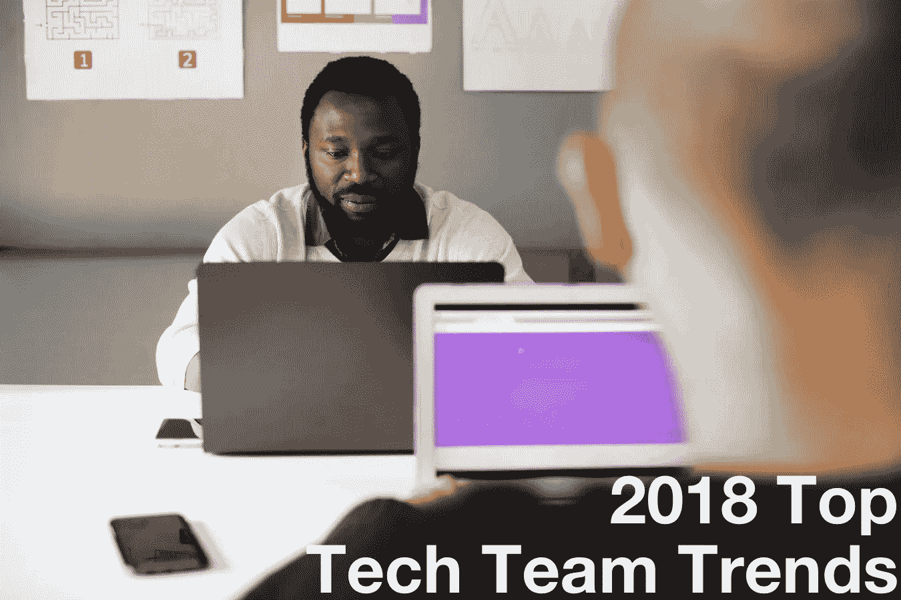

# 2018 顶级科技团队趋势

> 原文：<https://medium.com/hackernoon/2018-top-tech-team-trends-367e81e76e3d>

技术团队变得越来越聪明。软件工程的效率正成为公司竞争优势的关键部分。了解 2018 年的顶级软件工程趋势，保持领先地位:

## **集成开发操作系统**

DevOps 不再是事后的想法。这不再是球队坚持的事情了；DevOps 在前面和中间。在许多团队中，DevOps 工程师完全融入了团队的其他成员。同样，越来越多的软件工程师正在提高他们的开发能力，因为这已经成为团队的一个关键核心能力。Forrester 甚至将 2018 年称为企业发展的[年](https://go.forrester.com/blogs/2018-the-year-of-enterprise-devops/)。

## **聪明敏捷意味着定制敏捷:普通敏捷已死**

随着技术团队变得越来越聪明，盲目采用敏捷的想法正在消失。一刀切、简单敏捷的日子已经一去不复返了。为仪式而仪式的日子已经一去不复返了。

在它的位置上，聪明的、定制的、非教条式的敏捷才是正确的方向。团队精通敏捷工程和过程最佳实践，他们采用并迭代为他们工作的敏捷的一点一滴。测试驱动开发仍然是主要的实践，团队在平衡市场速度和代码质量方面做得越来越好。

## **协同定位继续增加**

大约两年前，同处一地的团队开始增多。2018 年，同地化继续兴起。团队通常是跨职能的，并且在同一个房间里。IBM、Reddit、Aetna、美国银行和 Best Buy 等巨头都在呼吁组建联合团队。

## **OKRs 和敏捷共存**

OKRs(目标和关键结果)是许多技术团队采用的主要年度计划流程。无论团队使用 OKRs、KPI 或任何其他形式的年度计划，团队都在学习如何平衡战略愿景与迭代的、基于 sprint 的技术团队节奏。OKRs 和敏捷*可以*共存。秘诀是经常测量过程，并在你了解“好”的样子时更新路线图。

## **招聘需求超过了供给**

在美国，预计未来几年科技需求将超过供给。所有的首席技术官和技术负责人都因为担心招聘速度不够快而夜不能寐。通过学习[如何高效地雇佣敏捷团队成员](https://www.stridenyc.com/how-to-hire-agile-team-members)来保持领先。

## **多元化和包容性是重中之重**

雇佣和留住一支多元化的团队是科技领袖们最关心的问题。强制性多元化培训不起作用。取而代之的是，团队正在利用志愿者工作队让员工选择帮助他们的团队变得更加多样化的方式。

> 纽约市的高级、首席或主要开发人员？[跨步招人](https://www.stridenyc.com/careers)！想要提升你的技术团队？[看我们怎么做](https://www.stridenyc.com/our-work)！[www.stridenyc.com](http://www.stridenyc.com/)

*原贴于* [*跨步博客*](https://www.stridenyc.com/blog/2018-top-tech-team-trends) *。作者:* [*黛比·马登*](https://www.stridenyc.com/blog/author/debbie-madden)