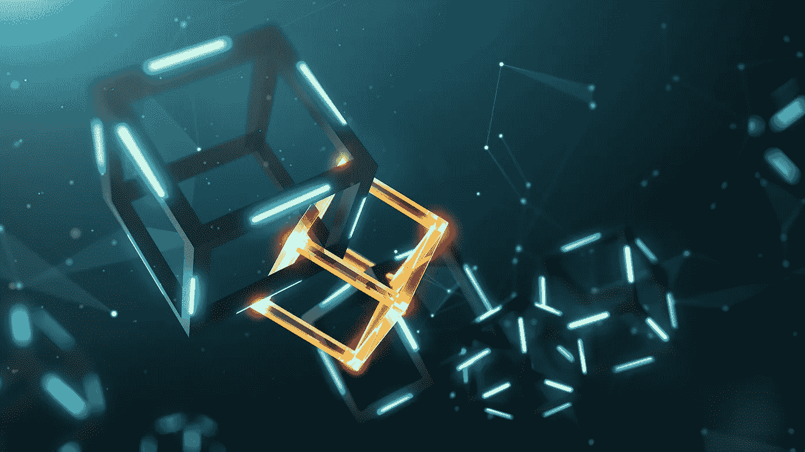

# 2019 和区块链事件——未来会是什么样子？

> 原文：<https://medium.com/hackernoon/2019-and-the-blockchain-affair-what-will-the-future-look-like-eec8227159d4>

随着 2018 年的告别，科技爱好者祈祷突破性技术改造世界。今年，人工智能、机器学习和区块链等创新技术像风暴一样颠覆了世界。我们只能说，这是一个巨大的技术年！

在上述所有技术中，毫无疑问，区块链成为 2018 年技术亮点的无冕冠军，因为它以其高端的安全性、透明度、多种应用和高级集成彻底改变了各种行业的规范。加密货币吸引了新手，区块链技术吸引了 90%的欧洲和北美银行进行投资。

Statista 预测，到 2021 年，区块链市场将达到 23 亿美元。INVAO 的联合创始人兼首席执行官 Frank Wagner 表示，*“我相信在 2019 年，我们将开始见证更多人接受基于区块链的金融产品”*。

让我们一起探索这项技术在 2019 年为我们带来了什么！

**安全令牌将重见天日**

安全令牌在 2018 年经历了一段坎坷的道路，但预计未来一年形势将会好转。证券代币还没有在市场上正式推出，因为传统投资者忠于传统投资。

安全令牌很复杂，很难描述。可以把代币想象成内部货币系统中的余额，filecoin 中保存的文件数量，或者用户在 augur 中的信誉。它们可以用作各方之间的支付方式、数字资产、贡献者的报酬或公司的股份。

安全令牌打开了巨大机会的大门，提供了高端效率和宇宙流动性。随着领先的加密交易所申请经纪牌照，以及吕克、币安和比特币基地等加密交易所寻求安全令牌的许可，这场游戏似乎又开始了另一场区块链的狂热。与此同时，瑞士证券交易所、伦敦证券交易所和纳斯达克等传统交易所正在打造数字资产平台。

**区块链将享有更好的声誉**

据 clearity，Nikao Yang，*“很长一段时间以来，区块链与加密货币有着千丝万缕的联系，但这只是该技术的一个应用。”*

此外，2019 年预计将见证针对[区块链](https://www.cubix.co/blockchain-development)、大规模研发和复杂开发的正式教育项目，因为技术爱好者热衷于发展该技术的专业知识。Lisk 首席执行官兼联合创始人 Max Kordek 认为，2019 年将是区块链无限辉煌的开始。他认为，区块链是一项进步的技术，将在未来几年内不断发展。一年的时间不足以充分发挥其潜力。

**区块链和人工智能的关系将繁荣发展**

*“人工智能是新的电力”* —谷歌大脑联合创始人、百度首席科学家吴恩达

人工智能已经存在了几十年，但当与区块链融合时，它的进步将经历巨大的增长。自主机器需要高端安全来消除可能的漏洞，由区块链的分布式账本提供。这两项引人注目的技术的结合将有助于机器高效运行，结果将更加准确。机器需要数据来运行，而区块链使大量获取有价值的数据成为可能。

人工智能消除了人为错误、偏见和对商业决策的情绪反应。在处理加密货币时使用人工智能将确保理性决策。加密机器人建立在人工智能、算法和市场预测的基础上。不带感情色彩的决定有更高的成功几率，因此在密码交换中有可能出现激烈的竞争。

人工智能是脸书和谷歌等全球公司大数据和数据分析的基础，但中小型公司对数据的访问有限。区块链促进点对点连接的能力将提高市场的数据可访问性。这项技术有一个开放的分类账，让网络上的每个用户都可以使用。然而，处理大量数据是一项复杂的任务。此外，人工智能的子领域人工通用智能(Artificial General Intelligence)作为一个反馈控制系统，帮助公司高效利用 1.3 的可用数据。

一些国家在没有出生记录和其他相关数据的情况下难以进行公民登记。AI 可以通过让政府在移民和医疗保健方面快速做出决定来加快这一进程。区块链将通过支持 ID 系统来保护未来的数据。AI 和区块链将通过快速交叉检查、高级分析、物联网数据、跟踪等等，共同减少钻石行业的欺诈行为！

**区块链将与社交网络亲密接触**

社交网络 Indorse 正在出售广告，并用 IND 代币奖励用户。该平台在首次发行硬币时筹集了 900 万美元。

社交网络可以创建真实的全球网络，通过验证用户详细信息和确保合法性来连接用户。拥有 20 多万用户的在线人才平台 Humans.net(Alibaba)发掘了这种可能性，它将有技能的人与寻求技能的人联系起来。它要求用户将他们的数据用于广告，并承诺广告收入的 25%。

2019 年，我们预计将见证社交网络让用户受益，就像它们多年来为利益相关者提供的服务一样。这些平台消除了第三方，因此，消除了所有可能的质量妥协。基于区块链的网络使用平台实用令牌进行交易，保持最低到零的费用。

[区块链](https://www.cubix.co/blockchain-development)的未来无疑比我们曾经想象的更加光明。我们只能说，这项技术将永远存在下去！