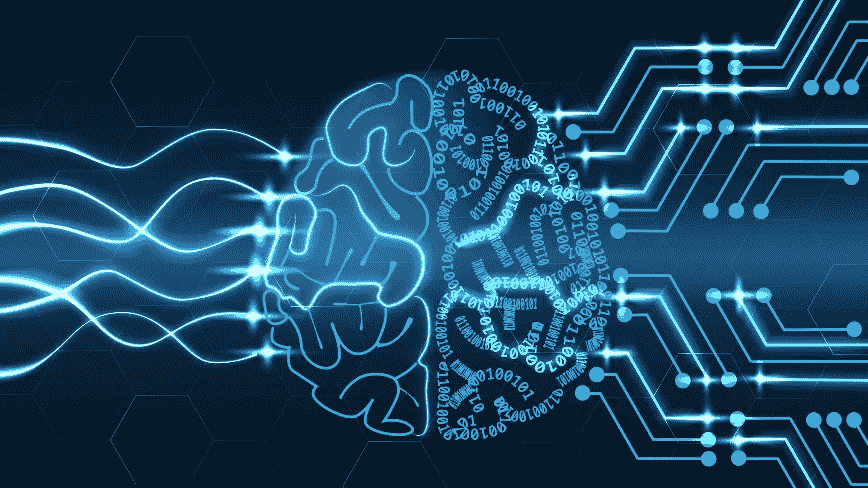

# 2019 预测:我们如何学会停止担忧并爱上人工智能

> 原文：<https://medium.com/hackernoon/2019-predictions-how-we-learned-to-stop-worrying-and-love-ai-9073ba216f4>

我最近有机会通过福布斯分享一些关于 2019】将给人工智能世界带来什么的预测。我想我应该在这里详述一下。

作为一个从我职业生涯早期就对人工智能和机器学习着迷的人，该领域的快速进展令人震惊。几乎在一夜之间，我们从一个努力完成简单图像识别任务的时代(想想:“[热狗，而不是热狗](https://www.youtube.com/watch?v=ACmydtFDTGs)”)发展到由深度神经网络驱动的人工智能，能够理解和描述[复杂场景](https://www.youtube.com/watch?v=yeS8TJwBAFs)，比人类更加准确和快速。

创新的步伐只会加快。这些工具变得越来越强大，越来越便宜，越来越容易使用。我职业生涯的前 5 年都在研究机器[和学习](https://hackernoon.com/tagged/learning)项目，我经常开玩笑说，这 5 年现在可以用 5 行 Python 包导入来代替。

这就是为什么我的第一个预测是“机器学习工程师”这个职位将开始消失。

如今，你不需要一个花哨的学位或专业知识来驾驭人工智能，这些工具正在成为标准开发人员工具箱的一部分。在 90 年代，想要对神经网络进行实验的工程师通常需要从最简单的单元(比如一个感知器)开始，一步步向上，理解每一层的数学和原理。如今，即使是新手也可以使用像 [Google](https://hackernoon.com/tagged/google) Cloud AutoML 这样的工具来自动化创建人工智能模型的几乎每个方面，并产生有影响力的结果。复杂性越来越抽象。没关系——你上一次碰到想学汇编(甚至 C++)的程序员是什么时候？)抽象就是力量。现代开发人员可能不明白为什么他们的人工智能模型能够工作，但他们确实做到了。

这让我想到了我的第二个预测:可解释性(理解人工智能系统如何工作的能力)将成为一个不错的选择。

想想吧。当你去医生的办公室做诊断时，你从来没有要求他们提供所有的参考资料、案例研究、对比病历等。来证明他们的观点。在某种程度上，你认为医生是专家，并信任他们。我们将在多长时间内让人工智能拥有比其他人类更高的可解释性标准？

在过去，不信任和不熟悉是接受人工智能的最大障碍。但是随着人工智能驱动的界面变得无处不在，我们正在飞速走出那个不可思议的山谷。现实是，在过去的几年里，人工智能已经开始超过人类的能力，2019 年是我们可以接受它的一年。我们人类不需要完全理解为什么人工智能会做决定，也许当我们决定离开时，系统会变得更好更快。

这最终让我想到了我对 2019 年及以后的最后一个预测:随着人工智能开始做出影响人类生活的决策，声誉、认证、监督和监管将变得必不可少。

我并不害怕天网的诞生，但是让无法解释的人工智能自己学习的一个不幸的方面是，事实证明它们和人类一样容易受到偏见的影响。如果我们对人工智能做出决策却决定将越来越多的责任转移给它们的原因缺乏理解，那么我们必须有确保信任和防止滥用的机制。已经有很多思想领袖呼吁这个问题，像微软这样的公司已经在[敲锣打鼓吸引监管关注](https://www.wired.com/story/microsoft-wants-stop-ai-facial-recognition-bottom/)。如果说过去十年社交网络的灾难教会了我们什么，那就是我们不擅长预测新技术将如何被滥用。但与社交网络不同，不受监管的人工智能是一个我们可以预见的问题。

**希望你喜欢这篇文章，请鼓掌、发微博或分享吧！**

摇滚在
上——尼克