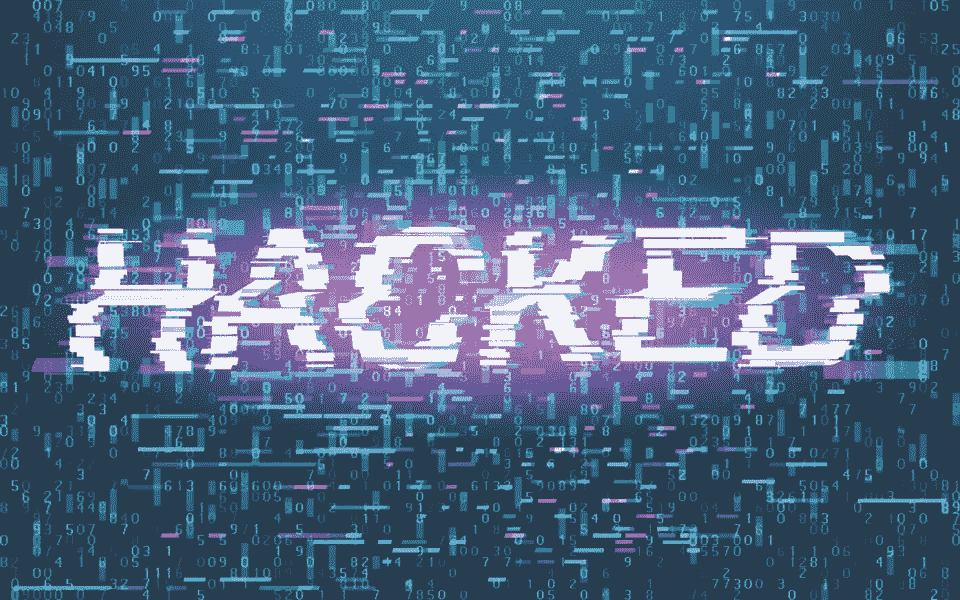

# 2019 预测:网络宁静会很快成为过去吗？

> 原文：<https://medium.com/hackernoon/2019-predictions-will-cyber-serenity-soon-be-a-thing-of-the-past-255b026a7cf>

2018 年，威胁格局以极快的速度演变，从主要的 DDoS 和赎金攻击(分别在 2016 年和 2017 年)到自动化攻击。我们看到了对 API 的耸人听闻的攻击，利用武器化人工智能的能力，以及旁路和基于代理的攻击的增长。

看起来，2019 年将是众所周知的打地鼠游戏的延伸，对当前的战术、技术和程序(TTP)进行了明确的改变。虽然没有人确切知道未来会发生什么，但今天的强劲指标使我们能够预测未来一年的趋势。

# 公共云将遭遇大规模安全攻击

根据 Gartner，Inc .的数据，全球公共云服务市场[预计](https://www.gartner.com/en/newsroom/press-releases/2018-09-12-gartner-forecasts-worldwide-public-cloud-revenue-to-grow-17-percent-in-2019)将在 2019 年增长 17.3%，总额达到 2062 亿美元，高于 2018 年的 1758 亿美元。这意味着组织正在迅速将内容转移到云，随着数据转移，新的漏洞和威胁也随之而来。虽然云的采用被吹捧为更快、更好、更容易，但安全性往往因性能和总体成本而被忽视。组织信任并期望他们的云提供商能够充分保护他们的信息，但就当前的云安全而言，这种看法并不总是现实，2019 年将证明这一点。

# 赎金技术将会激增

包括[勒索软件](https://blog.radware.com/security/2018/10/origin-of-ransomware/)和[勒索软件 RDoS](https://blog.radware.com/security/2017/07/rdos-campaign-underway-in-united-states/) 在内的 Ransom 将让位于劫持新的嵌入式技术，并随着 5G 网络和设备的推出，挟持医疗保健系统和智能城市。这看起来像什么？前景令人担忧:

*   劫持服务的可用性，如股票交易、流媒体视频或音乐，甚至 911，并要求赎金以换取设备或网络的数字化回报。
*   劫持设备。不仅像恒温器和冰箱这样的智能家居设备容易出现安全漏洞，像汽车这样的大型设备也是如此。
*   医疗赎金攻击构成了特别可怕的威胁。随着医疗保健越来越多地与基于云的监控、服务和负责管理健康管理的物联网嵌入式设备交织在一起(想想处方/紧急药物、健康记录等)。)是易受攻击的，使那些寻求医疗保健的人处于他们依赖的医疗保健设备成为恶意软件的目标或者他们支持网络的设备被劫持的危险中。

# 民族国家的攻击会增加

随着贸易和其他类型的“软基础”权力冲突的数量和严重性增加，民族国家和其他团体将寻求新的方式来造成广泛的破坏，包括当地或地区层面的互联网中断、服务中断、供应链攻击和政府在试图夺权时将应用程序列入黑名单。承包商和政府组织很可能成为目标，如果通信系统故障和贸易停滞，其他行业将作为间接受害者损失数百万美元。

# 更具破坏性的 DDoS 攻击正在出现

在过去的几年里，我们目睹了大规模基于物联网的僵尸网络的开发和部署，如 [Mirai 未来组合](https://blog.radware.com/security/2017/03/expansion-iot-since-mirai/)、[布里克博特](https://blog.radware.com/security/2017/06/everything-about-brickerbot-hajime-iot-botnets/)、[收割者](https://internetofthingsagenda.techtarget.com/blog/IoT-Agenda/IoTroop-targets-vulnerable-devices-in-massive-botnet-buildup)和 Haijme，他们的系统是围绕数千台被入侵的物联网设备构建的。这些武器化的僵尸网络大多被用于网络攻击，以相对直接的方式摧毁关键设备或服务。

最近，机器人牧民瞄准的设备发生了变化。根据我们在野外看到的发展，攻击者不仅渗透资源受限的物联网设备，他们还瞄准了强大的基于云的服务器。当被锁定时，只需要少量被破坏的实例就能造成严重威胁。由于物联网恶意软件针对包括 x86_64 在内的许多平台进行了交叉编译，我们预计攻击者会不断改变和更新 Mirai 未来组合/Qbot 扫描器，以在 2019 年加入更多基于云的漏洞。

# 网络宁静可能已经成为过去

如果攻击格局的增长通过各种连锁攻击和修改当前的 TTP 以包括自动化功能继续演变到 2019 年，网络安全的最佳时期可能已经过去。让我们希望 2019 年将是我们集体开始真正分享情报并在知识转移中相互帮助的一年；关键是要解决威胁等式，并提出合理和可实现的解决方案，以消除我们所有人面前的不祥迹象。

在此之前，要特别注意武器化的 AI、大型 API 攻击、代理攻击和自动化社会工程。当他们瞄准自动化的隐藏攻击面时，他们无疑会变得很成问题。

[***【你可能也喜欢:云 vs DDoS，七层复杂性】***](https://blog.radware.com/security/2018/03/cloud-vs-ddos-seven-layers-of-complexity/)

[***【您可能也喜欢:勒索软件的起源及其对商家的影响】***](https://blog.radware.com/security/2018/10/origin-of-ransomware/)

[***【你可能也喜欢:物联网僵尸网络在崛起】***](https://blog.radware.com/security/2018/10/iot-botnets-on-the-rise/)