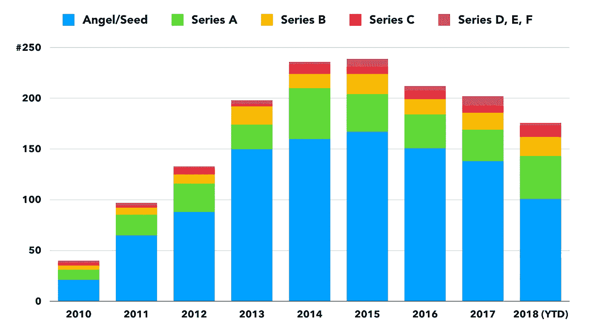

# 2019:教育年

> 原文：<https://medium.com/hackernoon/2019-the-year-of-education-b669328fa2a3>

## 数字革命正处于转折点。是时候重新思考我们为什么、做什么以及如何教学了。

重塑教育是一项具有挑战性但又紧迫的任务。我们正在见证技术的指数级增长。人工智能、传感器、数据分析和区块链(仅举几例)正在相互放大和加速。这将导致 2019 年经济和社会所有领域的新应用。

在数字时代，任何新的教育方法都需要采取更加“基于技能”的重点，旨在培养创造力。毕竟，我们(尤其是下一代)必须准备好与智能、网络化的机器更紧密地生活和工作。教育的主要重点不应该是标准化流程和程序的知识转移(这些肯定会自动化)，而是培养创新和创造技能，这些技能不容易被机器复制。

在一个智能技术的世界里，最人性化的品质将得到重视；我们独特且高度个性化的自我表达能力。所有的教育都需要围绕这个目标重新组织。

[我在](https://hackernoon.com/education-in-a-digital-age-db3063214407)之前已经写过这个问题，但我想在 2019 年让它变得更具体。就当是我的新年决心吧。

> 我们需要更加认真地教授与数字时代相关的技能。

我已经对我的课程进行了重大改革，更加注重培养学生的创造力。但是明年，我想更进一步，介绍三个“新”的组成部分:(1)“多学科合作”，(2)“远见卓识”，和(3)“教育技术”

# **#多学科协作**

19 世纪的工业革命是我们今天所知的流程化、程序化社会的起点。标准化的产品开发、制造和供应链流程创造了效率，带来了经济增长和社会福利。专业化变得很重要。当然，人们仍然必须在团队中工作，但是每个学科都有自己的职责，团队成员相互依赖，带来独特的专业知识。

团队合作和协作对于数字技术及其应用的发展也至关重要。然而，从产品到服务的转变，以及商业模式从“管道”(产品被不断推向消费者)到“平台”(利益相关者共同创造服务/价值)的转变，使得共同创造变得更加重要。这意味着“多学科团队”更加紧密地合作。这意味着每个人都需要超越自己的专业去经营。

这对团队动态产生了巨大的影响。在所谓的平台经济中，团队成员需要不同的技能组合。为了共同创造，至关重要的是成员们说彼此的语言，或者至少相互理解。更加开放和好奇的心态已经成为所有团队成功的先决条件。

必须教授多学科协作。它需要成为任何级别或年龄的所有课程的必修部分。当然，我们仍然需要专家，但他们比以往任何时候都更需要思想开放，能够倾听并掌握有效合作和沟通的技能。

# **#远见卓识**

有很多技术颠覆的例子。但在 YouTube 上观看了这个 Coldfusion 视频后，很明显，公司并没有被技术本身所颠覆。相反，他们苦于缺乏“远见”。

当面对新的技术发展/新技术时(甚至当他们被提供给他们时)，CEO 和其他管理人员会指出一长串与新技术的可用性、可靠性和适应性有关的低效之处。电话只是一个“玩具”电视是“无聊的”(与电影体验相比)。计算机的能源使用超出了图表，阻止了它成为主流产品。现代智能手机没有“真正的键盘”(因此不适合商务人士)。

在每一个案例中，高管们都没有看到新技术颠覆现有市场并变得具有商业吸引力的潜力。在每一个案例中，都有视觉障碍。

当然，说我们需要更多有远见的人，这太简单了。历史表明，这些远见卓识者(二十多年前在[苹果思考不同运动](https://www.youtube.com/watch?v=cFEarBzelBs)中被称为“反叛者、麻烦制造者、疯子或天才”)很难找到。

这并不意味着我们不应该在我们的教育项目中更多地关注新的和新鲜的观点的创造。再说一次，我们正处于一个转折点。技术颠覆已经“正常化”,成为日常工作和生活的一部分。技术革命的后果远不止一家公司的崩溃。忽视数字技术颠覆性潜力的速度和规模可能是“灾难性的”。

因此，有必要教会学生不断发展新观点的能力，并重新审视长期持有的假设、理论和商业模式的智慧。这并不是说这些模型总是错误的，而是批判性思维的能力有助于学生保持一种开放和新鲜的世界观。

> 随着人工智能和去中心化技术(如区块链)的发展，保持新鲜的视角已经成为一项必备技能。我们需要更多的多样性，而不是知道如何遵循和执行流程和程序的人。

 [## 经济学的再教育 101

### 十月的一个阴沉的星期三午餐时间，300 多名学生挤进了伦敦大学学院的一个…

qz.com](https://qz.com/1486238/the-unlikely-reeducation-of-econ-101/) 

# **#EdTech**

EdTech(或教育技术)的定义很广。它包括从计算机的直接使用到整个在线教学平台、移动学习应用、游戏化、增强和虚拟现实解决方案的一切。简而言之，它旨在利用数字技术扰乱教育。

教育科技公司已经存在了大约十年。2010 年，这一领域的公司开始吸引天使、风险资本家和其他风险资本投资者的关注。从投资数据来看，人们对 EdTech 的兴趣似乎已经下降。

Investments in EdTech. Source: Crunchbase

然而，预计教育科技公司将在 2019 年引起更多关注。

但是当我和我的同事讨论教育技术的发展时，他们似乎仍然远远跟不上最新的技术。教育技术行业目前由没有必要教育经验的技术人员主导。但是我希望明年教育工作者会更多的参与进来。当然，他们对教育技术的态度需要改变。它创造了重要的机会来提供数字时代所必需的技术、协作和基于视觉的技能的组合。

更重要的是，教育技术解决方案是开发学习架构的必要条件，有助于启动自我学习的关键[循环](https://hackernoon.com/education-is-the-key-to-a-better-future-but-6516903c547f)。掌握自我学习的周期对学生不断学习、研究和适应新的技术发展至关重要。

# **那么，“如何”呢？**

我目前正致力于与“教育技术”公司建立合作关系，这些公司将“教育技术”的解决方案和策略整合到我的课程中。

将通过组织“黑客马拉松”和其他任务来促进多学科合作。

教授“远见思维”将更具挑战性。有一点是肯定的。为了“培养”思想家，我需要表现得不像一个向学生灌输知识的传统教师。我将更多地扮演影响者和共同创造者的角色，激励学生去思考和挑战传统的假设和模型。分数很大程度上取决于对新鲜和新观点的解释和支持方式。

非常期待 2019 年的课内体验。

*感谢您的阅读！请点击*👏*下面，还是留下评论吧。*

每周都有一个新故事。因此，如果你关注我，你不会错过我关于数字时代如何改变我们生活、工作和娱乐方式的最新见解。