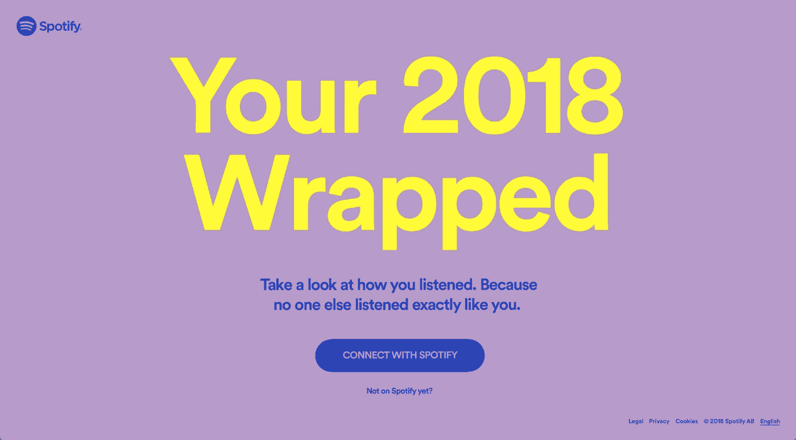

# 2019 年将是数据讲故事的一年

> 原文：<https://medium.com/hackernoon/2019-will-be-the-year-of-data-storytelling-a9121a8c7069>

如果 2018 年是大数据年，那么 2019 年将是利用这些**数据讲述一个有意义的故事的一年。**

现在，大多数数字和物理产品都需要以某种形式收集数据才能正常工作。把电视比作 YouTube 电视上的大多数节目和广告都不能引起我的共鸣，而我在 YouTube 上看到的一切都是出于战略和数据驱动的原因。

消费者越来越意识到他们的**数据对服务提供商很有价值。该事务看起来像这样:**

你的数据被用来吸引广告商为平台提供资金。作为回报，你会得到基于你观察到的行为和偏好的定制体验。

在[数据泄露](https://www.businessinsider.com/data-breaches-2018-4)、[脸书惨败](https://www.wired.com/story/facebook-security-breach-50-million-accounts/)以及公司不断完善我们的数字身份之间，数据已经成为每个人的心头之患。

# 展望 2019 年

拥有数据的企业在未来一年的机会在于我们如何使用数据向客户提供**个性化、便捷和神奇的体验**。这样做并不需要更多的数据，它需要你设计你的数据来讲述一个更好的故事。

一个广为人知的数据故事的例子是 [Fitbit](https://www.fitbit.com) 跟踪你的日常行动，然后用一个简单易懂的指标来表达它们:每天的步数。他们进一步简化了这一点，在某些型号上，五个 LED 灯代表 10，000 步。故事很简单；如果在一天结束时，你的手腕上有 4 个闪烁的灯，那么你知道是时候离开沙发，在睡觉前跑一圈了。

我想说，大多数消费者现在都明白他们的数据在任何地方、任何地方都被收集。问题是，并不是每个服务提供商都以对用户有意义的方式将数据返回给用户。他们不会讲故事。

> 最好的数据故事是那些不依赖数据的故事。他们创造了一个消费者乐于听到的故事，并且**使用数据来强调要点**而不是说服。

# Spotify 2018 已包装

一个伟大的数据故事最及时的例子是 Spotify 本月早些时候向他们超过 1 . 91 亿用户中的每一个人交付的 [**2018 年包装的**](https://spotifywrapped.com/en/)**。它以电子邮件的形式出现，庆祝又是一年的顾客。当你点击链接时，它会把你带到一个网站，要求你登录以查看“你听得怎么样”。**

****

**Spotify 2018 Wrapped welcome page [https://spotifywrapped.com/en/](https://spotifywrapped.com/en/)**

**对大多数接收者来说, *My Year In Review* 播放列表是一次个性化的记忆之旅，提醒你可能已经暴饮暴食了一周的艺术家和歌曲，然后放回虚拟书架以便以后重新发现。这可能会让人们想起从书架上挑选一张 CD 并在浏览专辑封面时回忆的怀旧之情。**

**艺术家、歌曲和流派的前十名列表很好地验证了你今年听了什么的假设，但当他们制作一个定制的 100 首歌曲的播放列表时，故事就来了，这会让你想起 2018 年。这与广播电台播放他们的年度最佳 100 首歌曲是不同的，因为你可能实际上没有欣赏过其中的任何一首。虽然像爱莉安娜·格兰德这样的艺术家作为年度最受欢迎的艺术家受到了大量的关注，但也有很多人不听她的，所以我为什么要让她在我的**年度回顾*中结束呢？***

***My Top Songs of 2018 — Feel free to make fun all you want.***

***然后他们给你介绍一个*品味突破者*播放列表，里面有你不常听的流派或艺术家的 100 首歌曲，但他们愿意打赌你会喜欢。他们能够如此自信地向你提供那个播放列表，因为他们已经收集了关于你的收听习惯的海量数据。就我而言，在过去的 12 个月里，我平均每天听 2.8 小时或超过 61，000 分钟。***

***这是一个数据故事。记录你在过去一年中听 CD 集的时长是一项非常繁重的任务，但对 Spotify 来说并非如此。它能够安静地坐着，不带任何评判，倾听你的音乐生活。**随着 2018 年的结束**，Spotify 比他们透露的更加了解你的收听习惯。**但是他们没有让你不知所措(或者害怕)，而是改变了叙述方式，给你讲了一个故事。我们愿意放弃我们的个人数据，只要我们得到的产品对你来说是令人愉快的、方便的和个性化的。*****

***我个人很想看看 Spotify 还收集了哪些关于我听音乐习惯的信息。我确信他们知道我喜欢的歌曲的理想长度，每分钟的节拍，以及我最喜欢的专辑封面颜色。我也确信他们不会很快与他们的用户分享这个故事，因为这是通过一种算法产生的理想数据组合，这种算法创造了我所期待的*你的每周发现*播放列表的魔力。***

***如果你花那么多时间观察行为，你可以学到很多东西，这就是数据将带我们进入 2019 年的地方。我们已经知道如何收集数据，现在就要看我们如何使用它了。**我们将如何用数据来讲述一个故事？*****

# ***现在是一个糟糕的例子***

***拥有超过[19 亿月活跃用户](https://www.omnicoreagency.com/youtube-statistics/)的 YouTube 也试图为他们的用户创造一个年终*谢谢*的方式，但最终事与愿违。YouTube Rewind 与 2018 Wrapped 在同一天发布，是一个八分钟长的视频，展示了该平台的创作者和迷因，旨在引发怀旧情绪。***

***Cringe-fest***

***它没有在社区中引起轰动，而是成为了 YouTube 上有史以来最不受欢迎的视频。在我写这篇文章的时候，它有超过 1400 万个不喜欢。***

***如果 Spotify 拥有海量数据，那么 YouTube(通过谷歌网络)将拥有海量数据，他们可以利用这些数据来开展这个项目。***

> ***失败的原因？他们没有讲述一个能引起观众共鸣的故事。***

***这不是个性化的，方便的，或神奇的。正因为如此，这是一个失败。它没有增加客户的信任，反而增加了平台上最近发生的一些活动的厌恶感。它没有生成数百万个积极的用户生成的帖子，而是创建了数千个谈论它有多糟糕的反应视频。正如古老的谚语所说，“任何宣传都是好的宣传”，但我不认为这是他们试图做的。***

***他们有机会展示他们的平台可以通过拼接自定义角色来匹配帐户的观看习惯而创造的魔力。他们本可以引进外国内容创作者。相反，他们在片尾演职员表中粉碎了所有特色创作者的名字。***

***我可以继续列举 YouTube 错过的所有机会，但我会在这里结束。有很多事情 *YouTube Rewind* 做得很差，特别是与 *Spotify 2018 Wrapped 相比。****

# ***把这当成每个人的警告***

***让这成为其他人的一个教训，告诉他们**的数据故事在 2019 年将变得比以往任何时候都更加重要。**其他人应该学习如何简单、优雅地向客户交付数据，而不要做过头。 *2018 Wrapped* 是一个漂亮迷人的网站，但仅此而已。没有与内容的真正互动，没有探索的能力，也没有从网页上播放音乐的能力。然而，我们所拥有的是与他人分享的能力。***

***什么是好故事？复述的能力。通过与世界分享你的故事，你保持了数据的流动，增加了网络效应，使数据变得非常强大。正如[凯文·凯利](https://medium.com/u/964bb8418b79?source=post_page-----a9121a8c7069--------------------------------)所说，***

> ***比特想移动。***
> 
> ***位想要链接到其他位。他们需要其他的东西。***
> 
> ***比特需要实时。***
> 
> ***比特需要被复制，被复制，被拷贝。***
> 
> ***比特想成为元。***

***让我们来满足这些数据。让我们用新的方式把它们连接起来，重新组合，讲述一个新类型的故事。如果我们不这样做，我们将只是数据海洋中的另一个 YouTube 倒带。***

*****感谢阅读！** *我是*[*GoDo*](http://godogood.ca)*的联合创始人，这是一家致力于帮助企业让数据变得有用的数据设计公司。随意在这里伸出手，上*[*Twitter*](https://twitter.com/stew_hillhouse)*，或者* [*LinkedIn。*](https://www.linkedin.com/in/stewarthillhouse/)***