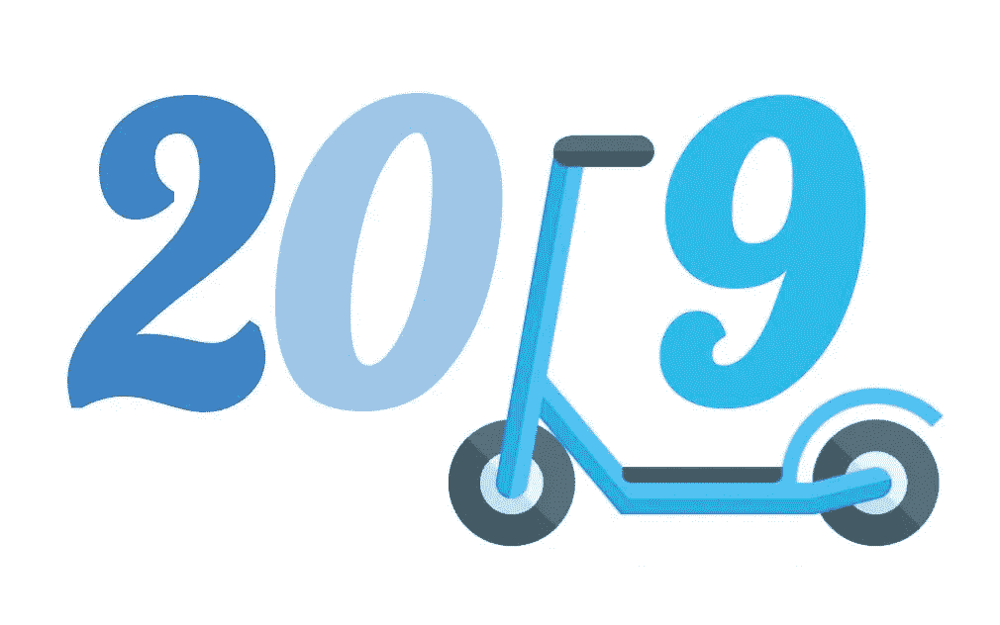

# 2019 年将是滑板车和微型汽车的一年

> 原文：<https://medium.com/hackernoon/2019-will-be-the-year-of-scooters-and-micromobility-17c04c120806>

## 移动行业正在发生很多事情，更多的参与者正在涌现。

“我们在美国有这种根深蒂固的汽车文化，我们必须以多种方式挑战它的核心，”Lyft 自行车、滑板车和行人政策 [Caroline Samponaro](https://medium.com/u/832e895153?source=post_page-----17c04c120806--------------------------------) 对 [Fast Company](https://medium.com/u/ada2289350de?source=post_page-----17c04c120806--------------------------------) 说。

该公司最近进入了自行车和电动滑板车共享业务，正在慢慢地在其应用程序中推出新的公共交通集成。正如 Fast Company 指出的那样，新的产品对公司没有任何直接的财务利益。“但它认为这是让人们不再开自己的车的愿景的关键部分，”该杂志写道。今年夏天，该公司收购了全球共享自行车运营商和技术创新者 [Motivate](https://medium.com/u/5ccde33a91d2?source=post_page-----17c04c120806--------------------------------) 之后,“自行车和踏板车是另一个愿景”。

“如果美国 40%的汽车旅行不到 2 英里，人们每天都在城市中进行许多短途旅行，那么我们有巨大的潜力骑自行车和踏板车进行这些旅行，并将这些旅行与公共交通联系起来，”Samponaro 说。“这就是 Lyft 目前正在努力建设和实现的目标。”

但 Lyft 并不是唯一一家投资自行车和滑板车共享的公司，这种共享是一种增长和创造新机会的方式，同时也是一种推动客户和用户在移动方面做出更环保选择的方式。

自行车和踏板车共享初创公司 Lime，前身为 [LimeBike](https://medium.com/u/881e39a1e63a?source=post_page-----17c04c120806--------------------------------) ，正在推出新的程序。该公司首先登陆欧洲市场，在西雅图也推出了汽车共享服务，现在已经将其应用程序与谷歌地图集成，从几个关键市场开始。

谷歌地图项目经理 Vishal Dutta 在一篇博客中写道:“我们将与 Lime 合作，帮助您找到更好的方式来进行这些短途旅行。”“在全球 13 个城市，你现在可以直接从谷歌地图上看到附近的 Lime scooters、踏板自行车和电动自行车作为交通选择。只需导航到您的目的地，点击交通图标即可查看附近的选项。如果有一辆 Lime 车，你会看到走到车前要花多长时间，估计你要花多少钱，以及你的总行程时间和预计到达时间。点击 Lime 卡将带你进入 Lime 应用程序，在那里你可以看到车辆的确切位置，并轻松解锁。如果你没有安装 Lime 应用程序，你将被带到应用程序或 Play store。”

到目前为止，唯一的非美国城市是新西兰的奥克兰和澳大利亚的布里斯班。但 Lime 的内容营销助理 Vickie Wu 表示，“更多的市场正在到来”。

微移动市场发展非常迅速，新的参与者正在涌现，特别是在美国和中国以外的地区，如墨西哥城的 Grin、柏林的 Tier 和圣保罗的 Yellow。

最新的是 dott，这是一家由 Ofo 前欧洲、中东和非洲负责人 Maxim ROMAIN 创立的欧洲滑板车初创公司。

由 [EQT Ventures](https://medium.com/u/48d123c25a82?source=post_page-----17c04c120806--------------------------------) 和 [Naspers](https://medium.com/u/cf616bc16354?source=post_page-----17c04c120806--------------------------------) Ventures 提供 2000 万€的初始资金，“多特的目标是支持充满活力的内陆城市的发展，没有汽车和污染，”Romain 在 [Medium](https://medium.com/u/504c7870fdb6?source=post_page-----17c04c120806--------------------------------) 上的一篇博客文章中写道。“为了实现这一目标，我们的目标是通过向城市中的任何人和任何地方提供自行车、电动自行车、电动滑板车甚至可能是货运自行车等轻型车辆，让短途旅行变得更加愉快。”

多特总部设在欧洲，市场主要由非欧洲公司主导，主要来自美国和中国。它的重点将是可分享性、耐用性和设计，而公司的使命取决于四个支柱:环保意识、透明、完成任务、家庭。

2019 年对于这个市场来说将是非常激动人心的一年！