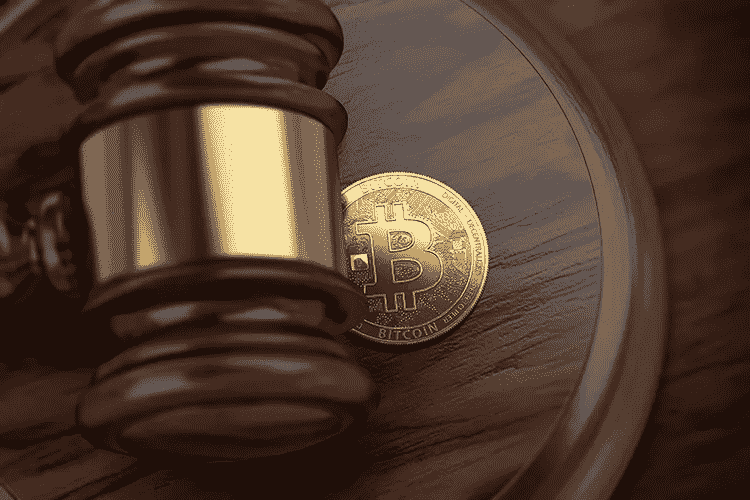

# 2030 年:代码就是法律。

> 原文：<https://medium.com/hackernoon/2030-code-is-law-29abe8d4fce4>

现在是 2030 年。

一觉醒来，你看到了这条新闻:拼车市场本周上涨了 5%。你微笑着，对本周早些时候你购买的骑乘硬币感到心满意足。

你以为，春假快到了。*许多大学生将成为拼车一族，这意味着许多投机者将向他们出售拼车硬币。*

看来你是对的。你打开你的数字钱包，这是你手机上的一个应用程序，并检查你的投资组合的余额。

你卖掉了你的自行车。你拿不到全部的 5%，但你已经知道原因了:作为对你投资智慧的感谢，政府已经冒昧地立即无形地征收了你的资本利得税，为你减轻了纳税日的压力。

你注意到你每月的薪水也进来了——减去你的所得税。多方便啊。

你回想一下，意识到“纳税日”已经多年没有提交任何实物纳税申报表了。

这是因为，在这个新的政府支持的数字钱包上，你可以看到你花的所有钱，你收到的所有钱，从销售税到遗产税的一切都是在幕后计算和扣除的，超出了你的意识。

这个过程是自动的，无可争议的，有时你完全看不见。

而且不仅仅是税收变得自动化了。您参与的每一笔交易，无论是购物、朋友赠送的礼物还是某项事业的捐赠，都会被即时审计和跟踪。

更重要的是:从广义上讲,“交易”这个词现在适用于几乎所有事物。

你的自动驾驶汽车与路上的其他汽车交换关于你的路线和优先权的数据；那是交易。

你的手机，笔记本电脑，甚至你的电视相互交换数据，为你优化内容，确保你永远不会不知道看什么电影或玩什么游戏；那是交易。

您的设备还不断与您的整个邻居进行通信，提出适合每个人个人日常生活的最佳时间表，并确保没有人的互联网连接在他们最需要的时候太慢；那是交易。

所有这些数据都可以，也将会被政府审计。

你查看你的电子邮件(是的，电子邮件还在),看到一条来自国税局的消息:

"请列出所列交易的目的:"

在你姐夫给你送了 500 美元的生日礼物后，你正在期待这封邮件。

“生日礼物”，你回信。

但是有一个问题:你的姐夫竟然*忘记了*你的生日。事实上，他给你寄钱是因为他觉得欠你的，因为你帮他搬家。

你不知道的是，你刚刚给自己安排了一次审计。

该系统以光速工作，记录下这神秘的 500 美元背后相互矛盾的故事，你会立即收到回复:

"请期待今晚 6 点我们审计员的后续访问。"

但是你已经关闭了你的电子邮件，并且不期望如此快速的回复。为什么你会？你没什么好隐瞒的，所以应该没什么问题吧？下班后，你和你的大学伙伴碰面，决定去打篮球。

之后，你开车去听你侄女的小提琴演奏会，但你发现你的车不会像你说的那样:“错误:非法路线，”它宣称。

百思不得其解，你打开手机，看到一条通知:

“交易冻结。请到当地 IRS 审计办公室申请放行。已通知您的车辆。”

时间是下午 6 点 05 分。

你还收到了一封来自你姐夫的愤怒的语音邮件，声称他的资产也被冻结了，并要求知道你那天早上在邮件中说了什么。

这是一个政府拥抱加密货币技术的世界。

在这个世界里，[区块链](https://hackernoon.com/tagged/blockchain)上的交易数据是受法律支持的，具有法律约束力。这有双重影响:

1.一种新的点对点经济的起源，在这种经济中，任何商品或服务的提供者都可以不通过任何中间人而与消费者匹配。他们赚更多的钱，而消费者花费更少，所有人的生活水平都提高了。

2.过去需要数百页文件、昂贵的律师和大量繁文缛节的法律和官僚程序，现在在一个单一的前提下运作:“代码就是法律。”这意味着政府的执行部门，如国税局、证交会和警方，不再需要等待法院签发搜查令；在智能合约的新法律体系中，在满足某些条件的情况下，权证可以自动发行。

公众喜爱加密货币。一些小麻烦，比如吃饭时撕毁账单，或者每个月和室友分摊电费，都不复存在了。你只是担心你为自己花的钱，当别人欠你钱的时候，看着它自动进来。

政府也喜欢它:现在人们已经停止使用纸币，转而使用美联储的加密美元，这就很容易追踪诈骗犯和罪犯。

太容易了。

困惑、沮丧的你让你的车带你去了审计师的办公室——显然，这是它现在唯一可以“合法”带你去的地方——冲进去，要求知道他们希望你如何向你的侄女、姐姐和姐夫解释你的缺席。

“这是怎么回事？”你对不知情的接待员大喊大叫。

你身后有个声音在喊你的名字。

“是吗？”你转身，一些西装递给你一张传票。

“我们希望您能帮助我们了解您在链外进行了什么样的商业交易。请向我们提供你的私人钥匙，你在过去一年中收到的任何纸币或贵重物品的完整记录，并在这次调查中给予我们充分的合作，否则将面临企图税务欺诈和洗钱的指控。”

你痛苦地回顾过去十年。我们怎么会让这一切发生？

你还记得那些将区块链吹捧为“伟大的民主主义者”的秘密无政府主义者和自由意志主义者吗他们说这项技术将使我们摆脱监管。相反，这让一切变得更糟。

哪里出了问题？

一个不同的世界是如何被创造出来的？

如果不使政府干预变得如此容易，经济怎么可能对所有人都有所改善呢？

谁有能力让正确的车轮运转起来？