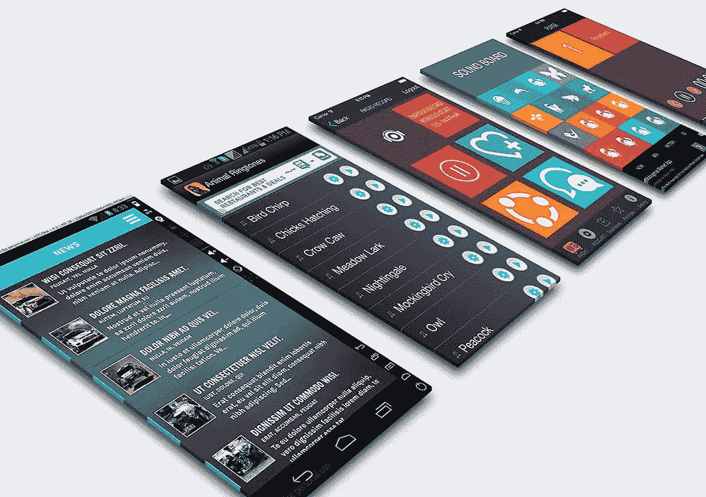
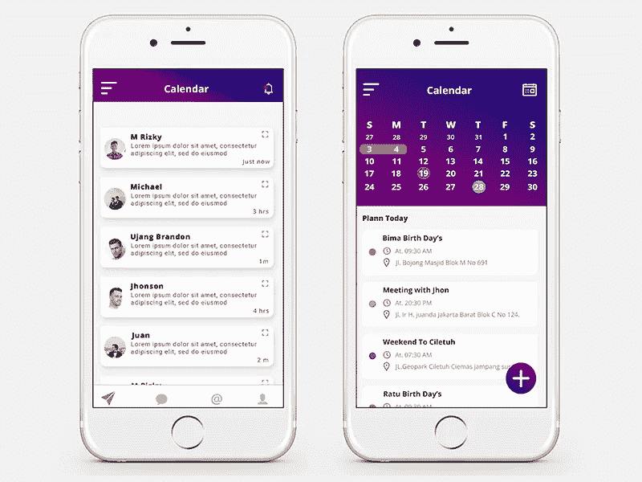

# 2018 年 21 个最佳移动应用模型设计资源

> 原文：<https://medium.com/hackernoon/21-best-mobile-app-mockup-design-resources-in-2018-122724934be1>

这篇文章包括 4 个免费的移动应用程序模型工具，12 个最佳移动应用程序模型下载模板(PSD)和 5 个优秀的最新移动应用程序模型设计示例。

向你的客户和用户展示你的原型设计是传达你对你的移动应用的想法的最好方式——在设计和功能方面。拥有一个好的移动应用模型工具可以帮助你高效快速地进行设计。Mockplus 提供了大量的移动应用程序模型模板和示例，您可以从中获得设计灵感。

因此，你可以专注于最重要的事情，我已经为你做了跑腿工作，并整理了这份用于移动应用程序设计的 **21 种设计资源的列表**。这篇文章包括 4 个免费的移动应用程序模型工具，12 个最佳移动应用程序模型下载模板(PSD)，以及 5 个优秀的移动应用程序模型设计示例。

# 4 个免费的移动应用模拟工具

# 1.Mockplus

近年来，Mockplus 受到了很多关注。我花了几天时间使用这个模拟工具，我发现它真的很容易使用。如果你想要强大而直观的交互功能，那么这个应用模型工具绝对是你的最佳选择。

特点:

*   简单的拖放操作可实现快速交互
*   大量经典、实用的图标和矢量图标
*   [中继器](http://doc.mockplus.com/?p=1626)可以为你节省很多设计时间
*   UI 流程图呈现更好的视觉效果
*   实时协作
*   “表单”组件具有与 Excel 相似的功能
*   导入草图文档
*   大量的[设计项目示例和模板](http://doc.mockplus.com/?cat=54)可供下载

**费用:所有基本功能免费**

如果想和会员一起设计，可以试试 [Mockplus iDoc](https://idoc.mockplus.com/?hmsr=cherry) ！它可以连接您的整个产品设计工作流程！

# 2.流体用户界面

Fluid UI 是一款面向移动开发的原型工具，可以帮助设计师快速高效地完成产品原型的设计。

特点:

*   内置了超过 1700 种线框和移动 UI 控件
*   没有平台限制—支持 Windows、Mac 和 Linux 系统
*   包括 2000 多个 iOS、Android 和 Windows 8 插件

**费用:允许你创建一个免费的项目(10 页，没有上传)**

# 3.视觉

Invision 是一个快速原型工具，非常适合应用程序 UI 设计。

特点:

*   内置的布局选项允许您为您的想法创建视觉层次。
*   使用 InVision Studio，当您更改设计系统中某些 UI 组件的样式时，相同的 UI 组件可以在整个设计文件中同步更新。
*   测试您的 web 和移动产品设计，并快速整合用户反馈。
*   很酷的动画效果。

**费用:一个活动原型项目免费**

# 4.素描

Sketch 是最强大的手机 app 矢量设计工具，它可以帮助你专注于自己最擅长的事情。

特点:

*   交互式原型制作
*   一起工作，保持同步。
*   强大的插件
*   Sketch 也有专门的开发者社区，不断创造新的扩展，帮助设计师提高工作效率。

**费用:99 美元/年**

# 12 应用程序模型模板下载(PSD)

# 5.免费等距 iPhone X 应用样机 PSD

【http://goodmockups.com/free-isometric-iphone-x-App... 

您可以使用这种以 3D 方式生成的对齐的 iPhone X 应用模型来展示您的应用设计。三个智能对象屏幕位于图层面板的顶部。放置您的设计后，您可以根据您的设计偏好更改背景颜色，或者填充整个应用程序用户界面主题的颜色。

# 6.iPhone X——免费的 4K PSD 模型

[https://www.behance.net/gallery/62410885/iPhone-X-...](https://www.behance.net/gallery/62410885/iPhone-X-Free-4K-Mockups)

这是三个不同的高度精确的 4K 本地 iPhone X 模型，由真实的 3D 模型创建，你可以免费下载。

# 7.iPhone X & 8 粘土角

[Https://store.ramotion.com/product/iphone-x-8-clay...](https://store.ramotion.com/product/iphone-x-8-clay-angled-mockups)

这 8 个粘土模型可以从最佳角度展示你的应用程序。费用:单次购买 8 美元，总共 24 美元。

# 8.应用程序显示屏 PSD 模型

[https://www.graphicsfuel.com/category/ui-mobile-Ap...](https://www.graphicsfuel.com/category/ui-mobile-Apps/)

使用这些屏幕模型 PSD 文件，以专业和生动的方式呈现您的移动应用程序屏幕。只需将您自己的屏幕添加到智能对象层并保存即可。模型可以转换成演示文稿。你甚至可以用模型来展示你的海报或贺卡。

# 9.2 个免费的 iOS 应用演示模型

[https://dribbble.com/shots/4591883-2-Free-iOS-App-...](https://dribbble.com/shots/4591883-2-Free-iOS-App-Presentation-Mockups)

尝试这些免费的 iOS 应用演示模型，并以可能的最佳方式展示您的应用设计。您可以单独定制每个屏幕，还可以隐藏任何不想要的屏幕。

# 10.Android 移动应用模型

[https://creativemarket.com/Graphicsworld125/256877...](https://creativemarket.com/Graphicsworld125/256877-Mobile-App-Mock-Up-2?u=templatenet)

这包括 6 个不同的移动应用程序模型屏幕，价格为 12 美元。

特点:

*   像素尺寸:3400x2400
*   高分辨率:300 DPI
*   易于替换截图
*   现实阴影
*   自动厚层
*   更改背景颜色
*   颜色模式:RGB
*   包括帮助文档
*   最低 Adobe 版本:CS5

# 11.免费三星 Galaxy S9 和 S9+应用程序实体模型 PSD

http://goodmockups.com/free-samsung-galaxy-s9-s9-A...

这个 PSD 文件由 5 个重叠阴影的屏幕编译而成。您可以根据您的应用程序设计自定义阴影的不透明度。两款三星 Galaxy 手机的分辨率没有区别。你可以在 5.8 英寸和 6.2 英寸的屏幕上使用应用模型。它在图层文件夹中有所有四种 S9 颜色(紫丁香紫色、午夜黑色、钛灰色和珊瑚蓝色)。

# 更多 5 款移动应用模拟模板可供下载:

# 12.概念 iPhone X 免费下载样机

【https://www.behance.net/gallery/57582271/Free-PSD-... 

# 13.良好的模型

[http://goodmockups.com](http://goodmockups.com/)

# 14.素描 App 资源网站

[https://www.sketchAppsources.com/all-free-sources....](https://www.sketchappsources.com/all-free-sources.html)

# 15.皮克斯登

[https://www.pixeden.com/mobile-Apps](https://www.pixeden.com/mobile-Apps)

# 16.免费 PSD 模型

[https://www.graphberry.com/category/mock-ups](https://www.graphberry.com/category/mock-ups)

# 5 个最佳移动应用程序模型示例，激发你的灵感

# 17.生产力应用过渡

[https://dribbble.com/shots/4082589-Productivity-Ap...](https://dribbble.com/shots/4082589-Productivity-App-Transition)

# 18.iPhoneX 项目

[https://dribbble.com/shots/4241730-iphoneX-project](https://dribbble.com/shots/4241730-iphoneX-project)

# 19.应用日历计划模型

[https://dribbble.com/shots/4597903-App-Calendar-Pl...](https://dribbble.com/shots/4597903-App-Calendar-Plan-Mockup)

# 20.电影应用

[https://dribbble.com/shots/4596226-Movie-App](https://dribbble.com/shots/4596226-Movie-App)

# 21.家具应用程序概念

[https://dribbble.com/shots/4562156-Furniture-App-C...](https://dribbble.com/shots/4562156-Furniture-App-Concept-UI-UX-Design)

