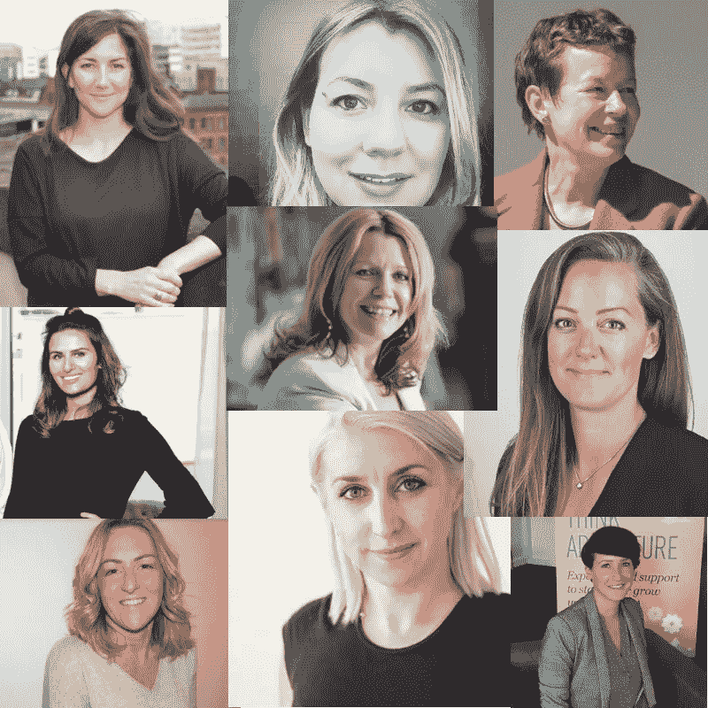
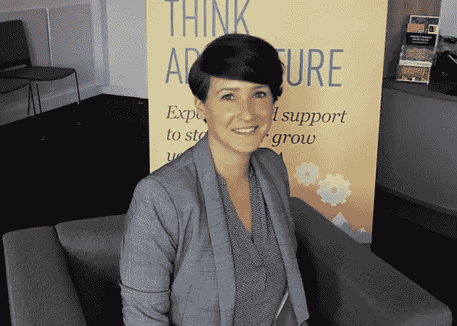
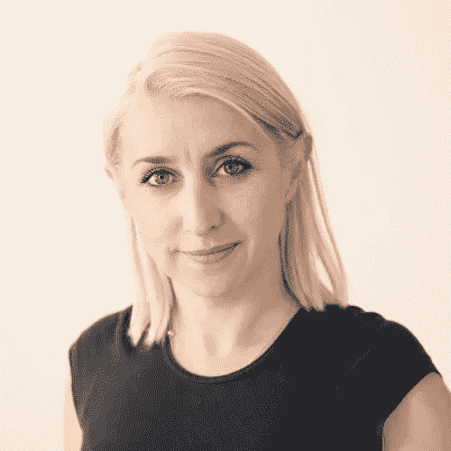
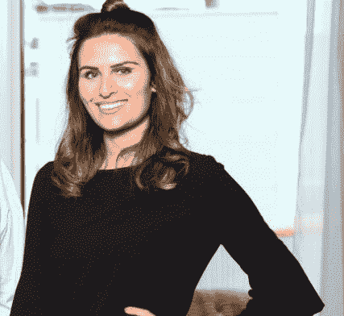
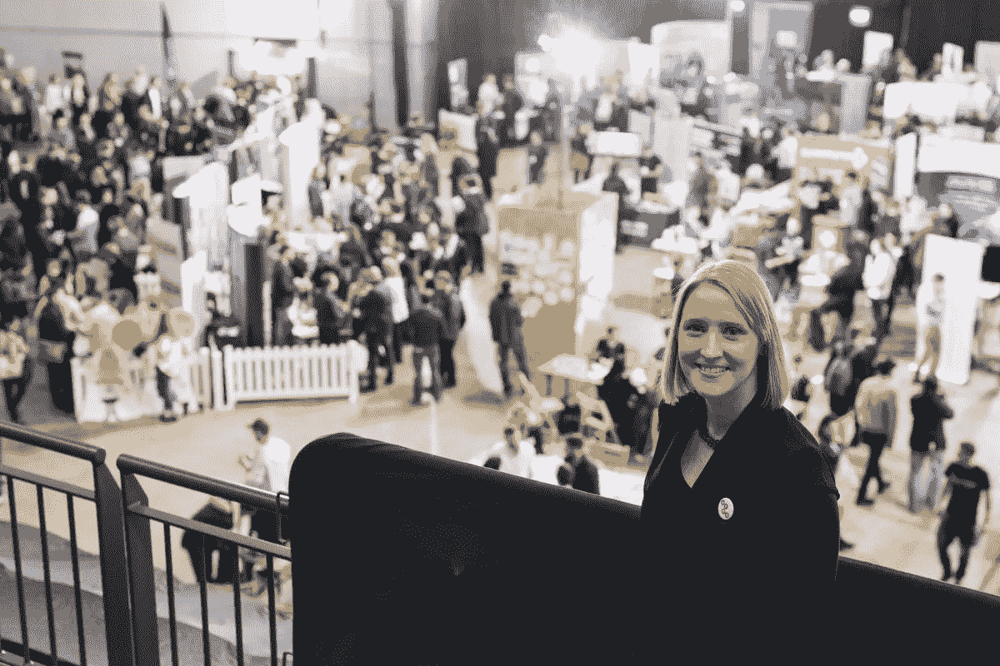
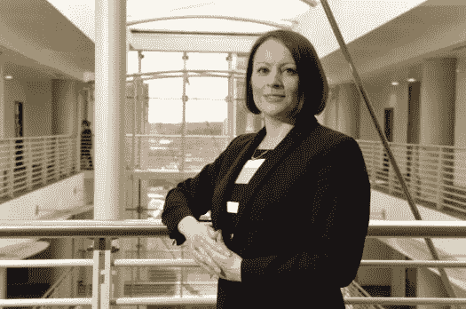
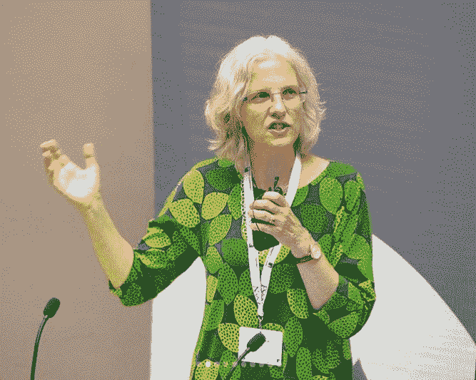

# 21 位女性科技领袖为英国北方科技摇旗呐喊

> 原文：<https://medium.com/hackernoon/21-female-tech-leaders-flying-the-flag-for-northern-tech-in-the-uk-f43df4af990e>

# 随着时间的推移，越来越多的杰出女性在科技领域崭露头角，并激励许多人效仿。英格兰北部正在成为一个充满活力的数字创新地区，很大一部分人真正加强了数字部门，其中包括女性。

# 在这篇博客中，我们认识到一些女性领导者在北方的技术社区做出了贡献。

**赞德拉·摩尔**

[**赞德拉**](https://twitter.com/zandramoore?lang=en) 是获奖软件公司——[**pan intelligence**](https://www.panintelligence.com/)(总部位于利兹)的 CEO。

Zandra 热衷于在技术领域赋予女性权力，并激励更多女性进入该行业。

她创建了利兹 Lean in women Circle，并定期就性别多样性和科技领域的女性发表演讲。赞德拉最近还入围了 [**前进女士奖**](https://www.panintelligence.com/resources/blog-posts/zandra-moore-shortlisted-in-the-national-women-in-business-awards/) 的“明日之星”类别。

Zandra 与 Panintelligence 的合作以及她在社区中的积极活动推动了该领域的发展，使她成为目前北方科技界最鼓舞人心的女性领导者之一。

梅丽莎·亨德利

梅丽莎是北方两家初创企业( [**兹莫维**](https://zimovi.com/success/) 和 [**VST 企业**](https://vstenterprises.com/) )的运营总监，最近她入围了今年的 Forward Ladies Awards 和 Summit 的 STEM 新星类别。

Melissa 非常热衷于推动利兹科技行业的进一步发展。她在最近的一次问答中说:“利兹有一个非常繁荣的科技领域，最重要的是有一个社区。这座城市每周都会举办数量惊人的鼓舞人心、富有教育意义的免费活动，这令人难以置信。帮助人们拓宽他们的联系，向他们的同行和先驱公司学习，并提供环境来建立合作是至关重要的。

在初等、中等和高等教育中推广和培养 STEM 科目和课程方面，利兹也有一些出色的举措；从暑期学校、实习、间隔年、工作场所拓展和学徒。"

**黛比·赫瑟林顿**

Deb 与 [**利兹贝克特大学**](http://www.leedsbeckett.ac.uk/) 的合作在一系列方面影响着北方的数字部门，从与大型项目的大规模知识转移合作，一直到与提供全方位大学服务的数字初创公司合作。

Deb 的主要项目是一个由欧洲资助的项目 [**，名为 Ad:venture**](https://ad-venture.org.uk/) ，为数字初创公司提供营销、业务规划、应用开发、指导、研讨会、资金等方面的帮助。Deb 能够会见对该项目感兴趣的公司，并对它们的业务进行全面诊断，以评估它们现在的状况、目标是什么，以及它们的增长障碍是什么。然后，她可以为他们创建一个由上述服务组成的业务支持计划。

以下是 Deb 对目前北部令人兴奋的数字领域的看法*“北部的数字领域目前确实是一个令人兴奋的地方，尤其是在利兹。有太多的事情正在发生，最好的部分是我们作为一个城市的协作程度——有了这样的协作和合作潜力，机会是无穷的。很高兴在这里看到如此多的女性科技领导者，她们高举多元化的旗帜，同样出色地完成了自己的工作；Panintelligence 的首席执行官赞德拉·摩尔、Sky 的技术负责人娜塔莎·赛斯-泽勒姆、Sky Bet 的工程经理塔尼亚·利希滕斯泰格等等。在北方，有一个强大的女性技术网络，她们也为希望在数字领域工作的年轻女性提供指导。为了保持我们在数字地图上的地位，留住我们大学培养的人才，教育下一代非常重要。”*

安娜·萨顿

安娜·萨顿在 2014 年和丈夫埃德一起建立了 [**数据仓库**](https://www.businessupnorth.co.uk/jobs-growth-for-leeds-data-services-business/) 。

[**数据仓库**](https://www.thedatashed.co.uk/) 整理和分析来自各种来源的数据，让客户更好地了解其客户的需求和期望。这个想法源于安娜对从她工作的组织内部的数据中获得洞察力的挫败感。Anna 和 Ed 经过讨论，决定开发一款产品，帮助非技术人员处理和分析他们自己的数据源。他们决心自筹资金，这意味着他们必须从别处寻找资金，于是这家咨询公司诞生了！

以下是她对经营自己的事业和成为一名女性领导者的看法，*“经营自己的事业永远不会无聊。在一个全新的行业中学习“在职”领导是一个巨大的挑战(尤其是在做母亲的同时)。最有成就感的是建立了一个优秀的团队，并确保我们有一个让我们都能茁壮成长的环境。”*

Anna 活跃于利兹数字社区，经常在定期的当地活动中发表演讲，包括《代码女士》,最近她还参加了技术之旅利兹活动的小组讨论。

娜塔莎·赛斯-泽勒姆

Natasha Sayce-Zelem 是 Sky 的技术主管，她被提名为目前英国 100 名从事技术工作的女性之一。

娜塔莎也是利兹 [**科技赋权女性**](https://www.yorkshirepost.co.uk/business/technology-event-in-leeds-will-encourage-more-women-to-take-up-careers-in-stem-1-9376132) 运动的创始人。该运动致力于展示在科学、数字和技术领域工作的鼓舞人心的榜样，以支持和吸引更多的女性进入该行业。

塔尼娅·利希滕施泰格

[**塔尼亚**](https://www.amsourcetechnology.com/news/a-q-and-a-with-tanja-lichtensteiger-of-sky-betting-and-gaming-81865940311) 是利兹 [**天空博彩**](https://www.skybetcareers.com/about-us) 的工程经理。Tanja 在创建系统方面拥有超过 17 年的经验。她是利兹科技社区的活跃成员，并积极支持全英国的女性科技工作者。Tanja 登上了 T[**he Northern Power Women ' s Future List 2018’**](https://www.northernpowerwomen.com/)，并荣获 2018 年 FDM 每一位科技女性奖！

黛比·阿什顿

(图:金融力量)

战略客户体验高级副总裁，[**FinancialForce.com 创始人。**](https://www.financialforce.com/)

黛比在 FinancialForce.com 业务的发展和持续成功中发挥了重要作用。

以下是黛比对于成为一名女性科技领导者的看法，*“作为 FinancialForce 的联合创始人，我非常幸运地有机会建立一家企业，在这里，文化、态度和价值观反映了我认为最重要的东西，能够为我们的团队和客户提供尽可能最好的体验。我们拥有非凡的灵活性，员工可以在工作之余平衡个人生活，超级员工福利专门为您提供津贴支出选择，以及多元化、完全包容和理解个人需求的文化。*

作为一名女性领导者，我非常自豪能够营造这样的环境，因为它贯穿于我们企业的核心 DNA。我为我们的文化感到非常自豪，并相信我们为科技行业的后代提供了一个绝佳的机会，金融力量是一个包容所有人的工作场所。”

**凯瑟琳·特罗特**

(图:曼彻斯特晚报)

凯瑟琳是 T2 T3 集团的技术总监。今年早些时候，她被曼彻斯特晚报**列为曼彻斯特科技界 30 名最佳女性之一。**

**在最近接受劳代尔采访时，凯瑟琳告诉读者她的父亲最初是如何激发她对技术的兴趣的。*“他是一名电子工程师，总是带回家一些小玩意和东西让我们尝试，从我 4 岁开始，我们就在家里到处敲电路板，所以我认为我对技术的兴趣是我父亲造成的，当我没有取得想要的成绩时，他鼓励我在大学学习技术！”***

**海伦·奥德姆**

****

**海伦是 NorthInvest 的创始董事。 这是一个总部位于约克郡的(非盈利)投资者平台，旨在加速科技初创企业以及金融科技、健康科技、媒体和优质科技领域的其他科技企业的发展。**

**Helen 和 North Invest 为科技企业提供支持，帮助他们实现目标和发挥全部潜力。**

**克洛伊·巴瑞特**

****

**(图片:Bdaily)**

**科技企业家克洛伊是数字牙科公司的创始人。**

**Digi 牙科是一个视觉学习平台，是一种先进的学习方式，使用增强现实和动画，针对所有学习领域。为了更好地加强和改变牙科教育。**

**克洛伊在 DigiDentistry 的鼓舞人心的工作使她在今年的英国伟大企业家奖中赢得了今年的' [**'年度年轻企业家'**](https://www.freshbusinessthinking.com/natwest-great-british-entrepreneur-awards-2018-finalists-the-north/) 。克洛伊还入围了数字企业家奖和英国科技创始人奖！**

**以下是克洛伊对于成为一名女性科技领袖的看法，*“我已经能够用科技创造出一些东西，这些东西将最终改变我们教育现在和下一代学习者的方式。我觉得作为一名女性科技创始人，这是改变生活的机会，有机会激励其他女性，鼓励她们创办自己的公司，证明我们都必须从某个地方开始，并以我们的经验为基础。”***

**艾米·德·巴尔西**

****

**(图片:布拉德福德电讯报)**

**[**Amy De Balsi**](https://www.amsourcetechnology.com/news/a-q-and-a-with-amy-de-balsi-founder-of-leeds-digital-73322811192) 于 2015 年推出 [**Herd 数字工作板**](https://herd.careers/) 。Herd 擅长从利兹当地雇主那里收集最好的数字和技术职位空缺，然后在社交媒体上将它们推给潜在候选人。**

**艾米还创办了 [**利兹数码招聘会**](https://www.amsourcetechnology.com/news/amsource-visits-leeds-digital-job-fair-64312122256) 。招聘会将一系列当地科技雇主聚集在第一个直接舞台上，持续一个下午。该活动让与会者听到公司推销为他们工作有多棒，在上次活动中有 500 多个工作机会。**

**该活动的五场活动吸引了成千上万的人前来参观。该展会为该地区有抱负的技术专业人士展示了大量的机会！**

**卢·科德威尔**

****

**(图:曼彻斯特晚报)**

**[**楼**](https://www.northernpowerwomen.com/portfolio/lou-cordwell-obe/) 是 [**磁北**](https://thisismn.com/) 的 CEO，这是一家总部位于曼彻斯特的屡获殊荣的独立数字设计公司。**

**除了日常工作之外，她还是大曼彻斯特本地企业合伙公司的董事会成员，曼彻斯特 设计公司 [**和奥布赖特**](https://designmcr.com/) 北部总监 [**的主席。**](https://www.allbrightcollective.com/)**

**楼因其对创意和数字经济的贡献而被授予 2018 年新年荣誉 英帝国勋章 [**。**](https://www.thedrum.com/news/2017/12/30/the-queen-s-new-year-s-honours-given-chiefs-magnetic-north-blippar)**

****法比奥拉·德塔利****

****

**[**法比奥拉**](https://twitter.com/fabioladetari) 是 Engagify 有限公司的创始人兼首席执行官。**

**法比奥拉已经认识到，全球有数百万人在与心理健康作斗争，而且缺乏心理学家来照顾每个人。法比奥拉和她的团队目前正在开发一种复杂的人工智能解决方案，以在全球范围内全天候支持员工心理健康— [**Sayge(即将推出)。**](https://twitter.com/Engagify_Sayge)**

**法比奥拉说:“无论年龄、性别或背景如何，科技领域对任何人的偏见都较少。我们需要世界上更多有远见的‘阿达·洛芙莱斯’来创造以前从未考虑过的产品，但一旦制造出来，就无法想象没有它的生活！”**

****艾玛·切希尔****

****

**(图片:DotForge)**

**艾玛是 FutureLabs 的联合创始人。Futurelabs 为公司提供一系列活动和服务，包括演讲和社交。促进协作、支持并最终将利兹的技术社区聚集在一起。**

**除此之外，艾玛还是 [**DotForge**](https://dotforge.com/) 的 CEO。DotForge 是一个为期 3 个月的加速器计划，总部设在利兹、马彻斯特和谢菲尔德，带领 Tech4Good 初创公司踏上从构思、推出到超越的支持之旅！**

**海伦·沃拉斯顿**

****

**海伦是 [**明智运动的首席执行官。**](https://www.wisecampaign.org.uk/)**

**自 2012 年成为首席执行官以来，海伦已经变得明智，并继续推动这场运动。**

**海伦是社会变革的倡导者，拥有公共、商业和非营利部门变革型领导的记录。在担任了七年平等机会委员会(Equal Opportunities Commission)的活动总监后，她创建了自己的咨询公司“应对自如”(Equal to the)，此前她曾为国家彩票慈善委员会(National Lottery Charities Board)管理约克郡地区。**

**黑泽尔·琼斯**

****

**(图:约克郡晚邮报)**

**黑兹尔是利兹 [**NHS Digital 的应用和可穿戴设备项目总监。**](https://digital.nhs.uk/)**

**黑兹尔和她才华横溢的团队是目前英国国民医疗服务体系中一些最具标志性创新的幕后推手。**

**NHS 应用程序库于 2017 年 4 月作为测试网站推出，提供了一个数字健康工具库，可供患者使用，值得信赖，易于使用，并帮助他们对数字健康和护理做出更好的选择。**

**Hazel 说*“应用程序库已经被证明是一个巨大的成功。去年有超过 25 万次访问，其中一半以上是通过手机进行的，这表明患者获得医疗保健的方式正在发生变化。”***

**安娜·巴斯比**

****

**(图片:首席信息官)**

**安娜·巴斯比是莫里森公司的首席技术官。**

**[**Anna Barsby**](https://www.cio.co.uk/it-leadership/new-morrisons-chief-technology-director-anna-barsby-reveals-her-plans-3655376/) 一直专注于提供业务增长的技术机会，并鼓励关键技能和人员加入超市零售商，作为其雄心勃勃的改进计划的一部分。**

**2015 年 [**首席信息官**](https://www.cio.co.uk/it-leadership/new-morrisons-chief-technology-director-anna-barsby-reveals-her-plans-3655376/) 100 名领导者和她的团队正在向云、数字和数据领域发起重大行动——敏锐地意识到超市后端系统和基础设施对支持其前端、面向客户的接触点的需求。**

**[**除了积极参与当地的学校活动**](https://www.cio.co.uk/cio100/2018/anna-barsby/)——这包括让莫里森的开发人员为当地一所女子学校的编码俱乐部提供培训——bars by 还在她的技术部门成立了一个多元化和包容性小组，她现在正在赞助整个业务。**

**娜奥米·廷伯利**

****

**(图:数字领袖)**

****娜奥米·廷伯利是索尔福德大学商学院的荣誉行业研究员，[**Tech North Advocates**](https://www.technorthadvocates.com/)的联合创始人，投资平台 Capital Pilot 的主席。****

****她被提名为 2015 年 [**玛莎拉蒂 100 强之一**](https://www.maserati.com/maserati/gb/en/others/Maserati-100)——这是一个明确的企业家名单，这些企业家从企业家的中心支持未来的企业家。娜奥米也是一名导师，并于 2015 年被欧洲指导和教练委员会提名为年度导师。****

****她是一名 TEDx 演讲者，也是一名经验丰富的伙伴关系和参与顾问，在英国各地建立了关系，专门从事技术和数字领域的工作。****

****娜奥米被计算机周刊《2017 年英国 IT 最具影响力女性》提名为后起之秀，并担任未来一切的董事会成员。****

****多恩·麦克洛林****

********

****多恩是 Ribbit Media Solutions 的首席执行官兼创始人。****

****她的公司专门从事脸书广告、移动钱包忠诚度解决方案和 Messenger Chatbot 营销，面向当地服务型企业，包括特许经营。****

****2016 年，Dorne 将 Ribbit Media 转变为今天的广告公司，但在此之前，她已经在脸书培训了 300 多名企业主，在她当地的 Halifax 镇举办商业研讨会，并建立了一个在线培训计划。今年 9 月，她应邀在德克萨斯州举行的世界上最大的 Messenger Chatbot 营销会议上发言，她在台上向 1000 多名代理商和营销人员发表了讲话。****

****我们问多恩，拥有一家数字广告公司最让她兴奋的是什么，她说…*“一个例子是——我们的一个客户担心他们在 2019 年没有婚礼预订，所以我们为他们建立了一个 Messenger Chatbot 营销漏斗，并将其与脸书广告相结合。在不到 3 个月的时间里，他们接受了 11，000 英镑的婚礼订金，总销售额约为。10 万英镑，而脸书的广告支出仅为 1600 英镑——这让我兴奋不已！凭借我们的数字技能，我们能够改变他人的生活，这种感觉真好”。*****

********

****杰玛·卡梅隆****

********

****杰玛是曼彻斯特合作数字公司的首席软件工程师。****

****Gemma 被科技国家称为“西北科技社区发电机”。****

****Gemma 对技术的热爱始于 8 岁时，当时她的父亲带回家一台笔记本电脑。然后她继续在大学学习计算机科学。****

****Gemma 对技术社区的承诺令人钦佩。周一至周五，她在 Co-op digital 创造了伟大的事情，建立了他们的工程社区。她在 co-op digital 之外的工作使她成为西北科技领域的一个重要组成部分。****

****Gemma 是 Hack Manchester 的创始人，Hack Manchester 是一家非营利活动组织公司，通过为所有年龄的人举办研讨会和活动来促进、庆祝和教授技术技能，从而展示和惠及技术社区。****

******珍妮特·凯德教授******

********

****珍妮特在利兹大学管理营养流行病学小组。****

****珍妮特是我的食物的幕后策划人。一项开创性的在线技术，帮助研究人员、教师和卫生专业人员测量食物和营养摄入。****

****Janet 说，*“用过时的方法测量食物和营养摄入的挫败感促使我开发了一种使用在线技术的新方法(Myfood24 );利用数据的力量交付高质量的循证结果。对这样一个系统的需求导致了 2017 年膳食评估有限公司的成立，我是该公司的创始人和董事。*****

*****我对这家公司有很强的方向和愿景，我们认为它迫切需要为 NHS(以及世界各地的其他医疗服务机构)提供一个系统，让患者记录他们的食物摄入量，以生成营养摄入结果，并与他们的营养师或医生/护士分享。我们已经证明，我们不仅有一个有效的跟踪饮食的系统，而且这可以为患者带来更好的健康结果，并得到卫生保健专业人员的支持。”*****

****[最初发表于此。](https://www.amsourcetechnology.com/news/21-female-tech-leaders-flying-the-flag-for-northern-tech--82774122736)****