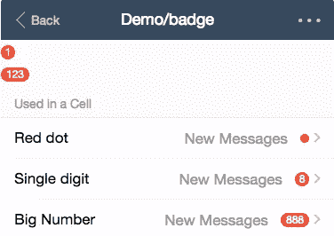

# 应用程序的 21 个顶级 Vue.js UI 框架和库

> 原文：<https://medium.com/hackernoon/21-top-vue-js-ui-libraries-for-your-app-4556e5a9060e>

## 基于 2019 年最佳 Vue UI 组件库和框架列表的[第 1 部分](https://blog.bitsrc.io/11-vue-js-component-libraries-you-should-know-in-2018-3d35ad0ae37f)和[第 2 部分](https://blog.bitsrc.io/best-vue-js-ui-frameworks-and-component-libraries-part-2-4196628d58ae)的完整主列表。

随着星球大战的激烈进行，Vue.js 最近在 GitHub 明星数量上超过了 [React](https://hackernoon.com/tagged/react) 。根据 NPM 的数据，虽然在下载数量上仍然落后于 React，但 Vue.js 的受欢迎程度似乎正在增长。

像 React 一样，Vue 最好的特性之一是能够使用隔离的和模块化的组件来组合你的 UI。为了帮助您更快地构建下一个应用程序，这里有一些 2019 年最好的 UI 组件库。

**提示**:使用 [**Bit 的组件平台**](https://bitsrc.io) 你可以把任何组件变成你可以从其他项目使用的 API，甚至可以用 NPM 安装，0 重构。您还可以与团队协作并共享收藏。

 [## 用代码组件进行位共享和构建

### Bit 帮助您在项目和应用程序之间共享、发现和使用代码组件，以构建新功能和…

bitsrc.io](https://bitsrc.io) 

了解更多信息:

[**我们如何构建微前端**](https://blog.bitsrc.io/how-we-build-micro-front-ends-d3eeeac0acfc) 和[**我们如何构建设计系统**](https://blog.bitsrc.io/how-we-build-our-design-system-15713a1f1833) **。**

# 1.使虚弱

这个 11K stars 流行库提供了超过 80 个 Vue.js 组件，这些组件是根据 Google 的材料设计指南实现的。Vuetify 支持跨平台的所有现代浏览器，包括 IE11 和 Safari 9+(使用 polyfills)，并且自带 8 个 vue-cli 模板。

 [## vuetifyjs/vuetify

### Vue 化-vue . js 2 的材料组件框架

github.com](https://github.com/vuetifyjs/vuetify) 

# 2.类星体框架

在超过 6K 颗恒星的情况下，Quasar 是一个用于构建 Vue.js 驱动的响应网站、pwa、混合移动应用程序和电子应用程序的流行框架。Quasar 还支持 HTML/CSS/JS 缩小、缓存破坏、树抖动、源映射、代码分割和延迟加载、ES6 传输、林挺和开箱即用等功能。

 [## 类星体框架/类星体

### 类星体-类星体框架

github.com](https://github.com/quasarframework/quasar) 

# 3.元素

近 28K 星，元素是一个 Vue.js 2.0 UI 的 Web 工具包。凭借强大的社区和 350 名贡献者，该库提供了丰富的可定制组件选择，以及完整的风格指南和更多资源。

 [## 元素/元素

### element—vue . js 2.0 Web 用户界面工具包

github.com](https://github.com/ElemeFE/element) 

# 4.Vue 材料

6K stars vue-material 是一个简单的库，实现了 Googles 的材质设计。该库还提供了一个 webpack 样板、Nuxt.js 的 SSR 模板和一个 HTML 文件来启动这个框架。这里有一些 [CodeSandBox 示例](https://codesandbox.io/s/github/vuematerial/examples/tree/master/examples/quick-start)来帮助你开始。

 [## 真空材料/真空材料

### vue-Material-vue . js 的材料设计

github.com](https://github.com/vuematerial/vue-material) 

# 5.Keen-UI

在近 3.5K 星级，keen-ui 是一个由材料设计启发的 Vue 组件集合。Keen UI 不是 CSS 框架。因此，它不包括网格系统、排版风格等。相反，重点是需要 [Javascript](https://hackernoon.com/tagged/javascript) 的交互组件。

 [## 约瑟夫·佩/基恩·伊

### keen-UI——一个轻量级的基本 UI 组件集合，用 Vue 编写，灵感来自材料设计

github.com](https://github.com/JosephusPaye/Keen-UI) 

# 6.布埃菲

在 3k stars 这个库提供了基于[布尔玛](https://bulma.io/)的 Vue.js 轻量级 UI 组件，这是这个库仅有的两个内部依赖。库的大小大约是 60KB min+gzip(包括布尔玛)。您可以查看 [live docs 网站](https://buefy.github.io/#/documentation/start)并在 Codepen 上玩代码。

 [## 布埃菲/布埃菲

### buefy -基于布尔玛的 Vue.js 轻量级 UI 组件

github.com](https://github.com/buefy/buefy) 

# 7.自举 Vue

在超过 5K 的 stars 上，bootstrap-vue 为 Vue.js 提供了 Bootstrap 4 组件和网格系统的实现，并带有自动化的 WAI-ARIA 可访问性标记。这里有一个[在文档中浏览组件](https://bootstrap-vue.js.org/docs/components/alert)的快速链接。

 [## 自举-vue/自举-vue

### BootstrapVue 提供了 Bootstrap 4 组件和网格的最全面的实现之一…

github.com](https://github.com/bootstrap-vue/bootstrap-vue) 

# 8.Muse-UI

超过 6K 的 stars，Muse 是 Vue 2.0 的另一个 MD 库，提供超过 40 个 UI 组件和可定制的主题。这些文件主要是中文的，但大部分是不言自明的。项目得到了积极的开发和维护。

 [## museui/muse-ui

### muse-ui——vue js 2.0 的材料设计 UI 库

github.com](https://github.com/museui/muse-ui) 

# 9.AT-UI

近 1.5K 星，AT-UI 提供了一个模块化的前端 UI 框架，用于开发基于 Vue.js 的快速 web 界面，适合桌面应用。有了 NPM +网络包+巴别塔前端开发工作流程和独立的 CSS 样式，这个库值得一试。

 [## AT-UI/at-ui

### at-ui——一个清新扁平的 ui 套件，专门用于桌面应用，由 Vue.js 2.0 用♥制作

github.com](https://github.com/at-ui/at-ui) 

# 10.Vux

Vux 是一个基于 WeUI 和 Vue 2.0 的流行社区库，拥有超过 13K 颗星。该库还支持 webpack + vue-loader + vux 工作流。这里的[文档](https://vux.li/)也是中文的，直播的[社区中心](http://webpack + vue-loader + vux)也是中文的。

 [## airyland/vux

### vux -基于 Vue 和 WeUI 的移动 UI 组件

github.com](https://github.com/airyland/vux) 

# 11.iView

在近 16K 星级，iView 提供了几十个 UI 组件和小部件，用 Vue.js 构建，风格简洁优雅。iView 被广泛采用，[积极维护](https://www.iviewui.com/docs/guide/update-en)，并自带 [CLI 工具](https://github.com/iview/iview-cli)帮助以可视化方式创建项目。这个值得一试。

 [## iview/iview

### iview——基于 Vue.js 2.0 构建的高质量 UI 工具包

github.com](https://github.com/iview/iview) 

# 12.Uiv

在“只有”550 颗星的情况下，Uiv 是 Vue 2 的 Bootstrap 3 组件库。所有组件加起来大约 20KB，唯一的外部依赖项是 Vue 和引导 CSS。支持基于 Webpack 的工作流。

 [## wxsms/uiv

### 由 Vue 2 实现的 uiv - Bootstrap 3 组件。

github.com](https://github.com/wxsms/uiv) 

# 13.武伊吉特

At 1K stars vuikit 是一个用于网站界面的响应式 Vue UI 库，具有干净一致的设计。当图标和主题作为单独的包发布时，库被构建为由 Yarn 工作空间管理的“monorepo”。

 [## vuikit/vuikit

### vui kit——一个用于网站界面的响应式 Vue UI 库

github.com](https://github.com/vuikit/vuikit) 

# 14.温泉 UI + Vue

基于流行的 Onsen-UI 框架，的这些 Vue 绑定提供了包装核心 web 组件的组件，并公开了一个类似 Vue 的 API。温泉 UI 组件也被设计成对道具作出反应。

 [## Vue.js 2+ -温泉 UI

### 了解如何在 Onsen UI 中使用 Vue.js。

温泉城](https://onsen.io/v2/guide/vue/) 

# 15.语义 Ui + Vue

这个项目基本上是流行的语义 UI 框架的 Vue.js 集成。仍在开发中，该库提供了一个类似于 Semantic-UI 的 API，以及一组可定制的主题。参见[示例](https://jsfiddle.net/pvjvekce/)。

 [## 语义 UI Vue

### 语义 UI Vue 是语义 UI 的 Vue 集成

semantic-ui-vue.github.io](https://semantic-ui-vue.github.io/) 

# 16.Fish-UI

尽管“只有”500 颗星和 3 个贡献者，fish-ui 提供了一个基于 Vue 的网络工具包，有着整洁干净的组件。该库支持 ES2015 + Webpack 工作流程。文档不是很好，但是设计是不容忽视的。欢迎你来看一眼。

 [## 米亮/鱼-ui

### fish-UI-A vue . js 2.0 UI Web 工具包

github.com](https://github.com/myliang/fish-ui) 

# 17.薄荷 UI

在超过 11K 星的情况下，Mint-UI 为 Vue.js 提供 UI 元素，带有用于构建移动应用的 CSS 和 js 组件。全部导入后，压缩后的代码只占用大约 30kb (JS + CSS)的 gzip 空间。支持单个组件的导入。这里有一个[快速演示](http://elemefe.github.io/mint-ui/#/)。

 [## ElemeFE/mint-ui

### mint-UI-vue . js 的移动用户界面元素

github.com](https://github.com/ElemeFE/mint-ui/) 

# 18.框架 7 Vue

这种集成提供了 Framework7 的几乎所有元素和组件，并集成了 Framework7 路由器，以一种 Vue 可完成的方式呈现页面。图书馆正在[的积极开发](https://github.com/framework7io/framework7-vue)和维护中。

 [## 框架 7 Vue

### 借助 Vue.js 的强大功能和简单性，将组件语法、结构化数据和数据绑定引入 Framework7

框架 7.io](https://framework7.io/vue/) 

# 19.多维数据集用户界面

At over 3K stars cube-ui 是一个用于 Vue.js 移动应用的 ui 组件库。所有组件都经过单元测试，并且该库还支持[后编译](https://didi.github.io/cube-ui/#/en-US/docs/post-compile)和按需组件导入。Cube-UI 仍在积极开发中。

 [## 滴滴/立方-ui

### cube-ui - :large_orange_diamond:一个由 Vue 实现奇妙的移动 ui 库

github.com](https://github.com/didi/cube-ui) 

# 20.武布鲁

在 1.5K stars，vueblu 是一个基于 Vue 2.0 和[布尔玛](https://bulma.io/)的 UI 组件库，专为构建中后台产品而打造。它支持 ES2015 和 NPM+网络包+巴别塔工作流，并提供可定制的主题。

 [## chenz24/vue-blu

### 基于 Vue.js(2.x)和布尔玛的 vue-blu - UI 组件库

github.com](https://github.com/chenz24/vue-blu) 

# 21.蚂蚁设计公司

在 1.5K stars 上，这个用于 [Ant design](https://ant.design/) 的 Vue.js 集成是为开发企业级后端产品而构建的，该产品具有几十个实现 Ant design 的组件，并支持基于 Webpack 的调试构建解决方案，该解决方案支持 ES6。注意，已经有一段时间没开发了。

 [## 奥科阿拉/武埃-安特德

### vue-antd - Vue UI 组件& Ant。设计

github.com](https://github.com/okoala/vue-antd) 

# ⭐️荣誉奖

[Primevue](https://github.com/primefaces/primevue) ， [n3-components](https://github.com/N3-components/N3-components) ， [vuikit](https://vuikit.js.org/) ， [Kendu UI Vue](https://www.telerik.com/kendo-vue-ui) ， [Office Fabric-Vue](https://github.com/aidewoode/office-ui-fabric-vue) ， [vuestrap](http://kzima.github.io/vuestrap-base-components/#/) ， [vueboot](http://morgul.github.io/vueboot/) ， [framevuerk](http://framevuerk.com/) ， [Vue WeUI](http://aidenzou.github.io/vue-weui/#!/) ， [Vue-MDC](https://github.com/posva/vue-mdc) …评论补充更多！:)

# 了解更多信息

 [## 我们如何构建微前端

### 构建微前端来加速和扩展我们的 web 开发过程。

blog.bitsrc.io](https://blog.bitsrc.io/how-we-build-micro-front-ends-d3eeeac0acfc)  [## 我们如何建立一个设计系统

### 用组件构建一个设计系统来标准化和扩展我们的 UI 开发过程。

blog.bitsrc.io](https://blog.bitsrc.io/how-we-build-our-design-system-15713a1f1833)  [## 如何在 React 中写出更好的代码

### 在 React 中编写更好代码的 9 个有用技巧:了解林挺、propTypes、PureComponent 等等。

blog.bitsrc.io](https://blog.bitsrc.io/how-to-write-better-code-in-react-best-practices-b8ca87d462b0)  [## 在 React 中加快开发的 5 个工具

### 加速 React 应用程序开发的 5 个工具，侧重于组件。

blog.bitsrc.io](https://blog.bitsrc.io/5-tools-for-faster-development-in-react-676f134050f2)  [## 2018 年你应该知道的 11 个 Javascript 实用程序库

### 11 个有用的 Javascript 实用程序库，加速您的开发。

blog.bitsrc.io](https://blog.bitsrc.io/11-javascript-utility-libraries-you-should-know-in-2018-3646fb31ade)