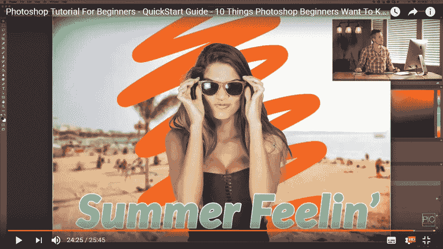
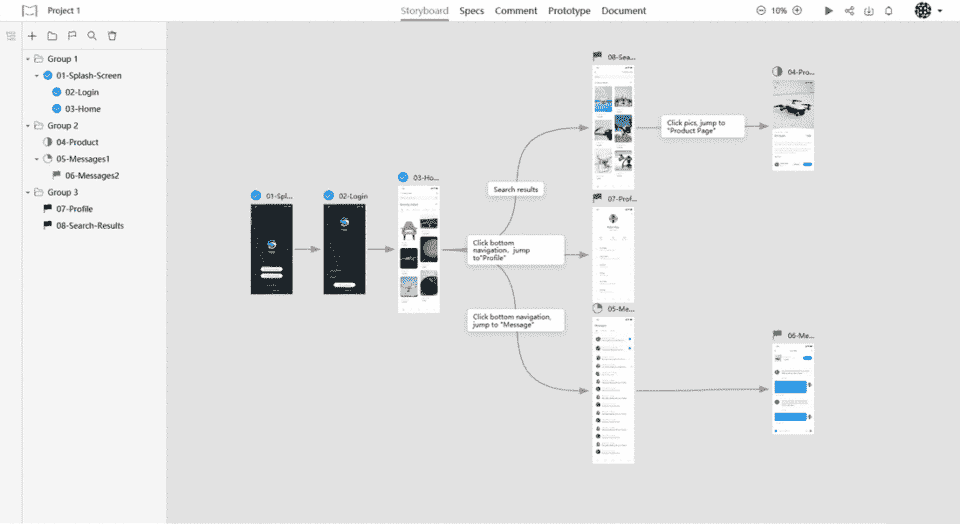

# 22 个最佳免费 Adobe Photoshop 入门教程

> 原文：<https://medium.com/hackernoon/22-best-free-step-by-step-adobe-photoshop-tutorials-for-beginners-18b182bd7831>

介绍了 22 个免费的 Adobe Photoshop 初学者教程，帮助设计师快速学习 Photoshop 的基础知识、技巧和窍门。

Adobe Photoshop 是一款非常棒的照片编辑工具，是大多数专业设计师和摄影师的必备工具之一。对于 UI 设计师来说，Photoshop 是帮助他们**创作出出色的网页/应用设计的基本工具之一。**

但是，作为一个 UI 设计新手或者专家，自由地学习和使用 Photoshop 并不是一件容易的事情。这个图像编辑工具偶尔会更新，用户必须掌握全新的照片编辑和操作技巧。

今天，Mockplus 为您连接了 **22 个最好的免费分步 Adobe Photoshop 教程**，让您从一开始就快速学习和掌握 Photoshop 的技巧、窍门和窍门:

*注意一篇文章总是有结尾的，可以展示的内容有限。但是，这并不意味着你必须受到它的限制。其实在这篇文章中，所有的 Photoshop 教程都会从四个方面进行介绍，为你提供一个有用的学习 PS 的线索或者方法，系统的提升你的 PS 技能。好吧！让我们一个一个来看看:*

# 首先，基本的 Photoshop 教程为初学者打下坚实的基础

# 1.Photoshop CC 2018 —初学者完整教程[概述]

**评分** : ★★★

**出版时间**:2017 年 10 月 28 日

**浏览量**:287305

顾名思义，本教程是 Photoshop CC 2018 的概述。您将学习基本的工具栏/窗口/选项信息以及 Photoshop 的基本技能。

这是一个很好的视频教程，它为您提供了 Adobe Photoshop 的概述，并为进一步的学习奠定了坚实的基础。

[Youtube 教程](https://www.youtube.com/watch?v=FvFq1eGKUTY)

# 2.初学 Photoshop 快速操作教程——快速简单的方法

**评分** : ★★★

**出版时间**:2017 年 7 月 19 日

**浏览量**:915722

你是否在寻找简单快捷的 Photoshop 教程，供初学者快速学习和掌握 PS 技巧？这个教程正是你要找的。它详细说明了照片处理的基本概念，并允许您快速学习和掌握基本的 Photoshop 照片编辑技能。

[Youtube 教程](https://www.youtube.com/watch?v=5fGl0eiWIZs)

# 3.了解 Photoshop — Photoshop 入门课程

**评分** : ★★★

它以简单的分步格式提供配有视频的文本教程，指导您使用 Photoshop。它提供了许多关于 Photoshop 的教程主题，如“更改图像大小”、“使用图层”、“调整图像质量”等等。

[在线观看](https://helpx.adobe.com/photoshop/how-to/ps-basics-fundamentals.html)

# 4.Photoshop 初学者教程—快速入门指南—Photoshop 初学者想知道的 10 件事

**评分** : ★★★

**出版时间**:2016 年 7 月 12 日

**浏览量**:114271

本教程不仅介绍了 Photoshop 的基础知识，还列出了初学者想知道如何在 Photoshop 中做的 10 件事。如果你不知道从哪里开始，这是一个不错的选择。

[Youtube 教程](https://www.youtube.com/watch?v=2307e8iGDo0)

# 5.Photoshop CC 2018 教程—专为初学者设计

**评分** : ★★★★

**出版时间**:2018 年 2 月 5 日

**浏览量**:56863

本视频教程旨在向您展示如何使用 Photoshop 2018 CC。作为一个 Photoshop 初学者，你将通过这个全面的视频教程学习 PS 2018 CC 的基础知识。例如，它向您介绍了基本的工具栏、工具、选项和使用工作窗口、使用图像层以及如何绘制/模糊/锐化图像等。

[Youtube 教程](https://www.youtube.com/watch?v=BMNVYzckSPU)

# 二、简易 Photoshop 教程，供初学者学习 PS 效果、技巧和窍门

一旦你掌握了 Photoshop 的基础知识，下一步就是学习更多的 Photoshop 效果、技巧和窍门来增强你的设计:

# 6.28 个惊人的 Photoshop CC 技巧、窍门和窍门

**评分** : ★★★★

出版时间:2015 年 9 月 30 日

**浏览人数**:1130848

即使这个教程是几年前出版的，它仍然非常有用。它介绍了多达 28 个惊人的 Photoshop CC 提示，技巧和黑客，这将有助于优化您的照片和打磨您的用户界面设计技能有效。

[Youtube 教程](https://www.youtube.com/watch?v=41mFIjCGkNg)

# 7.初学 Photoshop 教程:10 个简单的照片效果和技巧

**评分** : ★★★

**出版时间**:2016 年 11 月 14 日

**浏览量**:13910

在这个 YouTube Photoshop 教程中，你可以学习 10 个简单的照片效果和技巧来改善你的照片。您在本教程中学习的技能和技巧对于任何 UI 设计初学者和摄影师来说都是必不可少的和有用的，例如分割 RGB 颜色毛刺效果、柔和梦幻的发光效果、褪色的黑色胶片外观、漏光效果、经典的黑白效果等。这是一个完美的 Photoshop 教程，可以帮助你在很短的时间内提高 PS 技能。

[Youtube 教程](https://www.youtube.com/watch?v=XmPixGf7GTE)

# 8.扩散效果— Photoshop 教程

**评分** : ★★★

**出版时间**:2017 年 12 月 12 日

**浏览量**:337961

通过这篇 Photoshop CC 初学者教程，你将学习如何创建一个分散效果和解体效果。

[Youtube 教程](https://www.youtube.com/watch?v=lhdxVVLCIjY)

# 9.Photoshop 中的电/闪电效果

**评分** : ★★★

**出版时间**:2018 年 1 月 25 日

**浏览量**:123437

通过本教程，你将一步步学习如何在 Photoshop 中创建酷炫的电/闪电效果，制作出有趣又抢眼的照片。

这个视频教程也非常吸引人和有趣，这使得用户的学习过程更加容易和愉快。

[Youtube 教程](https://www.youtube.com/watch?v=kSFSDvKJISQ)

# 10.Photoshop 教程—光绘文本效果

**评分** : ★★★

出版时间:2017 年 12 月 5 日

**浏览人数**:216403

在本教程中，您将学习如何轻松地在 Photoshop 中使用浅色绘画效果优化您的文本或徽标设计。

[Youtube 教程](https://www.youtube.com/watch?v=pjKq2p2Rj5o)

# 11.在 Photoshop 中混合多个图像

**评分** : ★★★

**出版时间**:2016 年 6 月 26 日

**浏览量**:271779

在这个 YouTube PS 教程中，你将学习在 Photoshop 中混合多个图像的基本技巧。因此，只要按照它的一步一步的指导，学习如何混合模式和图层蒙版，以及调整图层和渐变映射。

[Youtube 教程](https://www.youtube.com/watch?v=Pr2jx62_k-g)

# 12.开始使用 Photoshop 效果的 10 个步骤

**评分** : ★★★

**出版时间**:2017 年 4 月 13 日

**浏览量**:39924

好的 3D 效果可以增强文本/网站/应用程序/照片设计。

在本教程中，您将学习如何使用 Photoshop 通过 10 个步骤创建原始 3D 对象或将现有图形转换为 3D 对象。这是一个非常好的技术，可以显著改善你的网站/应用/照片设计。

[Youtube 教程](https://www.youtube.com/watch?v=u5crxEaZHkY)

# 13.如何在 Photoshop 中制作 Logo

**评分** : ★★★

**出版时间**:2017 年 1 月 27 日

**浏览量**:684193

即使是 Photoshop 初学者，你是否也想在 Photoshop 中制作自己的 logo？本教程提供了一个非常实用的在 Photoshop 中创建专业标志的解决方案。

[Youtube 教程](https://www.youtube.com/watch?v=NVKju7nZvDI)

# 14.如何在 Photoshop 中创建卡通效果—矢量艺术(简单技巧)

**评分** : ★★★

**出版时间**:2017 年 4 月 12 日

**浏览量**:696883

通过这篇 PS 教程，你将轻松学会如何使用 Photoshop 中的钢笔工具来创建卡通效果。

[Youtube 教程](https://www.youtube.com/watch?v=VuQhhg_y22E)

# 15.初学者涂抹油画——涂抹 Photoshop 教程

**评分** : ★★★

**出版时间**:2017 年 4 月 1 日

**浏览人数**:37140 人

通过本教程，你将了解如何在 Photoshop 中制作照片油画涂抹效果。这种效果是打造优雅复古照片的好选择。

[Youtube 教程](https://www.youtube.com/watch?v=Ey4d9yIgv3Q)

# 第三，最新精彩的 Photoshop 教程，提升你的技能和灵感

下一批教程将把你的技能和创造力提升到一个新的水平:

# 16.Photoshop 中的霜冻效果

**评分** : ★★★

**出版时间**:2017 年 12 月 28 日

**浏览量**:739230

观看本教程，学习如何创建一个具有科幻设计风格的华丽照片/UI 设计的霜冻效果。使用这种技术，你可以很容易地“冻结”照片/设计中的任何对象。

[Youtube 教程](https://www.youtube.com/watch?v=ImjX7O6PN5A)

# 17.透明衣服效果— Photoshop 教程

**评分** : ★★★

**出版时间**:2017 年 6 月 17 日

**浏览量** : 500，313

透明布料或文字效果在 web/app UI 设计中被广泛使用。这个教程向你展示了如何为你的照片/用户界面设计创建一个透明的布料效果。初学者学一些东西很简单，超级好。

[Youtube 教程](https://www.youtube.com/watch?v=EvazECoMvrM)

# 18.初学 Photoshop 教程:面部幻灯片效果

**评分** : ★★★

**出版时间**:2017 年 9 月 10 日

**浏览量**:92754

通过这个 YouTube Photoshop 教程，你将很容易学会如何在 Photoshop 中创建独特的面部幻灯片效果。您将学习导入两个不同的图像，调整图像层，并完成一些更简单的步骤来创建这个效果。

[Youtube 教程](https://www.youtube.com/watch?v=FC48gsKkwN0)

# 19.如何在 Photoshop 中创建逼真的烟雾效果

**评分** : ★★★

**出版时间**:2017 年 7 月 17 日

**浏览量**:83432

烟雾效果在 web/app UI 设计中非常新潮。学习如何在你的照片/用户界面设计中添加华丽的烟雾效果。

[Youtube 教程](https://www.youtube.com/watch?v=qCGMVjoZhJU)

# 20.寒颤衰减效果— Photoshop 教程

**评分** : ★★★

**出版时间**:2017 年 10 月 7 日

**浏览人数**:673045

通过这个 Photoshop 教程，你可以学习如何使用遮罩、滤镜和免费 PS 笔刷快速轻松地创建一个令人不寒而栗的腐烂效果。

[Youtube 教程](https://www.youtube.com/watch?v=Vfz0hDdYl0A)

# 第四，用 Photoshop 插件拓展你的 PS 技能

Photoshop 插件经常被设计师和摄影师用来优化/简化他们的照片编辑/设计过程。最后但同样重要的是，看看下面这些 Photoshop 插件教程，拓展你的 PS 设计技能:

# 21.2018 年 5 大免费 Photoshop 插件

**评分** : ★★★

**出版时间**:2018 年 1 月 12 日

**浏览量**:60829

本教程将向您展示如何使用前 5 名免费 Photoshop 插件(包括 30 个图案，主题切换器和 PixelSquid)来增强您的照片设计。

[Youtube 教程](https://www.youtube.com/watch?v=pg4hDHNNTz8)

22.[**mock plus iDoc**](https://idoc.mockplus.com/?hmsr=cherrymedium)**Photoshop 插件**

[https://d3h2k7ug3o5pb3.cloudfront.net/video/ps_en....](https://d3h2k7ug3o5pb3.cloudfront.net/video/ps_en.mp4)

顺便说一下， [Mockplus iDoc](https://idoc.mockplus.com/?hmsr=cherrymedium) 的另一款出色的 Photoshop 插件(一款面向 UI 设计师、开发者和产品经理的更简单、更快速、更智能的在线设计协作工具)也可以帮助用户轻松地将带有切片和规格细节的设计从 Photoshop 导出到 Mockplus iDoc。它可以加速您的设计过程，并轻松增强您的设计协作。

总之，不管你是 UI 设计新手还是专家，上面的教程都会有适合大家的。

# 包裹

简而言之，我们希望这个为初学者准备的 **Photoshop 教程列表**能够帮助你提高你的 Photoshop 技能。

对了，不管 UI 设计新手还是专家，永远记住一点:工具只是工具。它们是用来改进而不是限制你的设计的。

考虑到这一点，在不同的设计阶段选择最合适的设计工具是非常重要的。

比如在绘制和讨论 UI 设计草稿的时候，使用 Photoshop 或者 Sketch 都是不错的选择。

嗯，当涉及到你的 web/app 设计原型时，Mockplus ( [一个快速易用的原型工具](https://www.mockplus.com/))是一个不错的选择。

当然，在设计实现和移交阶段，你最好选择[一款优秀的在线设计协作工具](https://idoc.mockplus.com/?hmsr=cherrymedium)，比如帮助你轻松有效地与开发者和 MPs 沟通协作的 Mockplus iDoc。