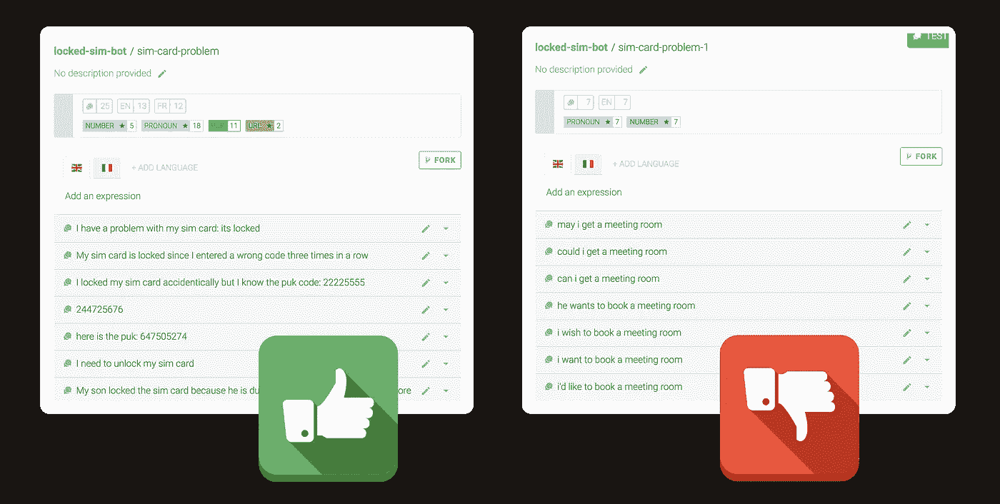
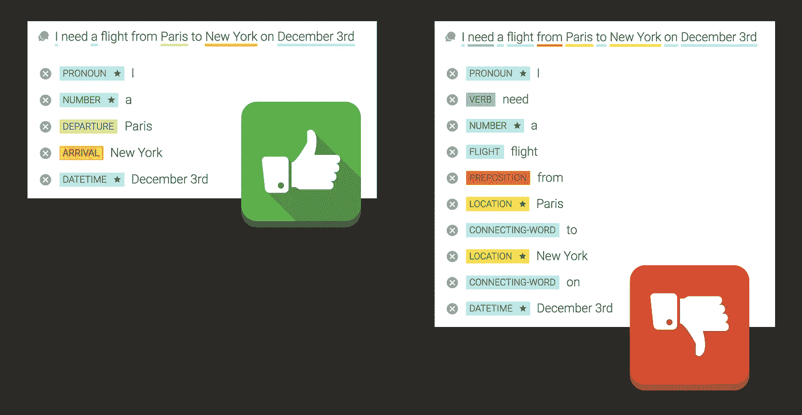
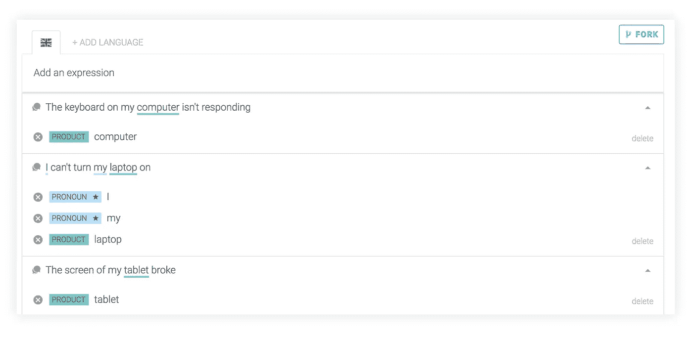
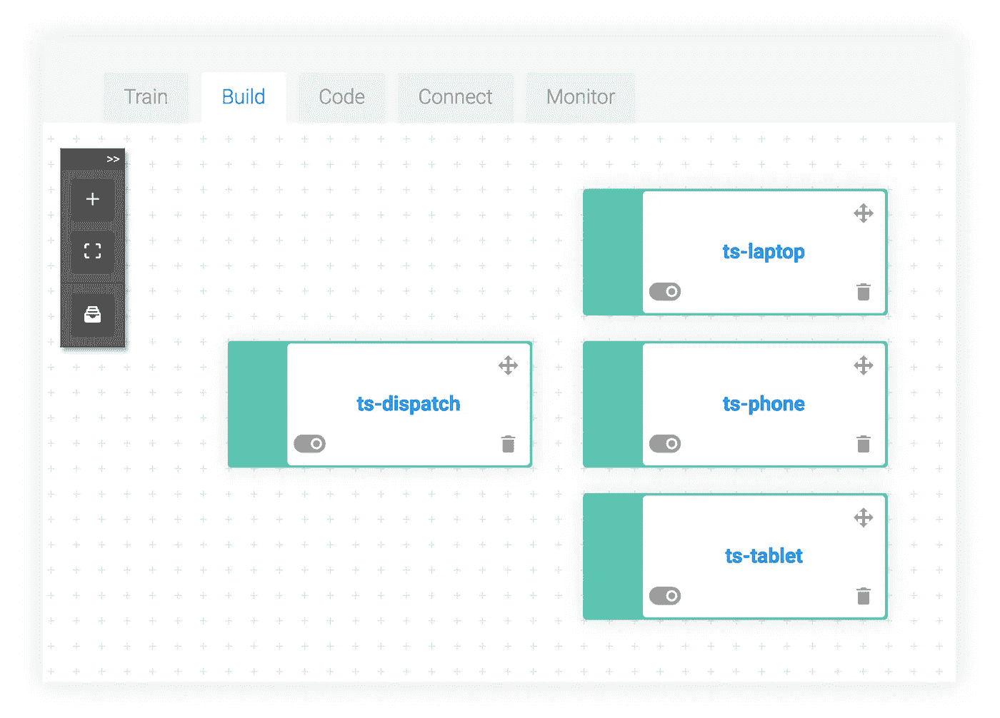
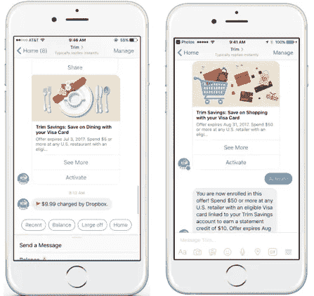

# 打造终极聊天机器人的 22 个步骤

> 原文：<https://medium.com/hackernoon/22-rules-you-should-never-break-when-building-a-bot-ddb2efcac70d>

## 在本教程中，我们将带您了解在 bot 建设的每个阶段(概念、培训、建设或连接)中最常见的错误。

建造一个机器人是一次有益的经历:创造你自己的人工智能是惊人的！然而，这可能是一个挑战，也有错误要避免。在这篇文章中，我们将带你了解新的 bot 建设者在 bot 建设的每个阶段最常见或最具破坏性的错误:概念，培训，建设，连接，用户体验和维护。我们走吧！

# 构思

构建一个机器人并不是从第一行代码开始。它开始得更早，在受孕期间。

在第一步中，定义聊天机器人的用例很重要。你希望它解决什么问题？你的业务需求是什么？我们经常看到人们说“我想要一个机器人来做这件事”，但是当我们深入挖掘时，我们意识到一个不同的机器人实际上可以更有效地解决这个问题。如果您想创建一个聊天机器人来管理客户关于退货政策的问题，但后来意识到这些查询还不到您全球总量的 2%，您可能想切换到另一个主题。所以，从业务问题开始，然后从那里开始构建。

既然您已经建立了现实生活中的业务需求，那么 bot 对话流应该如何解决它呢？我们通常做的是拿出一个画板，把所有的对话流程画出来，从头到尾。对所有的可能性进行建模可以让你确保每个主题都被涵盖，并给开发者一个需要做什么的好的概述。这也是创建用户体验的第一步，我们将在后面讨论。现在，只要记住每次对话应该是 3 到 4 次交流，不要超过。

在这一步，记住你的观众:谁是将与你的机器人交谈的最终用户？你必须做出对他们有用的东西。

不要忘记在你的构思中包括闲聊。所有聊天机器人都应该理解并回复一些与其任务无关的话题:笑话、天气问题、“你好吗”，甚至是“你愿意嫁给我吗”或其他令人讨厌的话题。如果你想让用户对这种体验感到满意，一定要做好准备。但是不用担心，我们在 [SAP 对话人工智能](https://cai.tools.sap/)上提供预先训练的闲聊技能。

**建造机器人时不要做什么:**

> ***1。将其视为不重要的步骤***
> 
> ***2。从你想要的开始，而不是从你需要的开始***
> 
> ***3。错误地理解机器人的最终用户是谁，并设计他们不会欣赏的体验***
> 
> ***4。不包括闲聊等常见问题***

# 培养

训练机器人是决定其性能的最重要因素。糟糕的训练将不可避免地导致聊天机器人表现不佳和用户沮丧。

基于你在构思过程中创造的流程，训练包括创造意图并用表达来填充它们。如果你对意图和表达的概念感到不舒服，[这篇文章](https://cai.tools.sap/docs/concepts/intent)应该能帮到你。但是这里有一些有助于良好训练的东西。

每个意图中的表达数量是至关重要的。五个不够，你应该去 50+。SAP 对话式人工智能在小数据集上工作得非常好，但我们仍然需要一些信息。这些句子应该是多种多样的，应该来自最终用户。永远不要只和开发和项目团队一起训练你的机器人:他们太了解技术术语了，以至于不能准确地代表实际使用机器人的人。

标记实体也有一些规则。实体是你需要在一个句子中检测出来提取信息的关键词(这里的重点是“提取信息”)。你不需要标记每一个名词、形容词或单词，因为你可以！实体的作用是提取可以在代码中使用的相关信息。只标记那些。但是，要避免使用仅由一个实体单词组成的句子(例如，“Paris”是一个完整的句子)。任何意图都可以检测到该实体，这可能会导致检测问题。

大型机器人的一个常见的最佳实践是联合使用意图和实体。最好创建一个全局意图并使用实体来指定用户请求，而不是创建非常具体的意图，因为它们重叠时分类器会混淆。

Here, the global intent is troubleshooting, but entities detect which product isn’t functioning.

**构建机器人时不要做的事情:**

> **5。每个意图的表情少于 50 个**
> 
> **6。由不是最终用户的人来训练你的机器人**
> 
> **7。将句子中的每个单词标记为一个实体**
> 
> **8。当不使用提取的信息时，将单词标记为实体**
> 
> **9。只有实体的表达式(如“巴黎”)**
> 
> **10。创建非常具体的意图，而不是使用实体来理解主题**

# 建筑物

构建 bot 通常被认为只是构建对话流。这是有趣的部分！这是万物复苏的时候。然而，这可能是一个可怕的过程。

首先要明白的是，使用多种技能完成一项任务是可以的。一项技能不一定等于一个完整的过程。创建一个“超级技能”是一个很好的解决方案，他的工作是将用户输入分派给正确的技能。

In our troubleshooting (ts) example, a mega-skill redirects to the different skills that manage the specific procedures

如果你的触发技能相互重叠，这也是一个解决方案。如果出现问题，一定要使用调试控制台中的日志来了解问题的来源。

**构建机器人时不要做的事情:**

> **11。坚持“一项技能=一项任务”的理念**
> 
> **12。不利用平台的调试工具**

# 连接和用户体验

当连接您的机器人时，您必须决定它将在哪里对您的用户可用，因此要致力于用户体验。为了提供一个愉快的 UX，有几件事需要知道，第一件事是:你的机器人必须看起来漂亮。一个有吸引力的机器人有很多按钮、图形元素、高清图片、颜色和良好的个性，这一切都不同。

但是你如何得到它呢？

首先，当你选择频道时，要考虑你的观众。如果你的目标是 50 到 65 岁的人群，你可能不会把你的机器人放在 Kik 上！不要试图把你的观众吸引到一个他们不使用的频道，即使它更好。相反，在用户已经存在的地方集成机器人。

然后，记住聊天机器人是一个对话界面。对话是互动交流；因此，你的机器人不应该回复长篇大论的文本块(超过 60 个字符是越来越长)。将回复分成不同的信息，根据你使用的频道使用图像、按钮、列表和其他 UX 组件，使其生动活泼。创造有益的对话也很重要:你的机器人不是联邦调查局特工。没有人想在得到答案之前被问 20 个问题。相反，创建你的流量和 UX，每 3 或 4 次交流提供一个答案，以保持用户参与。

由于我们的机器人构建工具提供了强大的自然语言处理 API，我们的用户倾向于通过语言做任何事情。虽然这令人钦佩，但我们仍然建议多样化:提供卡片、按钮和其他图形元素以实现交互性和易用性，但仍要确保整个流程可以使用自然语言来完成。这时用户就知道你的机器人是真的了。

给你的聊天机器人赋予个性是必要的，但是你必须找到正确的平衡。我们总是建议让你的用户知道他们在和一个机器人说话。简直就是期望管理！一个人与另一个人交谈会期望最高水平的互动，而一个人与机器人交谈会知道他们不能问任何事情。然而，不要让它太机器人化:给它一个名字，一个图像，并使用微笑和语调，使它令人难忘。

**构建机器人时不要做的事情:**

> **13。错误识别您的观众正在使用的频道**
> 
> **14。创建对话，用户必须回答 4 个以上的问题才能获得第一个答案**
> 
> 15。发送文本块作为回复(超过 60 个字符太多)
> 
> **16。丢弃所有 UX 元素(按钮、卡片、列表等)，只关注文本**
> 
> **17。把你的机器人变成人类**
> 
> 18。没有赋予你的机器人吸引观众的个性

# 维护

一旦你的机器人投入生产，你的工作还没有完成！维护你的机器人是其长期成功的重要组成部分。这主要包括微调你的培训和监测你的用户说什么，以适应你的流程或创建新的用例。

训练时，要谨慎进行。虽然通过日志提要添加新的用户句子很重要，但是您不希望让您已经创建的已经起作用的培训失去平衡。不要添加所有新的表达方式来掩盖你的意图，只添加必要的内容。请记住，所有的意图都必须接受同样的训练！如果一个意图有 100 个表达，而另一个有 10 个，那就不好了。因此，在分配新表达式时，请定期检查。在改进您的培训数据方面，我们的培训分析是您最好的朋友！

最后，您的日志提要是您可以看到用户在谈论什么的地方。你有没有发现用户经常提出的问题，而你的机器人还没有解决？为什么不把它融入你的心流呢？这是向你的社区展示他们使用的机器人总是努力提供良好体验的最好方式。

**构建机器人时不要做的事情:**

> **19。认为一旦机器人投入生产，你的工作就完成了**
> 
> **二十。用新的用户表达溢出意图，搞乱你现有的培训**
> 
> **21。在你的意图规模中制造不平等**
> 
> **22。不去关注人们是如何使用你的机器人的**

有了这些想法，你就可以全力打造第一个超级机器人了！如果你准备更进一步，这个循序渐进的教程[可以指导你完成实际的过程。](https://cai.tools.sap/blog/build-your-first-bot-with-sap-conversational-ai/)

快乐大厦！