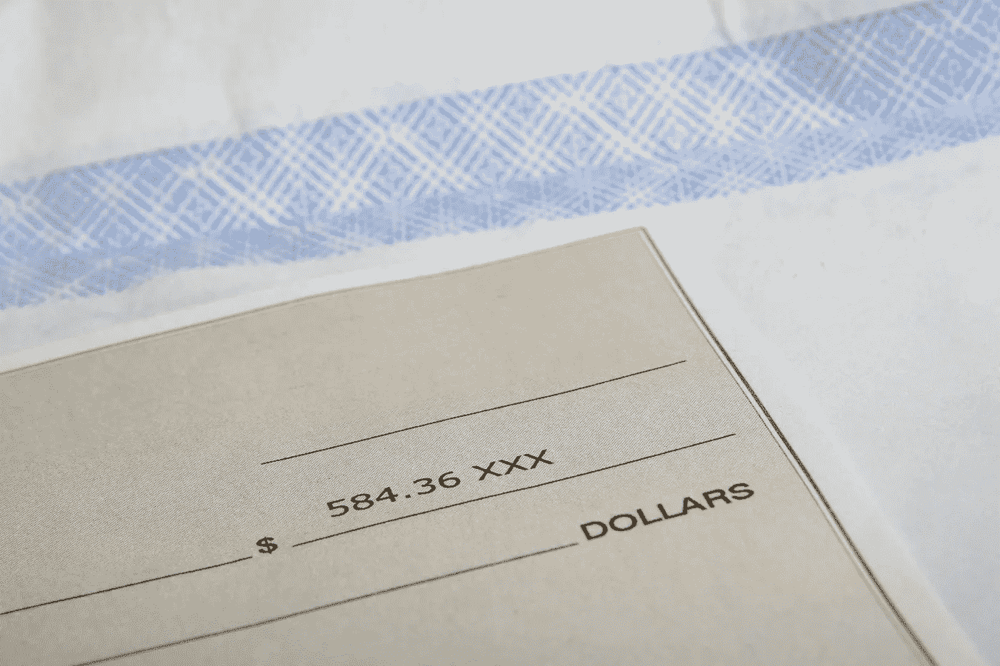

# 23/04/2018:BlockEx 的《密码世界最大的故事》

> 原文：<https://medium.com/hackernoon/23-04-2018-biggest-stories-in-the-cryptosphere-by-blockex-952cdea9ea97>

**1。阿联酋主要银行采用区块链解决支票欺诈**

就资产规模而言，迪拜国家银行(NBD)是中东最大的银行集团之一，它正在[通过在支票发行系统](http://www.arabianbusiness.com/banking-finance/394273-dubais-biggest-bank-goes-live-with-cheque-blockchain-project)中使用区块链来打击支票欺诈。这个名为 check Chain 的成功项目使 NBD 成为该地区第一家采用这种技术的银行。每张支票上都印有二维码，然后记录在区块链上。新系统提高了安全标准和支票的真实性。在阿联酋 NBD 未来实验室的监督下，之前已经启动了一个试点项目。这个系统已经注册了近一百万个支票簿页面。[利用区块链平台与阿联酋其他金融机构](https://www.emiratesnbd.com/en/media-centre/media-centre-info/?mcid_en=598)合作的方案目前也在考虑之中。这一消息是在[发布“阿联酋区块链战略 2021”](https://hackernoon.com/13-04-2018-biggest-stories-in-the-cryptosphere-13b12d2272a3)之后发布的。

**2。台湾将于 11 月实施加密法规**

台湾司法部长邱太三[希望在 11 月](https://www.ccn.com/taiwan-calls-for-aml-measures-for-cryptocurrency/)前实施一套针对加密货币的法规，以打击洗钱。内政部、中央银行和调查局等机构都将参与起草这些规则。泰三在台湾金融服务联盟主办的金融业反洗钱会议期间分享了该计划。此前已有两家虚拟货币运营商受到政府法务部门的邀请，讨论虚拟货币运营问题。后者计划在 11 月底了解一个“控制机制”，届时总部设在台湾的亚太反洗钱组织将开始运作。

**3。通过自有区块链推广 dApps 的消息提供商线**

日本通讯巨头 Line 希望通过自己的区块链平台推动 dApps 的创建。在 2018 年开发周期间，CTO Euivin Park 概述了该公司通过基于“激励型信息服务”的 dApps 创建令牌经济的努力。该公司还将促进 dApp 服务的开发，这些服务不会在 Line 的平台上进行，同时也将在未来创建自己的区块链 mainnet。为了实现它的计划，Line 正在增加开发者的数量。之前[也曾报道过](/swlh/04-04-2018-biggest-stories-in-the-cryptosphere-a629288889f5)在区块链开设了一家名为 Unblock 的子公司。

**4。关于禁止印度密码公司银行服务的争议**

我们之前[报道过](/swlh/10-04-2018-biggest-stories-in-the-cryptosphere-5f736d5cf78d)许多人在等待印度最高法院对加密货币的裁决。印度央行印度储备银行(RBI)的不明确性也被提出。印度储备银行现在被指控违反宪法，因为它阻止金融实体向任何从事虚拟货币交易的人提供服务。这导致印度储备银行、该中心和商品及服务税(GST)委员会收到了德里高等法院的通知。预计将在 5 月 24 日前得到答复。这个问题始于 Kali Digital ecologies Pvt Ltd 想要在印度领土上推出一个加密交易所，它与 RBI 的关系因禁令而破裂，禁令有 3 个月的执行期。不仅有人呼吁取消禁令，还呼吁商品及服务税委员会制定法规，以减少目前的不确定性。

> 本新闻综合报道由 [BlockEx](http://bit.ly/BlockEx_) 为您带来。

> *要想在你的邮箱里收到我们的每日新闻综述，请在这里注册:*[*http://bit.ly/BlockExNewsRoundup-Updates*](http://bit.ly/BlockExNewsRoundup-Updates)