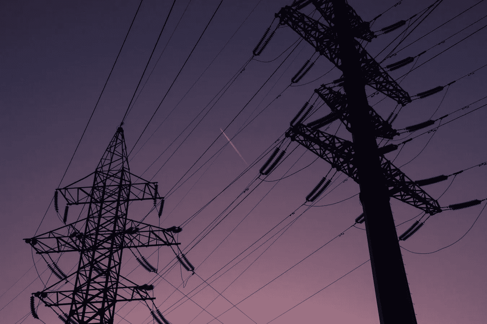
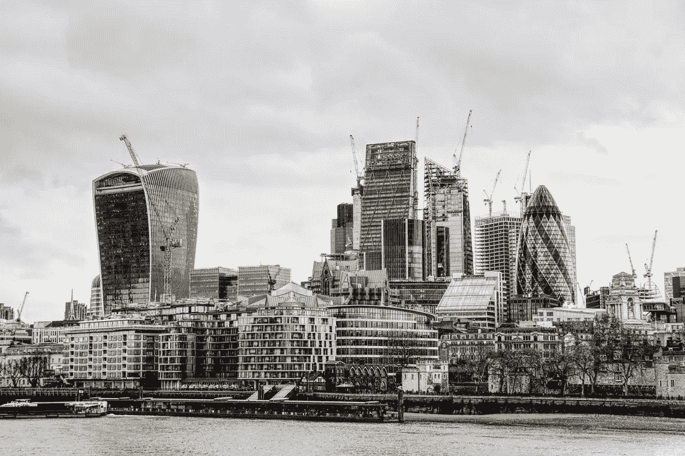
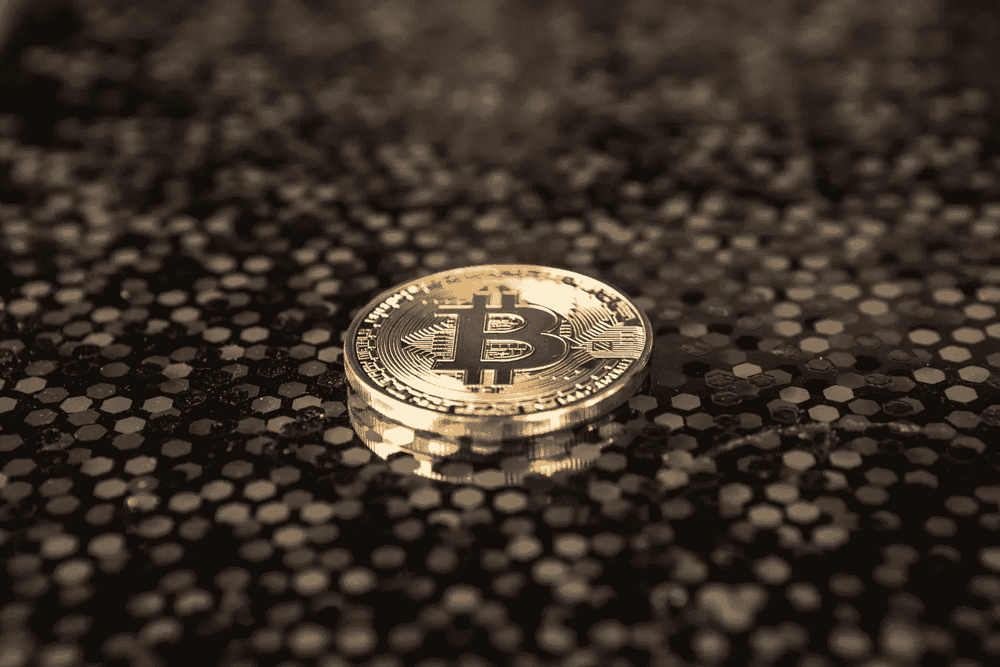

# 2018 年 8 月 23 日:神秘领域最大的故事

> 原文：<https://medium.com/hackernoon/23-08-2018-biggest-stories-in-the-cryptosphere-9c0ce9f0653e>

通过 BlockEx

**1。研究人员称银行消耗的能量是比特币的 3 倍**

匹兹堡大学的清洁能源技术研究员 Katrina Kelly-Pitou [称](https://bitcoinist.com/banks-consume-energy-bitcoin/)银行消耗的能量是比特币的三倍。然而，人们不发布这个是因为他们没有考虑到所有的因素。她[证实](https://phys.org/news/2018-08-energy-bitcoin.html)围绕比特币的网络电力消耗及其对环境的影响的辩论正在以错误的方式进行。凯利-皮图接着说，真正的问题不应该是消耗了多少能源，而是谁在生产能源，能源来自哪里。她不否认比特币的高消费。然而，她指出，银行业消耗约 100 太瓦，比比特币采矿所需的多三倍。即使比特币“成熟了 100 多倍”，它仍将占总能源消耗的 2%。研究人员总结说，人们应该专注于减少比特币的碳产量。

**2。加密公司从英国监管机构获得电子货币许可证**

英国金融监管机构金融行为监管局(FCA)已经[向加密公司 Wirex](https://www.financemagnates.com/cryptocurrency/news/uk-watchdog-grants-third-e-money-licence-to-cryptocurrency-company-wirex/) 授予了电子货币许可证，该公司的主要产品是加密支付卡。这是英国金融管理局颁发的第三个电子货币许可证。Wirex，以前被称为 E-coin，推出了一种预付费借记卡，允许将加密货币转换为英镑、欧元和美元。这使得用户可以使用加密货币支付日常开支。该产品支持超过 50 种替代币，包括莱特币。他们还提供一个名为 W-Pay 的支付网络。Wirex 联合创始人 Dmitry Lazarichev 表示，该许可将带来“简化的服务，甚至可能比我们目前提供的费率更低”。除了授予电子资金许可证，FCA 还一直在为金融科技公司管理一个沙箱，包括 [BlockEx](https://www.blockex.com/) 。我们目前正在[开发数字债券服务](https://www.blockex.com/news/blockex-launches-innovative-digital-bond-service-and-enters-fca-sandbox-as-part-of-path-to-uk-authorisation)。

**3。又一名美国政客承认投资加密技术**

民主党众议员 Tulsi Gabbard 的财务披露表显示，她在去年早些时候投资了加密货币，大约在比特币大幅下跌期间。夏威夷州第二选区的国会女议员在去年 12 月购买了价值 1001 至 15000 美元的乙醚和莱特币，这在美国众议院的[文件](http://clerk.house.gov/public_disc/financial-pdfs/2017/10021311.pdf)中有所显示。然而，加巴德并不是唯一投资加密货币的人。事实上，这份名单还包括众议院司法委员会主席鲍勃·古德拉特，他拥有 17，000 至 80，000 美元的比特币、比特币现金和以太。这一消息是在 5 月份由于弗吉尼亚共和党的年度财务披露而被披露的。

> 这是由 [BlockEx](http://bit.ly/BlockEx_) 为您带来的新闻综述。

> 要想在你的邮箱里收到我们的每日新闻综述，请在这里注册:[*http://bit.ly/BlockExNewsAndUpdates*](http://bit.ly/BlockExNewsAndUpdates)