# 启发你的 23 个视差滚动网站的最佳例子

> 原文：<https://medium.com/hackernoon/23-best-examples-of-parallax-scrolling-websites-to-inspire-you-d5334181fd85>

有 23 个视差滚动网站的例子，具有惊人的视差效果。一个免费的很酷的地方，可以为 UI/UX 设计师获取灵感。

想设计一个看起来很酷，有创意，让人印象深刻的网站？你可以在你的网站上添加很多效果和特性，其中之一就是滚动视差效果。视差滚动网站可以让你的网站鹤立鸡群。如果你渴望**视差滚动网站**的设计灵感，请继续阅读。我挑选了 2018 年视差滚动网站的 23 个最佳例子。

# 1.蛇蝎美人

*红颜祸水*是一家专注于文化、奢侈品、编辑和艺术的创意工作室。网站包含动画互动页面，激发公众的情感。向下滚动时，背景和文本会利用视差效果发生变化。

[参观现场](https://www.femmefatale.paris/en/project/tati-express)。

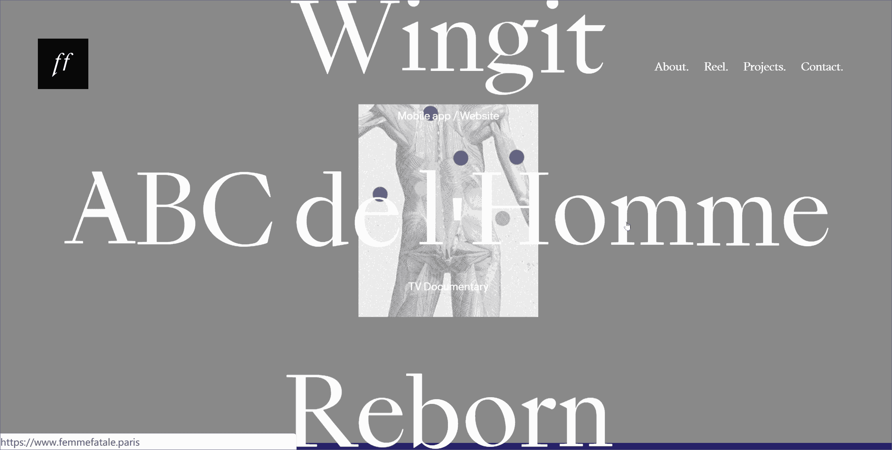

# 2.每一滴

*最后一滴*教你每天消耗多少水。设计者将进度条分成相等的比例。当向下滚动时，你会遇到日常生活中不同的场景，这些场景具有动画视差效果的风格。页面“宇宙”也有 3D 视差效果。

[参观现场。](http://everylastdrop.co.uk/)

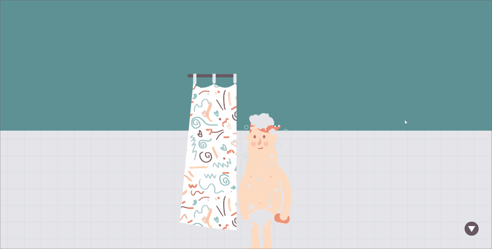

# 3.啤酒营

整个网站包括 5 层完全不同的视差滚动效果。它不是水平或垂直的，它是一种专门的平滑和缩放效果。当你滚动时，每一层都放大到屏幕上，没有剪切；这一点，加上明亮的颜色和大胆的排版，创造了一个惊人的空间感。

[参观现场。](http://2011.beercamp.com/)

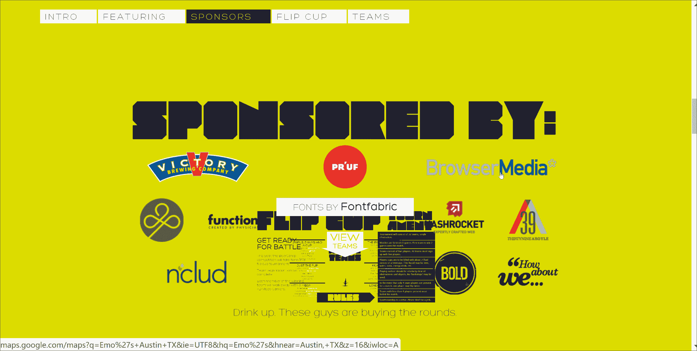

# 4.保时捷进化

Porschevolution 专注于保时捷品牌，展现了对汽车的热情。整个体验建立在十年的基础上——合适的音乐和显示保时捷发展的视差滚动照片。屏幕左侧有一个时间轴；当你滚动屏幕时，你会看到每年的豪华车型号都在变化。

[参观现场。](http://porschevolution.com/)

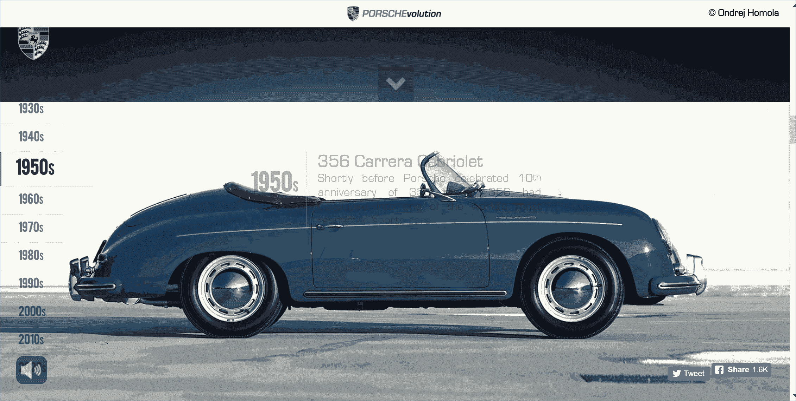

# 5.轮辐

*Spokes Eclectic pedic cab Rides*为停车和公共交通提供了一个即时解决方案，它不仅环保且价格合理，而且为橡树崖的自行车友好型、以社区为中心的文化提供了有趣而独特的服务。该网站有卡通风格和惊人的视差效果。顶栏导航与 UI 背景元素无缝协作。

[参观现场。](http://www.spokespedicabs.com/)

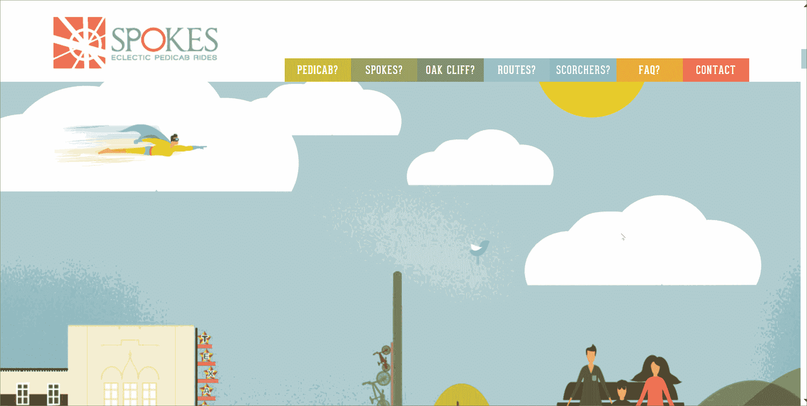

# 6.热点

*热点*与上面的例子完全不同——它展示了[水平滚动](https://www.mockplus.com/blog/post/horizontal-scroll/?r=trista)的使用。当你滚动时，页面从左向右移动，带有平滑的 3D 视差效果+,完全适用于纯黑背景。这个网站也是响应式移动优先设计的一个好例子。屏幕底部有可点击的 CTA。

[参观遗址。](http://hotdot.pro/)

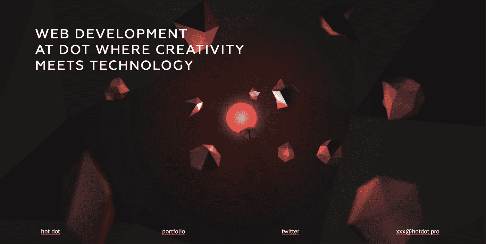

# 7.霍博洛博

这张也是因为水平视差效果有点不一样。它适用于触摸设备。滑动触摸板时，页面从左向右移动，告诉你一个惊人的故事。在屏幕的顶部有一个页面列表，它和页面一起滑动来显示你在哪里。这个网站是完全卡通化的，有着出色的 3D 视差效果。

[参观现场。](http://hobolobo.net/)

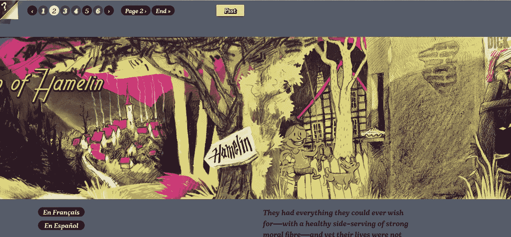

# 8.消防观察

《火眼金睛》讲述了一个发生在怀俄明荒野的神秘故事，在那里，你唯一的情感生命线是手持收音机另一端的那个人。该网站有 6 个移动层，以创造一种深度感。仅在第一个屏幕上采用视差效果。

[参观现场。](http://www.firewatchgame.com/)

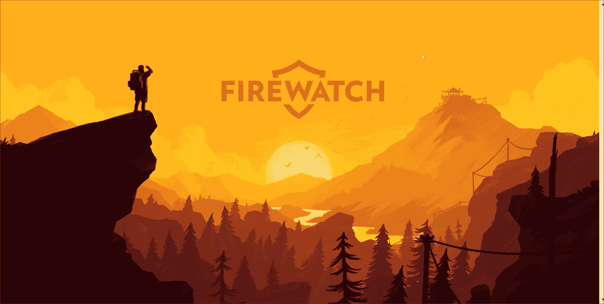

# 9.Nizo 应用程序

这绝对是我的最爱之一。当你滚动的时候，所有的 UI 元素有节奏地向页面的中心聚集。当你向后滚动时，所有的元素都从中间分开，直到你看到最后，它们仍然保持完整。整个风格干净简单，纯色和[粗体字体](https://www.mockplus.com/blog/post/typography-web-design/?r=trista)。

[参观现场。](http://nizoapp.com/)

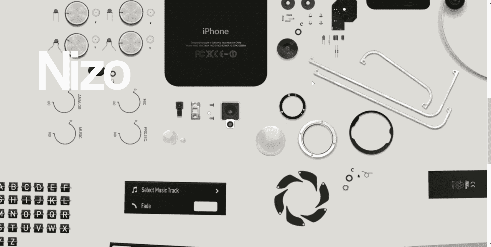

# 10.主要经营汽车）

*标致*向下滚动给你看一个惊人的故事。使用视差滚动，漫画会自动播放。这个故事很好地用水平和水平视差效果的混合来表现。

[参观现场。](http://graphicnovel-hybrid4.peugeot.com/start.html)

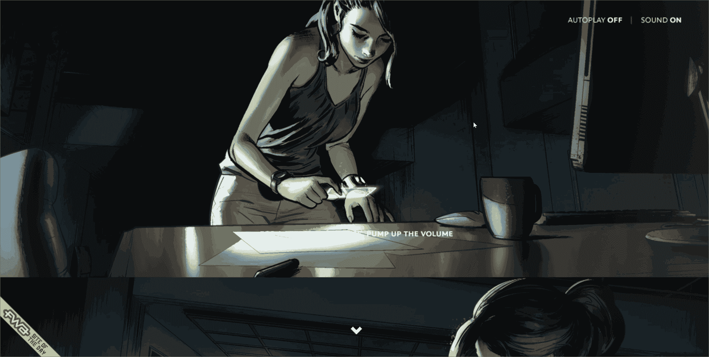

# 11.文凯

文凯是一个日本网站。向下滚动时，有一个可爱的卡通女孩在页面上移动，显示不同的信息。视差效果在最后一个屏幕结束，所以你可以不受干扰地阅读所有信息。

[参观工地。](http://bunkai-kei.com/special/Elect-LO-nica/)

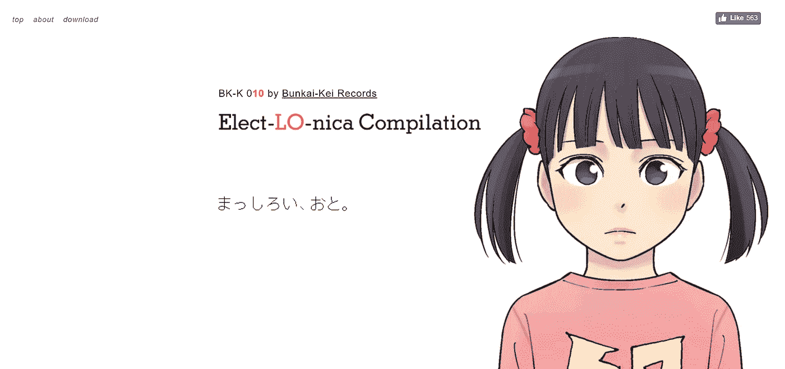

# 12.梅勒妮·戴维

在 *Melanie Daveid，*你可以体验一个精彩、丰富的数字世界。它融合了令人惊叹的美学、微妙的细节和品牌设计。页面被分成两部分，左边是一个固定的面板，右边是滚动条。用这位设计师的话说，“艺术品和插图是我进入创意产业的大门。”

[参观遗址。](http://melaniedaveid.com/)

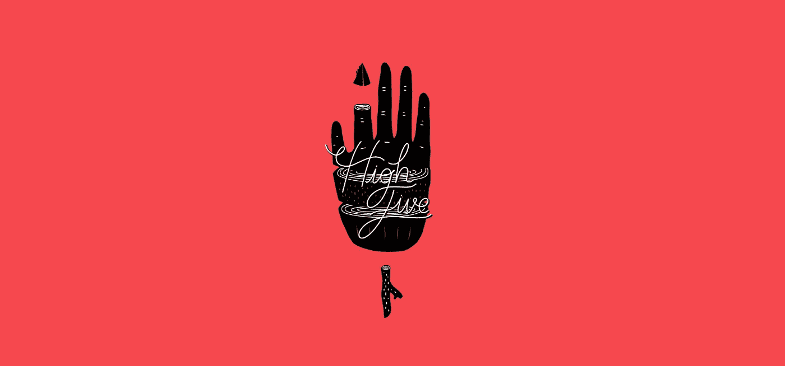

# 13.船

多么神奇的故事。总共有 6 个章节，页面的视差幻灯片演示采用了各种移动视差层来创建深度感。右边的导航栏代表了故事的六个章节。当您浏览每一章时，视差效果有助于阅读书籍的外观和感觉。结合背景动画，营造出深度感和生活感。我们就是喜欢这种风格的平面设计。

[参观遗址。](http://www.sbs.com.au/theboat/)

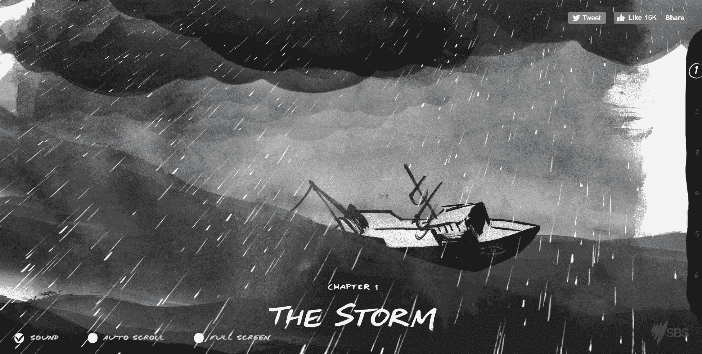

# 14.戴夫·加马什

是一个纯 UI 背景的视差网站演示。当你向下滚动时。你可以看到元素淡入淡出。更重要的是，有一个手机可以在你滚动的时候旋转。

[参观现场。](http://davegamache.com/parallax/)

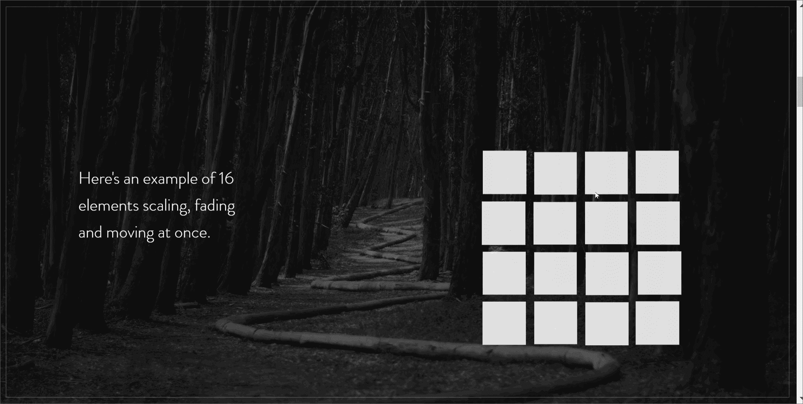

# 15.装配

Assemble 是一个免费的在线投资组合网站，在这里你可以制作令人敬畏的投资组合项目。在 18 个漂亮的主页的网格结构中使用卡片是非常明智的，当你向下滚动时，会显示出互动的轻微反弹。网格结构展示了 18 个美丽的主页，而视差效果在你滚动时提供了互动的轻微反弹。整个界面优雅、干净、醒目。

[参观现场。](http://preview.themeforest.net/item/assemble-a-contemporary-portfolio-theme/full_screen_preview/16966325?_ga=1.252040970.2030903852.1492146072)

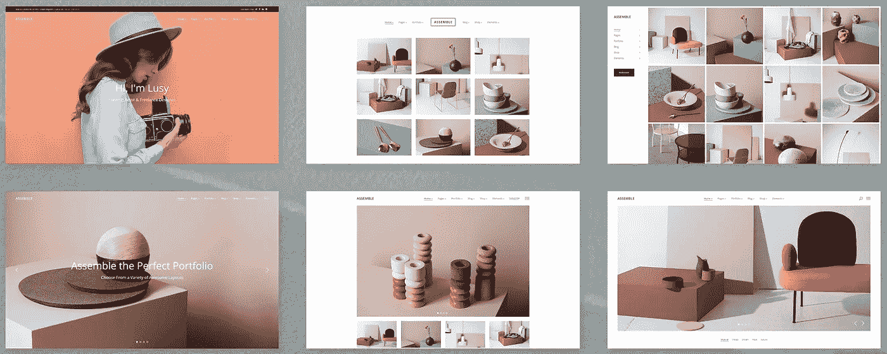

# 16.《行尸走肉》

这个网站就像一部恐怖的迷你僵尸剧。向下滚动可以看到一个死人走过不同的场景。整个故事可以以水平视差滚动效果自动显示。动画真的很棒，背景音乐营造了一种令人毛骨悚然的气氛。

[参观现场。](https://www.cabletv.com/the-walking-dead)

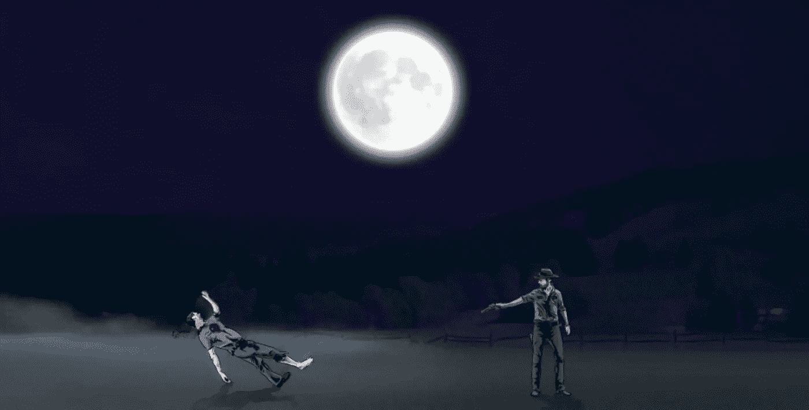

# 17.西摩·鲍威尔

Seymour Powel 是一个由设计研究员、战略家、品牌专家、产品、UX、UI 设计师和制作者组成的多学科团队。不同的图层通过平滑视差效果增加深度。每个屏幕都包含一个与背景颜色和图像一起工作的图像。

[参观现场。](http://www.seymourpowell.com/)

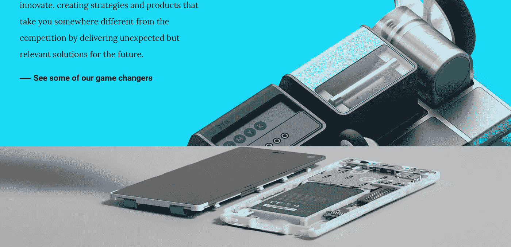

# 18.优图

它将完全把你的设计想法变成现实。Irene DemetriI 热衷于为在任何类型和大小的设备上工作的大型和小型项目创建漂亮、直观的响应网站。但是当点击一个按钮只发生在相对移动的项目上时，视差效应并不明显。单击“查看实时网站”可以看到明显的视差效果，与静态顶部导航栏配合良好。当你滚动时，不同的元素相互作用，形成一种互动的体验。点击主页上的“查看项目”以查看网站组件。

[参观现场。](https://www.youandigraphics.com/what-i-do-web-design-branding.html)

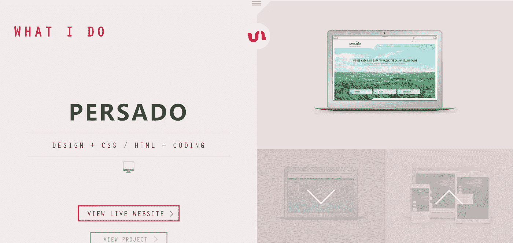

# 19.巴吉亚

冬天的时候，腋下夹一个热水袋怎么样？这是一个设计师的灵感。当你滚动时，视差效果会旋转袋子来突出它的不同特征。屏幕底部还有一个“拉链”，当你滚动时，它会从左向右移动。这件商品陈列得很好，非常吸引人。

[参观遗址。](http://www.bagigia.com/)

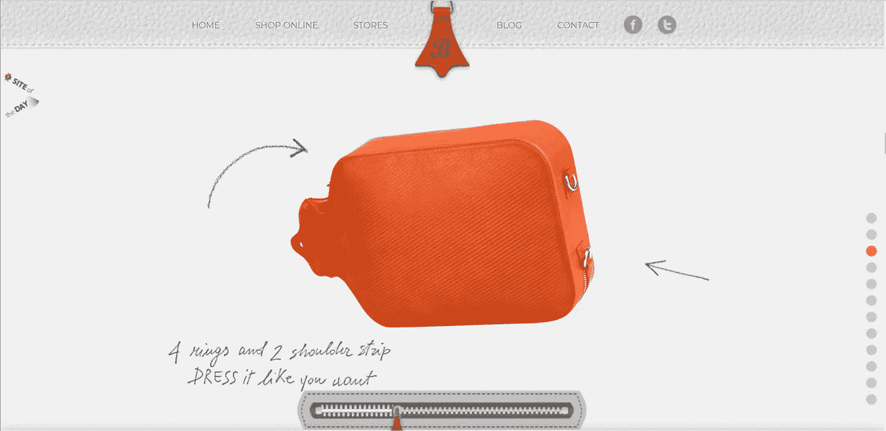

# 20.安东和艾琳

我非常喜欢这个网站的配色方案，以及温暖干净的界面。安东和艾琳穿着色彩鲜艳的现代服装，看起来很酷。向下滚动时，他们只是后退一步，为你需要的信息让路。大胆的排版和大胆的配色方案创造了美妙的视觉体验。该网站在首页还有一个很酷的复活节彩蛋；只要将鼠标停留在安东和艾琳身上，就能看到他们姿势和面部的变化。

[参观遗址。](http://antonandirene.com/)

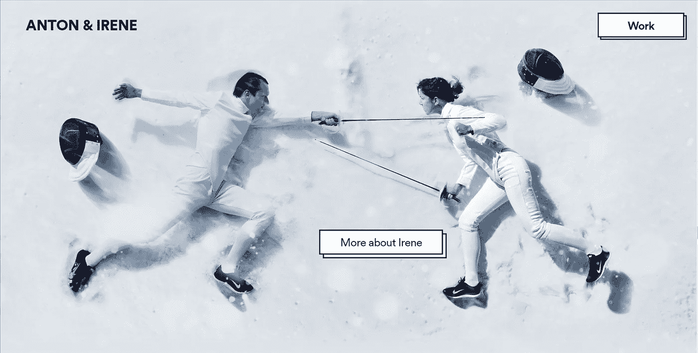

# 21.普曾格尔

向下滚动时，会连续显示 6 层。每一页都有一个独特的日常清洁场景。每一页都有不同的配色方案，具有复古、流行的艺术风格。

[参观现场。](http://www.putzengel.at/)

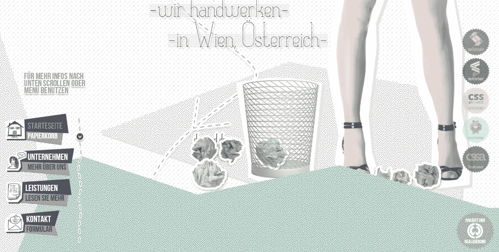

# 22.贝克特

该网站是你进行创意设计的地方，视差滚动贯穿始终，增加了插图的深度。提醒一句——这个网站有点太乱了，每一层都有太多的元素。

[参观现场。](https://www.beckett.de/)

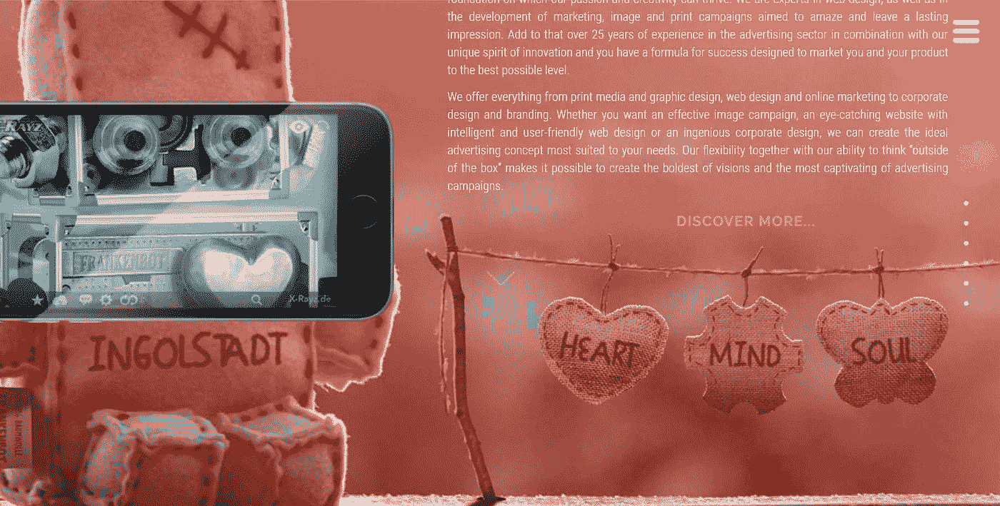

# 23.失落的世界集市

这个网站有一个非常微妙但有效的视差效果，一个人在海底旅行时穿过一个管道。看到这个人经历所有的场景，直到他最终到达在海底发现的目的地亚特兰蒂斯，这真的很有趣。

[参观现场。](http://lostworldsfairs.com/atlantis/)

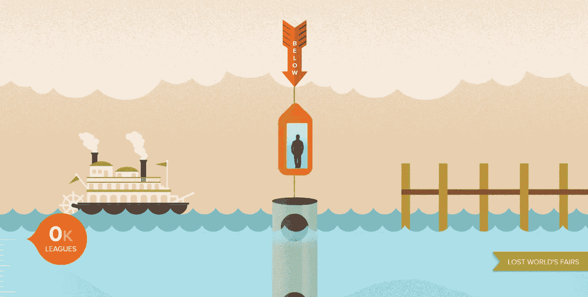

以上是我认为的 23 个最好的视差滚动网站的例子。我希望你喜欢它们，并受到启发去创造你自己的。如果你热衷于尝试视差滚动效果，我建议你从视差滚动原型开始，这要简单和容易得多。你可能需要一个原型工具，比如[mock plus](https://www.mockplus.com/?r=trista)——重新开始。组件和交互是如此美妙，使用起来毫不费力；更重要的是，它支持预览网页，无需安装任何额外的软件。