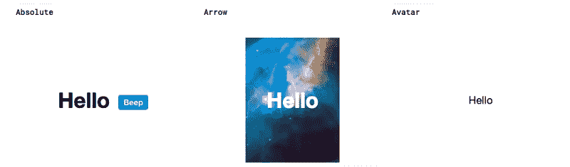

# 23 个最佳反应 UI 组件框架

> 原文：<https://medium.com/hackernoon/23-best-react-ui-component-libraries-and-frameworks-250a81b2ac42>

*始乱终弃汇总之* [***第一部分***](https://blog.bitsrc.io/11-react-component-libraries-you-should-know-178eb1dd6aa4)*[***第二部分***](https://blog.bitsrc.io/best-react-ui-component-libraries-for-2018-part-2-d231dcb04c0a)****最佳* [*反应*](https://hackernoon.com/tagged/react) *元件库为 2019*****

*****了解更多:*****

****[**我们如何构建微前端**](https://blog.bitsrc.io/how-we-build-micro-front-ends-d3eeeac0acfc) 和[**我们如何构建设计系统**](https://blog.bitsrc.io/how-we-build-our-design-system-15713a1f1833) **。******

****根据栈溢出调查， [React](https://hackernoon.com/tagged/React) 从 [2017](https://insights.stackoverflow.com/survey/2017#technology-frameworks-libraries-and-other-technologies) 到 [2018](https://insights.stackoverflow.com/survey/2018/#technology-frameworks-libraries-and-tools) 人气几乎增长了 150%。这并不奇怪，除了其他事情之外，这要归功于其不断增长的基于组件的生态系统。****

****有些人喜欢库，有些人喜欢开发自己的组件(参见[精通组件工作流的工具](https://blog.bitsrc.io/9-tools-and-libraries-to-boost-your-react-component-workflow-6ff4b49511c2))。不管怎样，这里是一些最好的 23 个 React 组件库和框架的完整列表，最后还有一个奖励。请注意，该列表没有排名，而是作为一个有用的资源。享受吧。****

****您还可以将这些库与 [**位**](https://bitsrc.io) 结合起来，使每个组件单独可用，无需库即可发现、共享和使用。****

********

****使用 NPM 和 Yarn，您可以发现每个组件，在真实的操场上亲自尝试，并将其安装到您的项目中。您甚至可以从多个项目中开发组件，并在它们之间同步更改。****

********

****[Bit (GitHub)](https://github.com/teambit/bit) 可以用来发现和分享来自任何开源库的组件，或者是针对你团队的组件，可以随意试一试。****

# ****1.材料-用户界面****

****React 实现谷歌材质设计的组件。在超过 [45k 星](https://github.com/mui-org/material-ui)(!)，是 GitHub 上最受欢迎、使用最广泛的 React UI 库。****

********

****Material UI [Grid-List](https://www.material-ui.com/#/components/grid-list) component****

****GitHub 回购:****

**** [## mui-组织/物料-用户界面

### React 组件使 web 开发更快更容易。建立自己的设计体系，或者从材料设计开始。…

github.com](https://github.com/mui-org/material-ui) 

单个组件集合:

 [## 按 mui-org 位的物料-ui

### React 实现谷歌材质设计的组件。— 115 个 Javascript 组件。示例:选项卡、工具提示…

bit.dev](https://bit.dev/mui-org/material-ui) 

# 2.[反应自举](https://react-bootstrap.github.io/)

用 React 构建的 Bootstrap 3 组件。在 [16k stars](https://github.com/react-bootstrap/react-bootstrap) 的时候，这个库仍然流行和有用，即使我们仍然在等待 bootstrap 4 的支持。

React bootstrap [buttons](https://react-bootstrap.github.io/components/buttons/)

GitHub 回购:

 [## 反应自举/反应自举

### 用 React 构建的引导组件。通过创建帐户，为 react-bootstrap/react-bootstrap 开发做出贡献…

github.com](https://github.com/react-bootstrap/react-bootstrap) 

单个组件集合:

 [## 通过反应自举位进行反应自举

### 用 React-92 Javascript 组件构建的引导组件。例子:按钮组，警告，模态，导航条…

bit.dev](https://bit.dev/react-bootstrap/react-bootstrap) 

# 3.[索环](https://v2.grommet.io/)

漂亮的反应 UI 组件，注重基本的体验。在[超过 5000 颗星星](https://github.com/grommet/grommet)，这些组件以其简单而美丽的设计而自豪。

React Grommet buttons

GitHub 回购:

 [## 索环/索环

### 一个基于 react 的框架，在一个整洁的包中提供可访问性、模块化、响应性和主题化…

github.com](https://github.com/grommet/grommet) 

单个组件集合:

 [## 逐个索环钻头

### 一个基于 react 的框架，在一个整洁的包中提供可访问性、模块化、响应性和主题化。- 73…

bit.dev](https://bit.dev/grommet/grommet) 

# 4.[蚂蚁设计反应](https://ant.design/docs/react/introduce)

流行的 React 组件遵循 Ant 设计指南和规范，用 typescript 编写，支持丰富的工作流。

[Ant design components](https://github.com/ant-design/ant-design)

# 5.[蓝图](http://blueprintjs.com/)

一个基于 React 的 UI 工具包，拥有超过 9K 个明星和 100 个贡献者。组件用 ts 编写，用 Sass 进行样式化，以便快速开发。

Blueprint [React components](http://blueprintjs.com/)

# 6.[反应陷阱](https://reactstrap.github.io/)

这个库提供了简单的 React bootstrap 4 组件。随着[超过 4k](https://github.com/reactstrap/reactstrap) 的明星和近 100 名贡献者，这是一个广受 bootstrap 粉丝欢迎的选择。

Reactstrap [buttons](https://reactstrap.github.io/components/buttons/)

# 7.[反应工具箱](http://react-toolbox.io/#/)

React Toolbox 是一套实现 Google Material Design 的 React 组件。它建立在一些最流行的提议之上，如 CSS 模块(用 SASS 编写)、Webpack 和 ES6。近 8K 起，非常受欢迎。

React Toolbox components- docs have a [live playground](http://react-toolbox.io/#/components)!

# 8.[反应桌面](http://reactdesktop.js.org/)

一个 UI 组件库[旨在为网络带来原生桌面体验，包含许多 macOS Sierra 和 Windows 10 组件。](https://github.com/gabrielbull/react-desktop)

React Desktop [Window Component](http://reactdesktop.js.org/docs/mac-os/window/)

# 9.语义用户界面

语义 UI React 是语义 UI 的官方 React 集成。与 6.5K stars 一起使用的还有网飞、亚马逊和其他伟大的组织。

React Semantic-UI [Dimmer component](https://react.semantic-ui.com/modules/dimmer)

GitHub 回购:

 [## 语义-组织/语义-用户界面-反应

### 官方的语义-用户界面-反应集成。为语义组织/语义用户界面反应开发做出贡献

github.com](https://github.com/Semantic-Org/Semantic-UI-React) 

单个组件集合:

 [## 语义-ui-按语义-组织位反应

### 官方的语义-用户界面-反应集成——76 个 Javascript 组件。示例:按钮、调光器、文本区、表格…

bit.dev](https://bit.dev/semantic-org/semantic-ui-react) 

# 10.[温泉 UI 反应](https://onsen.io/react/)

超过 100 个组件是专门为材料和平面设计制作的，将 Onsen UI [框架](https://hackernoon.com/tagged/framework)结合在一起，并反应来构建混合应用程序。

Onsen UI React [components](https://onsen.io/theme-roller/)

# 11. [Rebass](http://jxnblk.com/rebass/)

React UI 组件库&设计系统，用样式组件和样式系统构建。近 [4k 星](https://github.com/jxnblk/rebass)它是风格组件爱好者的绝佳选择。

Rebass React UI [components](http://jxnblk.com/rebass/getting-started)

# 12.[元素 UI](http://elemental-ui.com/)

这是一个实验性的 UI 工具包，用于 React.js 网站和 4k 星级的应用程序，目前由 Thinkmill 的 Keystone.js 作者开发。

Elemental UI [modal component](http://elemental-ui.com/)

# 13.[美女](http://nikgraf.github.io/belle/#/?_k=19jslm)

一组针对移动和桌面优化的 React 组件，具有高度可定制的风格，可以在基础级别上进行配置，也可以为每个组件单独进行配置。

React belle [components](http://nikgraf.github.io/belle/#/component/card?_k=2mkdb1)

# 14.[主要反应](https://www.primefaces.org/primereact/#/)

超过 [1000 颗星](https://github.com/primefaces/primereact)，我们喜欢这个项目，它提供了超过 70 个具有多个主题的 UI 组件的丰富和独特的选择。看一看！

A Primereact Chart component with Bit: play and install

GitHub 回购:

 [## primefaces/primereact

### PrimeReact 是 React - primefaces/primereact 的丰富 UI 组件的集合

github.com](https://github.com/primefaces/primereact) 

单个组件集合:

 [## primereact by primefaces 位

### PrimeReact 是 React 的丰富 UI 组件集合。- 73 个 Javascript 组件。示例:图表、输入文本…

bit.dev](https://bit.dev/primefaces/primereact) 

# 15.[地图集](https://atlaskit.atlassian.com/)

Atlasssian 官方 [React UI 套件](https://bitbucket.org/atlassian/atlaskit-mk-2)是[atlasssian 设计指南](http://atlassian.design/) (ADG)的技术实现。每个甚至是它自己的包裹。

Atlaskit Multi-select React [component](https://atlaskit.atlassian.com/packages)

# 16.[面料](https://developer.microsoft.com/en-us/fabric)

一组 React 组件，用于为 Office 和 Office 365 构建体验，以 Typescript 编写。超过 [2.5K 星](https://github.com/OfficeDev/office-ui-fabric-react)值得一试([快速入门](https://dev.office.com/fabric#/get-started))。

Fabric [Nav-Bar](https://developer.microsoft.com/en-us/fabric#/components/nav) React Component

# 17.[碳成分](http://react.carbondesignsystem.com/)

根据 IBM 的[碳设计系统](http://carbondesignsystem.com/)对组件进行反应。你也可以用 [CodeSandBox](https://codesandbox.io/s/x2mjypo6pp) 在线试用。

# 18.[汗反应成分](https://github.com/Khan/react-components)

这些几乎不为人知的组件是 Khan's academy 向社区发布的 React UI 组件，达到近 1k 星。

Khan’s blur-input [React component](http://khan.github.io/react-components/#tooltip)

# 19.[Pinterest 的格式塔](https://github.com/pinterest/gestalt)

这个即将到来的库是 Pinterest 的设计工作室精心设计的一套 React UI 构建块，用于同步和提高 Pinterest 团队之间的标准。

Gestalt React [search-filed component](https://pinterest.github.io/gestalt/#/SearchField)

# 20.[材料成分网](https://material.io/components/web/)

这个库由谷歌的工程师和设计师团队开发，取代了 react-mdl，已经接近 [7k 恒星](https://github.com/material-components/material-components-web/)。看看这个。

[Material-web components](https://material.io/components/web/catalog/)

# 21.[反应过来 MD](https://react-md.mlaursen.com/)

一个漂亮的和强烈推荐的工具包，用于使用 Google 的 Material Design 构建一个 web 应用程序，具有高度可定制的主题和样式(Sass)。

React-MD [subheaders component](https://react-md.mlaursen.com/components/subheaders)

# 22.[反应基础](https://react.foundation/)

在非常活跃的开发中，该项目将部分[基础](https://foundation.zurb.com/sites/docs/)包装为 React 组件，并以简单性和高覆盖率为傲。非常好。

Foundation’s [button component](https://react.foundation/) with React

GitHub 回购:

 [## 数字在线/反应基金会

### 基础作为反应组分。通过在…上创建帐户，为 digiaonline/react-foundation 的发展做出贡献

github.com](https://github.com/digiaonline/react-foundation) 

单个组件集合:

 [## primereact by primefaces 位

### PrimeReact 是 React 的丰富 UI 组件集合。- 73 个 Javascript 组件。示例:图表、输入文本…

bit.dev](https://bit.dev/primefaces/primereact) 

# 23. [React 虚拟化](https://github.com/bvaughn/react-virtualized)

几乎是虚拟化大型数据集的完美 React 组件集。拥有近 [10k 颗星星](https://github.com/bvaughn/react-virtualized)的它很受欢迎，因为它有用。

React virtualized [components](https://bvaughn.github.io/react-virtualized/#/components/List)

# +✨奖金

遗憾的是，大多数都没有得到积极的维护。仍然值得一试。

## * Reakit

 [## 雷基特/雷基特

### 使用 React - reakit/reakit 构建可访问的富 web 应用的工具包

github.com](https://github.com/reakit/reakit) 

## * [反应过来的 UWP](https://www.react-uwp.com/)

微软的 UWP 设计与反应。

## * [Amaze UI React](http://amazeui.org/react/)

中国流行的跨平台框架 Amaze-UI 的 React 实现。

## * [UXCore](http://uxcore.coding.me/components/button/)

面向企业后端数据应用的 React 组件。

## * [Zent](https://www.youzanyun.com/zanui)

一个漂亮的隐藏式中文用户界面库。

## * [卤素](http://madscript.com/halogen/)

仅装载器和旋转器。

## * [将自举与材料设计反应](https://github.com/mdbootstrap/React-Bootstrap-with-Material-Design)

Bootstrap 4-React 版本的材料设计。

 [## mdbootstrap/React-Bootstrap 与材料设计

### 反应-引导-与材料-设计-反应引导与材料设计

github.com](https://github.com/mdbootstrap/React-Bootstrap-with-Material-Design) 

## *反应-选择矩阵

一个漂亮的，物化的，灵活的反应选择控件。

 [## stratos-vetsos/react-selectrix

### 一个漂亮的，物化的，灵活的反应选择控件

github.com](https://github.com/stratos-vetsos/react-selectrix) 

## *反应-具体化

 [## 反应-物化/反应-物化

### react 的材料设计，由 materialize cs-react-materialize/react-materialize 提供动力

github.com](https://github.com/react-materialize/react-materialize) 

# 不使用图书馆？

添加整个库可能是一种负担，并且很难即时更改内容。因此，单个组件可以在[牛逼反应](https://github.com/enaqx/awesome-react)和[牛逼反应组件](https://github.com/brillout/awesome-react-components)以及[这里的](https://reactjs.org/community/ui-components.html)中找到。希望你喜欢！

# 了解更多信息

 [## 使用 React 和 Bit 的原子设计:简化复杂的 UI

### 使用带有 React + Bit 的原子设计来简化复杂的 UI。

blog.bitsrc.io](https://blog.bitsrc.io/simplify-complex-ui-by-implementing-the-atomic-design-in-react-with-bit-f4ad116ec8db)  [## 在 React 中加快开发的 5 个工具

### 加速 React 应用程序开发的 5 个工具，侧重于组件。

blog.bitsrc.io](https://blog.bitsrc.io/5-tools-for-faster-development-in-react-676f134050f2)  [## 如何在项目和应用程序之间共享 React UI 组件

### 如何使用 Bit 在团队的所有项目和应用程序之间轻松共享和同步 React UI 组件。

blog.bitsrc.io](https://blog.bitsrc.io/how-to-easily-share-react-components-between-projects-3dd42149c09)****