# 23 本书每个密码爱好者、交易者和投资者都应该在这个冬天阅读

> 原文：<https://medium.com/hackernoon/23-books-every-crypto-enthusiast-trader-and-investor-should-read-this-crypto-winter-c4d8d0e73b69>

## 给不安的灵魂的热可可

## 你想在不可避免的牛市到来之前获得优势吗？如果是这样，你应该在读书。很多。这里有一个列表可以让你开始。opics 是多学科的，涵盖经济学、交易、网络理论、技术、未来主义、金融、社会学和货币史。

**开始前两件事:**

1.  [我免费赠送所有这些书。](https://mishayurchenko.me/giveaway/book-giveaway/)任何人都可以通过分享推文或 FB 帖子获得赠品。
2.  这些链接是亚马逊的附属链接，所以如果你买了一本书，我会得到一小部分。

我们开始吧！

# [**1。区域交易:用信心、纪律和胜利的态度控制市场**](https://amzn.to/2EyjbxP)

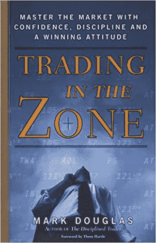

当我第一次开始交易时，在这个区域交易帮助我重新定义了概率的概念(生活很像扑克，从那以后我又重温了几次)。它主要处理股票交易，但概念更多地与管理自己有关，因此同样适用于加密领域。

道格拉斯说:“交易不仅仅揭示你的性格，如果你在游戏中待的时间足够长，它也会塑造你的性格。”他的课帮助我发现了许多我自己的心理偏见，更好地管理我的情绪，并最终让我对交易高度波动的秘密市场更有信心。

> “关于交易的概率思维由五个基本事实组成:1。任何事情都可能发生。2.为了赚钱，你不需要知道接下来会发生什么。3.对于任何给定的定义优势的变量集来说，赢和输都是随机分布的。4.优势只不过是一件事比另一件事发生的概率更高的指示。5.市场上的每一刻都是独一无二的。”—马克·道格拉斯

*(喊出* [*克里斯·邓恩*](https://medium.com/u/c24cfaf04a23?source=post_page-----c4d8d0e73b69--------------------------------)*——感谢推荐！)*

# [2**2。失去一百万美元我学到了什么**](https://amzn.to/2UH06hz)

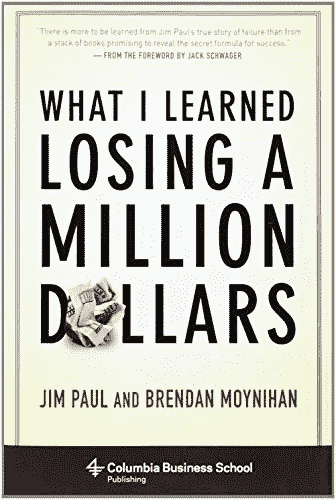

吉姆·保罗在肯塔基州北部的一个小镇长大，最终成为芝加哥商业交易所的总裁。他的故事是成功和失败的过山车。在他交易生涯的巅峰，他在一次交易中损失了 160 万美元，而不仅仅是 100 万美元。

他描绘了一个警示性的故事，讲述了我们的狂妄自大，沉迷于自己的想法，无视清晰的警告信号，以及当我们变得过于贪婪时会发生什么(听起来熟悉吗？).

尽管他关注的是大宗商品，但这一教训适用于任何金融资产和正在做出高风险决策的领域。我是在加密泡沫破裂之前(也是在我损失很多钱之前)读的这本书，所以在过去的一年里，它对我来说有了新的意义，对你也一样。

> “当我还是个孩子的时候，我父亲告诉我，世界上有两种人:聪明人和有智慧的人。聪明人从自己的错误中学习，聪明人从别人的错误中学习。”—吉姆·保罗

# [3。思考，快与慢](https://amzn.to/2LhJ8BX)

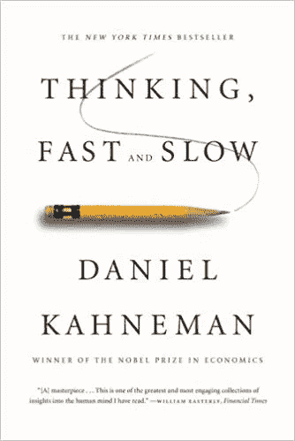

*《思考，快与慢》*是行为经济学的开创性著作，在识别我们的认知偏差方面具有革命性。这对我们如何看待世界上几乎每一个行业都产生了影响。

假设你在动物园，看到一只美洲虎在玻璃围栏里。美洲虎向你扑来。你大脑的原始部分会对恐惧和逃跑做出反应。只是在后来，你大脑中更进化的部分引入了逻辑:“在我和捕食者之间有一层玻璃。我很安全。恐惧反应未被指明”。从大脑的角度来看，这些“假阳性”有利于自然选择。从进化的角度来看，我们已经准备好基于情感做出反应；培养精神和情感上的坚韧需要真正的、一致的努力。卡尼曼承认，仅仅“知道”我们的心理谬误不足以阻止它们。那么，我们能做的最好的事情就是建立一个系统来降低我们做出愚蠢决定的几率。

所有这些都直接适用于你如何交易和投资。让我着迷的概念有:峰值结束规则、回归均值、启动效应、锚定、显著性——意识到这些以及它们是如何运作的，是保护自己免受(潜在的)自我毁灭本能伤害的第一步。

> “风险”不存在于“外面”，独立于我们的思想和文化，等待被测量。人类发明了“风险”这个概念，来帮助自己理解和应对生活中的危险和不确定性。尽管这些危险是真实存在的，但并没有所谓的“真实风险”或“客观风险”。—丹尼尔·卡内曼

# [4。自我是敌人:战胜我们最大的对手](https://amzn.to/2Ek3lps)

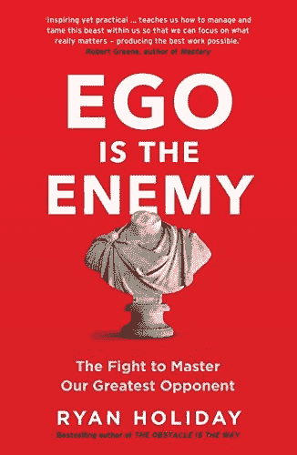

*自我是敌人*充满了历史轶事、斯多葛派哲学和生活教训，使其既有趣又实用。 [Ryan Holiday](https://medium.com/u/2e2701ae378f?source=post_page-----c4d8d0e73b69--------------------------------) 说，以贪婪的方式自我毁灭和获得成功是很常见的，但要自我意识到我们自己的行为及其对周围人的影响要难得多。罪魁祸首当然是我们的自我。我们对胜利的渴望，对名誉、地位和权力的渴望。

从波斯国王薛西斯到史蒂夫·乔布斯，有大量的例子说明自我失控的危险；在一些情况下，主角在意识到他们的错误后获得了胜利，在其他情况下，他们自掘坟墓。每一章都为那些感觉自己趾高气扬、需要脚踏实地的人提供了很好的解毒剂，同样也为那些因自我批评和恐惧而陷入瘫痪、无所作为的人提供了很好的解毒剂。

> “真正的学生就像一块海绵。吸收周围发生的事情，过滤它们，抓住他能抓住的东西。一个学生是自我批评和自我激励的，总是试图提高他的理解，这样他就可以进入下一个话题，下一个挑战。一个真正的学生也是他自己的老师和他自己的批评家。那里没有自我的空间。”—瑞安·霍利迪

# [5。下注思考:当你没有掌握所有事实时做出更明智的决定](https://amzn.to/2UJGTvy)

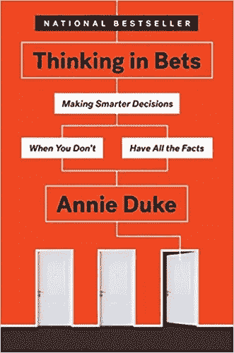

安妮·杜克大学毕业后计划成为一名心理学家，但在她哥哥邀请她参加扑克之夜后，她爱上了这项运动，并成为了世界扑克锦标赛的冠军。她引用了商业、体育、政治，当然还有扑克的例子来分享任何人都可以用来拥抱不确定性并做出更好决策的工具。安妮指出，我们的生活不像国际象棋——我们面前并没有所有的棋子。

书中重要的一点是:设定财务目标的交易者几乎总是失败。为什么？因为你控制不了市场。人们试图将自己的意愿强加于市场，但无济于事(我希望市场价格上涨，这样对我有利)，导致情绪化决策，就像市场暴跌时的恐慌性抛售。不要试图让市场符合你的财务目标，更明智的选择是创建系统，让你更有可能成功交易。这可能很简单，比如设置止损，或者总是在执行前写下你的交易。

> “相反，扑克是一种不完全信息的游戏。这是一场在长期不确定条件下的决策游戏。(不是巧合，那接近博弈论的定义。)有价值的信息仍然被隐藏。任何结果都有运气的成分。你可能在每一点都做出最好的决定，但仍然会输掉这手牌，因为你不知道会发什么样的新牌。一旦游戏结束，你试图从结果中学习，就很难将你的决策质量与运气的影响分开。”

# [6。习惯的力量:为什么我们在生活和工作中会这样做](https://amzn.to/2QTrgmj)

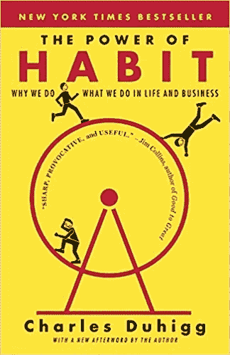

养成一个好习惯很难，比如一天做 100 个俯卧撑，吃适量的西兰花，或者说话前先听。一旦诱惑来了，很容易滑回坏习惯，比如往嘴里塞榛子巧克力或者该闭嘴的时候不闭嘴。

令人着迷的是，习惯养成的机制是一样的，不管是好是坏。我从来没有真正理解这一点，直到我读了这本书，它帮助我解开了很多关于我自己行为的谜团。对于任何正在寻找打破坏习惯、培养新习惯的实用指南的人来说，这就是了。

> **“习惯循环:**我们大脑内部的这个过程是一个三步循环。首先，有一个提示，一个触发器，告诉你的大脑进入自动模式，使用哪个习惯。然后是例行公事，可以是身体上的，也可以是精神上的，也可以是情感上的。最后，有一个奖励，它帮助你的大脑找出这个特定的循环是否值得在未来记住:随着时间的推移，习惯循环，这个循环——线索，例行公事，奖励；暗示、惯例、奖励——变得越来越自动化。线索和奖励交织在一起，直到一种强烈的期待感和渴望感出现。最终，不管是在寒冷的麻省理工学院实验室，还是在你的车道上，一种习惯就这样诞生了。

# 7.[第三次工业革命:横向力量如何改变能源、经济和世界](https://amzn.to/2NjWEst)

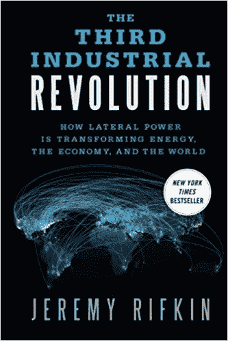

第三次工业革命是这样的:我们发展了一个分散的电网，而不是集中的发电厂和电网(包括化石能源和可再生能源)。每栋房子和每栋建筑都有自己的太阳能电池板/可再生能源；因此，每栋建筑实际上都变成了自己的小型发电厂。未使用的能量可以通过氢燃料电池储存起来，并通过分散的电网分配/分享/出售给其他需要能量的人。这就是互联网对信息所做的，除了能源。

**书中让我着迷的主题:**

1.  为什么财产权是最近的社会概念，启蒙思想家和后来的思想家是如何被牛顿物理学影响/蒙蔽的
2.  为什么生产率自 20 世纪 70 年代以来一直徘徊在 14%,为什么我们 85%的经济生产率被浪费了
3.  几十年来热力学定律是如何被经济学家忽略的
4.  为什么全球化正在衰落，并被更可持续的"*大陆化*"所取代

去中心化是第三次工业革命的核心，毫无疑问，区块链技术将成为实现这一目标所需的基础设施的支柱。(你可以在这里[观看的精彩视频](https://www.youtube.com/watch?v=QX3M8Ka9vUA)

# [8。富爸爸，穷爸爸](https://amzn.to/2PC3sPb)

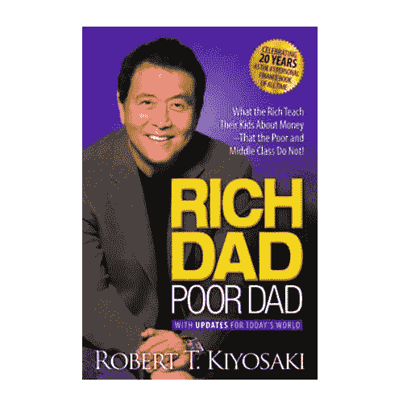

*富爸爸穷爸爸*概述了建立被动收入流、聪明的税收策略和创办自己的企业的基础知识。这是金融/投资人群中的经典之作，也是那些开始投资之旅的人以及那些有自己想要积累的积蓄的人的必读之作。这不是一步一步的指导，但它会改变你的心态，这通常是大变化的第一步。

清崎在书的开头讲述了两个平行的故事；富爸爸和穷爸爸。穷爸爸每天工作，把时间等同于金钱，认为金钱是肮脏的。他首先支付账单，有抵押贷款，深陷信用卡债务。他为钱而工作。另一方面，富爸爸得到他的薪水，并将其再投资于房地产和其他业务。他首先支付他自己。他分散投资股票。他是一个精明的投资者，钱为他工作。

> “不要听穷人或受惊吓的人的话。我有这样的朋友，虽然我非常爱他们，但他们是生活中的小鸡。对他们来说，一提到钱，尤其是投资，总是“天要塌下来了！天要塌了！“他们总能告诉你为什么有些东西行不通。问题是人们听他们的。但是盲目接受悲观信息的人也是胆小鬼。俗话说，“物以类聚，人以群分”。"

# 9.[巨人的工具:亿万富翁、偶像和世界级表演者的策略、惯例和习惯](https://amzn.to/2PBRQvn)

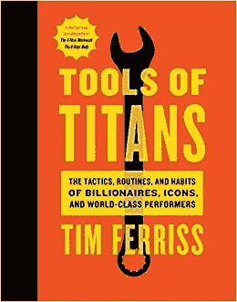

没有提到蒂姆·费里斯，书单就不完整。这是一个真正的门栓，当我寻找灵感时，我会不时地拿起它。这是数百页的笔记和对世界级表演者的采访，分为三个部分“健康、富有和明智”

我发现最有趣的是，每个人的惯例都不一样。你可能会认为，超高产和超级成功的人会有一个有组织和强迫症的日常生活，计划他们的生活每一分钟。但大多数情况下他们不会。他们只是喝一杯咖啡，洗个澡，然后开始。他们日复一日地朝着目标前进。虽然与大多数人相比，他们都取得了非凡的成就，但他们的成就是渐进的——最终是非凡的。没有“一夜成功”

> 蒂姆每年都会问自己一次的问题:

> 问题 1:如果我反其道而行之 48 小时呢？
> 
> 问题 2:我在什么上面花了很多钱？我该如何搔自己的痒处？
> 
> 问题 3:如果我有 1000 万美元，我会做什么？我真正的目标月收入是多少？
> 
> 问题 4:可能发生的最糟糕的事情是什么？我能回到这里吗？
> 
> 问题 5:如果我每周只能工作 2 小时，我会做什么？
> 
> 问题 6:如果我让他们做高达 100 美元的决策会怎么样？$500?$1,000?
> 
> 问题 7:最不拥挤的通道是什么？
> 
> 问题 8:如果我不能直接推销我的产品怎么办？
> 
> 问题 9:如果我创建了自己的现实世界 MBA 会怎样？
> 
> 问题 10:我需要把它恢复到失去时的样子吗？
> 
> 问题 11:如果我只能用减法来解决问题会怎么样？
> 
> 问题 12:我可以做些什么来让我离开网络 4 到 8 周，没有电话或电子邮件？
> 
> 问题 13:我在猎杀羚羊还是田鼠？
> 
> 问题 14:会不会一切都很好很完整？
> 
> 问题 15:如果很容易，这会是什么样子？
> 
> 问题 16:这个问题我怎么砸钱？怎么浪费钱才能提高生活质量？
> 
> 问题 17:不急，不停顿。

# 10.[精神错乱:骗子、相互依赖和捉迷藏的宇宙游戏](https://amzn.to/2EiXMHP)

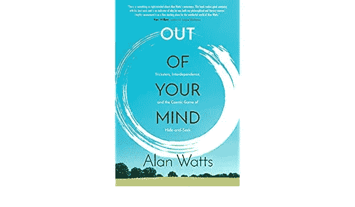

这是瓦茨最好的演讲和思想的精华，即使你不熟悉佛教或印度教，也能将东方哲学中的实际问题转化为容易理解的形式。他问了一些大问题，比如“宇宙是什么？我们如何改变过去？你打算用你的钱买什么？最重要的是，我们如何让自己不那么严肃？”当然，它变得很深刻，但它仍然机智、有趣、实用。

一个重要的观点是*“把指向月亮的手指误认为是月亮。”*以阅读非小说类书籍为例。许多人通过阅读来扩大知识面。然而，阅读是拖延的一种很好的形式。你可以整天读书，但却一事无成。不要把活动和目标混为一谈——换句话说，不要光看书，要用你学到的东西采取行动。

> “有一个著名的禅宗故事，讲的是一个和尚在打坐。大师走过来问道:“你在做什么？和尚回答说:“哦，我在打坐，这样我就能成佛了。”“嗯，大师在旁边坐下，拿起一块砖，开始擦。和尚问，“你在做什么？"哦，我在磨这块砖，想把它变成一面镜子。"和尚说，“再多的摩擦也不能把它变成镜子。”大师回答说，“再多的禅定也不会把你变成佛。”"在当代日本，他们不太喜欢这个故事。"

# 11.[不可避免的事情:了解将塑造我们未来的 12 种技术力量](https://amzn.to/2EmAD7A)

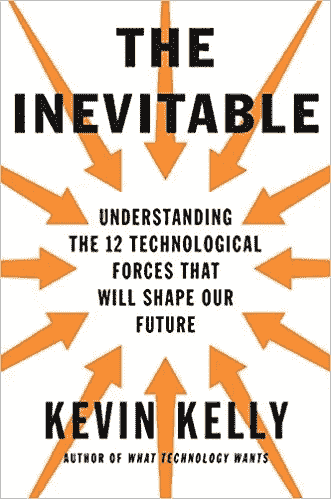

《连线》杂志的联合创始人，[凯文·凯利](https://medium.com/u/964bb8418b79?source=post_page-----c4d8d0e73b69--------------------------------)写了很多关于科技和数字媒体未来的文章。他首先从移动、人工智能、生物技术、无人驾驶交通工具、社交媒体等方面审视了我们的技术现状。他解释了这些行业是如何演变的，并提供了实际的例子来说明这可能会是什么样子(从问题的重要性到人工智能的危险)；这一切都可以归结为他认为将最终塑造未来的 12 种力量。他们是…

1.  变得:从固定产品转向始终升级服务和订阅
2.  认知:使用我们从云中获得的廉价而强大的人工智能，让一切变得更加智能
3.  流动:任何事情都依赖于不可阻挡的实时流
4.  筛选:将所有表面变成屏幕
5.  获取:将社会从一个我们拥有资产的社会转变为一个我们可以随时获取服务的社会。
6.  共享:大规模的合作。凯利写道，“在我想象的共享指数上，我们仍然是 10 分中的 2 分。”
7.  过滤:利用强烈的个性化来预测我们的欲望
8.  重新组合:将现有产品拆分成最原始的部分，然后以所有可能的方式重新组合
9.  互动:让我们沉浸在电脑中，最大限度地提高他们的参与度
10.  跟踪:为了公民和消费者的利益，采用全面监控
11.  提问:推广好问题远比好答案更有价值
12.  开始:构建一个将所有人类和机器连接成一个全球矩阵的行星系统

推荐给任何和我一样对未来感到担忧和兴奋的人。此外，对于那些研究商业想法的人来说(在加密和其他领域)，这将有助于发掘想法的价值。

# 12.[抗脆弱:从无序中获得的东西](https://amzn.to/2PBAKhi)

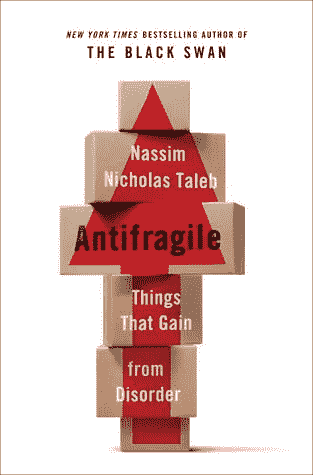

纳西姆·尼古拉斯·塔勒布在本书中讲述了很多内容，但与区块链最相关的是代理问题——区块链技术公司的宗旨就是摆脱中间商——以及增加信任。最有害的中间人类型是塔勒布所说的*(不，不是咖啡师)* **“让你参与政策和行动的人，都是人造的，好处很小，看得见，副作用可能很严重，看不见。”医生会开出一种他汀类药物来帮助你，但不会透露他们糟糕的记录，尽管他们并不完全了解药物的工作原理；在游戏中提出零皮肤财政建议的经济学家，以及把一百万根塑料吸管扔进垃圾填埋场而没有任何反响的公司。**

另一个重要的概念是:[林迪效应(Lindy Effect)](/incerto/an-expert-called-lindy-fdb30f146eaf),简单来说就是某样东西存在的时间越长，它就可能存在的时间越长。一本已经问世 50 年的书很可能还会问世 50 年。你奶奶比赫芬顿邮报更有可能是对的。这也是为什么比特币存在的时间越长，它就越有可能存在。

> 心理学家 Gerd Gigerenzer 有一个简单的启发法。千万不要问医生你该怎么做。问问他，如果他是你，他会怎么做。你会对这种差异感到惊讶。”――纳西姆·尼古拉斯·塔勒布，《反脆弱:从无序中获得的东西》

# 13.[货币的互联网，第一卷和第二卷](https://amzn.to/2PCKub5)

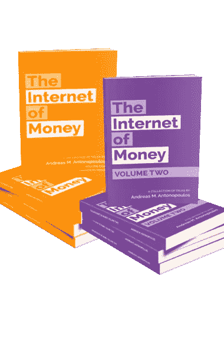

安德烈亚斯·m·安东诺普洛斯(Andreas M. Antonopoulos)是一位先驱。过去几年，他一直靠比特币为生，在这个游戏中拥有真实的皮肤。他有一个伟大的方式来简化复杂的想法，这本电子书是一个最好的入门书籍，从历史到经济学和区块链的技术基础。当我在熊市中感觉低迷时，或者当我想获得灵感时，我会读这些。*“我只是一个编码者，我只是一个空谈者；我不是恐怖分子，也不是暴徒。但是如果我有机会从这个系统中找到一个出口，我会抓住这个机会——因为我知道谁是真正的恐怖分子。”*你会不由自主地受到启发。

Andreas 对进步的局限性持现实态度，并花时间以冷静、易于理解的方式解释他的推理——这证明了他的理解和专业水平。我经常给那些刚刚起步的人送礼物。强烈推荐。

**用加密货币想象世界:**

> 这项技术允许我们重新设想社会秩序，创造系统——而不是权威——使用自治来传递秩序。但比那更好，因为这种秩序形式是前所未有的。想象一下，每个人在创建一个事务时，都有能力准确地指定执行该事务的条件，然后绝对保证这些条件得到满足。这对个人有什么价值？这创造了一个什么样的世界？这无疑创造了一个世界，在这个世界里，那些紧紧抓住权力不放的人既感到恐惧，更重要的是，他们变得无关紧要。

# 想要所有这些书吗？今年圣诞节，我要把它们全部免费赠送出去！[点击此处进入。](https://mishayurchenko.me/giveaway/book-giveaway/)

# 14.[选择自己的财富指南](https://amzn.to/2LgndeF)

虽然詹姆斯·阿尔图彻可能有点过头，但这正是他伟大的地方。他切中要害。这本书是我们生活的“新世界”的实地指南。你可以按老规则玩，然后被甩在后面，或者你可以利用这些新思想，变得富有。他损失了很多钱，经历了一系列失败的创业(其中 17 次)，所以他的故事总是轶事，个人和原始的。

他概述的我最喜欢的例行程序之一是“日常习惯”每天写下十个想法。大部分都会不好，不过没关系。你在展示你的创意。“当你有想法时，你会很快获得自由。当你获得自由时，你将有精力去创造更多的想法，创造更多的财富，去过你想过的生活。”

书中的其他观点 1)每天联系两个人 2)不要仅仅为了加薪而停留在一份工作上 3)不要仅仅为了钱而做一些事情。很多建议都是经过检验的、真实的(也是基本的)，但如果你感到恐惧，它会给你当头一棒。

> “当正规教育结束时，掌握就开始了。找到让你心动的话题。然后燃烧。”
> 
> “我认为比特币有大约 1/100 的几率成为幸存者。所以我的投资组合中有 1%是比特币。”
> 
> “生活中的一切都是为了拥有尽可能多的选择，这样你就可以最大限度地自由。”

# 15.[从零到一:创业笔记和如何打造未来](https://amzn.to/2Ekty7d)

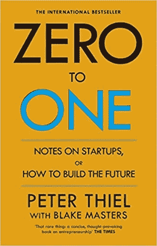

亿万富翁彼得·泰尔是 Paypal 的联合创始人，Clarium Capital 和 Palantir Technologies 的创始人，投资了 100 多家初创公司。他的书充满了如何思考商业、创业、风险、竞争和成功的建议。泰尔投资的两大秘诀:

1.  不要把公司当成彩票
2.  集中精力，在投资前对一家公司有高度的信心

Thiel 在思想和执行方面的清晰性可以帮助任何正在寻找优势的加密爱好者投资者。它始于总是问好问题，质疑现状。**“人们仅仅通过习俗达成一致，而什么是真理？”**总是问，**“这是真的吗？”**

> “……如果你计划在你的生活中做些什么，如果你有一个十年的计划来实现它，你应该问:为什么你不能在 6 个月内完成这件事？有时候，你必须真正经历复杂的 10 年轨迹。但至少值得问一问，这是你告诉自己的故事，还是现实。”

# 16.[聪明的投资者:价值投资的权威书籍](https://amzn.to/2LhqeeO)

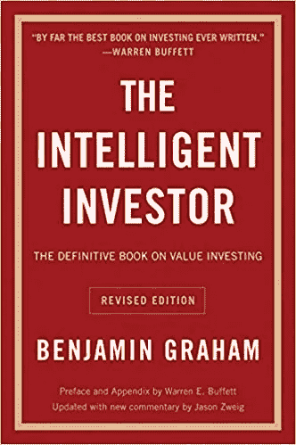

我认为大多数密码交易员都没有读过这本书。是的，这不是最容易读懂的，但它是一部经典的、基础性的作品。新版和修订版在每章后都有注释，用外行人的术语解释概念，我发现这非常有价值，也更容易理解。许多原则——尤其是在风险管理方面——是永恒的。保罗·格拉厄姆提醒我们，有一种方法既能成为聪明的交易者，又能成为聪明的投资者。以下是交易变得智能的三种常见方式:

1.  当你认为你在投资时，你就是在交易
2.  你全职交易(而不是过去的时间),却没有相关的知识和技能
3.  你冒的风险比你能承受的损失还要多

聪明的投资者首先会区分这两种类型的活动。然后，他们会考虑所有可能影响这两种策略的因素。我最大的错误之一是混淆了这两者，然后当我在交易中亏损时变得沮丧。经过进一步思考，我把它当作一项投资。

*Hodling* 是一种在心理上自我破坏的投资策略，因为人们一直关注短期价格，但拒绝卖出，将投资混淆为交易。

> “聪明的投资者意识到，当股票价格上涨时，风险会增加，而不是减少，当价格下跌时，风险会减少，而不是增加。聪明的投资者害怕牛市，因为它使股票的购买成本更高。反过来说(只要你手头有足够的现金来满足你的支出需求)，你应该欢迎熊市，因为它会让股票重新出售。”

# 17.[游牧资本家:如何通过离岸银行账户、双重国籍、外国公司和海外投资重获自由](https://amzn.to/2OAUbai)

你有一点你愿意投资/花费的钱。问题是如何**分散你的风险，保护你的钱，并让它在当前系统之外增长。** [**安德鲁·亨德森**](https://medium.com/u/e2c82ce29d05?source=post_page-----c4d8d0e73b69--------------------------------) 他自己有几个詹姆斯·邦德式的故事，偶尔会让我傻笑，他巧妙地将这些故事与最佳实践和可行(以及合法)的想法交织在一起。

[**“去你待遇最好的地方”**](https://nomadcapitalist.com/2017/05/15/how-to-go-where-youre-treated-best/) 是他几次开车回家的一个点。如果你所在国家的银行系统给你的费用高得离谱，或者你得不到贷款，你为什么不去另一家银行(在另一个国家)？如果你觉得你交了太多的税，与其抱怨和无所事事，为什么不搬到别的地方去呢？如果你在美国得到又差又贵的医疗保健，为什么不去更便宜更好的地方呢？

> “如果我继续做我现在正在做的事情，明天、这个月和今年我将付多少税？”“如果我不做出改变，我的生活方式中有哪些改变是我不喜欢的？”“继续从事现在的工作会对我的退休计划产生什么影响？”“如果我只保留一本护照，五年后会发生什么？或者，可能会发生什么我不愿意冒险的事？”

# 18。 [**数字黄金:**比特币和试图重新创造财富的不适应者和百万富翁的内幕](https://amzn.to/2SKl8tS)

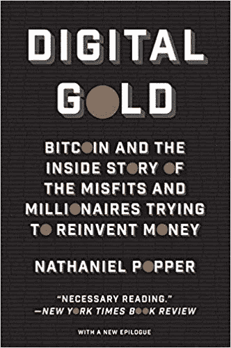

即使在比特币存在的过去 10 年里发生了这么多事情，这本书仍然是一个真正的瑰宝。过去几年出版的许多密码书都写得很差——波普的书是个例外。他很好地用叙事的形式讲述了这个故事，感觉不像是一部非小说，而更像是一部惊悚片。

波普尔通过这场运动五颜六色的中心人物的眼睛描绘了比特币的崛起，其中包括一名阿根廷百万富翁、一名中国企业家、泰勒和卡梅隆·文克莱沃斯、古怪的罗杰·弗以及比特币难以捉摸的创造者中本聪。

我经常把这本书送给那些刚刚起步的朋友，让他们了解比特币的背景。

> “比特币背后的去中心化账本是一种全新的网络——就像互联网——有着人们还没有想象到的可能性，安德森说。他接着说:比特币绝不是一个纯粹的自由主义童话，也不是一场简单的硅谷炒作，它提供了一个全面的机会，让人们重新想象金融体系在互联网时代可以和应该如何运作，它还是一种催化剂，以对个人和企业都更强大的方式重塑该体系。”

# **19。** [**加密资产:**比特币及其他创新投资者指南](https://amzn.to/2PB1Y7N)

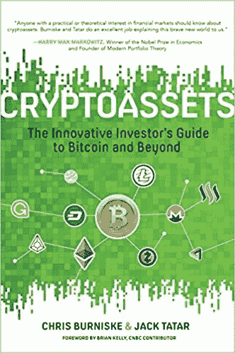

克里斯·伯尼斯克和杰克·塔塔尔在对分散货币这一新资产类别进行深入的技术分析方面做得很好。这不仅仅是考察团队、产品和资金的基础，而是真正深入到代币经济的机制以及概述项目的“网络价值”。(迈克尔·j·凯西(Michael J. Casey)和威利·吴(Willy Woo)的分析也值得一查)。

*书中探讨的主题:*

*   恐惧、贪婪和控制你的情绪。
*   区块链理工大学的滚雪球效应和为什么它会在这里
*   加密中的三个资产类别(货币、商品、令牌)
*   现代投资组合理论和夏普比率

在讨论估值话题时，要记住的一件大事是，没有人真正对此有一个坚实的理解——这就像试图计算出苹果在 1994 年的价值是 1 万亿美元。也就是说， *Cryptoassets* 是我迄今为止读过的最详细的一本认真探讨评估加密项目这一棘手问题的书。任何投资者，交易者和分析师的必读。

> “……区块链技术最强大的使用案例之一是记录不可改变的透明信息，这些信息永远不会从数字历史中抹去，并且所有人都可以免费查看。Satoshi 选择首先使用这一功能，在一张关于银行纾困的便条上写字，这清楚地表明，他希望永远不要让我们忘记 2008 年金融危机的失败。

# **20。** [**T** 智之书:比特币创造者中本聪文集](https://amzn.to/2CatFRs)

我们仍然不知道 Satoshi 是谁，他是一个人还是一群人——事实上，据我们所知，他甚至从未花过一个比特币。他的匿名可能更好，但神秘的吸引力很难放弃。这是多年来 Satoshi 在论坛上的邮件和帖子的有趣汇编。它提供了一种便捷的方式来解析比特币的创造者在消失前的两年时间里写了什么，这两年构成了他的“公共生活”。总的来说，这是一本有趣的书，可能会被后人作为历史书参考。:)

> “传统货币的根本问题是它运转所需的所有信任。必须相信央行不会让货币贬值，但法定货币的历史充满了对这种信任的违背。必须信任银行持有我们的钱，并以电子方式转移，但他们在信贷泡沫的浪潮中贷出这些钱，储备几乎没有一部分。我们必须相信他们会保护我们的隐私，相信他们不会让身份窃贼盗取我们的账户。他们巨大的管理成本使得小额支付变得不可能。”

# 21.强盗大亨:改变美国未来的有影响力的资本家的经典描述

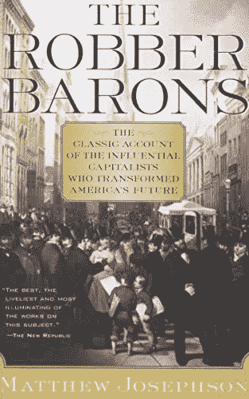

洛克菲勒、摩根、范德比尔特、卡内基、哈里曼、古尔德、弗里克……如果你对这些人如何操纵一切为自己谋利感兴趣，对国家经济、银行、股东造成的损失感兴趣，这本书值得一买。

最令人钦佩的男爵贿赂政客，虐待他们的工人，并通过操纵自己的股票来欺骗普通投资者。他们的许多行为在今天都是非法的。或者他们会吗？一个有趣的问题是，*“现代男爵长什么样？”*T4 的科技巨头是现代强盗大亨吗？

> “……同样为人所熟知的希尔是唯一一个不用政府资助而建造铁路的铁路大亨的故事，在这种修正主义的处理中被推翻了。当希尔开始在明尼苏达州修建铁路网时，他不仅从土地拨款中受益，而且他还利用政府获得了他所能收集到的所有直接和间接的财政援助。在马龙的观点中，我们清楚地看到他是政府投资和行动的受益者，这与早先对希尔的描述大相径庭，他是白手起家建立起一个帝国的人

*(喊出* [*泰勒皮尔森*](https://medium.com/u/b6343375a907?source=post_page-----c4d8d0e73b69--------------------------------) *求推荐！)*

# 22.1929 年的大崩盘

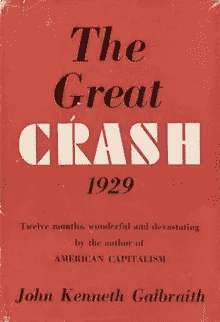

阅读这个故事感觉似曾相识，就像我曾经站在屋顶上准备跳下去一样。就像回到了未来，2017 年初的秘密世界。有趣的是，有些事情是不会改变的，有些教训是不学无术的。

这本书以 20 世纪 20 年代美国的巨大乐观开始，贯穿了佛罗里达土地投机带来的投资机会的兴奋。人们通过保证金购买股票——也就是说，借钱进行更大规模的投资。那是一个人们觉得过山车可以越爬越高的时代。

听到像胡佛这样的“专家”说着我们今天已经听腻了的那种话的次数之多令人恐惧……“经济的基本面基本上都是健康的”或“这只是一个小的调整，经济将会比以往任何时候都更强劲地反弹。”

当一切都崩溃时，它崩溃得很厉害。大萧条的故事是一个严酷的提醒，提醒我们盲目乐观和金融界权力游戏的后果。(另外，你也可以在这里观看[的 Youtube 视频](https://www.youtube.com/watch?v=FXNziew6C9A&t=8s)

> “最坏的情况继续恶化。某一天看起来像是结束的事情，第二天就被证明只是开始。没有比这更巧妙的设计了，以最大限度地减少痛苦，并确保尽可能少的人逃脱共同的不幸。幸运的投机者有资金来回答第一个保证金通知目前得到另一个同样紧迫的，如果他遇到了，还会有另一个。最后，他所有的钱都被人拿走并丢失了。拥有精明资金的人，在第一次崩盘时安全离场，自然会回来捡便宜。随后，这些便宜货遭遇了毁灭性的下跌。”

# 23.[金钱的崛起:世界金融史](https://amzn.to/2QQDYC9)

面包，现金，dosh，面团，战利品，lucre，moolah，钱。总之，钱是什么？历史学家 Nial Fergusson 带我们回到文艺复兴时期，美第奇家族传播复式记账，一直到今天，深入研究 CDO 的机制以及我们不断增加的债务和最近的金融危机背后的原因。他探索了这一点以及更多…

*   黄金为什么会变成黄金？钛和铂更加罕见，本来可以成为竞争对手，但在历史上的某个时候，黄金被认为是贸易的默认货币，并持续了 5000 年。
*   17 世纪的伦敦大火是如何刺激保险的创新的？为什么自由市场不能为灾难提供足够的保护？
*   次贷危机的起源是什么？如果中国超过美国会发生什么？
*   金钱如何影响我们的文化？

> “贫穷不是贪婪的金融家剥削穷人的结果。这与金融机构的缺乏有更多的关系，是银行的缺乏，而不是它们的存在。只有当借款人能够进入高效的信贷网络时，他们才能逃脱高利贷者的魔掌，只有当储户能够将钱存入可靠的银行时，钱才能从无所事事的富人那里流向勤劳的穷人。”

# 想要所有这些书吗？今年圣诞节，我要把它们全部免费赠送出去！[点击此处进入。](https://mishayurchenko.me/giveaway/book-giveaway/)

[www.mishayurchenko.me](http://www.mishayurchenko.me)