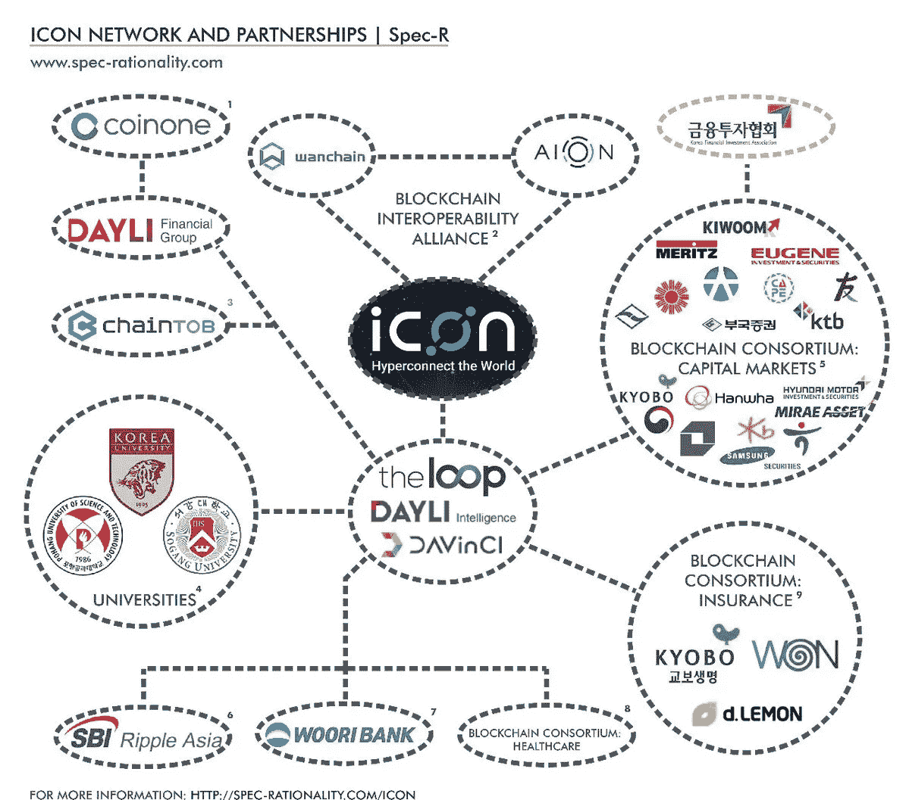

# 23 种方式图标超级连接世界

> 原文：<https://medium.com/hackernoon/23-ways-icon-is-hyper-connecting-the-world-105f919c6cce>

## 为什么购买这种加密的意见

2017 年第三季度，韩国企业集团**达利金融集团**启动了一个区块链项目**ICON**，这个项目很快被命名为**【韩国以太坊】**。Dayli Financial Group】还拥有 Yello Mobile ，这是韩国价值 40 亿美元的**最大的移动创业公司**、韩国最受欢迎的应用**Kakao**(相当于中国的 WhatsApp 或微信)以及 ICON 的区块链技术背后的**公司 **The Loop** 。实质上，ICON 有韩国最大的企业集团之一支持这个项目，这是千真万确的。ICON 的核心技术被称为 LoopChain，它被描述为“一种可以提供实时交易的高性能区块链”LoopChain 专为企业打造，提供可定制的智能合约功能，但最重要的是，可以链接到其他分布式账本网络。今天， **ICON 的交易价格是每枚硬币 8 美元**，然而，由于 ICON 正在将自己框定为开启区块链互操作性的万能钥匙，并将所请求的服务连接到每个企业和政府部门，ICON 可能在未来两年内以每枚硬币 70 美元的价格交易**。****

# **基础知识:**

1.  **图标项目于**2017 年第三季度从韩国首尔开始****
2.  **ICON 是一个**互连区块链网络**和**可以连接到独立的区块链**而无需使用额外的第三方中介**
3.  **ICON 项目**为成熟的行业提供区块链解决方案**，允许他们执行数据和货币转移、验证身份、利用智能合同环境(SCORE)以及利用分散式交换**
4.  ****The Loop，**ICON 背后的公司，已经获得了几轮融资**
5.  ****股票代码:ICON**
    价格:8 美元
    按市值排名(Token): 3
    市值:3063911421 美元
    流通供应量:380045004 ICX
    最大供应量:400230000 ICX
    平均交易量:83249600 美元
    共识:以太坊共识**

# **团队:**

1.  **图标项目由 JH·金领导，他也是 Loop 的首席执行官和图标基金会理事会的成员。金先生在信息安全领域有近 20 年的经验。**
2.  **KJ Eee 是 Dayli Intelligence 的首席执行官，也是 ICON 基金会理事会成员。在 Dayli Intelligence 之前，Eee 先生开发了韩国第一款防火墙“SUHOSHIN”**
3.  **ICON 团队拥有另外 15 名区块链经理和工程师**
4.  **图标团队的其他成员还有 **5 名人工智能开发人员和产品经理，以及 5 名营销专业人员****

# **增长驱动因素:**

1.  **图标项目是**在韩国的第一个区块链网络**，它正在推动韩国广泛采用区块链**
2.  **ICON 团队正在**建立几十个合作伙伴和侧链**，目标是使用他们的协议连接整个生态系统**
3.  **ICON 的 DEX 将为传统交易所提供一个更安全、更全面的替代方案。当 ICON 的核心钱包发布时，用户将能够直接从他们的钱包进行交易**
4.  **ICON 平台利用了一个**关于可靠环境的智能合约(SCORE)** 。SCORE 旨在让高性能合同直接在节点环境中运行，而无需单独的虚拟机。这可以很容易地为各种应用程序创建，因为它独立于底层区块链运行**
5.  **ICON platform 在其生态系统中提供了**灵活性**，使其他区块链能够通过他们的智能合约与 ICON 网络连接**
6.  **重申一下，ICON 平台是由母公司达利金融集团创建的， **DFG 与 ripple** 有合作关系**
7.  ****The Loop 是韩国金融投资协会**的成员，该协会包括韩国的 **27 家金融公司**。这些合作伙伴包括市值接近 10 亿美元的大信证券(T21)和市值超过 15 亿美元的 Kiwoom。其他合伙人也管理着数十亿或数亿美元**
8.  **ICON **与 Woori(韩国第二大银行)**签署了一项协议，以创建一个等价的系绳，但不包括韩元**
9.  **戴利金融集团(DFG)拥有韩国第二大密码交易所 Coinone**
10.  **DFG 与包括松岗大学在内的多所大学有着密切的合作关系，松岗大学目前正在开发一款名为 U-Coin 的区块链自动售货机**
11.  **DFG 最近与医院和保险公司组成了一个保险联盟来帮助 ICON 在区块链的领养**
12.  **韩国是区块链技术加速发展的理想之地，因为他们是加密货币交易量和支持者的**最大领导者之一****
13.  **ICON 区块链解决方案**已经过企业测试**。他们的平台是世界上最大的企业区块链网络之一，包括 25 家安全公司、6 家医院、多所大学和银行**

****

# **逆风:**

1.  **由于监管总是会落后于创新，数字货币领域未来可能会受到新监管的约束**

# **总结:**

**ICX 给我留下最深刻印象的一个方面是没有逆风。除了法规和区块链领域的一般挑战，ICON 在韩国的企业就绪区块链解决方案中没有任何严重的竞争。此外，他们已经有一个功能产品，企业，无论是商业还是政府都在使用。一旦你做了调查，很快就会发现，ICON 是由韩国最大的企业集团之一支持的，该集团为该项目提供了几乎无限的资源、人力和影响力来执行他们的路线图。这就是为什么我认为这枚硬币在未来两年内将触及**70 美元。****

**对于我的忠实读者，我很兴奋地宣布，我刚刚推出了我的咨询服务和基金，Masi Digital Ventures。**

**【https://masidigitalventures.com/ **