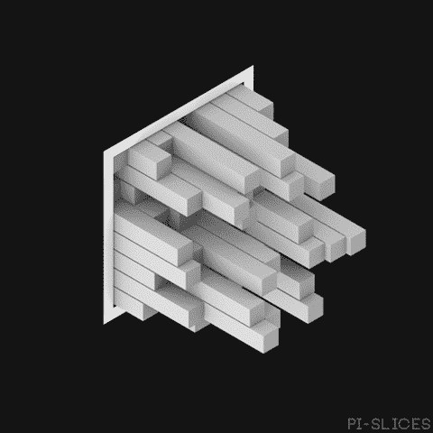

# 2018 年 1 月 24 日:神秘领域最大的故事

> 原文：<https://medium.com/hackernoon/24-01-2018-biggest-stories-in-the-cryptosphere-16f478858961>

**1。澳大利亚可能很快会有黄金支持的加密货币**

澳大利亚最大的黄金精炼商珀斯铸币厂正在开发[一种黄金支持的加密货币](https://www.ccn.com/australias-biggest-gold-refiner-plans-gold-backed-cryptocurency/)。这家国有公司希望通过此举吸引黄金投资。在过去的几年里，投资者的数量减少了，因为人们把钱投资到了别处。比特币等加密货币是另一种选择。尽管还没有名字，这种有争议的加密货币将被用于黄金交易。珀斯铸币厂还讨论了在他们的运营中采用区块链技术的计划，从供应链开始。在过去的一年半时间里，该公司一直试图通过引入在线交易平台[让人们更容易获得黄金，用户可以在任何时候购买这种贵金属。加密货币的加入将进一步提高可访问性。](http://www.abc.net.au/news/2018-01-24/cryptocurrency-backed-by-gold-being-developed-perth-mint/9352036)

**2。区块链技术在英国的两次胜利**

英国的技术开发部门 Innovate UK 周一宣布，它将对区块链的技术投入更多资金。2660 万美元将投资于推广新产品或服务的技术项目。招募毕业生参与这些项目的公司将再获得 1680 万美元。为了从这些资助中受益，必须在三月底之前提交一份提案，但公司首先需要满足某些标准才能获得资格。

区块链的第二个胜利来自于[英国区块链协会(BBA)](https://www.insider.co.uk/news/british-blockchain-association-set-up-11902320) ，一个专注于区块链技术的网络，在伦敦区块链周期间推出。它是由纳西姆·纳克维博士和穆里德·侯赛因博士创立的。BBA 旨在向政府和企业推广区块链技术，并激发学生的兴趣，以确保未来的熟练劳动力。

**3。我们有了隐猫，现在我们有了隐名人**

我们[在 12 月份报道](/@BlockEx/05-12-2017-biggest-stories-in-the-cryptosphere-59596a7bd341)当 CryptoKitties 在 Ethereum 上发布时，它占了平台总流量的 15%——这是迄今为止最成功的 dapp。现在，一款新游戏已经推出:[密码名人](https://thenextweb.com/distract/2018/01/23/you-can-buy-celebrities-with-ethereum-now/)。用户可以购买他们想要的任何“名人智能合同”，但每个合同只有一个。然而，如果另一个用户想要同样的名人，卖家不能拒绝。[网站声明](https://cryptocelebrities.co/):

> “如果你以 0.2 ETH 的价格购买一份合同，另一个玩家会从你手中抢走它。一旦发生这种情况，您将自动获得 0.4 ETH！大多数合同在每笔交易中都是双倍价格，直到达到 1 ETH。”

此外，从 2018 年 3 月起，特许权使用费也将支付。在最初的 24 小时内，交易总额达到了 100 万美元。然而，目前还不清楚用户是否有可能套现，或者他们是否需要等待被买断。

**4 .瑞银前员工推出隐币基金**

瑞银集团(UBS Bank)董事长、最大的财富管理公司阿克赛尔·韦伯昨日在达沃斯世界经济论坛(WEF)上表示，投资者应该远离投资隐货币。与此同时，瑞银前银行家简·布热泽克(Jan Brzezek)推出了一只密码货币基金(T13)，目标是在本月底前筹集 1000 万美元。该基金被称为密码基金，其创始人兼首席执行官形容为:*...一只跟踪第一个密码货币蓝筹股指数的被动基金”。*2015 年至 2017 年，Brzezek 首次涉足密码货币领域，当时他仍在瑞银工作。他承认其高度易变性，但表示金融业及其利益相关者的优势将[大于风险](https://www.ccn.com/ubs-alum-turns-toward-crypto-launches-new-fund/)。

> *在您的邮箱里接收我们每日新闻综述，请在这里注册:*[*http://bit.ly/BlockExNewsRoundup*](http://bit.ly/BlockExNewsRoundup)