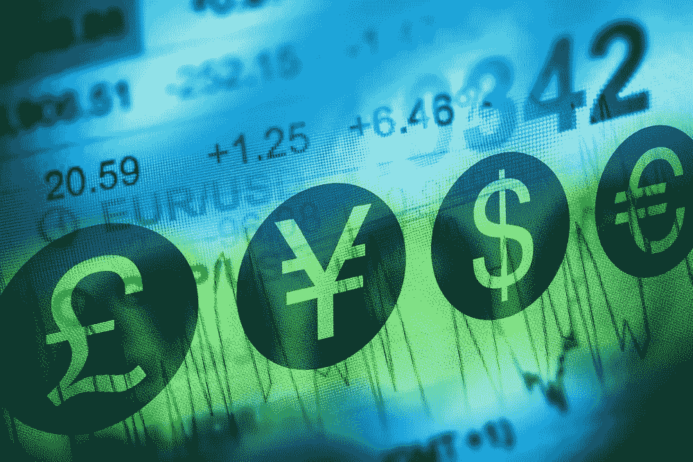
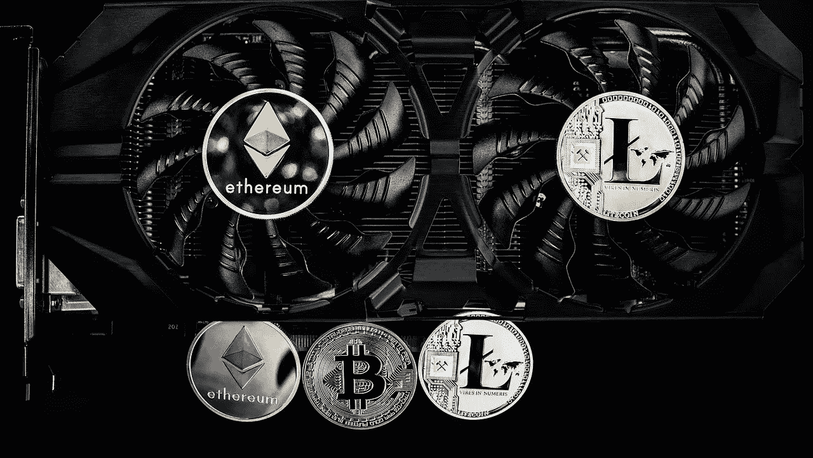
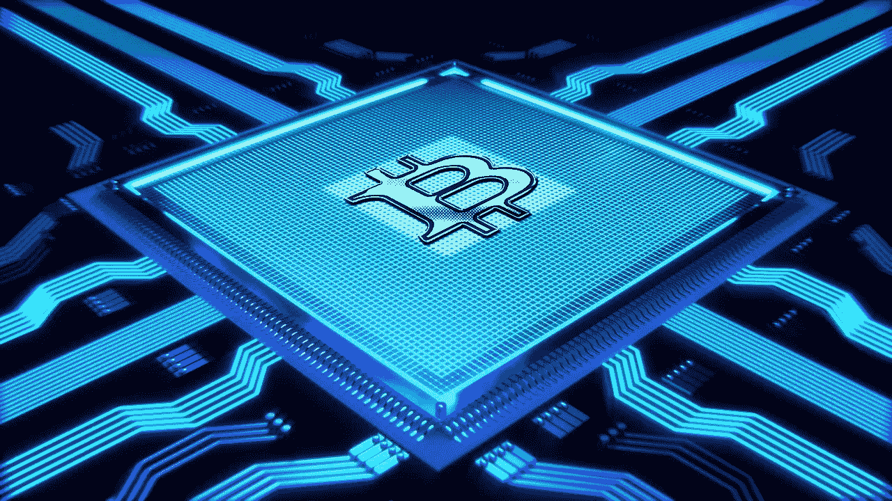

# 2018 年 5 月 24 日:神秘领域最大的故事

> 原文：<https://medium.com/hackernoon/24-05-2018-biggest-stories-in-the-cryptosphere-bc621cd76bd0>

通过 BlockEx

**1。俄罗斯央行 ICO 平台将由两家机构测试**

俄罗斯央行俄罗斯银行(Bank of Russia)在 4 月份推出了一个监管 ICO 平台，以提高投资者的透明度和安全性。两个本地金融机构，国家结算存管(NSD)和 CIB 储蓄银行，现在正在联合测试平台。Level One 将在平台上推出代币销售。俄罗斯联邦储蓄银行将担任“发行协调员和锚定投资者”，而 NSD 的职责将包括充当“托管人、记录和结算交易，以及保护资产”。该试验将有助于通过反馈改进平台。

**2。第一笔涉及德国大公司的区块链外汇交易刚刚发生**

第一笔涉及一家大型德国公司的区块链外汇交易刚刚完成。德国商业银行和蒂森克虏伯都是德国人，最近[进行了交易](https://uk.reuters.com/article/uk-commerzbank-blockchain-thyssenkrupp/commerzbank-demonstrates-first-german-corporate-fx-deal-on-blockchain-idUKKCN1IP1I6)。区块链财团的 CORDA 也参与了这个项目。目标是节省金钱和时间。此外，据德国商业银行称，延误和人为错误也将减少。由于区块链的性质，交易对账的需要(外汇交易的一个主要问题)也将消失。最后，德国商业银行还补充说，该技术的蓬勃发展需要监管和技术框架。

**3。转基因互联网集团将推出首款同类采矿机**

日本科技巨头 GMO [宣布推出首款同类采矿机器，转基因矿工 B2。该机器将是第一款采用基于“尖端 7 纳米”工艺的半导体芯片的机器，并将于今年 10 月上市。然而，在 6 月 6 日星期三，潜在客户将能够通过参加在东京举行的信息会议来表明他们的兴趣。该产品的研究&开发过程始于 2017 年 9 月。此外，为了能够大规模生产，该设备将可用于内部采矿以及外部客户。考虑到去年公司](https://www.gmo.jp/en/news/article/?id=777)[为加密货币开采设定了 9000 万美元的预算](https://www.coindesk.com/90-million-budget-japans-gmo-reveals-cryptocurrency-mining-details/)，这个消息不应该令人惊讶。

**4。德国证券交易所正在考虑提供比特币**

据高级执行官杰弗里·特斯勒称，法兰克福证券交易所的所有者德意志交易所正在考虑提供比特币产品。在参加欧洲金融市场协会的活动时，特斯勒确认该公司目前正在研究这种可能性。然而，他也强调了对加密货币和基础交易进行深入调查的重要性。正如之前报道的那样，美国 CME 和 Cboe 都在去年推出了比特币期货。然而，他们的欧洲同行还没有这样做。

> 本新闻综合报道由 [BlockEx](http://bit.ly/BlockEx_) 为您带来。

> *要想在你的邮箱里收到我们的每日新闻综述，请在这里注册:*[*http://bit.ly/BlockExNewsAndUpdates*](http://bit.ly/BlockExNewsAndUpdates)