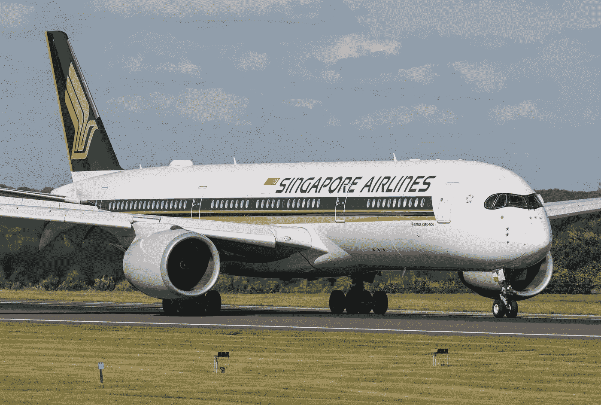
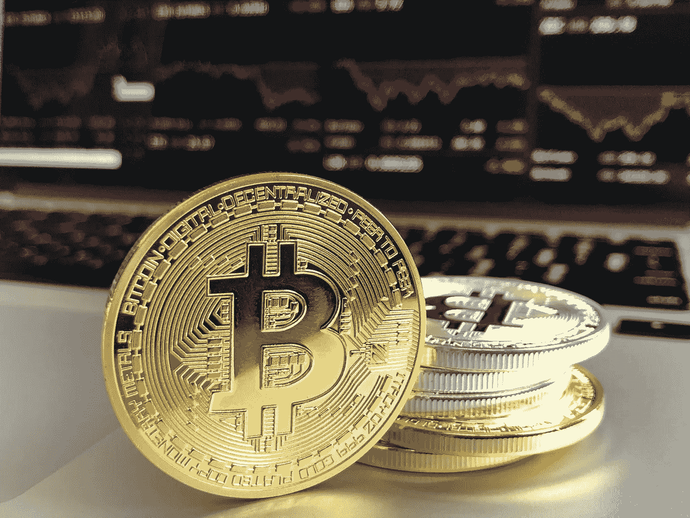
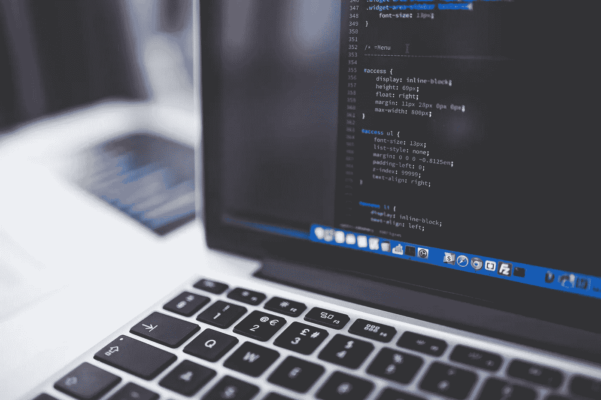

# 2018 年 7 月 24 日:神秘领域最大的故事

> 原文：<https://medium.com/hackernoon/24-07-2018-biggest-stories-in-the-cryptosphere-fcd68251eeaf>

通过 BlockEx

**1。SEC 推迟对比特币交易所交易基金的裁决至 9 月**

美国证券交易委员会(SEC)决定[将是否批准五只交易所交易基金(ETF)](https://www.coindesk.com/sec-delays-decision-on-direxions-bitcoin-etfs-until-september/)的决定推迟至 9 月。独立机构在其[联邦公报](https://www.gpo.gov/fdsys/pkg/FR-2018-07-24/html/2018-15768.htm)上宣布了这一决定。批准申请是由 Direxion Investments 提交的。一个是基于比特币价格，而另外四个是基于其价格变动。证券交易委员会解释说，该委员会认为，指定一个较长的期限来发布批准或不批准拟议的规则变化的命令是适当的，这样它就有足够的时间来考虑这一拟议的规则变化。

**2。新航推出数字区块链钱包**

领先的航空运营商新航推出了一款名为 KrisPay 的数字区块链钱包。这将允许常旅客将航空里程转换成数字货币，并在与合作商户的日常消费中使用。截至目前，参与该倡议的零售商有 18 家，经营不同的行业。将来还会增加更多。“KrisPay 是全球首个总部位于区块链的航空公司忠诚度数字钱包”。在发布期间，还将提供折扣。我们第一次[报道](https://hackernoon.com/05-02-2018-biggest-stories-in-the-cryptosphere-c3be4a3b5d5a)是在二月份，当时新加坡航空公司宣布了它的项目，这是在与毕马威和微软合作进行概念验证试验之后。

**3。比特币突破 8300 美元**

今天早些时候，比特币达到了 8300 多美元的峰值。这是过去两个月来的最高水平。许多人认为，这一飙升至少在一定程度上是因为美国政府即将批准一只加密货币交易所交易基金。最后一个数字来自卢森堡的比特币交易所。比特币报 8198.04 美元，涨幅 6.33%。就连第二大加密货币以太币在 Bitstamp 上也上涨了 4.79%，至 470.66 美元。

**4。TRON 收购 BitTorrent 得到证实**

一段时间以来，有传言称 TRON 可能收购 B2B 平台运营商 BitTorrent。创始人 Justin Sun 现在证实了这个消息，并补充说这使得 TRON 成为世界上最大的去中心化互联网生态系统。BitTorrent 是一种“基于对等网络的文件共享通信协议”。许多人认为这是在线去中心化的起源。TRON 解释说，导致此次收购的原因之一是对分散化网络的普遍渴望。TRON 还希望在其公司中整合 BitTorrent 的技术人才和经验。

> 这是由 [BlockEx](http://bit.ly/BlockEx_) 为您带来的新闻综述。

> 【http://bit.ly/BlockExNewsAndUpdates】[*要想在你的邮箱里收到我们的每日新闻综述，请在这里注册*](http://bit.ly/BlockExNewsAndUpdates)